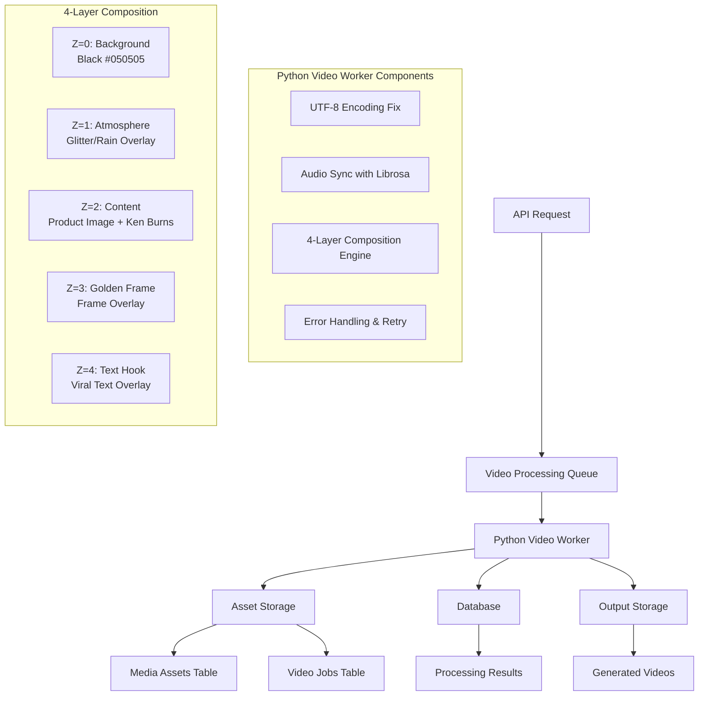

# Video Processing Architecture - Luxury Golden Frame System

## Overview

This document outlines the architecture for implementing a video processing system that creates "Luxury Golden Frame" aesthetic videos with multi-layer composition, audio synchronization, and robust error handling.

## System Architecture



## Integration Points with Existing System

### 1. Database Integration

The video processing system will integrate with the existing database schema by adding new tables:

- **video_processing_jobs**: Queue for video processing tasks
- **video_processing_assets**: Management for overlays and frames
- **video_processing_results**: Storage for processing outcomes

### 2. Asset Management Integration

Leverage existing `mediaAssets` table for:

- Source images (product photos, etc.)
- Audio files (background music)
- Generated video outputs
- Overlay assets (frames, glitter effects)

### 3. Background Job System

Extend existing job queue pattern (similar to `postJobs`) for video processing:

- Queue management via database
- Status tracking (pending, processing, completed, failed)
- Retry logic with exponential backoff
- Priority-based processing

### 4. API Integration

New endpoints in the existing API structure:

- `POST /api/v1/video/process` - Submit video processing job
- `GET /api/v1/video/jobs/{id}` - Get job status
- `GET /api/v1/video/jobs` - List jobs for tenant
- `GET /api/v1/video/assets/{id}` - Download processed video

## Technical Implementation Details

### 1. Python Video Worker

**Location**: `scripts/video-processor-worker.py`

**Key Features**:

- UTF-8 encoding fix at script start
- Librosa integration with fallback
- MoviePy-based composition engine
- Error handling and retry logic
- Progress reporting to database

### 2. 4-Layer Composition Engine

**Layer Stack (Bottom to Top)**:

1. **Z=0 (Background)**: ColorClip (Black #050505) - 1080x1920
2. **Z=1 (Atmosphere)**: Glitter/Rain video overlay - Normal blend, 0.7 opacity
3. **Z=2 (Content)**: Product image - 900x1600, Ken Burns zoom (1.0 -> 1.05)
4. **Z=3 (Golden Frame)**: Frame overlay or procedural border (#D4AF37)
5. **Z=4 (Text)**: Viral text hook - Top of composition

### 3. Audio Synchronization

**Primary**: Librosa onset detection for beat-based timing
**Fallback**: Fixed duration logic with warning log
**Features**:

- Dynamic clip duration based on audio beats
- Smooth transitions between clips
- Audio volume normalization

### 4. Asset Management

**Storage Structure**:

```
tenants/{tenant}/video-assets/
├── overlays/
│   ├── glitter-rain.mp4
│   └── frame-overlay.png
├── frames/
│   └── golden-frame.png
└── audio/
    └── background-music.mp3
```

## Database Schema Extensions

### video_processing_jobs Table

```sql
CREATE TABLE video_processing_jobs (
    id UUID PRIMARY KEY DEFAULT gen_random_uuid(),
    tenant_id UUID NOT NULL REFERENCES tenants(id),
    status VARCHAR(20) NOT NULL DEFAULT 'pending',
    priority INTEGER NOT NULL DEFAULT 0,

    -- Input parameters
    image_ids UUID[] NOT NULL,
    audio_file TEXT,
    text_overlay TEXT,
    overlay_type VARCHAR(50) DEFAULT 'golden-frame',

    -- Processing configuration
    duration_target DECIMAL(10,2),
    quality_mode VARCHAR(20) DEFAULT 'normal',

    -- Processing metadata
    started_at TIMESTAMP,
    completed_at TIMESTAMP,
    processing_time_ms INTEGER,
    attempts INTEGER DEFAULT 0,
    max_attempts INTEGER DEFAULT 3,
    last_error TEXT,

    -- Output
    output_video_url TEXT,
    output_thumbnail_url TEXT,

    created_at TIMESTAMP DEFAULT NOW(),
    updated_at TIMESTAMP DEFAULT NOW()
);
```

### video_processing_assets Table

```sql
CREATE TABLE video_processing_assets (
    id UUID PRIMARY KEY DEFAULT gen_random_uuid(),
    tenant_id UUID NOT NULL REFERENCES tenants(id),
    asset_type VARCHAR(50) NOT NULL, -- 'overlay', 'frame', 'audio'
    name VARCHAR(100) NOT NULL,
    file_path TEXT NOT NULL,
    metadata JSONB DEFAULT '{}',
    created_at TIMESTAMP DEFAULT NOW(),
    updated_at TIMESTAMP DEFAULT NOW()
);
```

## API Endpoints

### POST /api/v1/video/process

**Request Body**:

```json
{
  "imageIds": ["uuid1", "uuid2"],
  "audioFile": "background-music.mp3",
  "textOverlay": "✨ Luxury Beauty Secrets Revealed!",
  "overlayType": "golden-frame",
  "qualityMode": "normal"
}
```

**Response**:

```json
{
  "success": true,
  "jobId": "uuid",
  "status": "pending",
  "estimatedDuration": 30
}
```

## Error Handling Strategy

### 1. Categorization

- **Recoverable**: Network issues, temporary storage failures
- **Non-recoverable**: Invalid input, missing dependencies
- **Resource**: Memory/CPU limits

### 2. Retry Logic

- Exponential backoff: 1s, 2s, 4s, 8s
- Max 3 attempts by default
- Circuit breaker after 5 consecutive failures

### 3. Graceful Degradation

- Missing librosa: Fixed duration fallback
- Missing frame asset: Procedural border generation
- Memory limits: Reduced quality/size

## Performance Considerations

### 1. Resource Management

- Limit concurrent jobs per tenant
- Memory-efficient processing with streaming
- Temporary file cleanup

### 2. Caching Strategy

- Cache overlay assets in memory
- Reuse processed audio beat detection
- Thumbnail generation caching

### 3. Monitoring

- Processing time metrics
- Success/failure rates
- Resource utilization tracking

## Security Considerations

### 1. Input Validation

- File type and size limits
- Tenant isolation enforcement
- Sanitization of text overlays

### 2. Asset Security

- Signed URLs for asset access
- Tenant-scoped storage paths
- Audit logging for all operations

## Deployment Strategy

### 1. Worker Process

- Run as separate Python process
- Supervisor/systemd for restart management
- Environment-based configuration

### 2. Scaling

- Horizontal scaling via multiple workers
- Queue-based load distribution
- Tenant-based resource allocation

## Development Roadmap

### Phase 1: Core Implementation

- [ ] Basic video worker with UTF-8 fix
- [ ] Simple 2-layer composition
- [ ] Database schema and API endpoints
- [ ] Basic error handling

### Phase 2: Advanced Features

- [ ] 4-layer composition engine
- [ ] Librosa audio synchronization
- [ ] Asset management system
- [ ] Advanced error handling

### Phase 3: Production Readiness

- [ ] Performance optimization
- [ ] Monitoring and logging
- [ ] Security hardening
- [ ] Documentation and testing

## Testing Strategy

### 1. Unit Tests

- Individual component testing
- Mock external dependencies
- Error condition simulation

### 2. Integration Tests

- End-to-end video processing
- Database integration
- API endpoint testing

### 3. Performance Tests

- Load testing with concurrent jobs
- Memory usage profiling
- Processing time benchmarks

## Monitoring and Observability

### 1. Metrics Collection

- Job processing time
- Success/failure rates
- Resource utilization
- Queue depth

### 2. Logging Strategy

- Structured JSON logging
- Log levels for debugging
- Centralized log aggregation

### 3. Alerting

- Failed job rate thresholds
- Processing time alerts
- Resource exhaustion warnings

## Future Enhancements

### 1. Advanced Effects

- Transition animations between clips
- Advanced color grading options
- Custom frame designs

### 2. AI Integration

- Smart content positioning
- Automated text generation
- Quality optimization

### 3. Platform Expansion

- Multiple aspect ratios (9:16, 1:1)
- Platform-specific optimizations
- Batch processing capabilities
