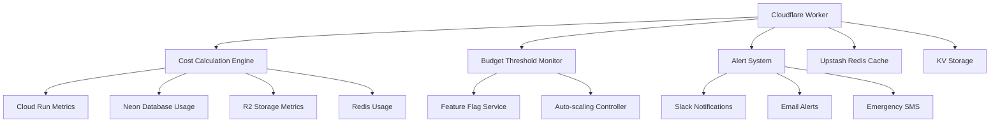

# Cost Sentinel - Real-Time Budget Monitoring System

## Daily Cloudflare Worker Implementation for ≤$5/Month Budget Compliance

### Table of Contents

1. [Cost Sentinel Architecture](#cost-sentinel-architecture)
2. [Cloudflare Worker Implementation](#cloudflare-worker-implementation)
3. [Cost Calculation Engine](#cost-calculation-engine)
4. [Budget Threshold Automation](#budget-threshold-automation)
5. [Real-Time Monitoring](#real-time-monitoring)
6. [Alert & Notification System](#alert--notification-system)
7. [Cost Attribution & Tenant Tracking](#cost-attribution--tenant-tracking)
8. [Emergency Response Automation](#emergency-response-automation)
9. [Dashboard & Reporting](#dashboard--reporting)
10. [Configuration & Deployment](#configuration--deployment)

---

## Cost Sentinel Architecture

### System Overview



### Core Components

- **Cost Calculator**: Real-time cost computation across all services
- **Threshold Monitor**: Automated budget compliance enforcement
- **Feature Flag Controller**: Dynamic service degradation
- **Alert Manager**: Multi-channel notification system
- **Tenant Attribution**: Per-tenant cost tracking and quotas

---

## Cloudflare Worker Implementation

### Main Worker Script

```javascript
// cost-sentinel.js - Main Cloudflare Worker
export default {
  async fetch(request, env, ctx) {
    const url = new URL(request.url);

    // CORS headers for dashboard access
    const corsHeaders = {
      "Access-Control-Allow-Origin": "*",
      "Access-Control-Allow-Methods": "GET, POST, OPTIONS",
      "Access-Control-Allow-Headers": "Content-Type, Authorization",
    };

    if (request.method === "OPTIONS") {
      return new Response(null, { headers: corsHeaders });
    }

    try {
      const response = await handleRequest(url, env);
      Object.entries(corsHeaders).forEach(([key, value]) => {
        response.headers.set(key, value);
      });
      return response;
    } catch (error) {
      console.error("Cost Sentinel Error:", error);
      return new Response(JSON.stringify({ error: error.message }), {
        status: 500,
        headers: { "Content-Type": "application/json", ...corsHeaders },
      });
    }
  },

  async scheduled(event, env, ctx) {
    console.log("Cost Sentinel scheduled run:", new Date().toISOString());

    try {
      await runCostSentinel(env);
    } catch (error) {
      console.error("Scheduled run failed:", error);
      await sendCriticalAlert(
        env,
        "Cost Sentinel scheduled run failed",
        error.message,
      );
    }
  },
};

async function handleRequest(url, env) {
  const path = url.pathname;

  switch (path) {
    case "/api/costs/current":
      return await getCurrentCosts(env);

    case "/api/costs/breakdown":
      return await getCostBreakdown(env);

    case "/api/costs/forecast":
      return await getForecastedCosts(env);

    case "/api/tenants/costs":
      return await getTenantCosts(env);

    case "/api/budget/status":
      return await getBudgetStatus(env);

    case "/api/alerts/test":
      return await testAlerts(env);

    case "/dashboard":
      return await serveDashboard(env);

    default:
      return new Response(
        "Cost Sentinel API - Endpoints: /api/costs/current, /api/costs/breakdown, /api/costs/forecast, /api/tenants/costs, /api/budget/status, /dashboard",
        {
          status: 200,
          headers: { "Content-Type": "text/plain" },
        },
      );
  }
}
```

### Core Cost Sentinel Logic

```javascript
async function runCostSentinel(env) {
  const timestamp = new Date().toISOString();
  console.log(`🚀 Cost Sentinel run started: ${timestamp}`);

  // 1. Gather usage metrics from all services
  const usage = await gatherUsageMetrics(env);

  // 2. Calculate current costs
  const costs = await calculateCurrentCosts(usage, env);

  // 3. Get budget configuration
  const budgets = await getBudgetConfiguration(env);

  // 4. Check tenant budgets and trigger actions
  const actions = await processTenantBudgets(costs, budgets, env);

  // 5. Update system metrics
  await updateMetrics(costs, actions, env);

  // 6. Generate alerts if needed
  await processAlerts(actions, env);

  console.log(`✅ Cost Sentinel run completed: ${new Date().toISOString()}`);

  return {
    timestamp,
    costs,
    actions,
    status: "completed",
  };
}

async function gatherUsageMetrics(env) {
  const [cloudRunMetrics, databaseMetrics, storageMetrics, redisMetrics] =
    await Promise.all([
      getCloudRunMetrics(env),
      getDatabaseMetrics(env),
      getStorageMetrics(env),
      getRedisMetrics(env),
    ]);

  return {
    cloudRun: cloudRunMetrics,
    database: databaseMetrics,
    storage: storageMetrics,
    redis: redisMetrics,
    timestamp: new Date().toISOString(),
  };
}
```

---

## Cost Calculation Engine

### Service Cost Calculators

```javascript
class CostCalculator {
  constructor(env) {
    this.env = env;
    this.pricing = {
      cloudRun: {
        cpu: 0.000024, // per vCPU-second
        memory: 0.0000025, // per GiB-second
        requests: 0.0000004, // per request
      },
      neon: {
        compute: 0.102, // per compute unit-hour
        storage: 0.000164, // per GiB-hour
        writes: 0.96, // per million write operations
        reads: 0.19, // per million read operations
      },
      r2: {
        storage: 0.015, // per GiB-month
        classA: 4.5, // per million operations (writes)
        classB: 0.36, // per million operations (reads)
      },
      redis: {
        memory: 0.00005, // per MiB-hour
        commands: 0.00002, // per thousand commands
      },
    };
  }

  async calculateCloudRunCosts(metrics) {
    const {
      instances,
      cpuUtilization,
      memoryUtilization,
      requests,
      executionTime,
    } = metrics;

    // Calculate actual usage based on utilization
    const avgInstances = instances * (cpuUtilization / 100);
    const memoryGiB = this.parseMemory(metrics.memoryAllocated);
    const cpuCores = metrics.cpuAllocated / 1000;

    // Monthly cost calculation
    const monthlyCpuSeconds = avgInstances * cpuCores * 30 * 24 * 3600;
    const monthlyMemorySeconds = avgInstances * memoryGiB * 30 * 24 * 3600;

    const cpuCost = monthlyCpuSeconds * this.pricing.cloudRun.cpu;
    const memoryCost = monthlyMemorySeconds * this.pricing.cloudRun.memory;
    const requestCost = requests * this.pricing.cloudRun.requests;

    return {
      cpu: this.round(cpuCost),
      memory: this.round(memoryCost),
      requests: this.round(requestCost),
      total: this.round(cpuCost + memoryCost + requestCost),
      utilization: {
        cpu: cpuUtilization,
        memory: memoryUtilization,
        instances: avgInstances,
      },
    };
  }

  async calculateDatabaseCosts(metrics) {
    const {
      computeUnits,
      storageGiB,
      uptime,
      writeOperations,
      readOperations,
    } = metrics;

    // Calculate based on actual usage
    const computeCost =
      computeUnits * (uptime / 3600) * this.pricing.neon.compute;
    const storageCost = storageGiB * (30 * 24) * this.pricing.neon.storage;
    const writeCost = (writeOperations / 1000000) * this.pricing.neon.writes;
    const readCost = (readOperations / 1000000) * this.pricing.neon.reads;

    return {
      compute: this.round(computeCost),
      storage: this.round(storageCost),
      writes: this.round(writeCost),
      reads: this.round(readCost),
      total: this.round(computeCost + storageCost + writeCost + readCost),
      metrics: {
        uptime: uptime,
        writeOps: writeOperations,
        readOps: readOperations,
      },
    };
  }

  async calculateStorageCosts(metrics) {
    const { totalSizeGiB, classAOperations, classBOperations } = metrics;

    const storageCost = totalSizeGiB * this.pricing.r2.storage;
    const classACost = (classAOperations / 1000000) * this.pricing.r2.classA;
    const classBCost = (classBOperations / 1000000) * this.pricing.r2.classB;

    return {
      storage: this.round(storageCost),
      classA: this.round(classACost),
      classB: this.round(classBCost),
      total: this.round(storageCost + classACost + classBCost),
      metrics: {
        sizeGiB: totalSizeGiB,
        operations: classAOperations + classBOperations,
      },
    };
  }

  async calculateRedisCosts(metrics) {
    const { memoryMiB, commands, uptime } = metrics;

    const memoryCost = memoryMiB * (uptime / 3600) * this.pricing.redis.memory;
    const commandCost = (commands / 1000) * this.pricing.redis.commands;

    return {
      memory: this.round(memoryCost),
      commands: this.round(commandCost),
      total: this.round(memoryCost + commandCost),
      metrics: {
        memoryMiB,
        commands,
        uptime,
      },
    };
  }

  round(value) {
    return Math.round(value * 10000) / 10000; // 4 decimal places
  }

  parseMemory(memoryString) {
    const match = memoryString.match(/(\d+)(Mi|Gi)/);
    if (!match) return 0;

    const value = parseInt(match[1]);
    const unit = match[2];

    return unit === "Gi" ? value : value / 1024;
  }
}
```

### Tenant Cost Attribution

```javascript
class TenantCostAttributor {
  constructor(env) {
    this.env = env;
  }

  async attributeCostsToTenants(totalCosts, env) {
    const tenantMetrics = await this.getTenantMetrics(env);
    const attributedCosts = {};

    // Get tenant activity metrics
    for (const [tenantId, metrics] of Object.entries(tenantMetrics)) {
      attributedCosts[tenantId] = await this.calculateTenantCosts(
        tenantId,
        metrics,
        totalCosts,
      );
    }

    return attributedCosts;
  }

  async calculateTenantCosts(tenantId, metrics, totalCosts) {
    const { requests, databaseQueries, storageUsed, cacheOperations } = metrics;

    // Calculate tenant's share of total usage
    const totalRequests = Object.values(
      await this.getTenantMetrics(this.env),
    ).reduce((sum, m) => sum + m.requests, 0);

    const requestShare = totalRequests > 0 ? requests / totalRequests : 0;

    // Attribute costs based on usage patterns
    const tenantCosts = {
      compute: totalCosts.cloudRun.total * requestShare,
      database: await this.attributeDatabaseCosts(
        tenantId,
        databaseQueries,
        totalCosts.database,
      ),
      storage: await this.attributeStorageCosts(
        tenantId,
        storageUsed,
        totalCosts.storage,
      ),
      redis:
        totalCosts.redis.total * (cacheOperations / this.getTotalCacheOps()),
    };

    const total = Object.values(tenantCosts).reduce(
      (sum, cost) => sum + cost,
      0,
    );

    return {
      ...tenantCosts,
      total: this.round(total),
      share: this.round(requestShare * 100),
      metrics,
    };
  }

  async getTenantMetrics(env) {
    // Retrieve tenant usage metrics from Upstash Redis
    const redis = new UpstashRedis(
      env.UPSTASH_REDIS_REST_URL,
      env.UPSTASH_REDIS_REST_TOKEN,
    );

    const currentMonth = new Date().toISOString().slice(0, 7); // YYYY-MM
    const tenantKeys = await redis.keys(`tenant:metrics:${currentMonth}:*`);

    const metrics = {};
    for (const key of tenantKeys) {
      const tenantId = key.split(":").pop();
      const data = await redis.hgetall(key);

      metrics[tenantId] = {
        requests: parseInt(data.requests || 0),
        databaseQueries: parseInt(data.databaseQueries || 0),
        storageUsed: parseFloat(data.storageUsed || 0),
        cacheOperations: parseInt(data.cacheOperations || 0),
      };
    }

    return metrics;
  }

  round(value) {
    return Math.round(value * 10000) / 10000;
  }
}
```

---

## Budget Threshold Automation

### Threshold Monitor

```javascript
class BudgetThresholdMonitor {
  constructor(env) {
    this.env = env;
    this.thresholds = {
      eco: 50, // 50% - Enable eco mode
      warning: 80, // 80% - Send warnings
      freeze: 90, // 90% - Enable freeze mode
      kill: 100, // 100% - Activate kill switch
    };
  }

  async processTenantBudgets(tenantCosts, budgetConfig, env) {
    const actions = [];

    for (const [tenantId, costs] of Object.entries(tenantCosts)) {
      const budget = budgetConfig[tenantId] || budgetConfig.default;
      const utilization = (costs.total / budget.monthly) * 100;

      const action = await this.determineAction(
        tenantId,
        utilization,
        costs,
        env,
      );
      if (action) {
        actions.push(action);
        await this.executeAction(action, env);
      }
    }

    return actions;
  }

  async determineAction(tenantId, utilization, costs, env) {
    const currentState = await this.getCurrentTenantState(tenantId, env);
    const newThreshold = this.getThresholdLevel(utilization);

    // Only trigger actions when crossing thresholds upward
    if (newThreshold > currentState.threshold) {
      await this.updateTenantState(tenantId, newThreshold, env);

      return {
        tenantId,
        utilization,
        costs,
        threshold: newThreshold,
        action: this.getActionForThreshold(newThreshold),
        timestamp: new Date().toISOString(),
        previousThreshold: currentState.threshold,
      };
    }

    return null;
  }

  getThresholdLevel(utilization) {
    if (utilization >= this.thresholds.kill) return 4; // Kill switch
    if (utilization >= this.thresholds.freeze) return 3; // Freeze mode
    if (utilization >= this.thresholds.warning) return 2; // Warning
    if (utilization >= this.thresholds.eco) return 1; // Eco mode
    return 0; // Normal
  }

  getActionForThreshold(threshold) {
    const actions = {
      0: "normal",
      1: "enable_eco_mode",
      2: "send_warning",
      3: "enable_freeze_mode",
      4: "activate_kill_switch",
    };
    return actions[threshold] || "unknown";
  }

  async executeAction(action, env) {
    const { tenantId, threshold, action: actionType } = action;

    switch (actionType) {
      case "enable_eco_mode":
        await this.enableEcoMode(tenantId, env);
        break;

      case "send_warning":
        await this.sendWarningAlert(action, env);
        break;

      case "enable_freeze_mode":
        await this.enableFreezeMode(tenantId, env);
        break;

      case "activate_kill_switch":
        await this.activateKillSwitch(tenantId, env);
        break;
    }

    // Log action
    await this.logAction(action, env);
  }

  async enableEcoMode(tenantId, env) {
    const featureFlags = {
      ecoMode: true,
      imageOptimization: "aggressive",
      cacheAggressiveness: "high",
      imageVariants: "minimal",
    };

    await this.updateFeatureFlags(tenantId, featureFlags, env);

    console.log(`🟡 Eco mode enabled for tenant: ${tenantId}`);
  }

  async enableFreezeMode(tenantId, env) {
    const featureFlags = {
      freezeMode: true,
      readOnlyMode: true,
      uploadsBlocked: true,
      realTimeSync: false,
      backgroundJobs: false,
    };

    await this.updateFeatureFlags(tenantId, featureFlags, env);

    console.log(`🟠 Freeze mode enabled for tenant: ${tenantId}`);
  }

  async activateKillSwitch(tenantId, env) {
    const featureFlags = {
      killSwitch: true,
      maintenanceMode: true,
      allFeaturesDisabled: true,
    };

    await this.updateFeatureFlags(tenantId, featureFlags, env);

    // Scale infrastructure to zero
    await this.scaleToZero(env);

    console.log(`🔴 Kill switch activated for tenant: ${tenantId}`);
  }

  async updateFeatureFlags(tenantId, flags, env) {
    // Update feature flags in the main application
    const apiEndpoint = env.API_BASE_URL;
    const adminKey = env.ADMIN_API_KEY;

    const response = await fetch(`${apiEndpoint}/admin/feature-flags`, {
      method: "POST",
      headers: {
        "Content-Type": "application/json",
        "X-Admin-Key": adminKey,
      },
      body: JSON.stringify({
        tenantId,
        flags,
      }),
    });

    if (!response.ok) {
      throw new Error(`Failed to update feature flags: ${response.statusText}`);
    }
  }

  async getCurrentTenantState(tenantId, env) {
    const redis = new UpstashRedis(
      env.UPSTASH_REDIS_REST_URL,
      env.UPSTASH_REDIS_REST_TOKEN,
    );
    const key = `tenant:state:${tenantId}`;

    const state = await redis.hgetall(key);

    return {
      threshold: parseInt(state.threshold || 0),
      lastUpdated: state.lastUpdated || null,
    };
  }

  async updateTenantState(tenantId, threshold, env) {
    const redis = new UpstashRedis(
      env.UPSTASH_REDIS_REST_URL,
      env.UPSTASH_REDIS_REST_TOKEN,
    );
    const key = `tenant:state:${tenantId}`;

    await redis.hset(key, {
      threshold: threshold.toString(),
      lastUpdated: new Date().toISOString(),
    });

    await redis.expire(key, 86400 * 32); // Expire after 32 days
  }
}
```

### Auto-scaling Controller

```javascript
class AutoScalingController {
  constructor(env) {
    this.env = env;
  }

  async scaleToZero(env) {
    try {
      // Scale Cloud Run to zero instances
      await this.scaleCloudRun(0, env);

      // Suspend Neon database
      await this.suspendDatabase(env);

      console.log("✅ Infrastructure scaled to zero");
    } catch (error) {
      console.error("❌ Failed to scale to zero:", error);
      throw error;
    }
  }

  async scaleCloudRun(instances, env) {
    const gcpServiceAccount = JSON.parse(env.GCP_SERVICE_ACCOUNT);
    const projectId = gcpServiceAccount.project_id;
    const region = env.CLOUD_RUN_REGION || "us-central1";
    const serviceName = env.CLOUD_RUN_SERVICE || "sass-store-api";

    // This would typically use GCP APIs to scale Cloud Run
    // For simplicity, showing the structure
    const response = await fetch(
      `https://run.googleapis.com/v2/projects/${projectId}/locations/${region}/services/${serviceName}`,
      {
        method: "PATCH",
        headers: {
          Authorization: `Bearer ${await this.getGCPAccessToken(env)}`,
          "Content-Type": "application/json",
        },
        body: JSON.stringify({
          spec: {
            template: {
              metadata: {
                annotations: {
                  "autoscaling.knative.dev/maxScale": instances.toString(),
                  "autoscaling.knative.dev/minScale": Math.min(
                    instances,
                    0,
                  ).toString(),
                },
              },
            },
          },
        }),
      },
    );

    if (!response.ok) {
      throw new Error(`Failed to scale Cloud Run: ${response.statusText}`);
    }
  }

  async suspendDatabase(env) {
    const neonApiKey = env.NEON_API_KEY;
    const projectId = env.NEON_PROJECT_ID;
    const endpointId = env.NEON_ENDPOINT_ID;

    const response = await fetch(
      `https://console.neon.tech/api/v2/projects/${projectId}/endpoints/${endpointId}/suspend`,
      {
        method: "POST",
        headers: {
          Authorization: `Bearer ${neonApiKey}`,
          "Content-Type": "application/json",
        },
      },
    );

    if (!response.ok) {
      throw new Error(`Failed to suspend database: ${response.statusText}`);
    }
  }

  async getGCPAccessToken(env) {
    // Implement GCP service account token generation
    // This is a simplified version
    const serviceAccount = JSON.parse(env.GCP_SERVICE_ACCOUNT);

    // Use JWT to get access token
    // Implementation depends on the JWT library available in Cloudflare Workers
    return "access_token_placeholder";
  }
}
```

---

## Real-Time Monitoring

### Metrics Collection

```javascript
async function getCloudRunMetrics(env) {
  try {
    const projectId = env.GCP_PROJECT_ID;
    const serviceName = env.CLOUD_RUN_SERVICE;
    const region = env.CLOUD_RUN_REGION;

    // Get metrics from Google Cloud Monitoring API
    const endTime = new Date();
    const startTime = new Date(endTime.getTime() - 24 * 60 * 60 * 1000); // Last 24 hours

    const metricsQueries = [
      "run.googleapis.com/container/instance_count",
      "run.googleapis.com/container/cpu/utilizations",
      "run.googleapis.com/container/memory/utilizations",
      "run.googleapis.com/request_count",
    ];

    const metrics = {};
    for (const metric of metricsQueries) {
      const data = await queryGCPMetric(metric, startTime, endTime, env);
      metrics[metric] = data;
    }

    return {
      instances: calculateAverageInstances(
        metrics["run.googleapis.com/container/instance_count"],
      ),
      cpuUtilization: calculateAverageUtilization(
        metrics["run.googleapis.com/container/cpu/utilizations"],
      ),
      memoryUtilization: calculateAverageUtilization(
        metrics["run.googleapis.com/container/memory/utilizations"],
      ),
      requests: calculateTotalRequests(
        metrics["run.googleapis.com/request_count"],
      ),
      memoryAllocated: env.CLOUD_RUN_MEMORY || "512Mi",
      cpuAllocated: parseInt(env.CLOUD_RUN_CPU || "1000"),
    };
  } catch (error) {
    console.error("Failed to get Cloud Run metrics:", error);
    return getDefaultCloudRunMetrics();
  }
}

async function getDatabaseMetrics(env) {
  try {
    const projectId = env.NEON_PROJECT_ID;
    const apiKey = env.NEON_API_KEY;

    // Get database metrics from Neon API
    const response = await fetch(
      `https://console.neon.tech/api/v2/projects/${projectId}/consumption`,
      {
        headers: {
          Authorization: `Bearer ${apiKey}`,
          "Content-Type": "application/json",
        },
      },
    );

    if (!response.ok) {
      throw new Error(`Neon API error: ${response.statusText}`);
    }

    const data = await response.json();

    return {
      computeUnits: data.current_period.compute || 0.25,
      storageGiB:
        (data.current_period.data_storage || 0) / (1024 * 1024 * 1024),
      uptime: data.current_period.compute_seconds || 0,
      writeOperations: data.current_period.written_data || 0,
      readOperations: data.current_period.data_transfer || 0,
    };
  } catch (error) {
    console.error("Failed to get database metrics:", error);
    return getDefaultDatabaseMetrics();
  }
}

async function getStorageMetrics(env) {
  try {
    const accountId = env.CLOUDFLARE_ACCOUNT_ID;
    const apiToken = env.CLOUDFLARE_API_TOKEN;
    const bucketName = env.R2_BUCKET_NAME;

    // Get R2 metrics from Cloudflare Analytics API
    const analyticsResponse = await fetch(
      `https://api.cloudflare.com/client/v4/accounts/${accountId}/r2/analytics/stored`,
      {
        headers: {
          Authorization: `Bearer ${apiToken}`,
          "Content-Type": "application/json",
        },
      },
    );

    const operationsResponse = await fetch(
      `https://api.cloudflare.com/client/v4/accounts/${accountId}/r2/analytics/operations`,
      {
        headers: {
          Authorization: `Bearer ${apiToken}`,
          "Content-Type": "application/json",
        },
      },
    );

    const storageData = await analyticsResponse.json();
    const operationsData = await operationsResponse.json();

    return {
      totalSizeGiB:
        (storageData.result.stored_bytes || 0) / (1024 * 1024 * 1024),
      classAOperations: operationsData.result.writes || 0,
      classBOperations: operationsData.result.reads || 0,
    };
  } catch (error) {
    console.error("Failed to get storage metrics:", error);
    return getDefaultStorageMetrics();
  }
}

async function getRedisMetrics(env) {
  try {
    const redis = new UpstashRedis(
      env.UPSTASH_REDIS_REST_URL,
      env.UPSTASH_REDIS_REST_TOKEN,
    );

    // Get Redis info
    const info = await redis.info();
    const memoryInfo = parseRedisInfo(info, "memory");
    const statsInfo = parseRedisInfo(info, "stats");

    return {
      memoryMiB: parseInt(memoryInfo.used_memory || 0) / (1024 * 1024),
      commands: parseInt(statsInfo.total_commands_processed || 0),
      uptime: parseInt(statsInfo.uptime_in_seconds || 0),
    };
  } catch (error) {
    console.error("Failed to get Redis metrics:", error);
    return getDefaultRedisMetrics();
  }
}

// Helper functions for default metrics when APIs fail
function getDefaultCloudRunMetrics() {
  return {
    instances: 0.1, // Assume minimal usage
    cpuUtilization: 5,
    memoryUtilization: 10,
    requests: 100,
    memoryAllocated: "512Mi",
    cpuAllocated: 1000,
  };
}

function getDefaultDatabaseMetrics() {
  return {
    computeUnits: 0.25,
    storageGiB: 0.5,
    uptime: 3600, // 1 hour
    writeOperations: 1000,
    readOperations: 5000,
  };
}

function getDefaultStorageMetrics() {
  return {
    totalSizeGiB: 1.0,
    classAOperations: 100,
    classBOperations: 500,
  };
}

function getDefaultRedisMetrics() {
  return {
    memoryMiB: 10,
    commands: 1000,
    uptime: 86400, // 24 hours
  };
}
```

### Cost Forecasting

```javascript
class CostForecaster {
  constructor(env) {
    this.env = env;
  }

  async getForecastedCosts(env) {
    const historicalData = await this.getHistoricalCosts(env);
    const currentTrends = await this.getCurrentTrends(env);

    return {
      daily: this.forecastDaily(historicalData, currentTrends),
      weekly: this.forecastWeekly(historicalData, currentTrends),
      monthly: this.forecastMonthly(historicalData, currentTrends),
      confidence: this.calculateConfidence(historicalData),
    };
  }

  async getHistoricalCosts(env) {
    const redis = new UpstashRedis(
      env.UPSTASH_REDIS_REST_URL,
      env.UPSTASH_REDIS_REST_TOKEN,
    );

    const days = 30;
    const costs = [];

    for (let i = 0; i < days; i++) {
      const date = new Date();
      date.setDate(date.getDate() - i);
      const key = `costs:daily:${date.toISOString().slice(0, 10)}`;

      const dailyCost = await redis.get(key);
      costs.push({
        date: date.toISOString().slice(0, 10),
        cost: parseFloat(dailyCost || 0),
      });
    }

    return costs.reverse(); // Chronological order
  }

  forecastDaily(historicalData, trends) {
    const recentDays = historicalData.slice(-7); // Last 7 days
    const averageDailyCost =
      recentDays.reduce((sum, day) => sum + day.cost, 0) / recentDays.length;

    // Apply trend adjustment
    const trendMultiplier = trends.growth > 0 ? 1 + trends.growth / 100 : 1;

    return {
      estimated: this.round(averageDailyCost * trendMultiplier),
      baseline: this.round(averageDailyCost),
      trend: trends.growth,
    };
  }

  forecastWeekly(historicalData, trends) {
    const dailyForecast = this.forecastDaily(historicalData, trends);
    return {
      estimated: this.round(dailyForecast.estimated * 7),
      baseline: this.round(dailyForecast.baseline * 7),
      trend: trends.growth,
    };
  }

  forecastMonthly(historicalData, trends) {
    const dailyForecast = this.forecastDaily(historicalData, trends);

    // Account for monthly variations and growth
    const monthlyMultiplier = 30;
    const seasonalAdjustment = this.calculateSeasonalAdjustment();

    return {
      estimated: this.round(
        dailyForecast.estimated * monthlyMultiplier * seasonalAdjustment,
      ),
      baseline: this.round(dailyForecast.baseline * monthlyMultiplier),
      trend: trends.growth,
      budgetUtilization: this.round(
        ((dailyForecast.estimated * monthlyMultiplier * seasonalAdjustment) /
          5.0) *
          100,
      ),
    };
  }

  async getCurrentTrends(env) {
    const redis = new UpstashRedis(
      env.UPSTASH_REDIS_REST_URL,
      env.UPSTASH_REDIS_REST_TOKEN,
    );

    // Get request trends
    const requestTrend = await redis.get("trends:requests:growth");
    const userTrend = await redis.get("trends:users:growth");
    const storageTrend = await redis.get("trends:storage:growth");

    return {
      growth: parseFloat(requestTrend || 0),
      users: parseFloat(userTrend || 0),
      storage: parseFloat(storageTrend || 0),
    };
  }

  calculateSeasonalAdjustment() {
    // Simple seasonal adjustment based on day of week and time of year
    const now = new Date();
    const dayOfWeek = now.getDay();
    const month = now.getMonth();

    // Weekend vs weekday adjustment
    const weekendMultiplier = dayOfWeek === 0 || dayOfWeek === 6 ? 0.7 : 1.0;

    // Monthly seasonal adjustment (business varies by month)
    const monthlyMultipliers = [
      0.8, 0.85, 0.9, 1.0, 1.1, 1.2, 1.1, 1.0, 1.1, 1.0, 0.9, 0.8,
    ];
    const monthlyMultiplier = monthlyMultipliers[month];

    return weekendMultiplier * monthlyMultiplier;
  }

  calculateConfidence(historicalData) {
    if (historicalData.length < 7) return 0.3; // Low confidence with little data

    // Calculate variance in daily costs
    const costs = historicalData.map((d) => d.cost);
    const mean = costs.reduce((sum, cost) => sum + cost, 0) / costs.length;
    const variance =
      costs.reduce((sum, cost) => sum + Math.pow(cost - mean, 2), 0) /
      costs.length;
    const standardDeviation = Math.sqrt(variance);

    // Lower variance = higher confidence
    const coefficientOfVariation = standardDeviation / mean;

    if (coefficientOfVariation < 0.1) return 0.9; // High confidence
    if (coefficientOfVariation < 0.3) return 0.7; // Medium confidence
    if (coefficientOfVariation < 0.5) return 0.5; // Low confidence
    return 0.3; // Very low confidence
  }

  round(value) {
    return Math.round(value * 10000) / 10000;
  }
}
```

---

## Alert & Notification System

### Multi-Channel Alert Manager

```javascript
class AlertManager {
  constructor(env) {
    this.env = env;
    this.channels = {
      slack: new SlackNotifier(env),
      email: new EmailNotifier(env),
      sms: new SMSNotifier(env),
    };
  }

  async sendAlert(action, env) {
    const alert = this.formatAlert(action);
    const channels = this.getChannelsForSeverity(action.threshold);

    for (const channel of channels) {
      try {
        await this.channels[channel].send(alert);
      } catch (error) {
        console.error(`Failed to send ${channel} alert:`, error);
      }
    }
  }

  formatAlert(action) {
    const {
      tenantId,
      utilization,
      costs,
      threshold,
      action: actionType,
    } = action;

    const severityEmojis = {
      1: "🟡", // Eco mode
      2: "🟠", // Warning
      3: "🔴", // Freeze mode
      4: "🚨", // Kill switch
    };

    const severityNames = {
      1: "ECO MODE",
      2: "WARNING",
      3: "FREEZE MODE",
      4: "KILL SWITCH",
    };

    return {
      severity: threshold,
      emoji: severityEmojis[threshold],
      severityName: severityNames[threshold],
      tenantId,
      utilization: utilization.toFixed(1),
      totalCost: costs.total.toFixed(4),
      actionType,
      timestamp: new Date().toISOString(),
      breakdown: {
        compute: costs.compute?.toFixed(4) || "0.0000",
        database: costs.database?.toFixed(4) || "0.0000",
        storage: costs.storage?.toFixed(4) || "0.0000",
        redis: costs.redis?.toFixed(4) || "0.0000",
      },
    };
  }

  getChannelsForSeverity(threshold) {
    switch (threshold) {
      case 1:
        return ["slack"]; // Eco mode - Slack only
      case 2:
        return ["slack", "email"]; // Warning - Slack + Email
      case 3:
        return ["slack", "email", "sms"]; // Freeze - All channels
      case 4:
        return ["slack", "email", "sms"]; // Kill switch - All channels
      default:
        return ["slack"];
    }
  }
}

class SlackNotifier {
  constructor(env) {
    this.webhookUrl = env.SLACK_WEBHOOK_URL;
  }

  async send(alert) {
    const message = this.formatSlackMessage(alert);

    const response = await fetch(this.webhookUrl, {
      method: "POST",
      headers: { "Content-Type": "application/json" },
      body: JSON.stringify(message),
    });

    if (!response.ok) {
      throw new Error(`Slack notification failed: ${response.statusText}`);
    }
  }

  formatSlackMessage(alert) {
    const color = this.getSeverityColor(alert.severity);

    return {
      attachments: [
        {
          color,
          title: `${alert.emoji} Budget Alert: ${alert.severityName}`,
          fields: [
            {
              title: "Tenant",
              value: alert.tenantId,
              short: true,
            },
            {
              title: "Budget Utilization",
              value: `${alert.utilization}%`,
              short: true,
            },
            {
              title: "Total Cost",
              value: `$${alert.totalCost}`,
              short: true,
            },
            {
              title: "Action Taken",
              value: alert.actionType.replace("_", " ").toUpperCase(),
              short: true,
            },
            {
              title: "Cost Breakdown",
              value: `Compute: $${alert.breakdown.compute}\\nDatabase: $${alert.breakdown.database}\\nStorage: $${alert.breakdown.storage}\\nRedis: $${alert.breakdown.redis}`,
              short: false,
            },
          ],
          ts: Math.floor(new Date(alert.timestamp).getTime() / 1000),
        },
      ],
    };
  }

  getSeverityColor(severity) {
    const colors = {
      1: "#ffcc00", // Yellow for eco mode
      2: "#ff9900", // Orange for warning
      3: "#ff3300", // Red for freeze mode
      4: "#cc0000", // Dark red for kill switch
    };
    return colors[severity] || "#cccccc";
  }
}

class EmailNotifier {
  constructor(env) {
    this.apiKey = env.SENDGRID_API_KEY;
    this.fromEmail = env.FROM_EMAIL;
    this.toEmail = env.ALERT_EMAIL;
  }

  async send(alert) {
    const message = this.formatEmailMessage(alert);

    const response = await fetch("https://api.sendgrid.com/v3/mail/send", {
      method: "POST",
      headers: {
        Authorization: `Bearer ${this.apiKey}`,
        "Content-Type": "application/json",
      },
      body: JSON.stringify(message),
    });

    if (!response.ok) {
      throw new Error(`Email notification failed: ${response.statusText}`);
    }
  }

  formatEmailMessage(alert) {
    const subject = `${alert.emoji} Sass Store Budget Alert: ${alert.severityName}`;

    const htmlContent = `
            <h2>${alert.emoji} Budget Alert: ${alert.severityName}</h2>
            <p><strong>Tenant:</strong> ${alert.tenantId}</p>
            <p><strong>Budget Utilization:</strong> ${alert.utilization}%</p>
            <p><strong>Total Cost:</strong> $${alert.totalCost}</p>
            <p><strong>Action Taken:</strong> ${alert.actionType.replace("_", " ").toUpperCase()}</p>

            <h3>Cost Breakdown</h3>
            <ul>
                <li>Compute: $${alert.breakdown.compute}</li>
                <li>Database: $${alert.breakdown.database}</li>
                <li>Storage: $${alert.breakdown.storage}</li>
                <li>Redis: $${alert.breakdown.redis}</li>
            </ul>

            <p><strong>Timestamp:</strong> ${alert.timestamp}</p>

            <hr>
            <p><em>This is an automated alert from Sass Store Cost Sentinel.</em></p>
        `;

    return {
      personalizations: [
        {
          to: [{ email: this.toEmail }],
        },
      ],
      from: { email: this.fromEmail },
      subject,
      content: [
        {
          type: "text/html",
          value: htmlContent,
        },
      ],
    };
  }
}

class SMSNotifier {
  constructor(env) {
    this.accountSid = env.TWILIO_ACCOUNT_SID;
    this.authToken = env.TWILIO_AUTH_TOKEN;
    this.fromNumber = env.TWILIO_FROM_NUMBER;
    this.toNumber = env.ALERT_PHONE_NUMBER;
  }

  async send(alert) {
    const message = this.formatSMSMessage(alert);

    const auth = btoa(`${this.accountSid}:${this.authToken}`);

    const response = await fetch(
      `https://api.twilio.com/2010-04-01/Accounts/${this.accountSid}/Messages.json`,
      {
        method: "POST",
        headers: {
          Authorization: `Basic ${auth}`,
          "Content-Type": "application/x-www-form-urlencoded",
        },
        body: new URLSearchParams({
          To: this.toNumber,
          From: this.fromNumber,
          Body: message,
        }),
      },
    );

    if (!response.ok) {
      throw new Error(`SMS notification failed: ${response.statusText}`);
    }
  }

  formatSMSMessage(alert) {
    return (
      `${alert.emoji} SASS STORE ALERT: ${alert.severityName}\n` +
      `Tenant: ${alert.tenantId}\n` +
      `Budget: ${alert.utilization}% ($${alert.totalCost})\n` +
      `Action: ${alert.actionType.replace("_", " ").toUpperCase()}`
    );
  }
}
```

---

## Dashboard & Reporting

### Cost Dashboard HTML

```javascript
async function serveDashboard(env) {
  const currentCosts = await getCurrentCosts(env);
  const forecast = await getForecastedCosts(env);
  const tenantCosts = await getTenantCosts(env);

  const html = `
<!DOCTYPE html>
<html lang="en">
<head>
    <meta charset="UTF-8">
    <meta name="viewport" content="width=device-width, initial-scale=1.0">
    <title>Sass Store - Cost Sentinel Dashboard</title>
    <script src="https://cdn.jsdelivr.net/npm/chart.js"></script>
    <style>
        * { margin: 0; padding: 0; box-sizing: border-box; }
        body { font-family: -apple-system, BlinkMacSystemFont, 'Segoe UI', Roboto, sans-serif; background: #f5f5f5; }
        .container { max-width: 1200px; margin: 0 auto; padding: 20px; }
        .header { background: #fff; padding: 20px; border-radius: 8px; margin-bottom: 20px; box-shadow: 0 2px 4px rgba(0,0,0,0.1); }
        .header h1 { color: #333; margin-bottom: 10px; }
        .status-indicators { display: flex; gap: 20px; margin-top: 15px; }
        .status-card { padding: 15px; border-radius: 6px; color: white; flex: 1; text-align: center; }
        .status-normal { background: #10b981; }
        .status-eco { background: #f59e0b; }
        .status-warning { background: #ef4444; }
        .status-critical { background: #dc2626; }
        .grid { display: grid; grid-template-columns: repeat(auto-fit, minmax(300px, 1fr)); gap: 20px; }
        .card { background: #fff; padding: 20px; border-radius: 8px; box-shadow: 0 2px 4px rgba(0,0,0,0.1); }
        .card h3 { margin-bottom: 15px; color: #333; }
        .cost-breakdown { display: grid; grid-template-columns: repeat(2, 1fr); gap: 10px; }
        .cost-item { display: flex; justify-content: space-between; align-items: center; padding: 8px; background: #f8f9fa; border-radius: 4px; }
        .chart-container { height: 300px; position: relative; }
        .tenant-list { max-height: 400px; overflow-y: auto; }
        .tenant-item { display: flex; justify-content: space-between; align-items: center; padding: 10px; border-bottom: 1px solid #eee; }
        .tenant-item:last-child { border-bottom: none; }
        .utilization-bar { width: 100px; height: 8px; background: #e5e7eb; border-radius: 4px; overflow: hidden; }
        .utilization-fill { height: 100%; border-radius: 4px; transition: width 0.3s ease; }
        .utilization-normal { background: #10b981; }
        .utilization-eco { background: #f59e0b; }
        .utilization-warning { background: #ef4444; }
        .utilization-critical { background: #dc2626; }
        .refresh-button { background: #3b82f6; color: white; border: none; padding: 10px 20px; border-radius: 6px; cursor: pointer; }
        .refresh-button:hover { background: #2563eb; }
        .timestamp { color: #6b7280; font-size: 0.875rem; }
    </style>
</head>
<body>
    <div class="container">
        <div class="header">
            <div style="display: flex; justify-content: space-between; align-items: center;">
                <div>
                    <h1>🏪 Sass Store - Cost Sentinel Dashboard</h1>
                    <p class="timestamp">Last updated: ${new Date().toLocaleString()}</p>
                </div>
                <button class="refresh-button" onclick="location.reload()">↻ Refresh</button>
            </div>

            <div class="status-indicators">
                <div class="status-card ${getStatusClass(currentCosts.utilization)}">
                    <div style="font-size: 1.5rem; font-weight: bold;">$${currentCosts.total.toFixed(4)}</div>
                    <div>Current Monthly Cost</div>
                </div>
                <div class="status-card ${getStatusClass(currentCosts.utilization)}">
                    <div style="font-size: 1.5rem; font-weight: bold;">${currentCosts.utilization.toFixed(1)}%</div>
                    <div>Budget Utilization</div>
                </div>
                <div class="status-card ${getStatusClass(forecast.monthly.budgetUtilization)}">
                    <div style="font-size: 1.5rem; font-weight: bold;">$${forecast.monthly.estimated.toFixed(4)}</div>
                    <div>Forecasted Monthly</div>
                </div>
                <div class="status-card status-normal">
                    <div style="font-size: 1.5rem; font-weight: bold;">$5.00</div>
                    <div>Monthly Budget</div>
                </div>
            </div>
        </div>

        <div class="grid">
            <div class="card">
                <h3>💰 Cost Breakdown</h3>
                <div class="cost-breakdown">
                    <div class="cost-item">
                        <span>☁️ Compute (Cloud Run)</span>
                        <span>$${currentCosts.costs.cloudRun.total.toFixed(4)}</span>
                    </div>
                    <div class="cost-item">
                        <span>🗃️ Database (Neon)</span>
                        <span>$${currentCosts.costs.database.total.toFixed(4)}</span>
                    </div>
                    <div class="cost-item">
                        <span>📦 Storage (R2)</span>
                        <span>$${currentCosts.costs.storage.total.toFixed(4)}</span>
                    </div>
                    <div class="cost-item">
                        <span>⚡ Cache (Redis)</span>
                        <span>$${currentCosts.costs.redis.total.toFixed(4)}</span>
                    </div>
                </div>

                <div class="chart-container">
                    <canvas id="costChart"></canvas>
                </div>
            </div>

            <div class="card">
                <h3>📈 Cost Forecast</h3>
                <div class="cost-breakdown">
                    <div class="cost-item">
                        <span>📅 Daily Estimate</span>
                        <span>$${forecast.daily.estimated.toFixed(4)}</span>
                    </div>
                    <div class="cost-item">
                        <span>📅 Weekly Estimate</span>
                        <span>$${forecast.weekly.estimated.toFixed(4)}</span>
                    </div>
                    <div class="cost-item">
                        <span>📅 Monthly Estimate</span>
                        <span>$${forecast.monthly.estimated.toFixed(4)}</span>
                    </div>
                    <div class="cost-item">
                        <span>🎯 Confidence</span>
                        <span>${(forecast.confidence * 100).toFixed(0)}%</span>
                    </div>
                </div>

                <div class="chart-container">
                    <canvas id="forecastChart"></canvas>
                </div>
            </div>

            <div class="card">
                <h3>🏢 Tenant Utilization</h3>
                <div class="tenant-list">
                    ${Object.entries(tenantCosts.tenants)
                      .map(
                        ([tenantId, tenant]) => `
                        <div class="tenant-item">
                            <div>
                                <strong>${tenantId}</strong>
                                <div style="font-size: 0.875rem; color: #6b7280;">$${tenant.total.toFixed(4)} (${tenant.share.toFixed(1)}%)</div>
                            </div>
                            <div>
                                <div class="utilization-bar">
                                    <div class="utilization-fill ${getUtilizationClass(tenant.utilization)}"
                                         style="width: ${Math.min(tenant.utilization || 0, 100)}%"></div>
                                </div>
                                <div style="font-size: 0.75rem; text-align: center; margin-top: 2px;">
                                    ${(tenant.utilization || 0).toFixed(1)}%
                                </div>
                            </div>
                        </div>
                    `,
                      )
                      .join("")}
                </div>
            </div>

            <div class="card">
                <h3>⚠️ System Status</h3>
                <div class="cost-breakdown">
                    <div class="cost-item">
                        <span>🟢 Cloud Run Instances</span>
                        <span>${currentCosts.costs.cloudRun.utilization.instances.toFixed(1)}</span>
                    </div>
                    <div class="cost-item">
                        <span>🟢 Database Uptime</span>
                        <span>${(currentCosts.costs.database.metrics.uptime / 3600).toFixed(1)}h</span>
                    </div>
                    <div class="cost-item">
                        <span>🟢 Storage Used</span>
                        <span>${currentCosts.costs.storage.metrics.sizeGiB.toFixed(2)} GiB</span>
                    </div>
                    <div class="cost-item">
                        <span>🟢 Cache Memory</span>
                        <span>${currentCosts.costs.redis.metrics.memoryMiB.toFixed(1)} MiB</span>
                    </div>
                </div>
            </div>
        </div>
    </div>

    <script>
        // Cost breakdown chart
        const costCtx = document.getElementById('costChart').getContext('2d');
        new Chart(costCtx, {
            type: 'doughnut',
            data: {
                labels: ['Compute', 'Database', 'Storage', 'Cache'],
                datasets: [{
                    data: [
                        ${currentCosts.costs.cloudRun.total},
                        ${currentCosts.costs.database.total},
                        ${currentCosts.costs.storage.total},
                        ${currentCosts.costs.redis.total}
                    ],
                    backgroundColor: ['#3b82f6', '#10b981', '#f59e0b', '#ef4444']
                }]
            },
            options: {
                responsive: true,
                maintainAspectRatio: false,
                plugins: {
                    legend: { position: 'bottom' }
                }
            }
        });

        // Forecast chart
        const forecastCtx = document.getElementById('forecastChart').getContext('2d');
        new Chart(forecastCtx, {
            type: 'line',
            data: {
                labels: ['Current', 'Daily', 'Weekly', 'Monthly'],
                datasets: [{
                    label: 'Cost Forecast',
                    data: [
                        ${currentCosts.total},
                        ${forecast.daily.estimated},
                        ${forecast.weekly.estimated},
                        ${forecast.monthly.estimated}
                    ],
                    borderColor: '#3b82f6',
                    backgroundColor: 'rgba(59, 130, 246, 0.1)',
                    fill: true
                }, {
                    label: 'Budget Limit',
                    data: [5, 5, 5, 5],
                    borderColor: '#ef4444',
                    borderDash: [5, 5]
                }]
            },
            options: {
                responsive: true,
                maintainAspectRatio: false,
                scales: {
                    y: {
                        beginAtZero: true,
                        max: 6
                    }
                }
            }
        });

        // Auto-refresh every 60 seconds
        setTimeout(() => location.reload(), 60000);
    </script>
</body>
</html>
    `;

  return new Response(html, {
    headers: { "Content-Type": "text/html" },
  });
}

function getStatusClass(utilization) {
  if (utilization >= 100) return "status-critical";
  if (utilization >= 90) return "status-warning";
  if (utilization >= 50) return "status-eco";
  return "status-normal";
}

function getUtilizationClass(utilization) {
  if (utilization >= 100) return "utilization-critical";
  if (utilization >= 90) return "utilization-warning";
  if (utilization >= 50) return "utilization-eco";
  return "utilization-normal";
}
```

---

## Configuration & Deployment

### Wrangler Configuration

```toml
# wrangler.toml
name = "sass-store-cost-sentinel"
main = "cost-sentinel.js"
compatibility_date = "2024-01-01"

[triggers]
crons = ["0 */6 * * *"]  # Run every 6 hours

[vars]
API_BASE_URL = "https://api.sassstore.com"
CLOUD_RUN_REGION = "us-central1"
CLOUD_RUN_SERVICE = "sass-store-api"
CLOUD_RUN_MEMORY = "512Mi"
CLOUD_RUN_CPU = "1000"
R2_BUCKET_NAME = "sass-store-media"
NEON_PROJECT_ID = "your-neon-project-id"
NEON_ENDPOINT_ID = "your-neon-endpoint-id"

# Secrets (set via wrangler secret put)
# UPSTASH_REDIS_REST_URL
# UPSTASH_REDIS_REST_TOKEN
# SLACK_WEBHOOK_URL
# SENDGRID_API_KEY
# TWILIO_ACCOUNT_SID
# TWILIO_AUTH_TOKEN
# NEON_API_KEY
# CLOUDFLARE_API_TOKEN
# ADMIN_API_KEY
# GCP_SERVICE_ACCOUNT
```

### Deployment Script

```bash
#!/bin/bash
# deploy-cost-sentinel.sh

echo "🚀 Deploying Cost Sentinel to Cloudflare Workers..."

# Install dependencies
npm install

# Set secrets
echo "Setting up secrets..."
wrangler secret put UPSTASH_REDIS_REST_URL
wrangler secret put UPSTASH_REDIS_REST_TOKEN
wrangler secret put SLACK_WEBHOOK_URL
wrangler secret put SENDGRID_API_KEY
wrangler secret put TWILIO_ACCOUNT_SID
wrangler secret put TWILIO_AUTH_TOKEN
wrangler secret put NEON_API_KEY
wrangler secret put CLOUDFLARE_API_TOKEN
wrangler secret put ADMIN_API_KEY
wrangler secret put GCP_SERVICE_ACCOUNT

# Deploy to Cloudflare Workers
wrangler deploy

echo "✅ Cost Sentinel deployed successfully!"
echo "📊 Dashboard: https://sass-store-cost-sentinel.your-subdomain.workers.dev/dashboard"
echo "📈 API: https://sass-store-cost-sentinel.your-subdomain.workers.dev/api/costs/current"
```

### Environment Variables Setup

```bash
# Setup script for environment variables
cat << 'EOF' > setup-env.sh
#!/bin/bash

echo "Setting up Cost Sentinel environment variables..."

# Cloudflare
export CLOUDFLARE_ACCOUNT_ID="your-account-id"
export CLOUDFLARE_API_TOKEN="your-api-token"

# Upstash Redis
export UPSTASH_REDIS_REST_URL="https://your-redis.upstash.io"
export UPSTASH_REDIS_REST_TOKEN="your-redis-token"

# Notification channels
export SLACK_WEBHOOK_URL="https://hooks.slack.com/services/your/webhook/url"
export SENDGRID_API_KEY="SG.your-sendgrid-api-key"
export FROM_EMAIL="alerts@sassstore.com"
export ALERT_EMAIL="admin@sassstore.com"

# SMS notifications (optional)
export TWILIO_ACCOUNT_SID="your-twilio-account-sid"
export TWILIO_AUTH_TOKEN="your-twilio-auth-token"
export TWILIO_FROM_NUMBER="+1234567890"
export ALERT_PHONE_NUMBER="+1987654321"

# Neon Database
export NEON_API_KEY="your-neon-api-key"
export NEON_PROJECT_ID="your-neon-project-id"
export NEON_ENDPOINT_ID="your-neon-endpoint-id"

# Google Cloud Platform
export GCP_PROJECT_ID="your-gcp-project-id"
export GCP_SERVICE_ACCOUNT='{"type": "service_account", "project_id": "your-project"}'

# Application
export API_BASE_URL="https://api.sassstore.com"
export ADMIN_API_KEY="your-admin-api-key"

echo "✅ Environment variables configured!"
echo "Run 'source setup-env.sh' to load them."
EOF

chmod +x setup-env.sh
```

This Cost Sentinel implementation provides comprehensive real-time budget monitoring with automated threshold responses, multi-channel alerting, and detailed cost attribution. The system continuously monitors all infrastructure components and automatically takes action to maintain the ≤$5/month budget constraint while providing detailed visibility into cost patterns and forecasting.
