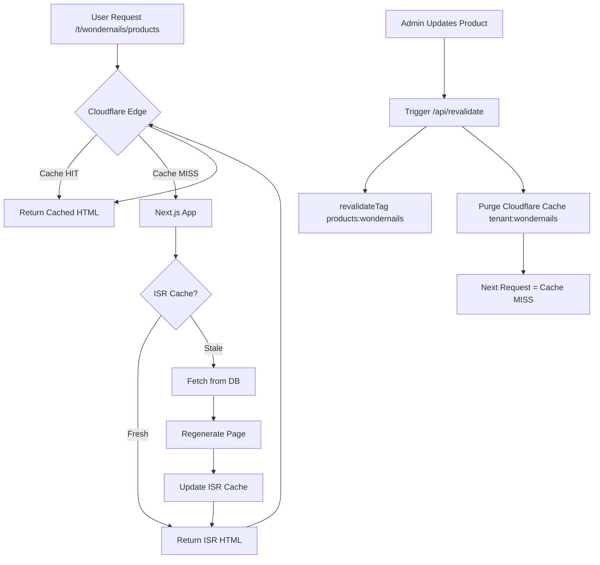

# Cloudflare Cache Optimization Guide

## Multi-Tenant SaaS Cache Strategy

Esta guía implementa cache granular por tenant con ISR + CDN para Wonder Nails y Vigi Studios (venta de productos + servicios).

---

## 1. Cloudflare Cache Rules (Dashboard → Rules → Cache Rules)

### Regla A: HTML Público (Catálogo/Servicios)
**Propósito**: Cachear páginas de productos y servicios para usuarios no autenticados

```
If:
  Hostname equals yourdomain.com
  AND Path matches /t/(*)
  AND NOT Cookie contains next-auth.session-token

Then:
  Cache level: Cache everything
  Edge TTL: 10m
  Respect origin headers: Off
  Bypass cache on cookie: session*, next-auth*
  Origin cache-control: Ignore
```

### Regla B: API GET Cacheable
**Propósito**: Cachear endpoints públicos de API (listados de productos/servicios)

```
If:
  Path matches /api/public/*
  AND Request method is GET

Then:
  Cache: Eligible for cache
  Edge TTL: 5m
  Vary: X-Tenant, Accept-Encoding
```

### Regla C: No Cache para Contenido Personalizado
**Propósito**: Bypass de cache para usuarios autenticados

```
If:
  Cookie contains next-auth.session-token

Then:
  Bypass cache
```

---

## 2. Headers de Origen (Next.js Middleware)

### Tenant Tag + Vary Header

```typescript
// apps/web/middleware.ts
import { NextResponse } from "next/server";
import type { NextRequest } from "next/server";

export function middleware(req: NextRequest) {
  const url = new URL(req.url);

  // Extraer tenant desde hostname o path
  const tenantId = url.pathname.split('/')[2] || "default"; // /t/[tenant]/...

  const res = NextResponse.next();

  // Headers para cache granular por tenant
  res.headers.set("X-Tenant", tenantId);
  res.headers.append("Cache-Tag", `tenant:${tenantId}`);

  // Para APIs cacheables - permitir variación por tenant
  if (url.pathname.startsWith('/api/public')) {
    res.headers.set("Vary", "X-Tenant, Accept-Encoding");
    res.headers.set("Cache-Control", "public, max-age=300, s-maxage=300, stale-while-revalidate=60");
  }

  // No cachear contenido personalizado
  if (req.cookies.has('next-auth.session-token')) {
    res.headers.set("Cache-Control", "private, no-cache, no-store, must-revalidate");
  }

  return res;
}

export const config = {
  matcher: [
    "/((?!_next|api/private|admin).*)",
  ],
};
```

---

## 3. Next.js ISR - Páginas con Revalidación

### 3.1 Páginas Públicas con Revalidate Time-Based

```typescript
// apps/web/app/t/[tenant]/products/page.tsx
import { cache } from "react";
import { getProducts } from "@/lib/data";

// Revalidar cada 15 minutos
export const revalidate = 900;

const getData = cache(async (tenant: string) => {
  return getProducts(tenant);
});

export default async function ProductsPage({
  params
}: {
  params: { tenant: string }
}) {
  const products = await getData(params.tenant);

  return (
    <div>
      <h1>Productos de {params.tenant}</h1>
      <ProductsGrid items={products} />
    </div>
  );
}
```

### 3.2 Revalidación por Tags (On-Demand)

```typescript
// apps/web/app/t/[tenant]/products/page.tsx
import { unstable_cache } from "next/cache";
import { getProducts } from "@/lib/data";

export const dynamic = "force-static";
export const revalidate = 0; // Usar tags en su lugar

const getData = (tenant: string) =>
  unstable_cache(
    () => getProducts(tenant),
    [`products:${tenant}`],
    {
      revalidate: 900, // Fallback: 15 min
      tags: [`products:${tenant}`, `tenant:${tenant}`]
    }
  )();

export default async function ProductsPage({
  params
}: {
  params: { tenant: string }
}) {
  const products = await getData(params.tenant);

  return <ProductsGrid items={products} />;
}
```

### 3.3 Servicios (Wondernails, Vigi Studios)

```typescript
// apps/web/app/t/[tenant]/services/page.tsx
import { unstable_cache } from "next/cache";
import { getServices } from "@/lib/data";

export const revalidate = 900; // 15 min

const getData = (tenant: string) =>
  unstable_cache(
    () => getServices(tenant),
    [`services:${tenant}`],
    {
      revalidate: 900,
      tags: [`services:${tenant}`, `tenant:${tenant}`]
    }
  )();

export default async function ServicesPage({
  params
}: {
  params: { tenant: string }
}) {
  const services = await getData(params.tenant);

  return <ServicesGrid items={services} />;
}
```

---

## 4. Endpoint de Revalidación On-Demand

### API Route para Purga Selectiva

```typescript
// apps/web/app/api/revalidate/route.ts
import { revalidateTag, revalidatePath } from "next/cache";
import { NextRequest, NextResponse } from "next/server";

export async function POST(req: NextRequest) {
  try {
    const { secret, tenant, tags, paths } = await req.json();

    // Validar secret
    if (secret !== process.env.REVALIDATE_SECRET) {
      return NextResponse.json(
        { error: "Unauthorized" },
        { status: 401 }
      );
    }

    // Revalidar por tags
    const tagsToRevalidate = tags?.length
      ? tags
      : [`products:${tenant}`, `services:${tenant}`];

    tagsToRevalidate.forEach((tag: string) => {
      revalidateTag(tag);
    });

    // Revalidar paths específicos (opcional)
    if (paths?.length) {
      paths.forEach((path: string) => {
        revalidatePath(path);
      });
    }

    return NextResponse.json({
      revalidated: true,
      tags: tagsToRevalidate,
      paths: paths || [],
      timestamp: new Date().toISOString()
    });

  } catch (error) {
    return NextResponse.json(
      { error: "Internal Server Error" },
      { status: 500 }
    );
  }
}
```

### Trigger desde Admin Panel

```typescript
// Ejemplo: cuando admin actualiza un producto
async function onProductUpdate(tenantId: string, productId: string) {
  await fetch('/api/revalidate', {
    method: 'POST',
    headers: { 'Content-Type': 'application/json' },
    body: JSON.stringify({
      secret: process.env.REVALIDATE_SECRET,
      tenant: tenantId,
      tags: [`products:${tenantId}`, `tenant:${tenantId}`],
      paths: [`/t/${tenantId}/products`, `/t/${tenantId}/products/${productId}`]
    })
  });
}
```

---

## 5. API Cacheable (CDN) vs Privada (Bypass)

### API Pública (Cacheable por CDN)

```typescript
// apps/web/app/api/public/products/route.ts
import { NextRequest, NextResponse } from "next/server";
import { getPublicProducts } from "@/lib/data";

export async function GET(req: NextRequest) {
  const tenant = req.nextUrl.searchParams.get("tenant") ?? "default";

  const data = await getPublicProducts(tenant);

  return NextResponse.json(data, {
    headers: {
      "Content-Type": "application/json",
      "Cache-Control": "public, max-age=300, s-maxage=300, stale-while-revalidate=60",
      "Vary": "X-Tenant, Accept-Encoding",
      "Cache-Tag": `tenant:${tenant}, api:public`,
    },
  });
}
```

### API Privada (No Cache)

```typescript
// apps/web/app/api/private/cart/route.ts
import { NextRequest, NextResponse } from "next/server";
import { getSession } from "next-auth/react";

export async function GET(req: NextRequest) {
  const session = await getSession();

  if (!session) {
    return NextResponse.json({ error: "Unauthorized" }, { status: 401 });
  }

  const cart = await getUserCart(session.user.id);

  return NextResponse.json(cart, {
    headers: {
      "Cache-Control": "private, no-cache, no-store, must-revalidate",
    },
  });
}
```

---

## 6. Purga Granular en Cloudflare

### Purga por Cache-Tag vía API de Cloudflare

```typescript
// lib/cloudflare/purge.ts
export async function purgeCloudflareCache(
  tenant: string,
  tags: string[] = []
) {
  const zoneId = process.env.CLOUDFLARE_ZONE_ID;
  const apiToken = process.env.CLOUDFLARE_API_TOKEN;

  const cacheTags = tags.length
    ? tags
    : [`tenant:${tenant}`, `products:${tenant}`, `services:${tenant}`];

  const response = await fetch(
    `https://api.cloudflare.com/client/v4/zones/${zoneId}/purge_cache`,
    {
      method: 'POST',
      headers: {
        'Authorization': `Bearer ${apiToken}`,
        'Content-Type': 'application/json',
      },
      body: JSON.stringify({
        tags: cacheTags
      })
    }
  );

  return response.json();
}
```

### Uso en Admin Panel

```typescript
// Cuando admin actualiza catálogo
await purgeCloudflareCache('wondernails', [
  'tenant:wondernails',
  'products:wondernails'
]);
```

---

## 7. TTLs Recomendados

| Tipo de Contenido | Edge TTL (CDN) | ISR Revalidate | Redis TTL | Notas |
|-------------------|---------------|----------------|-----------|-------|
| **HTML Catálogo/Servicios** | 10-15 min | 15 min (900s) | N/A | Purga on-demand al editar |
| **Disponibilidad/Slots** | No cache | N/A | 60-120s | Siempre fresco, alta rotación |
| **Carrito** | No cache | N/A | 2h | Session-based, privado |
| **Sesión (NextAuth)** | No cache | N/A | 24h | Token refresh automático |
| **API Públicas GET** | 5-10 min | N/A | N/A | Stale-while-revalidate |
| **Imágenes (R2/next-image)** | 30 días | N/A | N/A | Immutable, versionado en URL |

---

## 8. Guardrails y Mejores Prácticas

### ✅ Hacer:
- **Cachear HTML solo para usuarios no autenticados** (sin sesión)
- **Usar tags de cache por tenant** para purga granular
- **Variar por X-Tenant header** en APIs públicas
- **Stale-While-Revalidate** para evitar cache stampede bajo pico
- **Revalidar on-demand** al actualizar catálogo desde admin

### ❌ No Hacer:
- **Nunca cachear HTML con sesión activa** (next-auth)
- **No meter catálogos completos en Redis** (usar CDN/ISR)
- **No usar TTLs muy largos sin purga on-demand** (datos stale)
- **No olvidar keying por tenant** en Redis y cache tags

---

## 9. Flujo Completo de Cache Multi-Tenant



---

## 10. Variables de Entorno Requeridas

```bash
# .env.local
REVALIDATE_SECRET=your-secret-token-min-32-chars
CLOUDFLARE_ZONE_ID=your-zone-id
CLOUDFLARE_API_TOKEN=your-api-token

# Upstash Redis (para slots/carrito)
UPSTASH_REDIS_REST_URL=https://your-redis.upstash.io
UPSTASH_REDIS_REST_TOKEN=your-token
```

---

## Resultado Esperado

- **HTML Catálogo**: Cached en Cloudflare (10 min) + ISR (15 min)
- **Disponibilidad**: Redis (60s) - siempre fresco
- **Carrito**: Redis (2h) - privado, no CDN
- **Purga**: On-demand al actualizar productos/servicios
- **Performance**: p95 < 300ms en cache HIT, < 700ms en MISS

---

**Última actualización**: 2025-10-08
**Versión**: 1.0.0
**Tenants soportados**: Wonder Nails, Vigi Studios, Nom-Nom, Delirios
