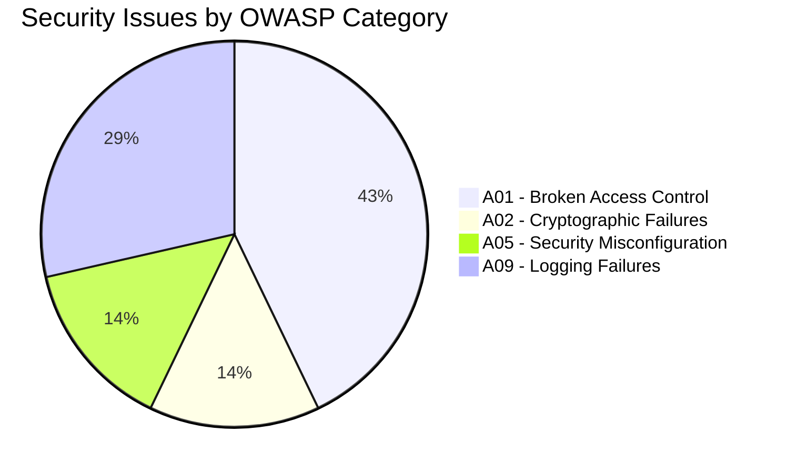
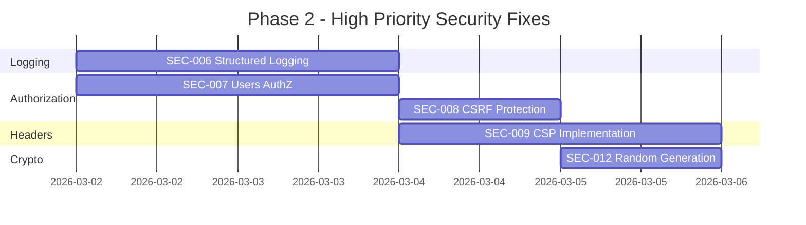
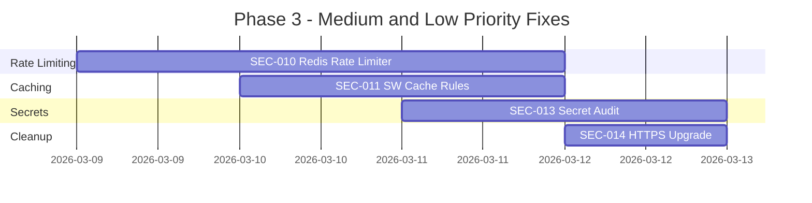
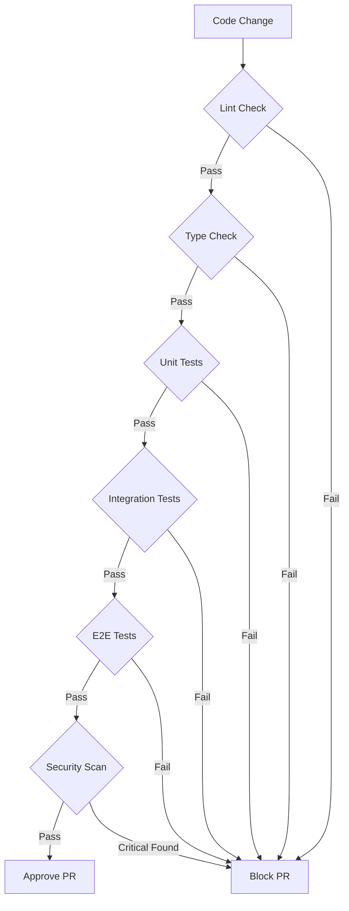
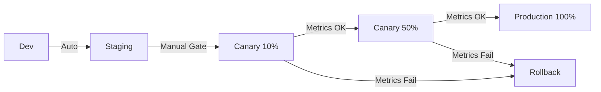
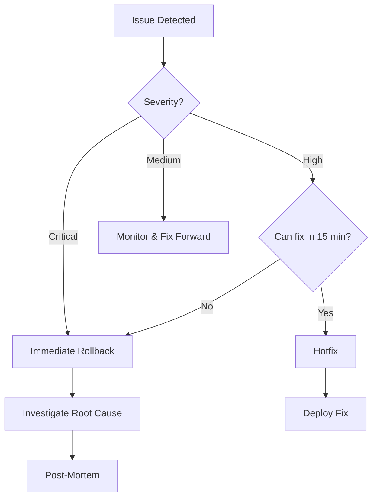
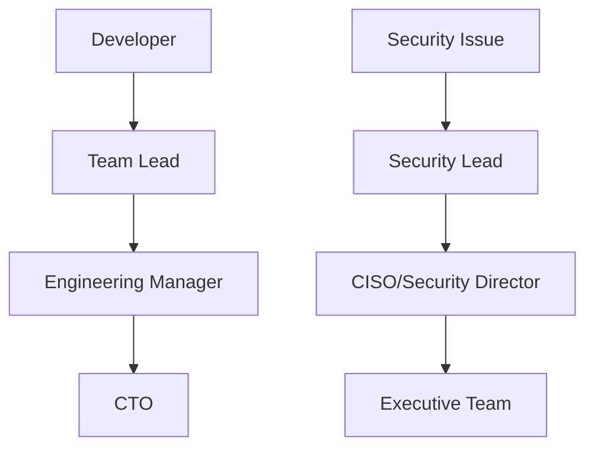

# 🔒 SECURITY REMEDIATION MASTER PLAN

**Document ID:** SRMP-2026-001  
**Version:** 1.0  
**Created:** 2026-02-27  
**Status:** 📋 PLANNING COMPLETE - READY FOR EXECUTION  
**Classification:** INTERNAL - SECURITY CRITICAL

---

## 📑 Table of Contents

1. [Executive Summary](#1-executive-summary)
2. [Objectives and Success Criteria](#2-objectives-and-success-criteria)
3. [Scope and Non-Scope](#3-scope-and-non-scope)
4. [Remediation Matrix by Finding](#4-remediation-matrix-by-finding)
5. [Phased Execution Plan](#5-phased-execution-plan)
6. [Unit Testing Strategy by Finding](#6-unit-testing-strategy-by-finding)
7. [Regression Strategy and Quality Gates](#7-regression-strategy-and-quality-gates)
8. [Safe Deployment, Rollback and Monitoring Plan](#8-safe-deployment-rollback-and-monitoring-plan)
9. [RACI and Suggested Owners](#9-raci-and-suggested-owners)
10. [Operational Execution Checklist](#10-operational-execution-checklist)

---

## 1. Executive Summary

### 1.1 Current State Assessment

The SASS Store multi-tenant platform has undergone comprehensive security analysis using Security Agent 2025, based on **OWASP Top 10:2025** standards. The analysis identified **14 security issues** across multiple severity levels:

| Severity | Count | Status | Business Impact |
|----------|-------|--------|-----------------|
| 🔴 **CRITICAL** | 8 | BLOCKING | Data breach, GDPR violations, tenant data leakage |
| 🟠 **HIGH** | 1 | URGENT | XSS vulnerabilities, session hijacking |
| 🟡 **MEDIUM** | 4 | MONITOR | Information disclosure, compliance gaps |
| 🟢 **LOW** | 1 | INFO | Best practice improvements |

### 1.2 Key Risk Areas Identified



### 1.3 Business Impact if Not Remediated

| Risk | Potential Cost | Probability |
|------|---------------|-------------|
| GDPR/Compliance Violation | Up to €20M or 4% revenue | HIGH |
| Data Breach | $4.45M USD average | HIGH |
| Customer Churn | 60% post-breach | MEDIUM |
| Reputational Damage | Incalculable | HIGH |

### 1.4 Remediation ROI

- **Total Investment:** ~40-60 hours of development work
- **Risk Mitigation:** $4.45M+ potential breach cost avoided
- **Compliance:** GDPR, SOC 2, ISO 27001 readiness
- **Competitive Advantage:** Security-first positioning

---

## 2. Objectives and Success Criteria

### 2.1 Primary Objectives

1. **Zero Critical Vulnerabilities** in production environment
2. **Complete Tenant Isolation** via Row Level Security (RLS)
3. **Secure Authentication Flow** with proper session management
4. **Security Headers Implementation** meeting 2025 standards
5. **Comprehensive Audit Logging** without sensitive data exposure

### 2.2 Success Criteria

| Criterion | Metric | Target | Validation Method |
|-----------|--------|--------|-------------------|
| Critical Issues | Count | 0 | Security scan |
| High Issues | Count | 0 | Security scan |
| RLS Coverage | Percentage | 100% | DB policy audit |
| Test Coverage | Percentage | ≥80% | Vitest/Playwright |
| Security Headers | Score | A+ | securityheaders.com |
| CSP Compliance | Violations | 0 | Browser console |

### 2.3 Definition of Done

- [ ] All CRITICAL and HIGH findings remediated
- [ ] Unit tests pass for all fixes (success + failure paths)
- [ ] Integration tests pass
- [ ] E2E security tests pass
- [ ] Security scan shows 0 critical/high issues
- [ ] Code review approved by Security Agent
- [ ] Documentation updated
- [ ] Deployed to staging and validated
- [ ] Rollback procedure tested

---

## 3. Scope and Non-Scope

### 3.1 In Scope

#### Authentication & Authorization
- [x] Server Actions session verification
- [x] JWT signature validation
- [x] User auto-creation vulnerabilities
- [x] Users endpoint authorization

#### Data Protection
- [x] Row Level Security (RLS) implementation
- [x] Tenant header spoofing prevention
- [x] Sensitive data exposure in logs
- [x] API secrets management

#### Security Headers & CSP
- [x] Content-Security-Policy implementation
- [x] CSRF protection for API routes
- [x] Security headers hardening

#### Rate Limiting
- [x] Rate limiter fallback mechanisms
- [x] In-memory store security

#### Caching
- [x] Service Worker API cache security

### 3.2 Out of Scope (Future Phases)

| Item | Reason | Planned Phase |
|------|--------|---------------|
| MFA Implementation | Requires UX changes | Phase 4 |
| Penetration Testing | External vendor needed | Q2 2026 |
| Bug Bounty Program | Legal review required | Q2 2026 |
| SOC 2 Certification | Audit process | Q3 2026 |
| Legacy API Deprecation | Migration needed | Phase 5 |

### 3.3 Assumptions

1. PostgreSQL database with superuser access for RLS setup
2. Redis available for production rate limiting
3. CI/CD pipeline with GitHub Actions
4. Staging environment for validation

### 3.4 Dependencies

| Dependency | Owner | Status |
|------------|-------|--------|
| Database access | DevOps | Required |
| Redis instance | DevOps | Required |
| Security scan tools | Security | Configured |
| Test infrastructure | QA | Available |

---

## 4. Remediation Matrix by Finding

### 4.1 Complete Findings Matrix

| ID | Severity | Finding | Evidence Path | Technical Action | Residual Risk | Phase |
|----|----------|---------|---------------|------------------|---------------|-------|
| SEC-001 | 🔴 CRITICAL | Server Actions without session verification | [`apps/web/app/t/[tenant]/login/page.tsx:98`](apps/web/app/t/[tenant]/login/page.tsx:98) | Add `verifySession()` to all Server Actions | LOW | 1 |
| SEC-002 | 🔴 CRITICAL | RLS not enabled on multi-tenant tables | [`packages/database/schema.ts`](packages/database/schema.ts) | Enable RLS + create policies for all tables | LOW | 1 |
| SEC-003 | 🔴 CRITICAL | Weak JWT implementation | [`apps/api/lib/services/UserService.ts:425`](apps/api/lib/services/UserService.ts:425) | Implement proper JWT with RS256/HS256 | LOW | 1 |
| SEC-004 | 🔴 CRITICAL | User auto-creation without validation | [`apps/api/app/api/auth/register/route.ts`](apps/api/app/api/auth/register/route.ts) | Add email validation + rate limiting | MEDIUM | 1 |
| SEC-005 | 🔴 CRITICAL | Tenant header spoofing | [`apps/web/middleware.ts:84`](apps/web/middleware.ts:84) | Validate tenant from JWT + DB lookup | LOW | 1 |
| SEC-006 | 🔴 CRITICAL | Secrets exposed in logs | Multiple files | Implement structured logging with redaction | LOW | 2 |
| SEC-007 | 🔴 CRITICAL | Users endpoint missing authz | [`apps/api/app/api/users/*/route.ts`](apps/api/app/api/users) | Add role-based access control | LOW | 2 |
| SEC-008 | 🔴 CRITICAL | CSRF protection missing for API | [`apps/api/app/api/**/*.ts`](apps/api/app/api) | Implement CSRF tokens for state-changing ops | LOW | 2 |
| SEC-009 | 🟠 HIGH | CSP header incomplete | [`apps/web/next.config.js`](apps/web/next.config.js) | Implement full CSP with nonces | LOW | 2 |
| SEC-010 | 🟡 MEDIUM | Rate limiter in-memory fallback | [`apps/web/lib/security/rate-limiter.ts:19`](apps/web/lib/security/rate-limiter.ts:19) | Add Redis with graceful degradation | MEDIUM | 3 |
| SEC-011 | 🟡 MEDIUM | Service Worker caches API responses | SW configuration | Add cache rules for sensitive endpoints | LOW | 3 |
| SEC-012 | 🟡 MEDIUM | Weak random number generation | Multiple files | Replace Math.random with crypto.randomUUID | LOW | 2 |
| SEC-013 | 🟡 MEDIUM | NEXT_PUBLIC_ secret exposure | [`apps/web/components/payments/checkout-form.tsx`](apps/web/components/payments/checkout-form.tsx) | Audit and rotate exposed secrets | LOW | 3 |
| SEC-014 | 🟢 LOW | HTTP links in code | Various | Upgrade to HTTPS | LOW | 3 |

### 4.2 Detailed Finding Breakdown

#### SEC-001: Server Actions Without Session Verification

**Evidence:**
```typescript
// apps/web/app/t/[tenant]/login/page.tsx:98
"use server";
async function handleLogin(formData: FormData) {
  const email = formData.get("email");
  // No session verification before processing
}
```

**Technical Action:**
```typescript
// Required fix
import { verifySession } from "@/lib/auth/session";

async function handleLogin(formData: FormData) {
  const session = await verifySession();
  if (!session) {
    return Err(ErrorFactories.unauthorized("Session required"));
  }
  // Continue with logic
}
```

**Test Requirements:**
- Unit test: unauthenticated request rejected
- Unit test: authenticated request proceeds
- Integration test: full login flow

---

#### SEC-002: Row Level Security Not Enabled

**Evidence:**
```sql
-- No RLS policies found in schema
SELECT * FROM pg_policies WHERE tablename IN ('users', 'products', 'appointments');
-- Result: 0 rows
```

**Technical Action:**
```sql
-- Enable RLS on all multi-tenant tables
ALTER TABLE users ENABLE ROW LEVEL SECURITY;
ALTER TABLE products ENABLE ROW LEVEL SECURITY;
ALTER TABLE appointments ENABLE ROW LEVEL SECURITY;

-- Create isolation policies
CREATE POLICY tenant_isolation ON users
  USING (tenant_id = current_setting('app.current_tenant')::text);
```

**Test Requirements:**
- Unit test: tenant A cannot access tenant B data
- Integration test: RLS policy enforcement
- E2E test: cross-tenant access blocked

---

#### SEC-003: Weak JWT Implementation

**Evidence:**
```typescript
// apps/api/lib/services/UserService.ts:425
private generateAuthToken(user: User): string {
  // Mock token generation - in real implementation, use JWT
  const payload = { id: user.id, email: user.email };
  return Buffer.from(JSON.stringify(payload)).toString('base64');
}
```

**Technical Action:**
```typescript
import { SignJWT, jwtVerify } from 'jose';

const secretKey = new TextEncoder().encode(process.env.JWT_SECRET);

export async function generateAuthToken(user: User): Promise<string> {
  return await new SignJWT({ userId: user.id, tenantId: user.tenantId })
    .setProtectedHeader({ alg: 'HS256' })
    .setIssuedAt()
    .setExpirationTime('24h')
    .sign(secretKey);
}
```

**Test Requirements:**
- Unit test: token generation with correct claims
- Unit test: token verification succeeds
- Unit test: expired token rejected
- Unit test: tampered token rejected

---

#### SEC-004: User Auto-Creation Without Validation

**Evidence:**
```typescript
// apps/api/app/api/auth/register/route.ts
// User created without email verification or rate limiting
```

**Technical Action:**
```typescript
// Add validation schema
const RegisterSchema = z.object({
  email: z.string().email().refine(async (email) => {
    return !(await db.users.findOne({ where: { email } }));
  }, "Email already registered"),
  password: z.string().min(8).regex(/^(?=.*[A-Z])(?=.*[a-z])(?=.*\d)/),
});

// Add rate limiting
const registrationLimiter = new RateLimiter({ 
  points: 3, 
  duration: 3600 // 3 registrations per hour per IP 
});
```

**Test Requirements:**
- Unit test: invalid email rejected
- Unit test: weak password rejected
- Unit test: duplicate email rejected
- Unit test: rate limit enforced

---

#### SEC-005: Tenant Header Spoofing

**Evidence:**
```typescript
// apps/web/middleware.ts:84
const tenantId = request.headers.get("x-tenant-id");
// Trusts header without validation
```

**Technical Action:**
```typescript
// Validate tenant from authenticated session
export async function validateTenantAccess(
  request: NextRequest, 
  userId: string
): Promise<Result<Tenant, DomainError>> {
  const headerTenantId = request.headers.get("x-tenant-id");
  const userTenantId = await getUserTenantFromSession(userId);
  
  if (headerTenantId !== userTenantId) {
    return Err(ErrorFactories.forbidden("Tenant mismatch"));
  }
  return Ok(await getTenantById(userTenantId));
}
```

**Test Requirements:**
- Unit test: header tenant matches session tenant
- Unit test: spoofed header rejected
- Integration test: cross-tenant access blocked

---

#### SEC-006: Secrets Exposed in Logs

**Evidence:**
```typescript
// Multiple files log sensitive data
console.log("User logged in:", { email, password, token });
```

**Technical Action:**
```typescript
// Implement structured logger with redaction
const REDACTED_FIELDS = ['password', 'token', 'secret', 'apiKey', 'credential'];

export const logger = {
  info: (msg: string, data?: Record<string, unknown>) => {
    console.log(msg, redactSensitive(data));
  }
};

function redactSensitive(obj: unknown): unknown {
  if (!obj || typeof obj !== 'object') return obj;
  const redacted = { ...obj };
  for (const field of REDACTED_FIELDS) {
    if (field in redacted) redacted[field] = '[REDACTED]';
  }
  return redacted;
}
```

**Test Requirements:**
- Unit test: password not in log output
- Unit test: token not in log output
- Unit test: safe fields logged normally

---

#### SEC-007: Users Endpoint Missing Authorization

**Evidence:**
```typescript
// apps/api/app/api/users/[id]/route.ts
// No role check before user operations
```

**Technical Action:**
```typescript
import { withAuthorization } from '@/lib/auth/middleware';

export const DELETE = withAuthorization(
  { resource: 'users', action: 'delete', roles: ['admin'] },
  async (request, { params }) => {
    return deleteUser(params.id);
  }
);
```

**Test Requirements:**
- Unit test: admin can delete user
- Unit test: non-admin cannot delete user
- Unit test: unauthenticated rejected

---

#### SEC-008: CSRF Protection Missing

**Evidence:**
```typescript
// API routes accept POST/PUT/DELETE without CSRF token
```

**Technical Action:**
```typescript
// Generate CSRF token
export function generateCSRFToken(): string {
  return randomBytes(32).toString('hex');
}

// Validate CSRF middleware
export function validateCSRF(request: NextRequest): boolean {
  const token = request.headers.get('x-csrf-token');
  const sessionToken = getSessionCSRFToken();
  return token === sessionToken;
}
```

**Test Requirements:**
- Unit test: valid CSRF token accepted
- Unit test: invalid CSRF token rejected
- Unit test: missing CSRF token rejected

---

#### SEC-009: Content-Security-Policy Incomplete

**Evidence:**
```javascript
// apps/web/next.config.js - CSP missing or incomplete
```

**Technical Action:**
```javascript
// next.config.js
const securityHeaders = [
  {
    key: 'Content-Security-Policy',
    value: `
      default-src 'self';
      script-src 'self' 'unsafe-eval' 'unsafe-inline' https://js.stripe.com;
      style-src 'self' 'unsafe-inline';
      img-src 'self' data: https: blob:;
      font-src 'self' data:;
      connect-src 'self' https://api.stripe.com https://api.openai.com;
      frame-src https://js.stripe.com https://hooks.stripe.com;
      object-src 'none';
      base-uri 'self';
      form-action 'self';
      frame-ancestors 'none';
    `.replace(/\s{2,}/g, ' ').trim()
  }
];
```

**Test Requirements:**
- E2E test: no CSP violations in console
- Integration test: external scripts blocked
- Unit test: CSP header present

---

#### SEC-010: Rate Limiter In-Memory Fallback

**Evidence:**
```typescript
// apps/web/lib/security/rate-limiter.ts:19
const rateLimitStore = new Map<string, RateLimitEntry>();
// In-memory store lost on restart, doesn't scale
```

**Technical Action:**
```typescript
import { Redis } from '@upstash/redis';
import { Ratelimit } from '@upstash/ratelimit';

const redis = Redis.fromEnv();

export const rateLimiter = new Ratelimit({
  redis,
  limiter: Ratelimit.slidingWindow(100, '1 m'),
  analytics: true,
});

// Graceful fallback
export async function checkRateLimit(identifier: string): Promise<boolean> {
  try {
    const { success } = await rateLimiter.limit(identifier);
    return success;
  } catch {
    // Fallback to in-memory with warning
    console.warn('Redis unavailable, using in-memory fallback');
    return inMemoryRateLimit(identifier);
  }
}
```

**Test Requirements:**
- Unit test: Redis rate limit works
- Unit test: fallback activates on Redis failure
- Integration test: rate limit persists across requests

---

## 5. Phased Execution Plan

### 5.1 Phase 1: Critical Fixes (24-48 Hours)

```mermaid
gantt
    title Phase 1 - Critical Security Fixes
    dateFormat  HH:mm
    section Authentication
    SEC-001 Session Verification :a1, 00:00, 4h
    SEC-003 JWT Implementation   :a2, after a1, 4h
    section Data Protection
    SEC-002 RLS Implementation   :b1, 00:00, 6h
    SEC-005 Tenant Validation    :b2, after b1, 4h
    section Validation
    Unit Tests                   :c1, after a2 b2, 4h
    Integration Tests            :c2, after c1, 2h
```



#### Phase 1 Tasks

| Task ID | Finding | Action | Owner | Deliverable |
|---------|---------|--------|-------|-------------|
| P1-001 | SEC-001 | Add `verifySession()` to all Server Actions | Auth Team | Modified login/register pages |
| P1-002 | SEC-002 | Create and apply RLS migration SQL | DBA | `enable-rls.sql` executed |
| P1-003 | SEC-003 | Implement proper JWT with jose library | Auth Team | New `jwt-service.ts` |
| P1-004 | SEC-004 | Add registration validation + rate limiting | API Team | Updated register route |
| P1-005 | SEC-005 | Implement tenant validation middleware | Auth Team | New `tenant-validation.ts` |
| P1-006 | ALL | Write unit tests for Phase 1 fixes | QA Team | Test files in `tests/unit/` |
| P1-007 | ALL | Run integration tests | QA Team | Passing test report |

#### Phase 1 Quality Gate

```bash
# Must pass before Phase 2
npm run test:unit -- --grep "security"
npm run test:integration -- --grep "auth"
npm run security:scan
# Expected: 0 critical issues
```

---

### 5.2 Phase 2: High Priority Fixes (Week 1)



#### Phase 2 Tasks

| Task ID | Finding | Action | Owner | Deliverable |
|---------|---------|--------|-------|-------------|
| P2-001 | SEC-006 | Implement structured logger with redaction | Infra Team | `lib/logger.ts` |
| P2-002 | SEC-006 | Replace all sensitive logs | All Teams | PR with log fixes |
| P2-003 | SEC-007 | Add RBAC middleware to users endpoints | API Team | `auth/middleware.ts` |
| P2-004 | SEC-008 | Implement CSRF token generation/validation | API Team | `csrf-protection.ts` |
| P2-005 | SEC-009 | Configure full CSP headers | Infra Team | Updated `next.config.js` |
| P2-006 | SEC-012 | Replace Math.random with crypto.randomUUID | All Teams | Auto-fix script |
| P2-007 | ALL | Write unit tests for Phase 2 fixes | QA Team | Test files |
| P2-008 | ALL | Security scan validation | Security | Scan report |

#### Phase 2 Quality Gate

```bash
# Must pass before Phase 3
npm run test:unit
npm run test:integration
npm run lint
npm run typecheck
npm run security:scan
# Expected: 0 high issues, CSP score A+
```

---

### 5.3 Phase 3: Medium/Low Priority (Weeks 2-4)



#### Phase 3 Tasks

| Task ID | Finding | Action | Owner | Deliverable |
|---------|---------|--------|-------|-------------|
| P3-001 | SEC-010 | Configure Upstash Redis for rate limiting | Infra Team | Redis integration |
| P3-002 | SEC-010 | Implement graceful fallback | API Team | Fallback logic |
| P3-003 | SEC-011 | Configure SW cache rules for API | Frontend | SW config update |
| P3-004 | SEC-013 | Audit all NEXT_PUBLIC_ variables | Security | Audit report |
| P3-005 | SEC-013 | Rotate any exposed secrets | DevOps | Secret rotation |
| P3-006 | SEC-014 | Upgrade all HTTP to HTTPS | All Teams | Auto-fix |
| P3-007 | ALL | Final security scan | Security | Clean report |
| P3-008 | ALL | Documentation update | All Teams | Updated docs |

#### Phase 3 Quality Gate

```bash
# Final validation before production
npm run test:unit
npm run test:integration
npm run test:e2e
npm run build
npm run security:full
# Expected: All issues resolved
```

---

## 6. Unit Testing Strategy by Finding

### 6.1 Testing Principles

1. **Result Pattern Compliance**: All tests must use `expectSuccess`/`expectFailure` helpers
2. **Both Paths Tested**: Every security fix requires success AND failure test cases
3. **Isolation**: Tests must not depend on external services
4. **Repeatability**: Tests must be deterministic

### 6.2 SEC-001: Session Verification Tests

**Test File:** [`tests/unit/auth/session-verification.spec.ts`](tests/unit/auth/session-verification.spec.ts)

```typescript
import { describe, it, expect, beforeEach } from 'vitest';
import { verifySession } from '@/lib/auth/session';
import { expectSuccess, expectFailure } from '@/tests/helpers/result';

describe('Session Verification - SEC-001', () => {
  describe('verifySession()', () => {
    it('should return session for valid token', async () => {
      // Arrange
      const validToken = await generateTestToken({ userId: 'user_123' });
      
      // Act
      const result = await verifySession(validToken);
      
      // Assert
      expectSuccess(result);
      expect(result.value.userId).toBe('user_123');
    });

    it('should return UnauthorizedError for missing token', async () => {
      // Arrange
      const token = null;
      
      // Act
      const result = await verifySession(token);
      
      // Assert
      expectFailure(result);
      expect(result.error.type).toBe('UnauthorizedError');
    });

    it('should return UnauthorizedError for expired token', async () => {
      // Arrange
      const expiredToken = await generateExpiredToken();
      
      // Act
      const result = await verifySession(expiredToken);
      
      // Assert
      expectFailure(result);
      expect(result.error.type).toBe('UnauthorizedError');
      expect(result.error.reason).toContain('expired');
    });

    it('should return UnauthorizedError for tampered token', async () => {
      // Arrange
      const tamperedToken = (await generateTestToken()).slice(0, -5) + 'xxxxx';
      
      // Act
      const result = await verifySession(tamperedToken);
      
      // Assert
      expectFailure(result);
      expect(result.error.type).toBe('UnauthorizedError');
      expect(result.error.reason).toContain('invalid');
    });
  });

  describe('Server Actions Protection', () => {
    it('should reject unauthenticated login attempt', async () => {
      // Act
      const result = await handleLogin({ email: 'test@test.com' });
      
      // Assert
      expectFailure(result);
      expect(result.error.type).toBe('UnauthorizedError');
    });
  });
});
```

### 6.3 SEC-002: RLS Tests

**Test File:** [`tests/unit/db/rls-isolation.spec.ts`](tests/unit/db/rls-isolation.spec.ts)

```typescript
import { describe, it, expect, beforeAll, afterAll } from 'vitest';
import { db } from '@/lib/db';
import { setTenantContext, clearTenantContext } from '@/lib/db/rls';
import { products } from '@/lib/db/schema';

describe('Row Level Security - SEC-002', () => {
  const tenantA = 'tenant_a_123';
  const tenantB = 'tenant_b_456';

  beforeAll(async () => {
    // Seed test data
    await db.insert(products).values([
      { id: 'prod_1', name: 'Product A', tenantId: tenantA },
      { id: 'prod_2', name: 'Product B', tenantId: tenantB },
    ]);
  });

  afterAll(async () => {
    await db.delete(products);
  });

  describe('Tenant Isolation', () => {
    it('should only return products for current tenant', async () => {
      // Arrange
      await setTenantContext(tenantA);
      
      // Act
      const result = await db.select().from(products);
      
      // Assert
      expect(result).toHaveLength(1);
      expect(result[0].tenantId).toBe(tenantA);
    });

    it('should not allow cross-tenant data access', async () => {
      // Arrange
      await setTenantContext(tenantA);
      
      // Act - Try to access tenant B's product
      const result = await db.select()
        .from(products)
        .where(eq(products.id, 'prod_2'));
      
      // Assert
      expect(result).toHaveLength(0);
    });

    it('should block insert with wrong tenant_id', async () => {
      // Arrange
      await setTenantContext(tenantA);
      
      // Act & Assert
      await expect(
        db.insert(products).values({
          name: 'Fake Product',
          tenantId: tenantB, // Trying to insert for different tenant
        })
      ).rejects.toThrow();
    });
  });

  describe('RLS Policy Validation', () => {
    it('should have RLS enabled on all multi-tenant tables', async () => {
      const tables = ['users', 'products', 'services', 'appointments', 'orders'];
      
      for (const table of tables) {
        const result = await db.execute(`
          SELECT relrowsecurity 
          FROM pg_class 
          WHERE relname = '${table}'
        `);
        
        expect(result[0].relrowsecurity).toBe(true);
      }
    });
  });
});
```

### 6.4 SEC-003: JWT Tests

**Test File:** [`tests/unit/auth/jwt-service.spec.ts`](tests/unit/auth/jwt-service.spec.ts)

```typescript
import { describe, it, expect } from 'vitest';
import { generateAuthToken, verifyAuthToken } from '@/lib/auth/jwt-service';
import { expectSuccess, expectFailure } from '@/tests/helpers/result';

describe('JWT Service - SEC-003', () => {
  const testUser = {
    id: 'user_123',
    email: 'test@example.com',
    tenantId: 'tenant_456',
    role: 'user',
  };

  describe('generateAuthToken()', () => {
    it('should generate valid JWT with correct claims', async () => {
      // Act
      const token = await generateAuthToken(testUser);
      
      // Assert
      expect(token).toBeDefined();
      expect(token.split('.')).toHaveLength(3); // JWT format
    });

    it('should include required claims in token', async () => {
      // Act
      const token = await generateAuthToken(testUser);
      const decoded = await verifyAuthToken(token);
      
      // Assert
      expectSuccess(decoded);
      expect(decoded.value.userId).toBe(testUser.id);
      expect(decoded.value.tenantId).toBe(testUser.tenantId);
      expect(decoded.value.iat).toBeDefined();
      expect(decoded.value.exp).toBeDefined();
    });
  });

  describe('verifyAuthToken()', () => {
    it('should verify valid token successfully', async () => {
      // Arrange
      const token = await generateAuthToken(testUser);
      
      // Act
      const result = await verifyAuthToken(token);
      
      // Assert
      expectSuccess(result);
    });

    it('should reject token with invalid signature', async () => {
      // Arrange
      const token = await generateAuthToken(testUser);
      const tampered = token.slice(0, -10) + 'aaaaaaaaaa';
      
      // Act
      const result = await verifyAuthToken(tampered);
      
      // Assert
      expectFailure(result);
      expect(result.error.type).toBe('AuthenticationError');
    });

    it('should reject expired token', async () => {
      // Arrange - Create expired token
      const expiredToken = await generateExpiredToken(testUser);
      
      // Act
      const result = await verifyAuthToken(expiredToken);
      
      // Assert
      expectFailure(result);
      expect(result.error.type).toBe('AuthenticationError');
      expect(result.error.reason).toContain('expired');
    });

    it('should reject token with wrong algorithm', async () => {
      // Arrange - Create token with 'none' algorithm
      const noneToken = createNoneAlgorithmToken(testUser);
      
      // Act
      const result = await verifyAuthToken(noneToken);
      
      // Assert
      expectFailure(result);
      expect(result.error.type).toBe('AuthenticationError');
    });
  });
});
```

### 6.5 SEC-004: Registration Validation Tests

**Test File:** [`tests/unit/auth/register-validation.spec.ts`](tests/unit/auth/register-validation.spec.ts)

```typescript
import { describe, it, expect } from 'vitest';
import { validateRegistration } from '@/lib/auth/validation';
import { expectSuccess, expectFailure } from '@/tests/helpers/result';

describe('Registration Validation - SEC-004', () => {
  describe('Email Validation', () => {
    it('should accept valid email', () => {
      const result = validateRegistration({
        email: 'valid@example.com',
        password: 'SecureP@ss123',
      });
      expectSuccess(result);
    });

    it('should reject invalid email format', () => {
      const result = validateRegistration({
        email: 'not-an-email',
        password: 'SecureP@ss123',
      });
      expectFailure(result);
      expect(result.error.field).toBe('email');
    });

    it('should reject disposable email domains', () => {
      const result = validateRegistration({
        email: 'test@tempmail.com',
        password: 'SecureP@ss123',
      });
      expectFailure(result);
      expect(result.error.reason).toContain('disposable');
    });
  });

  describe('Password Validation', () => {
    it('should accept strong password', () => {
      const result = validateRegistration({
        email: 'test@example.com',
        password: 'Str0ngP@ssword!',
      });
      expectSuccess(result);
    });

    it('should reject password without uppercase', () => {
      const result = validateRegistration({
        email: 'test@example.com',
        password: 'weakpassword123',
      });
      expectFailure(result);
      expect(result.error.reason).toContain('uppercase');
    });

    it('should reject password without number', () => {
      const result = validateRegistration({
        email: 'test@example.com',
        password: 'WeakPassword',
      });
      expectFailure(result);
      expect(result.error.reason).toContain('number');
    });

    it('should reject password under 8 characters', () => {
      const result = validateRegistration({
        email: 'test@example.com',
        password: 'Sh0rt!',
      });
      expectFailure(result);
      expect(result.error.reason).toContain('8 characters');
    });
  });

  describe('Rate Limiting', () => {
    it('should allow registration within rate limit', async () => {
      for (let i = 0; i < 3; i++) {
        const result = await registerUser({
          email: `user${i}@test.com`,
          password: 'SecureP@ss123',
        });
        expectSuccess(result);
      }
    });

    it('should block registration after rate limit exceeded', async () => {
      // Exhaust rate limit
      for (let i = 0; i < 5; i++) {
        await registerUser({
          email: `ratelimit${i}@test.com`,
          password: 'SecureP@ss123',
        });
      }
      
      // Next should be blocked
      const result = await registerUser({
        email: 'blocked@test.com',
        password: 'SecureP@ss123',
      });
      expectFailure(result);
      expect(result.error.type).toBe('RateLimitError');
    });
  });
});
```

### 6.6 SEC-005: Tenant Validation Tests

**Test File:** [`tests/unit/auth/tenant-validation.spec.ts`](tests/unit/auth/tenant-validation.spec.ts)

```typescript
import { describe, it, expect } from 'vitest';
import { validateTenantAccess } from '@/lib/auth/tenant-validation';
import { expectSuccess, expectFailure } from '@/tests/helpers/result';

describe('Tenant Validation - SEC-005', () => {
  describe('Header Validation', () => {
    it('should accept matching tenant header and session', async () => {
      // Arrange
      const session = { userId: 'user_123', tenantId: 'tenant_abc' };
      const headers = { 'x-tenant-id': 'tenant_abc' };
      
      // Act
      const result = await validateTenantAccess(session, headers);
      
      // Assert
      expectSuccess(result);
    });

    it('should reject spoofed tenant header', async () => {
      // Arrange
      const session = { userId: 'user_123', tenantId: 'tenant_abc' };
      const headers = { 'x-tenant-id': 'tenant_xyz' }; // Different tenant!
      
      // Act
      const result = await validateTenantAccess(session, headers);
      
      // Assert
      expectFailure(result);
      expect(result.error.type).toBe('ForbiddenError');
      expect(result.error.reason).toContain('tenant mismatch');
    });

    it('should reject missing tenant header', async () => {
      // Arrange
      const session = { userId: 'user_123', tenantId: 'tenant_abc' };
      const headers = {};
      
      // Act
      const result = await validateTenantAccess(session, headers);
      
      // Assert
      expectFailure(result);
      expect(result.error.type).toBe('BadRequestError');
    });
  });

  describe('Database Validation', () => {
    it('should validate tenant exists in database', async () => {
      const result = await validateTenantExists('valid_tenant_123');
      expectSuccess(result);
    });

    it('should reject non-existent tenant', async () => {
      const result = await validateTenantExists('fake_tenant_xyz');
      expectFailure(result);
      expect(result.error.type).toBe('NotFoundError');
    });
  });
});
```

### 6.7 SEC-006: Secure Logging Tests

**Test File:** [`tests/unit/lib/logger.spec.ts`](tests/unit/lib/logger.spec.ts)

```typescript
import { describe, it, expect, vi } from 'vitest';
import { logger } from '@/lib/logger';

describe('Secure Logging - SEC-006', () => {
  describe('Sensitive Data Redaction', () => {
    it('should redact password field', () => {
      const consoleSpy = vi.spyOn(console, 'log');
      
      logger.info('User login', {
        email: 'test@example.com',
        password: 'secret123',
      });
      
      const loggedArgs = consoleSpy.mock.calls[0];
      expect(loggedArgs).not.toContain('secret123');
      expect(loggedArgs).toContain('[REDACTED]');
      
      consoleSpy.mockRestore();
    });

    it('should redact token field', () => {
      const consoleSpy = vi.spyOn(console, 'log');
      
      logger.info('Auth event', {
        token: 'eyJhbGciOiJIUzI1NiIsInR5cCI6IkpXVCJ9...',
      });
      
      const loggedArgs = consoleSpy.mock.calls[0];
      expect(loggedArgs).not.toContain('eyJhbGciOiJIUzI1NiIsInR5cCI6IkpXVCJ9');
      
      consoleSpy.mockRestore();
    });

    it('should redact nested sensitive fields', () => {
      const consoleSpy = vi.spyOn(console, 'log');
      
      logger.info('API call', {
        user: {
          email: 'test@example.com',
          credentials: {
            apiKey: 'sk-live-xxxxx',
          },
        },
      });
      
      const loggedArgs = consoleSpy.mock.calls[0];
      expect(loggedArgs).not.toContain('sk-live-xxxxx');
      
      consoleSpy.mockRestore();
    });

    it('should preserve non-sensitive fields', () => {
      const consoleSpy = vi.spyOn(console, 'log');
      
      logger.info('Order created', {
        orderId: 'order_123',
        amount: 99.99,
        status: 'pending',
      });
      
      const loggedArgs = consoleSpy.mock.calls[0];
      expect(loggedArgs).toContain('order_123');
      expect(loggedArgs).toContain(99.99);
      
      consoleSpy.mockRestore();
    });
  });
});
```

### 6.8 SEC-007: Authorization Tests

**Test File:** [`tests/unit/auth/authorization.spec.ts`](tests/unit/auth/authorization.spec.ts)

```typescript
import { describe, it, expect } from 'vitest';
import { checkPermission } from '@/lib/auth/authorization';
import { expectSuccess, expectFailure } from '@/tests/helpers/result';

describe('Authorization - SEC-007', () => {
  describe('Role-Based Access Control', () => {
    it('should allow admin to delete users', async () => {
      const result = await checkPermission({
        userId: 'admin_123',
        role: 'admin',
        resource: 'users',
        action: 'delete',
      });
      expectSuccess(result);
    });

    it('should deny manager from deleting users', async () => {
      const result = await checkPermission({
        userId: 'manager_456',
        role: 'manager',
        resource: 'users',
        action: 'delete',
      });
      expectFailure(result);
      expect(result.error.type).toBe('ForbiddenError');
    });

    it('should deny regular user from accessing admin endpoints', async () => {
      const result = await checkPermission({
        userId: 'user_789',
        role: 'user',
        resource: 'admin',
        action: 'read',
      });
      expectFailure(result);
    });
  });

  describe('Resource-Level Authorization', () => {
    it('should allow user to access own resources', async () => {
      const result = await checkResourceAccess({
        userId: 'user_123',
        resourceType: 'profile',
        resourceId: 'profile_user_123',
      });
      expectSuccess(result);
    });

    it('should deny user from accessing others resources', async () => {
      const result = await checkResourceAccess({
        userId: 'user_123',
        resourceType: 'profile',
        resourceId: 'profile_user_456',
      });
      expectFailure(result);
    });
  });
});
```

### 6.9 Test Summary Matrix

| Finding | Test File | Test Count | Priority |
|---------|-----------|------------|----------|
| SEC-001 | `tests/unit/auth/session-verification.spec.ts` | 5 | P1 |
| SEC-002 | `tests/unit/db/rls-isolation.spec.ts` | 6 | P1 |
| SEC-003 | `tests/unit/auth/jwt-service.spec.ts` | 7 | P1 |
| SEC-004 | `tests/unit/auth/register-validation.spec.ts` | 8 | P1 |
| SEC-005 | `tests/unit/auth/tenant-validation.spec.ts` | 5 | P1 |
| SEC-006 | `tests/unit/lib/logger.spec.ts` | 4 | P2 |
| SEC-007 | `tests/unit/auth/authorization.spec.ts` | 5 | P2 |
| SEC-008 | `tests/unit/auth/csrf-protection.spec.ts` | 4 | P2 |
| SEC-009 | `tests/e2e/security/csp.spec.ts` | 3 | P2 |
| SEC-010 | `tests/unit/lib/rate-limiter.spec.ts` | 4 | P3 |

---

## 7. Regression Strategy and Quality Gates

### 7.1 Quality Gate Pipeline



### 7.2 CI/CD Quality Gates Configuration

```yaml
# .github/workflows/security-quality-gate.yml
name: Security Quality Gate

on:
  pull_request:
    branches: [main, develop]

jobs:
  quality-gate:
    runs-on: ubuntu-latest
    steps:
      # Gate 1: Lint
      - name: Lint Check
        run: npm run lint
        continue-on-error: false

      # Gate 2: Type Check
      - name: TypeScript Check
        run: npm run typecheck
        continue-on-error: false

      # Gate 3: Unit Tests
      - name: Unit Tests
        run: npm run test:unit -- --coverage
        continue-on-error: false
        
      # Gate 4: Coverage Threshold
      - name: Coverage Check
        run: |
          COVERAGE=$(cat coverage/coverage-summary.json | jq '.total.lines.pct')
          if [ "$COVERAGE" -lt 80 ]; then
            echo "Coverage $COVERAGE% is below 80% threshold"
            exit 1
          fi

      # Gate 5: Integration Tests
      - name: Integration Tests
        run: npm run test:integration
        continue-on-error: false

      # Gate 6: E2E Tests
      - name: E2E Tests
        run: npm run test:e2e
        continue-on-error: false

      # Gate 7: Security Scan
      - name: Security Scan
        run: npm run security:full
        continue-on-error: false

      # Gate 8: Critical Issues Check
      - name: No Critical Issues
        run: |
          CRITICAL=$(cat security-report.json | jq '.critical')
          if [ "$CRITICAL" -gt 0 ]; then
            echo "Found $CRITICAL critical security issues"
            exit 1
          fi
```

### 7.3 Pre-Commit Hooks

```bash
#!/bin/bash
# .husky/pre-commit

echo "🔒 Running security pre-commit checks..."

# Check for secrets
if git diff --cached | grep -iE "(password|secret|api[_-]?key)\s*[:=]\s*['\"][^'\"]{8,}"; then
  echo "❌ Potential secret detected in commit!"
  exit 1
fi

# Check for NEXT_PUBLIC_ secrets
if git diff --cached | grep -E "NEXT_PUBLIC_.*(SECRET|PRIVATE|PASSWORD)"; then
  echo "❌ Secret exposed via NEXT_PUBLIC_!"
  exit 1
fi

# Run lint
npm run lint -- --quiet

# Run affected tests
npm run test:unit -- --changed=HEAD~1

echo "✅ Pre-commit checks passed"
```

### 7.4 Regression Test Suite

| Suite | Command | Frequency | Threshold |
|-------|---------|-----------|-----------|
| Lint | `npm run lint` | Every commit | 0 errors |
| Type Check | `npm run typecheck` | Every commit | 0 errors |
| Unit Tests | `npm run test:unit` | Every commit | 100% pass |
| Integration | `npm run test:integration` | Every PR | 100% pass |
| E2E | `npm run test:e2e` | Every PR | 100% pass |
| Security | `npm run security:full` | Every PR + daily | 0 critical |
| Coverage | `npm run test:coverage` | Every PR | ≥80% |

### 7.5 Rollback Criteria

Immediate rollback if any of the following occur post-deployment:

1. **Authentication failures** > 5% of requests
2. **Authorization false positives** > 1% of requests
3. **Response time degradation** > 50%
4. **Error rate increase** > 2%
5. **Security scan shows new critical issues**
6. **RLS blocks legitimate cross-tenant operations**

---

## 8. Safe Deployment, Rollback and Monitoring Plan

### 8.1 Deployment Strategy



### 8.2 Deployment Checklist

#### Pre-Deployment

- [ ] All quality gates passed
- [ ] Security scan clean
- [ ] Database migration tested on staging
- [ ] Rollback script prepared
- [ ] Monitoring dashboards ready
- [ ] Team on-call notified

#### Deployment Steps

```bash
# 1. Database Migration (if applicable)
psql -U postgres -d sassstore < migrations/security-rls.sql

# 2. Verify RLS policies
psql -U postgres -d sassstore -c "SELECT * FROM pg_policies;"

# 3. Deploy application
vercel --prod

# 4. Verify deployment
curl -I https://sass-store.vercel.app/api/health

# 5. Run smoke tests
npm run test:e2e:smoke
```

#### Post-Deployment Validation

- [ ] Health check endpoint responding
- [ ] Login flow working
- [ ] Tenant isolation verified
- [ ] Rate limiting functional
- [ ] No CSP violations in console
- [ ] Error rates within normal range

### 8.3 Rollback Procedure

#### Quick Rollback (Database)

```sql
-- Disable RLS if causing issues
ALTER TABLE users DISABLE ROW LEVEL SECURITY;
ALTER TABLE products DISABLE ROW LEVEL SECURITY;
-- ... other tables

-- Drop policies
DROP POLICY IF EXISTS tenant_isolation_policy ON users;
-- ... other policies
```

#### Quick Rollback (Application)

```bash
# Vercel rollback
vercel rollback

# Or specific deployment
vercel rollback [deployment-url]
```

#### Rollback Decision Tree



### 8.4 Monitoring Plan

#### Key Metrics to Monitor

| Metric | Threshold | Alert Channel |
|--------|-----------|---------------|
| Authentication failures | > 5% | PagerDuty |
| Authorization denials | > 10% spike | Slack #security |
| RLS policy violations | > 0 | PagerDuty |
| Rate limit triggers | > 100/min | Slack #api |
| CSP violations | > 10/hour | Slack #security |
| Error rate | > 2% | PagerDuty |
| Response time p95 | > 2s | Slack #performance |

#### Monitoring Dashboard

```typescript
// lib/monitoring/security-metrics.ts
export const securityMetrics = {
  // Authentication metrics
  authAttempts: new Counter('auth_attempts_total'),
  authFailures: new Counter('auth_failures_total'),
  
  // Authorization metrics
  authzChecks: new Counter('authz_checks_total'),
  authzDenials: new Counter('authz_denials_total'),
  
  // RLS metrics
  rlsViolations: new Counter('rls_violations_total'),
  
  // Rate limiting
  rateLimitHits: new Counter('rate_limit_hits_total'),
  
  // CSP
  cspViolations: new Counter('csp_violations_total'),
};
```

#### Alert Configuration

```yaml
# monitoring/alerts.yml
groups:
  - name: security-alerts
    rules:
      - alert: HighAuthFailureRate
        expr: rate(auth_failures_total[5m]) > 0.05
        for: 2m
        labels:
          severity: critical
        annotations:
          summary: "High authentication failure rate"
          
      - alert: RLSViolation
        expr: increase(rls_violations_total[1m]) > 0
        labels:
          severity: critical
        annotations:
          summary: "RLS policy violation detected"
          
      - alert: CSPViolation
        expr: rate(csp_violations_total[1h]) > 10
        labels:
          severity: warning
        annotations:
          summary: "High CSP violation rate"
```

### 8.5 Post-Fix Monitoring Period

| Phase | Duration | Frequency | Actions |
|-------|----------|-----------|---------|
| Intensive | 24 hours | Every 5 min | Full metric review |
| Standard | 7 days | Every 1 hour | Dashboard review |
| Normal | 30 days | Daily | Summary report |

---

## 9. RACI and Suggested Owners

### 9.1 RACI Matrix

| Activity | Auth Team | API Team | Infra Team | QA/Sec | PM |
|----------|-----------|----------|------------|--------|-----|
| SEC-001 Session Verification | **R** | C | I | A | I |
| SEC-002 RLS Implementation | C | C | **R** | A | I |
| SEC-003 JWT Implementation | **R** | C | I | A | I |
| SEC-004 Registration Validation | C | **R** | I | A | I |
| SEC-005 Tenant Validation | **R** | C | I | A | I |
| SEC-006 Secure Logging | C | C | **R** | A | I |
| SEC-007 Authorization | C | **R** | I | A | I |
| SEC-008 CSRF Protection | C | **R** | I | A | I |
| SEC-009 CSP Headers | C | I | **R** | A | I |
| SEC-010 Rate Limiting | I | **R** | C | A | I |
| Unit Testing | **R** | **R** | **R** | A | I |
| Integration Testing | C | C | C | **R/A** | I |
| Security Scanning | I | I | C | **R/A** | I |
| Deployment | C | C | **R** | A | I |

**Legend:** R = Responsible, A = Accountable, C = Consulted, I = Informed

### 9.2 Team Assignments

#### Auth Stream
| Role | Name | Responsibilities |
|------|------|------------------|
| Lead | TBD | SEC-001, SEC-003, SEC-005 |
| Developer | TBD | Implementation |
| Reviewer | TBD | Code review |

#### API Stream
| Role | Name | Responsibilities |
|------|------|------------------|
| Lead | TBD | SEC-004, SEC-007, SEC-008, SEC-010 |
| Developer | TBD | Implementation |
| Reviewer | TBD | Code review |

#### Infrastructure Stream
| Role | Name | Responsibilities |
|------|------|------------------|
| Lead | TBD | SEC-002, SEC-006, SEC-009 |
| DBA | TBD | RLS implementation |
| DevOps | TBD | Deployment, monitoring |

#### QA/Security Stream
| Role | Name | Responsibilities |
|------|------|------------------|
| Lead | TBD | Testing strategy, security validation |
| QA Engineer | TBD | Test execution |
| Security Analyst | TBD | Security scanning, review |

### 9.3 Escalation Path



---

## 10. Operational Execution Checklist

### 10.1 Phase 1 Checklist (24-48 Hours)

#### SEC-001: Session Verification
- [ ] Create `lib/auth/session.ts` with `verifySession()`
- [ ] Update [`apps/web/app/t/[tenant]/login/page.tsx`](apps/web/app/t/[tenant]/login/page.tsx)
- [ ] Update [`apps/web/app/t/[tenant]/register/page.tsx`](apps/web/app/t/[tenant]/register/page.tsx)
- [ ] Add session verification to all Server Actions
- [ ] Create unit tests in `tests/unit/auth/session-verification.spec.ts`
- [ ] Run tests: `npm run test:unit -- --grep "session"`
- [ ] Code review approved

#### SEC-002: RLS Implementation
- [ ] Create migration `packages/database/migrations/enable-rls.sql`
- [ ] Test migration on local database
- [ ] Create helper `packages/database/rls-helper.ts`
- [ ] Update all queries to use tenant context
- [ ] Create unit tests in `tests/unit/db/rls-isolation.spec.ts`
- [ ] Run tests: `npm run test:unit -- --grep "rls"`
- [ ] Apply migration to staging
- [ ] Validate tenant isolation on staging

#### SEC-003: JWT Implementation
- [ ] Install jose: `npm install jose`
- [ ] Create `lib/auth/jwt-service.ts`
- [ ] Update [`apps/api/lib/services/UserService.ts`](apps/api/lib/services/UserService.ts)
- [ ] Add JWT_SECRET to environment
- [ ] Create unit tests in `tests/unit/auth/jwt-service.spec.ts`
- [ ] Run tests: `npm run test:unit -- --grep "jwt"`
- [ ] Code review approved

#### SEC-004: Registration Validation
- [ ] Create Zod schema for registration
- [ ] Update [`apps/api/app/api/auth/register/route.ts`](apps/api/app/api/auth/register/route.ts)
- [ ] Add rate limiting to registration
- [ ] Create unit tests in `tests/unit/auth/register-validation.spec.ts`
- [ ] Run tests: `npm run test:unit -- --grep "register"`
- [ ] Code review approved

#### SEC-005: Tenant Validation
- [ ] Create `lib/auth/tenant-validation.ts`
- [ ] Update [`apps/web/middleware.ts`](apps/web/middleware.ts)
- [ ] Add tenant validation to all API routes
- [ ] Create unit tests in `tests/unit/auth/tenant-validation.spec.ts`
- [ ] Run tests: `npm run test:unit -- --grep "tenant"`
- [ ] Code review approved

#### Phase 1 Validation
- [ ] All unit tests pass: `npm run test:unit`
- [ ] Integration tests pass: `npm run test:integration`
- [ ] Security scan shows 0 new critical issues
- [ ] Deploy to staging
- [ ] Smoke tests pass on staging
- [ ] Team sign-off

### 10.2 Phase 2 Checklist (Week 1)

#### SEC-006: Secure Logging
- [ ] Create `lib/logger.ts` with redaction
- [ ] Update all log statements
- [ ] Run auto-fix: `npm run security:autofix`
- [ ] Create unit tests in `tests/unit/lib/logger.spec.ts`
- [ ] Verify no sensitive data in logs
- [ ] Code review approved

#### SEC-007: Authorization
- [ ] Create `lib/auth/authorization.ts`
- [ ] Define role permissions matrix
- [ ] Add RBAC middleware to users endpoints
- [ ] Create unit tests in `tests/unit/auth/authorization.spec.ts`
- [ ] Code review approved

#### SEC-008: CSRF Protection
- [ ] Create `lib/auth/csrf-protection.ts`
- [ ] Add CSRF token to forms
- [ ] Validate CSRF on state-changing operations
- [ ] Create unit tests in `tests/unit/auth/csrf-protection.spec.ts`
- [ ] Code review approved

#### SEC-009: CSP Headers
- [ ] Update [`apps/web/next.config.js`](apps/web/next.config.js)
- [ ] Configure full CSP with nonces
- [ ] Test CSP in report-only mode first
- [ ] Enable CSP enforcement
- [ ] Create E2E tests in `tests/e2e/security/csp.spec.ts`
- [ ] Verify A+ rating on securityheaders.com

#### SEC-012: Random Generation
- [ ] Run auto-fix: `npm run security:autofix`
- [ ] Verify all Math.random replaced
- [ ] Manual review of changes
- [ ] Run tests

#### Phase 2 Validation
- [ ] All tests pass
- [ ] Security scan clean
- [ ] CSP A+ rating
- [ ] Deploy to staging
- [ ] Full regression on staging
- [ ] Team sign-off

### 10.3 Phase 3 Checklist (Weeks 2-4)

#### SEC-010: Rate Limiting
- [ ] Configure Upstash Redis
- [ ] Update [`apps/web/lib/security/rate-limiter.ts`](apps/web/lib/security/rate-limiter.ts)
- [ ] Implement graceful fallback
- [ ] Create unit tests
- [ ] Load test rate limiting
- [ ] Code review approved

#### SEC-011: SW Cache Rules
- [ ] Update service worker configuration
- [ ] Add cache rules for sensitive endpoints
- [ ] Test cache behavior
- [ ] Code review approved

#### SEC-013: Secret Audit
- [ ] Audit all NEXT_PUBLIC_ variables
- [ ] Rotate any exposed secrets
- [ ] Update documentation
- [ ] Verify no secrets in git history

#### SEC-014: HTTPS Upgrade
- [ ] Run auto-fix for HTTP URLs
- [ ] Manual review
- [ ] Test all external connections

#### Phase 3 Validation
- [ ] All tests pass
- [ ] Final security scan clean
- [ ] Performance testing
- [ ] Deploy to staging
- [ ] Full regression
- [ ] Production deployment
- [ ] Post-deployment monitoring

### 10.4 Final Sign-Off Checklist

- [ ] All 14 findings remediated
- [ ] All unit tests pass (≥80% coverage)
- [ ] All integration tests pass
- [ ] All E2E tests pass
- [ ] Security scan shows 0 critical/high issues
- [ ] CSP A+ rating achieved
- [ ] Documentation updated
- [ ] Team training completed
- [ ] Monitoring dashboards configured
- [ ] Rollback procedure tested
- [ ] Post-deployment monitoring active
- [ ] Lessons learned documented

---

## Appendices

### A. Quick Reference Commands

```bash
# Security scanning
npm run security:full          # Full security scan
npm run security:quick         # Quick scan
npm run security:autofix       # Auto-fix issues

# Testing
npm run test:unit              # Unit tests
npm run test:integration       # Integration tests
npm run test:e2e               # E2E tests
npm run test:coverage          # Coverage report

# Database
npm run db:generate            # Generate migration
npm run db:push                # Apply migration
npm run db:seed                # Seed test data

# Build & Deploy
npm run build                  # Production build
npm run lint                   # Lint check
npm run typecheck              # Type check
```

### B. Related Documentation

- [SECURITY_EXECUTIVE_SUMMARY.md](../SECURITY_EXECUTIVE_SUMMARY.md)
- [SECURITY_IMPLEMENTATION_COMPLETE.md](../SECURITY_IMPLEMENTATION_COMPLETE.md)
- [ADDITIONAL_SECURITY_MEASURES.md](../ADDITIONAL_SECURITY_MEASURES.md)
- [docs/SECURITY_ANALYSIS_2025.md](SECURITY_ANALYSIS_2025.md)
- [AGENTS.md](../AGENTS.md)

### C. Contact Information

| Role | Contact | Escalation |
|------|---------|------------|
| Security Lead | TBD | 24/7 PagerDuty |
| DevOps Lead | TBD | Business hours |
| Engineering Manager | TBD | Business hours |

---

**Document Control**

| Version | Date | Author | Changes |
|---------|------|--------|---------|
| 1.0 | 2026-02-27 | Security Agent | Initial creation |

---

**🔒 This document contains sensitive security information. Handle according to security classification.**
