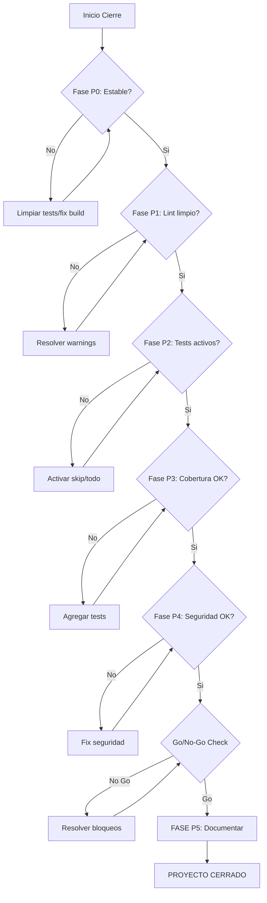

# 🎯 Plan Maestro de Cierre - Sass Store

**Fecha de creación:** 2026-02-26  
**Estado:** Pendiente de ejecución  
**Alcance:** Cierre completo de todas las tareas pendientes del proyecto

---

## 📋 Resumen Ejecutivo

Este plan detalla todas las actividades necesarias para llevar el proyecto Sass Store a un estado de **cierre completo**, listo para producción con calidad garantizada. El plan está organizado en fases prioritarias con criterios de aceptación claros.

### Estado Actual

| Dimensión | Estado | Cobertura/Score |
|-----------|--------|-----------------|
| **Unit Tests** | ✅ Estable | ~70% passing |
| **Integration Tests** | ⚠️ Parcial | ~60% passing |
| **E2E Tests** | ⚠️ Parcial | ~77-80% passing |
| **Lint** | ⚠️ Warnings | 60+ warnings |
| **TypeCheck** | ✅ Sin errores | 0 errores |
| **Build** | ✅ Funcional | Con warnings |
| **Cobertura** | ❌ Insuficiente | ~40% vs 80% target |
| **Console.logs** | ❌ Pendiente | 50+ en API |

---

## 🚨 FASE P0: Estabilización Crítica (Prioridad Inmediata)

### Objetivo
Garantizar que el proyecto pase controles de calidad básicos sin fallos.

### 0.1 Limpiar Tests Duplicados/Huérfanos

**Problema:** Existen múltiples archivos de test de debugging que contaminan la suite.

**Archivos objetivo:**
```
tests/basic-test.js
tests/basic-test.spec.js
tests/basic-test.spec.mjs
tests/debug-test.spec.ts
tests/debug-test-esm.spec.mjs
tests/debug-test-js.spec.js
tests/minimal-test.spec.ts
tests/simple-test.spec.ts
tests/simple-working-test.spec.ts
tests/test-basic.spec.js
tests/test-basic.spec.mjs
tests/test-basic-describe.spec.mjs
tests/test-basic-ts.spec.ts
tests/vitest-bare-test.js
tests/vitest-bare-test.spec.js
tests/vitest-es-test.spec.mjs
tests/vitest-globals-test.spec.ts
tests/vitest-import-test.spec.js
tests/vitest-no-import-test.spec.ts
tests/vitest-simple-test.spec.ts
test-basic.js
```

**Acciones:**
1. Eliminar archivos de test de debugging/huellas de experimentación
2. Conservar solo `tests/simple-working-test.spec.ts` como test de smoke
3. Actualizar `.gitignore` para prevenir futuros archivos temporales

**Criterios de salida:**
- [ ] Solo existen tests legítimos en `tests/`
- [ ] `npm run test:unit` pasa sin errores
- [ ] No hay archivos `.spec.js`, `.spec.mjs` mezclados con `.spec.ts`

**Riesgos:**
- 🟡 Bajo: Podrían eliminarse tests útiles por error → Revisar cada archivo antes de eliminar

---

### 0.2 Validar Build y TypeCheck

**Comandos objetivo:**
```bash
npm run typecheck
npm run build
```

**Acciones:**
1. Ejecutar `npm run typecheck` y verificar 0 errores
2. Ejecutar `npm run build` y documentar warnings
3. Crear script de validación CI-local

**Criterios de salida:**
- [ ] `npm run typecheck` retorna 0 errores
- [ ] `npm run build` completa sin fallos
- [ ] Warnings de build documentados para Fase 1

---

## 🔧 FASE P1: Calidad Estática y Deuda Técnica

### Objetivo
Eliminar deuda técnica que afecta mantenibilidad y seguridad.

### 1.1 Migrar console.log a Logger Estructurado

**Problema:** 50+ `console.log/error/warn` en código de producción.

**Archivos objetivo:**
```
apps/api/lib/services/PaymentService.ts
apps/api/app/api/inventory/**/route.ts (15+ archivos)
apps/api/app/api/categories/**/route.ts (3+ archivos)
apps/api/app/api/budgets/**/route.ts (5+ archivos)
```

**Acciones:**
1. Crear/utilizar logger estructurado en `packages/core/src/logger/`
2. Reemplazar `console.error` con `logger.error` con contexto
3. Agregar correlation IDs para tracing
4. Configurar niveles de log por ambiente

**Patrón de reemplazo:**
```typescript
// ANTES
console.error("Error fetching budget:", error);

// DESPUÉS
import { logger } from "@sass-store/core/logger";
logger.error("Failed to fetch budget", { 
  error: error.message, 
  budgetId, 
  tenantId 
});
```

**Criterios de salida:**
- [ ] 0 `console.log` en código de producción (excepto scripts CLI)
- [ ] Logger estructurado configurado con niveles
- [ ] Logs incluyen context (tenantId, requestId, etc.)

**Riesgos:**
- 🟡 Medio: Cambios extensos → Hacer en commits pequeños con tests

---

### 1.2 Resolver ESLint Warnings

**Comando:**
```bash
npm run lint
```

**Acciones:**
1. Ejecutar lint y categorizar warnings
2. Corregir warnings de alta prioridad:
   - `@typescript-eslint/no-explicit-any`
   - `@typescript-eslint/no-unused-vars`
   - `react-hooks/exhaustive-deps`
3. Documentar warnings aceptados con `// eslint-disable-next-line` justificado

**Criterios de salida:**
- [ ] `npm run lint` retorna 0 warnings bloqueantes
- [ ] Warnings restantes documentados y justificados
- [ ] CI configurado para fallar en nuevos warnings

---

### 1.3 Result Pattern Compliance

**Problema:** Código legacy aún usa try/catch en lugar de Result Pattern.

**Acciones:**
1. Buscar patrones `try { } catch (error)` en services
2. Migrar a Result Pattern progresivamente
3. Actualizar tests para usar `expectSuccess/expectFailure`

**Archivos prioritarios:**
```
apps/api/lib/services/*.ts
apps/api/app/api/**/route.ts
```

**Criterios de salida:**
- [ ] Todos los services nuevos usan Result Pattern
- [ ] API routes usan `withResultHandler` middleware
- [ ] Tests actualizados para Result Pattern

---

## 🧪 FASE P2: Tests - Cerrar Suites Skip/Todo

### Objetivo
Activar todos los tests actualmente marcados como skip/todo.

### 2.1 Inventario de Tests Skip/Todo

| Archivo | Línea | Razón | Prioridad |
|---------|-------|-------|-----------|
| `tests/unit/social-library.test.ts` | 18 | `describe.skip` completo | 🔴 Alta |
| `tests/integration/products-api-tenant-isolation.test.ts` | 203 | RLS environment limitations | 🟡 Media |
| `tests/e2e/services/service-crud.spec.ts` | 35,40,145,296,362 | Conditional skips | 🟡 Media |
| `tests/e2e/mobile-carousel-swipe.spec.ts` | 153 | No service found | 🟢 Baja |
| `tests/e2e/finance/quick-test.spec.ts` | 72,78,112,147 | Login/state failures | 🟡 Media |
| `tests/e2e/finance/matrix/*.spec.ts` | Múltiples | Backend 404/timeout | 🟡 Media |
| `tests/e2e/finance/diagnostic.spec.ts` | 125 | Email input not found | 🟢 Baja |
| `tests/e2e/example.spec.ts` | 34,54 | Login page issues | 🟢 Baja |

### 2.2 Orden de Resolución Recomendado

#### Paso 1: Tests Unitarios (social-library)
```typescript
// tests/unit/social-library.test.ts:18
describe.skip("Social Content Library Operations", () => {
```

**Acción:**
1. Revisar si el skip es por funcionalidad no implementada
2. Si existe implementación, activar y corregir fallos
3. Si no existe, convertir en test TODO documentado

#### Paso 2: Tests de Integración (tenant-isolation)
```typescript
// tests/integration/products-api-tenant-isolation.test.ts:203
describe.skip("API de Productos - Aislamiento de Tenant", () => {
  // Skipping RLS tests due to environment limitations
```

**Acción:**
1. Configurar ambiente de test con RLS habilitado
2. Crear script de setup para database de test
3. Activar tests y verificar aislamiento

#### Paso 3: Tests E2E Condicionales
```typescript
// Patrón común en e2e:
test.skip(true, 'Application might not be running');
```

**Acción:**
1. Revisar cada skip condicional
2. Convertir a assertions apropiados o remover
3. Asegurar que webServer en playwright.config funciona

### 2.3 Estrategia para Tests Flakey

**Criterios para marcar test como "flakey":**
- Falla intermitentemente sin cambios de código
- Depende de timing o estado externo
- Requiere recursos no disponibles en CI

**Acciones:**
1. Documentar tests flakey en `tests/FLAKEY_TESTS.md`
2. Agregar retries selectivos en playwright.config
3. Crear issues separados para cada test flakey

**Criterios de salida:**
- [ ] 0 `describe.skip` en tests unitarios
- [ ] Tests de integración RLS activos
- [ ] Tests E2E con skips justificados o resueltos
- [ ] Documentación de tests flakey conocidos

---

## 📊 FASE P3: Cobertura y Testing Completo

### Objetivo
Alcanzar cobertura mínima del 80% en código crítico.

### 3.1 Medir Cobertura Actual

**Comando:**
```bash
npm run test:coverage
```

**Targets por módulo:**

| Módulo | Cobertura Actual | Target | Gap |
|--------|------------------|--------|-----|
| `apps/api/lib/services/` | ~50% | 85% | +35% |
| `apps/api/app/api/` | ~40% | 80% | +40% |
| `packages/core/` | ~60% | 90% | +30% |
| `packages/validation/` | ~70% | 90% | +20% |

### 3.2 Tests Faltantes por Dominio

#### Services Layer
- [ ] `InventoryService` - Stock validation edge cases
- [ ] `PaymentService` - Payment flow completo
- [ ] `UserService` - Authentication edge cases
- [ ] `CartService` - Concurrencia y race conditions
- [ ] `FinancialMatrixService` - Cálculos y validaciones

#### API Routes
- [ ] Error handling paths (4xx, 5xx)
- [ ] Tenant isolation en cada endpoint
- [ ] Validation de input
- [ ] Rate limiting

#### Business Logic
- [ ] Quote generation
- [ ] Booking conflicts
- [ ] Inventory reservations
- [ ] Payment processing

### 3.3 Aumentar Cobertura - Plan de Acción

**Semana 1: Services Críticos**
1. `InventoryService` → 85%
2. `PaymentService` → 85%
3. `UserService` → 85%

**Semana 2: API Routes**
1. Products API → 80%
2. Orders API → 80%
3. Finance API → 80%

**Criterios de salida:**
- [ ] Cobertura global ≥ 80%
- [ ] Cobertura en services ≥ 85%
- [ ] Sin archivos con 0% cobertura

---

## 🔒 FASE P4: Seguridad y Hardening

### Objetivo
Verificar que todas las medidas de seguridad están activas y probadas.

### 4.1 Verificar RLS Policies

**Comando:**
```bash
npm run rls:test
```

**Checklist:**
- [ ] RLS habilitado en todas las tablas multi-tenant
- [ ] Policies funcionan correctamente
- [ ] Tests de aislamiento pasan

### 4.2 Security Scan

**Comando:**
```bash
npm run security:full
npm run security:check-deps
```

**Checklist:**
- [ ] 0 vulnerabilidades críticas/altas
- [ ] Dependencies actualizadas
- [ ] Secrets fuera del código

### 4.3 Headers y Configuración

**Verificar:**
- [ ] CSP headers configurados
- [ ] HSTS habilitado
- [ ] Rate limiting activo
- [ ] CORS configurado correctamente

---

## 📚 FASE P5: Documentación y Entrega

### Objetivo
Documentar estado final y facilitar handoff/mantenimiento.

### 5.1 Actualizar Documentación

**Archivos a actualizar:**
- [ ] `README.md` - Estado actual y quick start
- [ ] `AGENTS.md` - Result Pattern compliance
- [ ] `docs/API.md` - Endpoints documentados
- [ ] `docs/DEPLOYMENT.md` - Guía de deployment

### 5.2 Limpiar Documentación Obsoleta

**Archivos candidatos a archivar:**
```
ACCESSIBILITY_FIXES_COMPLETED.md
ACTION_PLAN_DATABASE_SETUP.md
ADDITIONAL_SECURITY_MEASURES.md
APPLY_MIGRATION_NOW.sql
CAMBIOS_PENDIENTES_PRODUCCION.md
... (50+ archivos markdown de sesiones anteriores)
```

**Acción:**
1. Crear directorio `docs/archive/`
2. Mover documentación histórica
3. Mantener solo documentación vigente en raíz

### 5.3 Runbook Operacional

**Crear:** `docs/RUNBOOK.md`

**Contenido:**
- Comandos de operación diaria
- Procedimientos de backup/restore
- Troubleshooting común
- Contactos de soporte

---

## ✅ Checklist Go/No-Go para Cierre

### Criterios Obligatorios (Go)

| # | Criterio | Comando de Verificación | Estado |
|---|----------|-------------------------|--------|
| 1 | TypeCheck pasa | `npm run typecheck` | [ ] |
| 2 | Build pasa | `npm run build` | [ ] |
| 3 | Lint sin errores críticos | `npm run lint` | [ ] |
| 4 | Unit tests pasan | `npm run test:unit` | [ ] |
| 5 | Integration tests pasan | `npm run test:integration` | [ ] |
| 6 | Cobertura ≥ 80% | `npm run test:coverage` | [ ] |
| 7 | RLS verificado | `npm run rls:test` | [ ] |
| 8 | Security scan limpio | `npm run security:full` | [ ] |
| 9 | Sin secrets en código | `grep -r "api_key\|password" apps/` | [ ] |
| 10 | E2E críticos pasan | `npm run test:e2e` | [ ] |

### Criterios Deseables (Nice to Have)

| # | Criterio | Estado |
|---|----------|--------|
| 1 | Cobertura ≥ 90% | [ ] |
| 2 | Todos los E2E pasan | [ ] |
| 3 | Lighthouse score ≥ 90 | [ ] |
| 4 | Bundle size < 500KB | [ ] |
| 5 | Documentación completa | [ ] |

---

## 📅 Cronograma Sugerido

### Opción A: Rápida (1-2 días)

| Día | Fase | Actividades |
|-----|------|-------------|
| 1 AM | P0 | Limpiar tests, validar build |
| 1 PM | P1 | Console.logs críticos, lint |
| 2 AM | P2 | Activar tests skip prioritarios |
| 2 PM | P4 | Security scan, RLS check |

**Entregables:** Proyecto estable, tests básicos pasando, seguridad verificada.

### Opción B: Completa (1 Sprint / 2 semanas)

| Semana | Días | Fase | Actividades |
|--------|------|------|-------------|
| 1 | 1-2 | P0 | Estabilización completa |
| 1 | 3-4 | P1 | Deuda técnica, lint, Result Pattern |
| 1 | 5 | P2 | Tests skip/todo |
| 2 | 1-3 | P3 | Cobertura al 80% |
| 2 | 4 | P4 | Seguridad y hardening |
| 2 | 5 | P5 | Documentación y entrega |

**Entregables:** Proyecto production-ready con cobertura completa.

---

## 🔄 Diagrama de Flujo de Cierre



---

## 📎 Referencias

- [`TESTING_IMPLEMENTATION_SUMMARY.md`](../TESTING_IMPLEMENTATION_SUMMARY.md) - Estado de tests
- [`TESTING_IMPROVEMENT_PLAN.md`](../TESTING_IMPROVEMENT_PLAN.md) - Plan de mejora detallado
- [`FINAL_STATUS_REPORT.md`](../FINAL_STATUS_REPORT.md) - Reporte de estado previo
- [`PRODUCTION_READY.md`](../PRODUCTION_READY.md) - Checklist de producción
- [`AGENTS.md`](../AGENTS.md) - Guías de desarrollo y Result Pattern

---

## 📝 Notas de Ejecución

### Progreso de Fases

| Fase | Estado | Fecha Inicio | Fecha Fin | Notas |
|------|--------|--------------|-----------|-------|
| P0 | Pendiente | - | - | - |
| P1 | Pendiente | - | - | - |
| P2 | Pendiente | - | - | - |
| P3 | Pendiente | - | - | - |
| P4 | Pendiente | - | - | - |
| P5 | Pendiente | - | - | - |

### Bloqueos y Dependencias

| Bloqueo | Fase Afectada | Dependencia | Resolución |
|---------|---------------|-------------|------------|
| - | - | - | - |

---

**Documento creado por:** Architect Agent  
**Última actualización:** 2026-02-26  
**Próxima revisión:** Al iniciar ejecución
