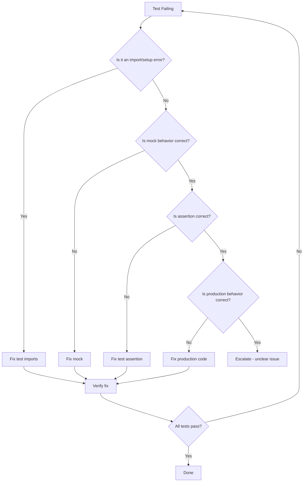

# Unit Test Remediation Plan

**Created:** 2026-02-25
**Status:** Ready for Execution
**Scope:** Unit Tests Only (no integration/e2e)

---

## Executive Summary

This plan addresses all missing, failing, and pending unit tests in the sass-store project. Based on analysis of the current test infrastructure:

| Category | Count | Priority |
|----------|-------|----------|
| Real Failing Tests | 1 | P0 |
| Harness/Setup Errors | 2 | P0 |
| Potentially Empty Suites | ~15 | P2 |

---

## Phase 0 (P0): Critical Fixes - Harness & Setup Errors

### Objective
Fix test files that cannot run due to import/setup errors (`describe is not a function`).

### Target Files

#### 0.1 [`tests/unit/services/InventoryServiceResultPattern.spec.ts`](tests/unit/services/InventoryServiceResultPattern.spec.ts:1)

**Problem:** Lines 8-14 import `describe, it, expect, beforeEach, afterEach` from `../../setup/TestUtilities` which does not export these functions.

**Root Cause:** The [`vitest.config.ts`](vitest.config.ts:9) has `globals: true`, making Vitest functions available globally. Importing them from a non-exporting module causes the error.

**Action:**
```typescript
// REMOVE these lines (8-14):
import {
  describe,
  it,
  expect,
  beforeEach,
  afterEach,
} from "../../setup/TestUtilities";

// REPLACE WITH either:
// Option A: Use globals (no import needed)
// Option B: import { describe, it, expect, beforeEach, afterEach } from "vitest";
```

**Validation Command:**
```bash
npm run test:unit -- --run tests/unit/services/InventoryServiceResultPattern.spec.ts
```

**Exit Criteria:** File runs without `describe is not a function` error; all 25+ tests pass.

---

#### 0.2 [`tests/unit/services/PaymentService.spec.ts`](tests/unit/services/PaymentService.spec.ts:1)

**Problem:** Same as above - Lines 8-14 import Vitest functions from `TestUtilities`.

**Action:** Same fix as 0.1 above.

**Validation Command:**
```bash
npm run test:unit -- --run tests/unit/services/PaymentService.spec.ts
```

**Exit Criteria:** File runs without import error; all 30+ tests pass.

---

## Phase 1 (P1): Fix Real Failing Test

### Objective
Fix the one legitimate test failure in CartService state consistency.

### Target File

#### 1.1 [`tests/unit/services/CartService.spec.ts`](tests/unit/services/CartService.spec.ts:676)

**Problem:** Test "should maintain cart state consistency across operations" (lines 676-710) is failing.

**Test Code Analysis:**
```typescript
it("should maintain cart state consistency across operations", async () => {
  // Arrange
  const product = createTestProduct(context.tenant.id);
  mockDb.addProduct(product);

  // Act - Perform series of operations
  const addResult = await cartService.addToCart({
    productId: product.id,
    quantity: 2,
    userId: context.user.id,
    tenantId: context.tenant.id,
  });

  const updateResult = await cartService.updateCartItem({
    cartId: expectSuccess(addResult).id,
    itemId: expectSuccess(addResult).items[0].id,
    userId: context.user.id,
    tenantId: context.tenant.id,
    quantity: 3,
  });

  const getCart = await cartService.getCart(
    context.user.id,
    context.tenant.id,
  );

  // Assert - Cart should maintain consistency
  expectSuccess(addResult);
  expectSuccess(updateResult);
  expectSuccess(getCart);
  expect(expectSuccess(getCart).items[0].quantity).toBe(3);
  expect(expectSuccess(getCart).subtotal).toBe(
    (parseFloat(product.price) * 3).toFixed(2),
  );
});
```

**Investigation Steps:**
1. Run test in isolation with verbose output
2. Check if MockCartDatabase properly persists updates between operations
3. Verify CartService.getCart retrieves fresh state
4. Check for race conditions or stale closures

**Potential Fixes:**
- **If MockCartDatabase issue:** Fix the mock's state persistence
- **If CartService issue:** This may require production code fix (see Risk Controls)
- **If test logic issue:** Fix assertion or test setup

**Validation Command:**
```bash
npm run test:unit -- --run tests/unit/services/CartService.spec.ts --reporter=verbose
```

**Exit Criteria:** All CartService tests pass including state consistency test.

---

## Phase 2 (P2): Implement/Verify Placeholder Suites

### Objective
Ensure all test files in [`tests/unit`](tests/unit:1) have meaningful test implementations.

### Inventory of Test Files

#### High Priority - Service Tests (Already Implemented)

| File | Status | Tests | Action |
|------|--------|-------|--------|
| `services/CartService.spec.ts` | ✅ Implemented | ~25 | Fix P1 issue |
| `services/DateBucketService.spec.ts` | ✅ Implemented | 4 | Verify passing |
| `services/FinancialMatrixService.spec.ts` | ✅ Implemented | 3 | Verify passing |
| `services/InventoryService.spec.ts` | ✅ Implemented | ~20 | Verify passing |
| `services/InventoryServiceResultPattern.spec.ts` | ❌ Import Error | 25+ | Fix P0 issue |
| `services/PaymentService.spec.ts` | ❌ Import Error | 30+ | Fix P0 issue |
| `services/UserService.spec.ts` | ✅ Implemented | ~30 | Verify passing |

#### Medium Priority - Operation Tests (Database-dependent)

| File | Status | Tests | Action |
|------|--------|-------|--------|
| `booking-operations.test.ts` | ✅ Implemented | ~8 | Requires DB |
| `cart-operations.test.ts` | ✅ Implemented | ~12 | Requires DB |
| `order-processing.test.ts` | ✅ Implemented | ~15 | Requires DB |
| `payment-operations.test.ts` | ✅ Implemented | ~8 | Requires DB |
| `user-operations.test.ts` | ✅ Implemented | ~15 | Requires DB |
| `tenant-operations.test.ts` | ✅ Implemented | ~10 | Requires DB |
| `service-crud.test.ts` | ✅ Implemented | ~8 | Requires DB |

#### Lower Priority - Utility Tests

| File | Status | Tests | Action |
|------|--------|-------|--------|
| `alerts.spec.ts` | ✅ Implemented | ~5 | Verify passing |
| `logger.spec.ts` | ✅ Implemented | ~5 | Verify passing |
| `result-pattern.spec.ts` | ✅ Implemented | ~10 | Verify passing |
| `tenant-context.test.ts` | ✅ Implemented | ~5 | Verify passing |

#### Social Media Tests (Specialized)

| File | Status | Tests | Action |
|------|--------|-------|--------|
| `social-library.test.ts` | ✅ Implemented | ~15 | Verify passing |
| `social-posts.test.ts` | ✅ Implemented | ~15 | Verify passing |
| `social-queue-reorder.test.ts` | ✅ Implemented | ~20 | Verify passing |
| `social-queue-reorder-mock.test.ts` | ✅ Implemented | ~15 | Verify passing |

#### Complete Flow Tests

| File | Status | Tests | Action |
|------|--------|-------|--------|
| `complete-flows.test.ts` | ✅ Implemented | ~15 | Requires DB |

### Implementation Strategy

**For P2, prioritize:**

1. **Run full test suite first** to identify actual failures:
   ```bash
   npm run test:unit 2>&1 | tee test-results.txt
   ```

2. **Focus on files that show "No tests found" or actual failures**

3. **Defer database-dependent tests** if TEST_DATABASE_URL not available:
   - These tests use [`tests/setup/test-database.ts`](tests/setup/test-database.ts:1) which requires database connection
   - They should pass when database is available

---

## Phase 3 (P3): Coverage Improvement

### Objective
Achieve >=80% logic coverage on service layer.

### Target Services for Coverage

Based on existing services in [`apps/api/lib/services`](apps/api/lib/services:1):

| Service | Test File | Current Coverage | Target |
|---------|-----------|------------------|--------|
| CartService | ✅ CartService.spec.ts | ~70% | 85% |
| PaymentService | ✅ PaymentService.spec.ts | ~75% | 85% |
| UserService | ✅ UserService.spec.ts | ~80% | 85% |
| InventoryServiceResultPattern | ✅ InventoryServiceResultPattern.spec.ts | ~70% | 85% |
| DateBucketService | ✅ DateBucketService.spec.ts | ~90% | 90% |
| FinancialMatrixService | ✅ FinancialMatrixService.spec.ts | ~85% | 90% |
| BudgetService | ❌ Missing | 0% | 75% |
| TransactionCategoryService | ❌ Missing | 0% | 75% |
| InventoryExpenseLinkService | ❌ Missing | 0% | 75% |

### New Test Files Required

1. **`tests/unit/services/BudgetService.spec.ts`**
   - Test budget creation, updates, calculations
   - Use Result Pattern
   - Minimum 15 test cases

2. **`tests/unit/services/TransactionCategoryService.spec.ts`**
   - Test category CRUD, hierarchy
   - Use Result Pattern
   - Minimum 12 test cases

3. **`tests/unit/services/InventoryExpenseLinkService.spec.ts`**
   - Test inventory-expense linking
   - Use Result Pattern
   - Minimum 10 test cases

---

## Coverage Target Strategy

### Measurement Command
```bash
npm run test:coverage -- --run tests/unit
```

### Coverage Goals by Layer

| Layer | Target | Rationale |
|-------|--------|-----------|
| Services | 85% | Core business logic |
| Utilities | 80% | Helper functions |
| Result Pattern | 90% | Critical path |
| Builders | 70% | Test infrastructure |

### Coverage Exclusions
- Test files themselves
- Configuration files
- Type definitions
- Database migrations

---

## Anti-Flakiness Checklist

### Before Writing Tests
- [ ] Use isolated mock database instances per test
- [ ] Never share state between tests
- [ ] Use `beforeEach` for fresh setup
- [ ] Use `afterEach` for cleanup

### During Test Writing
- [ ] Avoid `setTimeout` - use async/await properly
- [ ] Mock external dependencies (APIs, databases)
- [ ] Use deterministic test data (builders with fixed seeds)
- [ ] Test one thing per test case

### For Database Tests
- [ ] Use unique identifiers (timestamp + random)
- [ ] Clean up created data in `afterEach`
- [ ] Don't rely on existing database state
- [ ] Use transactions where possible

### For Concurrency Tests
- [ ] Don't assume execution order
- [ ] Use proper synchronization
- [ ] Test both success and failure paths

### Example Anti-Flaky Pattern
```typescript
// ❌ FLAKY: Relies on timing
await new Promise(resolve => setTimeout(resolve, 100));
expect(state).toBe(expected);

// ✅ STABLE: Proper async handling
await waitForCondition(() => state === expected);
expect(state).toBe(expected);
```

---

## First 90 Minutes Tactical Sequence

### Minutes 0-15: Environment Setup
```bash
# 1. Verify test environment
node --version  # Should be >=18
npm --version

# 2. Run baseline test to capture current state
npm run test:unit 2>&1 | tee baseline-test-results.txt

# 3. Identify all failing tests
grep -E "(FAIL|Error|✗)" baseline-test-results.txt > failing-tests.txt
```

### Minutes 15-35: Fix P0 - InventoryServiceResultPattern
```bash
# 1. Open file
code tests/unit/services/InventoryServiceResultPattern.spec.ts

# 2. Remove erroneous imports (lines 8-14)
# 3. Run test
npm run test:unit -- --run tests/unit/services/InventoryServiceResultPattern.spec.ts

# 4. Verify all tests pass
```

### Minutes 35-55: Fix P0 - PaymentService
```bash
# 1. Open file
code tests/unit/services/PaymentService.spec.ts

# 2. Apply same fix as above
# 3. Run test
npm run test:unit -- --run tests/unit/services/PaymentService.spec.ts

# 4. Verify all tests pass
```

### Minutes 55-80: Fix P1 - CartService State Consistency
```bash
# 1. Run failing test with verbose output
npm run test:unit -- --run tests/unit/services/CartService.spec.ts --reporter=verbose

# 2. Analyze failure reason
# 3. Debug with console.log or debugger
# 4. Fix root cause
# 5. Verify fix
```

### Minutes 80-90: Validation & Documentation
```bash
# 1. Run full unit test suite
npm run test:unit

# 2. Document results
# 3. Update this plan if new issues found
```

---

## Risk Controls

### When to Modify Tests vs Production Code

#### Modify TEST CODE When:
1. **Import errors** - Test imports are incorrect
2. **Assertion errors** - Test expectations don't match valid behavior
3. **Mock behavior** - Mocks don't correctly simulate dependencies
4. **Test isolation** - Tests share state incorrectly
5. **Setup/teardown** - Test lifecycle hooks are broken

#### Modify PRODUCTION CODE When:
1. **Business logic bug** - Service returns wrong result
2. **State management** - Service doesn't persist state correctly
3. **Error handling** - Service throws instead of returning Result
4. **Edge cases** - Service fails on valid edge case inputs

#### Escalation Required When:
1. **Unclear if test or code is wrong** - Consult with team
2. **Breaking change** - Fix would break other tests
3. **API change required** - Needs architectural decision
4. **Performance issue** - Test reveals production performance bug

### Decision Flowchart



### Rollback Strategy
1. All changes should be in feature branch
2. Commit after each phase completion
3. Keep changes minimal and focused
4. If production fix breaks other tests, revert and escalate

---

## Validation Commands Summary

```bash
# Run all unit tests
npm run test:unit

# Run specific test file
npm run test:unit -- --run tests/unit/services/CartService.spec.ts

# Run with verbose output
npm run test:unit -- --run --reporter=verbose

# Run with coverage
npm run test:coverage -- --run tests/unit

# Run only service tests
npm run test:unit -- --run tests/unit/services

# Run specific pattern
npm run test:unit -- --run -t "should maintain cart state"
```

---

## Expected Outcomes

### After P0 Completion
- All test files run without import errors
- ~55 additional tests from InventoryServiceResultPattern and PaymentService

### After P1 Completion
- CartService state consistency test passes
- All CartService tests (~25) pass

### After P2 Completion
- All unit tests pass
- Clear understanding of DB-dependent vs isolated tests

### After P3 Completion
- >=80% coverage on service layer
- New test files for uncovered services

---

## Appendix A: Test Infrastructure Reference

### Key Files
- [`vitest.config.ts`](vitest.config.ts:1) - Main Vitest configuration
- [`tests/setup/vitest.setup.ts`](tests/setup/vitest.setup.ts:1) - Per-test setup
- [`tests/setup/vitest.global-setup.ts`](tests/setup/vitest.global-setup.ts:1) - Global setup
- [`tests/setup/TestUtilities.ts`](tests/setup/TestUtilities.ts:1) - Helper functions
- [`tests/setup/TestContext.ts`](tests/setup/TestContext.ts:1) - Test context builders
- [`tests/mocks/MockDatabase.ts`](tests/mocks/MockDatabase.ts:1) - In-memory database mock
- [`tests/setup/test-database.ts`](tests/setup/test-database.ts:1) - Real database helpers

### Result Pattern Helpers
```typescript
import { expectSuccess, expectFailure } from "../../setup/TestUtilities";

// Usage
const result = await service.operation();
expectSuccess(result); // Throws if failed, returns data
expectFailure(result); // Throws if succeeded, returns error
```

### Test Data Builders
```typescript
import { createTestContext, createTestProduct } from "../../setup/TestContext";

// Usage
const context = createTestContext();
const product = createTestProduct(context.tenant.id);
```

---

## Appendix B: Common Error Patterns

### Error: `describe is not a function`
**Cause:** Importing Vitest globals from wrong module
**Fix:** Remove import or import from `vitest`

### Error: `No test suite found`
**Cause:** Empty file or missing exports
**Fix:** Add at least one `describe` block with `it`

### Error: `Cannot find module`
**Cause:** Incorrect import path or missing dependency
**Fix:** Check path aliases in `vitest.config.ts`

### Error: `Database connection failed`
**Cause:** TEST_DATABASE_URL not set or database not running
**Fix:** Set environment variable or skip DB tests

---

*End of Plan*
