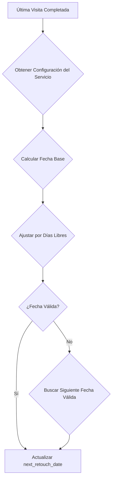

# Plan de Implementación: Sistema de Fecha de Retoque Configurable

## 📋 Resumen Ejecutivo

Implementar un sistema flexible de gestión de fechas de retoque que permita configurar frecuencias específicas por servicio, con soporte para días libres y diferentes intervalos de tiempo según las necesidades de cada negocio (uñas, restaurante, estética, redes sociales, etc.).

## 🎯 Objetivos Principales

1. **Reemplazar el concepto de "contacto" por "fecha de retoque"** - Agregar un campo calculado automáticamente
2. **Ordenar clientes por fecha próxima a retiro** - Implementar como ordenamiento principal
3. **Cálculo automático de fecha de retoque** - Basado en la última visita con frecuencia configurable
4. **Configuración flexible por servicio** - Permitir diferentes frecuencias según tipo de servicio
5. **Soporte para días libres** - Configuración de días donde no se calcula fecha de retoque

## 📊 Análisis de Requisitos

### Requisitos Funcionales

| Requisito                  | Descripción                                         | Prioridad |
| -------------------------- | --------------------------------------------------- | --------- |
| Campo de fecha de retoque  | Agregar `next_retouch_date` a tabla customers       | Alta      |
| Cálculo automático         | Calcular fecha basada en última visita + frecuencia | Alta      |
| Configuración por servicio | Cada servicio puede tener su propia frecuencia      | Alta      |
| Días libres configurables  | Excluir días específicos del cálculo                | Media     |
| Ordenamiento por fecha     | Ordenar lista de clientes por fecha de retoque      | Alta      |
| Configuración por tenant   | Valores globales por organización                   | Media     |
| Validación de fechas       | Evitar fechas en días libres o pasadas              | Alta      |

### Casos de Uso

| Tipo de Servicio     | Frecuencia Sugerida | Días Libres    | Ejemplo                                                           |
| -------------------- | ------------------- | -------------- | ----------------------------------------------------------------- |
| Uñas                 | 15 días             | Domingo        | Servicio de uñas, retoque cada 15 días, descanso domingo          |
| Restaurante          | Diario              | Domingo, Lunes | Servicio de restaurante, retoque diario, descanso domingo y lunes |
| Estética             | Mensual             | Domingo        | Servicio de estética, retoque mensual, descanso domingo           |
| Publicación en redes | Diario              | Ninguno        | Servicio de publicación diaria, sin días libres                   |
| Soporte técnico      | Mensual             | Domingo        | Servicio de soporte, retoque mensual, descanso domingo            |

## 🗄️ Diseño de Base de Datos

### 1. Modificación a Tabla Existente: `customers`

```sql
-- Agregar campo de fecha de próximo retoque
ALTER TABLE customers ADD COLUMN next_retouch_date DATE;

-- Crear índice para ordenamiento eficiente
CREATE INDEX idx_customers_next_retouch ON customers(next_retouch_date);

-- Crear índice compuesto para ordenamiento por tenant y fecha
CREATE INDEX idx_customers_tenant_retouch ON customers(tenant_id, next_retouch_date);
```

### 2. Nueva Tabla: `service_retouch_config`

```sql
-- Tabla de configuración de frecuencia de retoque por servicio
CREATE TABLE service_retouch_config (
    id UUID PRIMARY KEY DEFAULT gen_random_uuid(),
    tenant_id UUID NOT NULL REFERENCES tenants(id) ON DELETE CASCADE,
    service_id UUID NOT NULL REFERENCES services(id) ON DELETE CASCADE,

    -- Frecuencia de retoque
    frequency_type VARCHAR(20) NOT NULL, -- 'days', 'weeks', 'months'
    frequency_value INTEGER NOT NULL, -- Número de días/semanas/meses

    -- Días libres (días donde no se calcula fecha de retoque)
    days_off INTEGER[] NOT NULL DEFAULT '{}', -- Array de días (0=Domingo, 6=Sábado)
    exclude_holidays BOOLEAN NOT NULL DEFAULT false, -- Excluir días festivos del cálculo

    -- Configuración adicional
    start_date DATE, -- Fecha desde la cual se empieza a calcular
    end_date DATE, -- Fecha hasta la cual se calcula (opcional, para promociones)

    metadata JSONB DEFAULT '{}',
    created_at TIMESTAMP WITH TIME ZONE DEFAULT NOW(),
    updated_at TIMESTAMP WITH TIME ZONE DEFAULT NOW()
);

-- Índices para consultas eficientes
CREATE INDEX idx_service_retouch_config_tenant_service ON service_retouch_config(tenant_id, service_id);
CREATE INDEX idx_service_retouch_config_service ON service_retouch_config(service_id);
```

### 3. Enumeraciones para Tipos de Frecuencia

```sql
-- Enumeración de tipos de frecuencia
CREATE TYPE frequency_type AS ENUM ('days', 'weeks', 'months');
```

### 4. Tabla de Días Festivos por Tenant (Opcional)

```sql
-- Tabla opcional para configurar días festivos por tenant
CREATE TABLE tenant_holidays (
    id UUID PRIMARY KEY DEFAULT gen_random_uuid(),
    tenant_id UUID NOT NULL REFERENCES tenants(id) ON DELETE CASCADE,
    holiday_date DATE NOT NULL,
    description TEXT,
    recurring BOOLEAN NOT NULL DEFAULT false, -- Si se repite anualmente
    created_at TIMESTAMP WITH TIME ZONE DEFAULT NOW()
);

CREATE INDEX idx_tenant_holidays_tenant_date ON tenant_holidays(tenant_id, holiday_date);
```

## 🔄 Lógica de Cálculo de Fecha de Retoque

### Algoritmo de Cálculo

```typescript
function calculateNextRetouchDate(
  lastVisitDate: Date,
  config: ServiceRetouchConfig,
  tenantHolidays: Date[],
): Date {
  // 1. Convertir frecuencia a días
  const frequencyInDays = convertFrequencyToDays(
    config.frequencyType,
    config.frequencyValue,
  );

  // 2. Calcular fecha base (última visita + frecuencia)
  let nextDate = addDays(lastVisitDate, frequencyInDays);

  // 3. Ajustar por días libres
  nextDate = adjustForDaysOff(nextDate, config.daysOff);

  // 4. Ajustar por días festivos (si está configurado)
  if (config.excludeHolidays) {
    nextDate = adjustForHolidays(nextDate, tenantHolidays);
  }

  // 5. Validar que la fecha no sea pasada
  if (isBeforeToday(nextDate)) {
    nextDate = getNextValidDate(nextDate, config.daysOff, tenantHolidays);
  }

  return nextDate;
}

function convertFrequencyToDays(type: string, value: number): number {
  switch (type) {
    case "days":
      return value;
    case "weeks":
      return value * 7;
    case "months":
      return value * 30;
    default:
      return 15; // Valor por defecto
  }
}

function adjustForDaysOff(date: Date, daysOff: number[]): Date {
  let adjustedDate = new Date(date);
  let attempts = 0;
  const maxAttempts = 10; // Evitar bucle infinito

  while (attempts < maxAttempts) {
    const dayOfWeek = adjustedDate.getDay();

    if (!daysOff.includes(dayOfWeek)) {
      return adjustedDate;
    }

    adjustedDate = addDays(adjustedDate, 1);
    attempts++;
  }

  return adjustedDate; // Retornar fecha aunque esté en día libre (fallback)
}

function adjustForHolidays(date: Date, holidays: Date[]): Date {
  let adjustedDate = new Date(date);

  while (holidays.some((h) => isSameDay(h, adjustedDate))) {
    adjustedDate = addDays(adjustedDate, 1);
  }

  return adjustedDate;
}
```

### Flujo de Cálculo



## 🔌 API Endpoints

### 1. Configuración de Retoque por Servicio

```typescript
// GET /api/tenants/[tenant]/services/[serviceId]/retouch-config
// Obtiene la configuración de retoque para un servicio específico

// POST /api/tenants/[tenant]/services/[serviceId]/retouch-config
// Crea o actualiza la configuración de retoque para un servicio

// PUT /api/tenants/[tenant]/services/[serviceId]/retouch-config
// Actualiza la configuración existente

// DELETE /api/tenants/[tenant]/services/[serviceId]/retouch-config
// Elimina la configuración (usa valor por defecto)
```

### 2. Cálculo Automático de Fechas

```typescript
// POST /api/tenants/[tenant]/customers/[customerId]/calculate-retouch
// Calcula la fecha de próximo retoque para un cliente específico

// POST /api/tenants/[tenant]/customers/batch-calculate-retouch
// Calcula fechas de retoque para múltiples clientes (batch)

// POST /api/tenants/[tenant]/customers/recalculate-all
// Recalcula todas las fechas de retoque del tenant
```

### 3. Gestión de Días Festivos

```typescript
// GET /api/tenants/[tenant]/holidays
// Obtiene todos los días festivos del tenant

// POST /api/tenants/[tenant]/holidays
// Agrega un día festivo

// DELETE /api/tenants/[tenant]/holidays/[holidayId]
// Elimina un día festivo
```

### 4. Clientes con Fechas de Retoque

```typescript
// GET /api/tenants/[tenant]/customers
// Ordenar por fecha de próximo retoque (nuevo ordenamiento default)

// GET /api/tenants/[tenant]/customers?sortBy=retouch_date
// Ordenar explícitamente por fecha de retoque

// GET /api/tenants/[tenant]/customers?sortBy=name,retouch_date
// Ordenamiento compuesto
```

## 🎨 Componentes de UI

### 1. Configuración de Retoque por Servicio

```typescript
// Componente: ServiceRetouchConfigForm
interface ServiceRetouchConfigFormProps {
  serviceId: string;
  onSave: (config: ServiceRetouchConfig) => void;
}

interface ServiceRetouchConfig {
  frequencyType: "days" | "weeks" | "months";
  frequencyValue: number;
  daysOff: number[];
  excludeHolidays: boolean;
  startDate?: Date;
  endDate?: Date;
}
```

### 2. Lista de Clientes con Fechas de Retoque

```typescript
// Componente: CustomerListWithRetouchDates
interface CustomerListWithRetouchDatesProps {
  sortBy?: "name" | "retouch_date" | "last_visit";
  filterByRetouchStatus?: "overdue" | "upcoming" | "none";
}

// Muestra fecha de próximo retoque destacada
// Indicador visual de clientes vencidos (rojo)
// Indicador visual de clientes próximos (verde)
```

### 3. Selector de Días Libres

```typescript
// Componente: DaysOffSelector
interface DaysOffSelectorProps {
  selectedDays: number[];
  onChange: (days: number[]) => void;
}

// Checkbox para cada día de la semana
// Visualización clara de días seleccionados
```

### 4. Gestión de Días Festivos

```typescript
// Componente: HolidayManager
interface HolidayManagerProps {
  tenantId: string;
}

// Lista de días festivos
// Formulario para agregar nuevos días
```

## 📋 Plan de Implementación por Fases

### Fase 1: Infraestructura de Base de Datos

**Objetivo**: Crear tablas y modificar estructura existente

**Tareas**:

- [ ] Agregar campo `next_retouch_date` a tabla `customers`
- [ ] Crear índices para ordenamiento por fecha de retoque
- [ ] Crear tabla `service_retouch_config`
- [ ] Crear enumeración `frequency_type`
- [ ] Crear tabla opcional `tenant_holidays`
- [ ] Crear índices para nuevas tablas
- [ ] Configurar RLS para nuevas tablas
- [ ] Crear migración SQL para Supabase

**Tiempo estimado**: 2-3 horas

**Archivos a modificar**:

- `packages/database/schema.ts`
- `packages/database/migrations/schema.ts`

### Fase 2: API Backend - Configuración

**Objetivo**: Implementar endpoints para configuración de frecuencias

**Tareas**:

- [ ] Crear servicio de configuración de retoque
- [ ] Implementar GET `/api/tenants/[tenant]/services/[serviceId]/retouch-config`
- [ ] Implementar POST `/api/tenants/[tenant]/services/[serviceId]/retouch-config`
- [ ] Implementar PUT `/api/tenants/[tenant]/services/[serviceId]/retouch-config`
- [ ] Implementar DELETE `/api/tenants/[tenant]/services/[serviceId]/retouch-config`
- [ ] Agregar validaciones de configuración
- [ ] Implementar manejo de errores con Result Pattern
- [ ] Agregar logging de cambios de configuración

**Tiempo estimado**: 3-4 horas

**Archivos a crear**:

- `apps/api/lib/retouch-config-service.ts`
- `apps/api/app/api/tenants/[tenant]/services/[serviceId]/retouch-config/route.ts`

### Fase 3: API Backend - Cálculo de Fechas

**Objetivo**: Implementar lógica de cálculo automático

**Tareas**:

- [ ] Implementar función `calculateNextRetouchDate`
- [ ] Implementar conversión de frecuencias a días
- [ ] Implementar ajuste por días libres
- [ ] Implementar ajuste por días festivos
- [ ] Implementar validación de fechas
- [ ] Implementar endpoint POST `/api/tenants/[tenant]/customers/[customerId]/calculate-retouch`
- [ ] Implementar endpoint POST `/api/tenants/[tenant]/customers/batch-calculate-retouch`
- [ ] Implementar endpoint POST `/api/tenants/[tenant]/customers/recalculate-all`
- [ ] Implementar actualización automática al completar visita
- [ ] Agregar tests unitarios para lógica de cálculo

**Tiempo estimado**: 4-5 horas

**Archivos a crear**:

- `apps/api/lib/retouch-calculator.ts`
- `apps/api/app/api/tenants/[tenant]/customers/[customerId]/calculate-retouch/route.ts`
- `apps/api/app/api/tenants/[tenant]/customers/batch-calculate-retouch/route.ts`
- `apps/api/app/api/tenants/[tenant]/customers/recalculate-all/route.ts`

### Fase 4: API Backend - Días Festivos

**Objetivo**: Implementar gestión de días festivos

**Tareas**:

- [ ] Implementar GET `/api/tenants/[tenant]/holidays`
- [ ] Implementar POST `/api/tenants/[tenant]/holidays`
- [ ] Implementar DELETE `/api/tenants/[tenant]/holidays/[holidayId]`
- [ ] Implementar validación de días festivos
- [ ] Implementar manejo de errores con Result Pattern
- [ ] Agregar tests para gestión de días festivos

**Tiempo estimado**: 2-3 horas

**Archivos a crear**:

- `apps/api/lib/holiday-service.ts`
- `apps/api/app/api/tenants/[tenant]/holidays/route.ts`

### Fase 5: API Backend - Modificación de Clientes

**Objetivo**: Modificar endpoints existentes para soportar fechas de retoque

**Tareas**:

- [ ] Modificar GET `/api/tenants/[tenant]/customers` para incluir `next_retouch_date`
- [ ] Cambiar ordenamiento default a `next_retouch_date ASC`
- [ ] Mantener compatibilidad con otros ordenamientos existentes
- [ ] Agregar filtros por estado de retoque (vencido, próximo, normal)
- [ ] Implementar actualización automática de `next_retouch_date` al completar visita
- [ ] Agregar validaciones de fechas
- [ ] Actualizar tests existentes

**Tiempo estimado**: 3-4 horas

**Archivos a modificar**:

- `apps/api/app/api/tenants/[tenant]/customers/route.ts`

### Fase 6: Frontend - Configuración de Retoque

**Objetivo**: Crear componentes de UI para configuración

**Tareas**:

- [ ] Crear componente `ServiceRetouchConfigForm`
- [ ] Crear hook `useServiceRetouchConfig`
- [ ] Crear componente `DaysOffSelector`
- [ ] Integrar con formulario de edición de servicios
- [ ] Agregar validaciones visuales
- [ ] Implementar guardado con feedback al usuario
- [ ] Agregar tests de componentes

**Tiempo estimado**: 3-4 horas

**Archivos a crear**:

- `apps/web/components/services/ServiceRetouchConfigForm.tsx`
- `apps/web/lib/hooks/useServiceRetouchConfig.ts`
- `apps/web/components/common/DaysOffSelector.tsx`

### Fase 7: Frontend - Lista de Clientes con Fechas

**Objetivo**: Modificar lista de clientes para mostrar fechas de retoque

**Tareas**:

- [ ] Modificar componente de lista de clientes para mostrar `next_retouch_date`
- [ ] Implementar ordenamiento por fecha de retoque como default
- [ ] Agregar indicadores visuales de estado (vencido, próximo)
- [ ] Implementar filtros por estado de retoque
- [ ] Crear componente de tarjeta de cliente con fecha destacada
- [ ] Implementar actualización manual de fecha de retoque
- [ ] Agregar tests de componentes

**Tiempo estimado**: 4-5 horas

**Archivos a modificar**:

- `apps/web/app/t/[tenant]/customers/page.tsx`
- `apps/web/components/customers/CustomerList.tsx`
- `apps/web/components/customers/CustomerCard.tsx`

### Fase 8: Frontend - Gestión de Días Festivos

**Objetivo**: Crear interfaz para gestión de días festivos

**Tareas**:

- [ ] Crear componente `HolidayManager`
- [ ] Crear hook `useTenantHolidays`
- [ ] Integrar en configuración del tenant
- [ ] Implementar calendario visual de días festivos
- [ ] Agregar validaciones
- [ ] Implementar tests de componentes

**Tiempo estimado**: 2-3 horas

**Archivos a crear**:

- `apps/web/components/admin/HolidayManager.tsx`
- `apps/web/lib/hooks/useTenantHolidays.ts`

### Fase 9: Integración con Sistema de Visitas

**Objetivo**: Conectar cálculo de fechas con sistema de visitas

**Tareas**:

- [ ] Modificar endpoint de conversión de booking a visita
- [ ] Implementar cálculo automático de `next_retouch_date` al completar visita
- [ ] Implementar trigger o job para recálculo automático
- [ ] Agregar validaciones
- [ ] Actualizar tests de integración

**Tiempo estimado**: 3-4 horas

**Archivos a modificar**:

- `apps/api/app/api/tenants/[tenant]/bookings/[id]/convert-to-visit/route.ts`
- `apps/api/lib/visit-service.ts`

### Fase 10: Testing y Validación

**Objetivo**: Validar todo el sistema

**Tareas**:

- [ ] Escribir tests unitarios para lógica de cálculo
- [ ] Escribir tests de integración para endpoints
- [ ] Escribir tests de componentes de UI
- [ ] Crear casos de prueba para diferentes frecuencias
- [ ] Validar manejo de días libres
- [ ] Validar manejo de días festivos
- [ ] Validar ordenamiento de clientes
- [ ] Validar actualización automática de fechas
- [ ] Probar casos extremos (fechas pasadas, días libres consecutivos)
- [ ] Validar rendimiento con grandes volúmenes de datos

**Tiempo estimado**: 4-5 horas

**Archivos a crear**:

- `tests/unit/retouch-calculator.spec.ts`
- `tests/integration/retouch-config.spec.ts`
- `tests/e2e/retouch-workflow.spec.ts`

### Fase 11: Documentación y Deployment

**Objetivo**: Documentar y desplegar

**Tareas**:

- [ ] Actualizar documentación de API
- [ ] Crear guía de configuración de frecuencias
- [ ] Documentar ejemplos de configuración por tipo de negocio
- [ ] Crear scripts de migración para producción
- [ ] Preparar rollback plan
- [ ] Desplegar en staging
- [ ] Validar en staging
- [ ] Desplegar en producción
- [ ] Monitorear post-deployment

**Tiempo estimado**: 2-3 horas

**Archivos a crear**:

- `docs/retouch-config-guide.md`
- `scripts/migrations/retouch-config-migration.sql`

## 🔍 Consideraciones de Diseño

### Flexibilidad y Escalabilidad

1. **Configuración Jerárquica**:
   - Valores por defecto por tipo de frecuencia
   - Configuración por servicio (sobrescribe defaults)
   - Configuración por tenant (opcional, para reglas globales)

2. **Validación de Frecuencias**:
   - Valores mínimos: 1 día, 1 semana, 1 mes
   - Valores máximos: 365 días, 52 semanas, 12 meses
   - Prevenir configuraciones inválidas

3. **Manejo de Bordes**:
   - Fechas pasadas: Permitir pero marcar como vencidas
   - Días libres consecutivos: Ajustar al siguiente día hábil
   - Días festivos: Saltar o ajustar al siguiente día

4. **Performance**:
   - Índices compuestos para consultas eficientes
   - Cálculos en batch para múltiples clientes
   - Caching de configuraciones frecuentes

### Seguridad

1. **Validación de Permisos**:
   - Solo usuarios con rol Admin/Gerente pueden configurar
   - Validar tenant_id en todas las operaciones

2. **Auditoría**:
   - Registrar cambios en configuración de retoque
   - Registrar cálculos automáticos de fechas

3. **Consistencia de Datos**:
   - Validar que `next_retouch_date` no sea nula
   - Validar integridad referencial con servicios

## 📊 Métricas de Éxito

### Métricas Técnicas

- [ ] Todas las tablas creadas con RLS configurado
- [ ] Índices creados para optimización de consultas
- [ ] Endpoints API responden en <200ms
- [ ] Cálculo de fechas en <100ms por cliente
- [ ] Tests con >80% de cobertura

### Métricas Funcionales

- [ ] Configuración por servicio funciona correctamente
- [ ] Cálculo automático de fechas es preciso
- [ ] Días libres son respetados correctamente
- [ ] Días festivos son excluidos del cálculo
- [ ] Ordenamiento de clientes por fecha funciona
- [ ] Actualización automática al completar visita funciona

### Métricas de UX

- [ ] Configuración es intuitiva y fácil de usar
- [ ] Indicadores visuales de estado son claros
- [ ] Feedback de acciones es inmediato
- [ ] Errores son descriptivos y accionables

## 🎯 Casos de Prueba

### Casos Básicos

1. **Uñas con frecuencia de 15 días**:
   - Última visita: 2026-01-10
   - Frecuencia: 15 días
   - Días libres: [0] (Domingo)
   - Resultado esperado: 2026-01-25

2. **Restaurante con frecuencia diaria**:
   - Última visita: 2026-01-10
   - Frecuencia: 1 día
   - Días libres: [0, 1] (Domingo, Lunes)
   - Resultado esperado: 2026-01-12 (primer día hábil)

3. **Estética con frecuencia mensual**:
   - Última visita: 2026-01-10
   - Frecuencia: 30 días
   - Días libres: [0] (Domingo)
   - Resultado esperado: 2026-02-09

4. **Publicación en redes diaria sin días libres**:
   - Última visita: 2026-01-10
   - Frecuencia: 1 día
   - Días libres: []
   - Resultado esperado: 2026-01-11

### Casos Extremos

1. **Todos los días son libres**:
   - Días libres: [0, 1, 2, 3, 4, 5, 6]
   - Resultado esperado: Saltar al siguiente ciclo (7 días después)

2. **Fecha de retoque en el pasado**:
   - Última visita: 2026-01-01
   - Frecuencia: 15 días
   - Hoy: 2026-01-20
   - Resultado esperado: Marcar como vencida, calcular siguiente fecha

3. **Múltiples servicios con diferentes frecuencias**:
   - Cliente tiene visita de uñas (15 días) y estética (30 días)
   - Resultado esperado: Calcular fechas independientes por servicio

## 📝 Comentarios, Mejoras y Correcciones

### Comentarios sobre el Diseño Propuesto

1. **Campo Calculado vs Almacenado**:
   - **Propuesta**: Campo `next_retouch_date` calculado en tiempo real
   - **Ventaja**: Siempre actualizado, no requiere mantenimiento
   - **Desventaja**: No permite edición manual de la fecha
   - **Alternativa**: Campo calculado + campo manual editable `manual_retouch_date_override`

2. **Configuración por Servicio vs por Tenant**:
   - **Propuesta**: Configuración por servicio con defaults por tipo
   - **Ventaja**: Flexibilidad máxima para cada negocio
   - **Desventaja**: Más complejidad en configuración
   - **Alternativa**: Configuración por servicio + configuración global por tenant con reglas

3. **Ordenamiento Principal**:
   - **Propuesta**: Ordenar por `next_retouch_date` como default
   - **Ventaja**: Mejora UX para seguimiento de clientes
   - **Desventaja**: Puede afectar flujos existentes
   - **Alternativa**: Mantener ordenamiento actual, agregar como opción adicional

4. **Días Libres vs Días Festivos**:
   - **Propuesta**: Usar tabla de días libres + tabla de días festivos
   - **Ventaja**: Separación clara de conceptos
   - **Desventaja**: Duplicidad en configuración
   - **Alternativa**: Unificar en una sola tabla de "exclusiones"

### Mejoras Sugeridas

1. **Sistema de Notificaciones**:
   - Alertas automáticas cuando fecha de retoque está próxima
   - Notificaciones por email o push
   - Configuración de anticipación de alertas (ej: 3 días antes)

2. **Historial de Cambios de Fecha**:
   - Registrar cada cambio en `next_retouch_date`
   - Permitir ver quién modificó y cuándo
   - Auditoría completa de fechas de retoque

3. **Plantillas de Configuración**:
   - Plantillas predefinidas por tipo de negocio
   - "Uñas estándar": 15 días, descanso domingo
   - "Restaurante estándar": 1 día, descanso domingo y lunes
   - "Estética estándar": 30 días, descanso domingo
   - Facilitar configuración inicial

4. **Cálculo Inteligente de Fechas**:
   - Considerar historial de visitas del cliente
   - Ajustar frecuencia basada en patrones
   - Sugerir frecuencia óptima automáticamente

5. **Integración con Calendario**:
   - Mostrar fechas de retoque en calendario
   - Permitir arrastrar y soltar para cambiar fechas
   - Sincronizar con Google Calendar si está configurado

6. **Reportes de Retoque**:
   - Reporte de clientes por vencer en X días
   - Reporte de frecuencia de visitas por servicio
   - Reporte de cumplimiento de fechas de retoque
   - Métricas de retención de clientes

### Correcciones Necesarias

1. **Manejo de Zonas Horarias**:
   - Considerar timezone del tenant
   - Usar siempre UTC en base de datos
   - Convertir a timezone del usuario en frontend

2. **Validación de Integridad**:
   - Validar que `service_id` en `service_retouch_config` exista
   - Validar que `customer_id` en `customer_visits` exista
   - Manejar gracefully referencias rotas

3. **Performance en Grandes Volúmenes**:
   - Implementar paginación para cálculos en batch
   - Usar consultas optimizadas con índices
   - Considerar caching de configuraciones

4. **Rollback Plan**:
   - Script para revertir cambios si hay problemas
   - Backup automático antes de migraciones
   - Plan de contingencia documentado

## 🚀 Próximos Pasos

1. **Aprobar el plan** con el equipo
2. **Revisar y ajustar** según feedback
3. **Priorizar fases** según necesidades del negocio
4. **Asignar recursos** para implementación
5. **Comenzar implementación** por fases
6. **Testing continuo** durante desarrollo
7. **Documentar cambios** y decisiones
8. **Deploy en staging** para validación
9. **Deploy en producción** con monitoreo
10. **Recopilar feedback** y planear mejoras

---

**Estado del Plan**: ✅ Completo y listo para revisión

**Fecha de Creación**: 2026-01-26

**Versión**: 1.0
