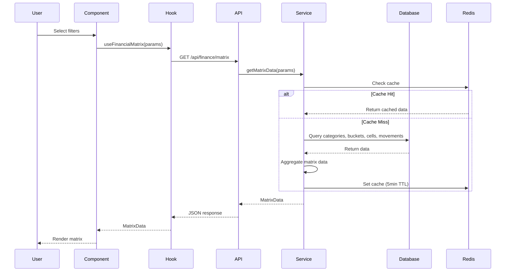
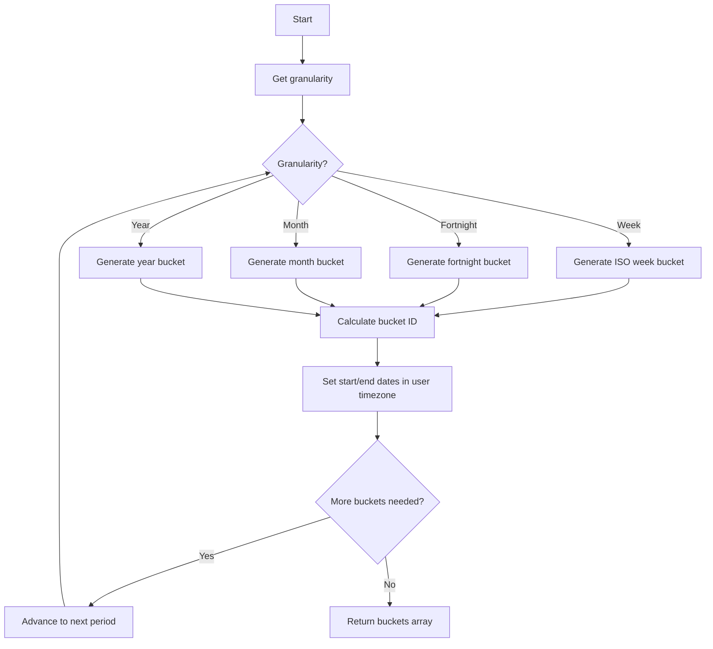

# Financial Planning Matrix Architecture Plan

## Executive Summary

This document outlines the technical architecture for implementing a dynamic Financial Planning Matrix for the Zo System at `/t/{tenant}/finance`. The feature provides a matrix-based view of income/expense categories across time buckets with granular filtering, quick-entry capabilities, and dispersion persistence.

---

## A) Technical Architecture Document

### 1. Current-to-Target Architecture Delta

#### 1.1 Current State

**Frontend (`apps/web`):**
- Basic finance dashboard at `/t/[tenant]/finance/page.tsx`
- KPI cards, movements table, filter panels
- Links to categories and budgets pages
- Uses `useFinance` hook for data fetching

**Backend (`apps/api`):**
- BudgetService with mock database
- TransactionCategoryService with mock database
- API routes: `/api/budgets`, `/api/categories`
- Result Pattern implementation in `@sass-store/core/src/result`
- DomainError types in `@sass-store/core/src/errors/types`

**Data Model:**
- `Budget` entity with period types (weekly, biweekly, monthly, custom)
- `BudgetCategory` linking budgets to transaction categories
- `TransactionCategory` with income/expense types
- Mock in-memory storage (no real database integration)

#### 1.2 Target Architecture

**Frontend Additions:**
```
apps/web/
├── app/t/[tenant]/finance/
│   ├── page.tsx (existing - update)
│   └── matrix/
│       └── page.tsx (NEW - matrix view)
├── components/finance/
│   ├── FinancialMatrix.tsx (NEW)
│   ├── MatrixCell.tsx (NEW)
│   ├── MatrixHeader.tsx (NEW)
│   ├── MatrixFilters.tsx (NEW)
│   ├── QuickEntryPopover.tsx (NEW)
│   └── CloneMonthDialog.tsx (NEW)
├── hooks/
│   └── useFinancialMatrix.ts (NEW)
└── lib/
    └── utils/
        └── date-buckets.ts (NEW)
```

**Backend Additions:**
```
apps/api/
├── app/api/finance/
│   └── matrix/
│       ├── route.ts (NEW - GET matrix data)
│       ├── cells/
│       │   └── route.ts (NEW - PUT/POST cell updates)
│       ├── movements/
│       │   └── route.ts (NEW - POST mark as paid)
│       └── clone/
│       └── route.ts (NEW - POST clone month)
├── lib/services/
│   ├── FinancialMatrixService.ts (NEW)
│   └── DateBucketService.ts (NEW)
└── lib/db/
    └── schema/
        └── financial-planning.ts (NEW - schema extensions)
```

**Shared Packages:**
```
packages/
├── core/src/errors/types.ts (EXTEND - add MatrixError)
├── validation/src/zod-result.ts (EXTEND - add matrix schemas)
└── cache/src/ (NEW - matrix caching)
```

---

### 2. Route/Module Map with File Responsibilities

#### 2.1 Frontend Routes

| Route | File | Responsibility |
|-------|------|----------------|
| `/t/[tenant]/finance` | `page.tsx` | Dashboard overview, navigation to matrix |
| `/t/[tenant]/finance/matrix` | `matrix/page.tsx` | Main matrix view with filters |

#### 2.2 Frontend Components

| Component | File | Responsibility |
|-----------|------|----------------|
| `FinancialMatrix` | `components/finance/FinancialMatrix.tsx` | Main matrix container, state management |
| `MatrixCell` | `components/finance/MatrixCell.tsx` | Individual cell rendering, click handling |
| `MatrixHeader` | `components/finance/MatrixHeader.tsx` | Time bucket column headers |
| `MatrixFilters` | `components/finance/MatrixFilters.tsx` | Granularity, date range, entity selectors |
| `QuickEntryPopover` | `components/finance/QuickEntryPopover.tsx` | Budget entry, mark as paid actions |
| `CloneMonthDialog` | `components/finance/CloneMonthDialog.tsx` | Dispersion persistence UI |

#### 2.3 Frontend Hooks

| Hook | File | Responsibility |
|------|------|----------------|
| `useFinancialMatrix` | `hooks/useFinancialMatrix.ts` | Matrix data fetching, mutations, caching |

#### 2.4 Backend API Routes

| Route | Method | File | Responsibility |
|-------|--------|------|----------------|
| `/api/finance/matrix` | GET | `matrix/route.ts` | Load matrix data for filters |
| `/api/finance/matrix/cells` | PUT | `matrix/cells/route.ts` | Update cell (budget or real amount) |
| `/api/finance/matrix/movements` | POST | `matrix/movements/route.ts` | Mark as paid (create movement) |
| `/api/finance/matrix/clone` | POST | `matrix/clone/route.ts` | Clone planning to another month |

#### 2.5 Backend Services

| Service | File | Responsibility |
|---------|------|----------------|
| `FinancialMatrixService` | `lib/services/FinancialMatrixService.ts` | Matrix data aggregation, cell operations |
| `DateBucketService` | `lib/services/DateBucketService.ts` | Time bucket calculations, ISO week handling |

---

### 3. API Contract Proposals

#### 3.1 Load Matrix Data

**Request:**
```typescript
GET /api/finance/matrix?tenantId={uuid}&granularity=week|fortnight|month|year&startDate={ISO}&endDate={ISO}&entityId={uuid|optional}

Query Parameters:
- tenantId: string (UUID) - Required
- granularity: "week" | "fortnight" | "month" | "year" - Required
- startDate: string (ISO 8601) - Required
- endDate: string (ISO 8601) - Required
- entityId: string (UUID) | null - Optional, for sub-account filtering
```

**Response:**
```typescript
{
  success: true,
  data: {
    tenantId: string,
    granularity: "week" | "fortnight" | "month" | "year",
    dateRange: {
      start: string (ISO),
      end: string (ISO)
    },
    timeBuckets: Array<{
      id: string,
      label: string,
      startDate: string (ISO),
      endDate: string (ISO),
      isPartial: boolean
    }>,
    categories: Array<{
      id: string,
      type: "income" | "expense",
      name: string,
      color?: string,
      icon?: string,
      parentId?: string,
      sortOrder: number,
      isGroup: boolean
    }>,
    cells: Array<{
      categoryId: string,
      bucketId: string,
      projectedAmount: string (decimal),
      realAmount: string (decimal),
      isOverBudget: boolean,
      movementCount: number
    }>,
    totals: {
      income: {
        projected: string (decimal),
        real: string (decimal)
      },
      expense: {
        projected: string (decimal),
        real: string (decimal)
      },
      net: string (decimal)
    },
    metadata: {
      currency: string,
      timezone: string,
      generatedAt: string (ISO)
    }
  }
}
```

**Error Response:**
```typescript
{
  success: false,
  error: {
    type: "ValidationError" | "NotFoundError" | "TenantError" | "DatabaseError",
    message: string,
    details?: any
  }
}
```

#### 3.2 Update Cell

**Request:**
```typescript
PUT /api/finance/matrix/cells

Body:
{
  tenantId: string (UUID),
  categoryId: string (UUID),
  bucketId: string,
  projectedAmount?: string (decimal),
  realAmount?: string (decimal),
  notes?: string
}
```

**Response:**
```typescript
{
  success: true,
  data: {
    cellId: string,
    categoryId: string,
    bucketId: string,
    projectedAmount: string (decimal),
    realAmount: string (decimal),
    isOverBudget: boolean,
    updatedAt: string (ISO)
  }
}
```

#### 3.3 Mark as Paid (Create Movement)

**Request:**
```typescript
POST /api/finance/matrix/movements

Body:
{
  tenantId: string (UUID),
  categoryId: string (UUID),
  bucketId: string,
  amount: string (decimal),
  description?: string,
  referenceNumber?: string,
  paymentMethod?: string,
  entityId?: string (UUID)
}
```

**Response:**
```typescript
{
  success: true,
  data: {
    movementId: string,
    categoryId: string,
    bucketId: string,
    amount: string (decimal),
    fechaPago: string (ISO),
    fechaProgramada: string (ISO),
    status: "paid",
    createdAt: string (ISO)
  }
}
```

#### 3.4 Clone Month

**Request:**
```typescript
POST /api/finance/matrix/clone

Body:
{
  tenantId: string (UUID),
  sourceBucketId: string,
  targetBucketId: string,
  categories?: string[] (UUIDs to clone, empty = all)
}
```

**Response:**
```typescript
{
  success: true,
  data: {
    clonedCells: number,
    sourceBucket: {
      id: string,
      label: string,
      startDate: string (ISO),
      endDate: string (ISO)
    },
    targetBucket: {
      id: string,
      label: string,
      startDate: string (ISO),
      endDate: string (ISO)
    },
    clonedAt: string (ISO)
  }
}
```

---

### 4. Data Model Proposal

#### 4.1 New Tables

**`financial_planning_cells`**
```sql
CREATE TABLE financial_planning_cells (
  id UUID PRIMARY KEY DEFAULT gen_random_uuid(),
  tenant_id UUID NOT NULL REFERENCES tenants(id) ON DELETE CASCADE,
  category_id UUID NOT NULL REFERENCES transaction_categories(id) ON DELETE CASCADE,
  bucket_id VARCHAR(50) NOT NULL, -- Computed bucket identifier
  bucket_type VARCHAR(20) NOT NULL, -- 'week', 'fortnight', 'month', 'year'
  bucket_start_date DATE NOT NULL,
  bucket_end_date DATE NOT NULL,
  projected_amount DECIMAL(12,2) NOT NULL DEFAULT 0,
  real_amount DECIMAL(12,2) NOT NULL DEFAULT 0,
  entity_id UUID REFERENCES entities(id) ON DELETE SET NULL, -- Sub-account
  notes TEXT,
  is_over_budget BOOLEAN NOT NULL DEFAULT FALSE,
  created_at TIMESTAMPTZ NOT NULL DEFAULT NOW(),
  updated_at TIMESTAMPTZ NOT NULL DEFAULT NOW(),
  UNIQUE(tenant_id, category_id, bucket_id, entity_id)
);

CREATE INDEX idx_fpc_tenant ON financial_planning_cells(tenant_id);
CREATE INDEX idx_fpc_category ON financial_planning_cells(category_id);
CREATE INDEX idx_fpc_bucket ON financial_planning_cells(bucket_id, bucket_type);
CREATE INDEX idx_fpc_entity ON financial_planning_cells(entity_id);
```

**`financial_movements`** (if not exists)
```sql
CREATE TABLE financial_movements (
  id UUID PRIMARY KEY DEFAULT gen_random_uuid(),
  tenant_id UUID NOT NULL REFERENCES tenants(id) ON DELETE CASCADE,
  category_id UUID NOT NULL REFERENCES transaction_categories(id) ON DELETE RESTRICT,
  entity_id UUID REFERENCES entities(id) ON DELETE SET NULL,
  amount DECIMAL(12,2) NOT NULL,
  type VARCHAR(10) NOT NULL CHECK (type IN ('income', 'expense')),
  description TEXT,
  reference_number VARCHAR(100),
  payment_method VARCHAR(50),
  fecha_programada DATE NOT NULL,
  fecha_pago DATE,
  status VARCHAR(20) NOT NULL DEFAULT 'pending' CHECK (status IN ('pending', 'paid', 'cancelled')),
  metadata JSONB,
  created_at TIMESTAMPTZ NOT NULL DEFAULT NOW(),
  updated_at TIMESTAMPTZ NOT NULL DEFAULT NOW()
);

CREATE INDEX idx_fm_tenant ON financial_movements(tenant_id);
CREATE INDEX idx_fm_category ON financial_movements(category_id);
CREATE INDEX idx_fm_fecha_programada ON financial_movements(fecha_programada);
CREATE INDEX idx_fm_fecha_pago ON financial_movements(fecha_pago);
CREATE INDEX idx_fm_status ON financial_movements(status);
```

#### 4.2 RLS Policies

```sql
-- Financial Planning Cells
ALTER TABLE financial_planning_cells ENABLE ROW LEVEL SECURITY;

CREATE POLICY tenant_isolation_fpc ON financial_planning_cells
  FOR ALL
  USING (tenant_id = current_tenant_id());

CREATE POLICY tenant_insert_fpc ON financial_planning_cells
  FOR INSERT
  WITH CHECK (tenant_id = current_tenant_id());

-- Financial Movements
ALTER TABLE financial_movements ENABLE ROW LEVEL SECURITY;

CREATE POLICY tenant_isolation_fm ON financial_movements
  FOR ALL
  USING (tenant_id = current_tenant_id());

CREATE POLICY tenant_insert_fm ON financial_movements
  FOR INSERT
  WITH CHECK (tenant_id = current_tenant_id());
```

#### 4.3 Tenancy Boundaries

- **Strict Isolation:** All queries MUST filter by `tenant_id`
- **Entity Isolation:** When `entityId` is provided, filter both cells and movements by entity
- **Category Isolation:** Categories are tenant-scoped via `transaction_categories.tenant_id`
- **RLS Enforcement:** Database-level policies prevent cross-tenant data access

---

### 5. Date-Bucket Algorithm Design

#### 5.1 Granularity Definitions

**Week (ISO 8601):**
- Monday to Sunday
- Week number: `getISOWeek(date)`
- Year transition: Week 1 of new year contains Jan 4
- Edge case: Dec 29-31 may belong to week 1 of next year

**Fortnight (Quincena):**
- Q1: Days 1-15 of month
- Q2: Days 16-end of month (28-31 depending on month)
- Boundary: Q1 ends at 23:59:59 on day 15, Q2 starts at 00:00:00 on day 16

**Month:**
- First day to last day of month
- Standard calendar month boundaries

**Year:**
- Jan 1 to Dec 31
- Full calendar year

#### 5.2 Algorithm Pseudocode

```typescript
interface DateBucket {
  id: string;
  label: string;
  startDate: Date;
  endDate: Date;
  isPartial: boolean;
}

function generateDateBuckets(
  granularity: 'week' | 'fortnight' | 'month' | 'year',
  startDate: Date,
  endDate: Date,
  timezone: string = 'America/Mexico_City'
): DateBucket[] {
  const buckets: DateBucket[] = [];
  let current = startOfDayInTimezone(startDate, timezone);
  const end = endOfDayInTimezone(endDate, timezone);

  while (current <= end) {
    let bucket: DateBucket;
    
    switch (granularity) {
      case 'week':
        bucket = generateWeekBucket(current, timezone);
        current = addDays(bucket.endDate, 1);
        break;
      case 'fortnight':
        bucket = generateFortnightBucket(current, timezone);
        current = addDays(bucket.endDate, 1);
        break;
      case 'month':
        bucket = generateMonthBucket(current, timezone);
        current = addMonths(bucket.endDate, 1);
        break;
      case 'year':
        bucket = generateYearBucket(current, timezone);
        current = addYears(bucket.endDate, 1);
        break;
    }
    
    bucket.isPartial = bucket.startDate < startDate || bucket.endDate > endDate;
    buckets.push(bucket);
  }

  return buckets;
}

function generateWeekBucket(date: Date, timezone: string): DateBucket {
  // ISO week: Monday is day 1
  const localDate = toZonedTime(date, timezone);
  const dayOfWeek = localDate.getDay() === 0 ? 7 : localDate.getDay(); // Sunday=7
  
  const startDate = subDays(localDate, dayOfWeek - 1);
  const endDate = addDays(startDate, 6);
  
  const isoWeek = getISOWeek(startDate);
  const isoYear = getISOYear(startDate);
  
  return {
    id: `W${isoYear}-${String(isoWeek).padStart(2, '0')}`,
    label: `Sem ${isoWeek}`,
    startDate: startOfDay(startDate),
    endDate: endOfDay(endDate)
  };
}

function generateFortnightBucket(date: Date, timezone: string): DateBucket {
  const localDate = toZonedTime(date, timezone);
  const dayOfMonth = localDate.getDate();
  
  let startDate, endDate;
  
  if (dayOfMonth <= 15) {
    startDate = new Date(localDate.getFullYear(), localDate.getMonth(), 1);
    endDate = new Date(localDate.getFullYear(), localDate.getMonth(), 15);
  } else {
    startDate = new Date(localDate.getFullYear(), localDate.getMonth(), 16);
    endDate = new Date(localDate.getFullYear(), localDate.getMonth() + 1, 0);
  }
  
  const monthName = format(localDate, 'MMM', { locale: es });
  const period = dayOfMonth <= 15 ? 'Q1' : 'Q2';
  
  return {
    id: `F${localDate.getFullYear()}-${String(localDate.getMonth() + 1).padStart(2, '0')}-${period}`,
    label: `${monthName} ${period}`,
    startDate: startOfDay(startDate),
    endDate: endOfDay(endDate)
  };
}

function generateMonthBucket(date: Date, timezone: string): DateBucket {
  const localDate = toZonedTime(date, timezone);
  const startDate = new Date(localDate.getFullYear(), localDate.getMonth(), 1);
  const endDate = new Date(localDate.getFullYear(), localDate.getMonth() + 1, 0);
  
  const monthName = format(localDate, 'MMMM', { locale: es });
  
  return {
    id: `M${localDate.getFullYear()}-${String(localDate.getMonth() + 1).padStart(2, '0')}`,
    label: monthName.charAt(0).toUpperCase() + monthName.slice(1),
    startDate: startOfDay(startDate),
    endDate: endOfDay(endDate)
  };
}

function generateYearBucket(date: Date, timezone: string): DateBucket {
  const localDate = toZonedTime(date, timezone);
  const startDate = new Date(localDate.getFullYear(), 0, 1);
  const endDate = new Date(localDate.getFullYear(), 11, 31);
  
  return {
    id: `Y${localDate.getFullYear()}`,
    label: String(localDate.getFullYear()),
    startDate: startOfDay(startDate),
    endDate: endOfDay(endDate)
  };
}
```

#### 5.3 Year Boundary Handling (Weekly View)

**Problem:** ISO weeks can span year boundaries (e.g., Dec 29-31 may be in week 1 of next year).

**Solution:**
1. Generate buckets based on ISO week numbers
2. Include `isoYear` in bucket ID for uniqueness
3. When aggregating movements, check both `fecha_programada` OR `fecha_pago`
4. Use inclusive date ranges with timezone-aware comparisons

```typescript
function getMovementsForBucket(
  movements: FinancialMovement[],
  bucket: DateBucket,
  timezone: string
): FinancialMovement[] {
  return movements.filter(m => {
    const programada = toZonedTime(m.fechaProgramada, timezone);
    const pago = m.fechaPago ? toZonedTime(m.fechaPago, timezone) : null;
    
    const inBucketByProgramada = programada >= bucket.startDate && programada <= bucket.endDate;
    const inBucketByPago = pago && pago >= bucket.startDate && pago <= bucket.endDate;
    
    return inBucketByProgramada || inBucketByPago;
  });
}
```

#### 5.4 Timezone Handling

- **User Timezone:** `America/Mexico_City` (UTC-6, UTC-5 DST)
- **Server Storage:** UTC timestamps in database
- **Conversion:** All date operations use user timezone for display and bucket generation
- **Consistency:** Use `date-fns-tz` or similar library for timezone-aware operations

---

### 6. Caching/Performance Strategy (≤300ms UI Updates)

#### 6.1 Multi-Level Caching

**Level 1: Frontend React Query Cache**
```typescript
const useFinancialMatrix = (params: MatrixParams) => {
  return useQuery({
    queryKey: ['financial-matrix', params],
    queryFn: () => fetchMatrixData(params),
    staleTime: 5 * 60 * 1000, // 5 minutes
    gcTime: 10 * 60 * 1000, // 10 minutes
    refetchOnWindowFocus: false
  });
};
```

**Level 2: Backend Redis Cache**
```typescript
const CACHE_KEY_PREFIX = 'financial-matrix';
const CACHE_TTL = 300; // 5 minutes

async function getMatrixDataWithCache(params: MatrixParams): Promise<MatrixData> {
  const cacheKey = `${CACHE_KEY_PREFIX}:${params.tenantId}:${params.granularity}:${params.startDate}:${params.endDate}:${params.entityId || 'all'}`;
  
  const cached = await redis.get(cacheKey);
  if (cached) {
    return JSON.parse(cached);
  }
  
  const data = await computeMatrixData(params);
  await redis.setex(cacheKey, CACHE_TTL, JSON.stringify(data));
  
  return data;
}
```

**Level 3: Database Query Optimization**
```sql
-- Optimized query with proper indexes
SELECT 
  fc.id,
  fc.category_id,
  fc.bucket_id,
  fc.projected_amount,
  fc.real_amount,
  COALESCE(SUM(fm.amount), 0) as movement_sum
FROM financial_planning_cells fc
LEFT JOIN financial_movements fm ON 
  fm.tenant_id = fc.tenant_id AND
  fm.category_id = fc.category_id AND
  fm.entity_id = fc.entity_id AND
  (fm.fecha_programada BETWEEN fc.bucket_start_date AND fc.bucket_end_date OR
   fm.fecha_pago BETWEEN fc.bucket_start_date AND fc.bucket_end_date)
WHERE 
  fc.tenant_id = $1 AND
  fc.bucket_type = $2 AND
  fc.bucket_start_date >= $3 AND
  fc.bucket_end_date <= $4 AND
  (fc.entity_id = $5 OR fc.entity_id IS NULL)
GROUP BY fc.id
ORDER BY fc.bucket_start_date, fc.category_id;
```

#### 6.2 Performance Targets

| Operation | Target | Strategy |
|-----------|--------|----------|
| Initial load | <500ms | Redis cache + optimized query |
| Granularity switch | <300ms | Pre-computed buckets + cache |
| Cell update | <200ms | Optimistic update + cache invalidation |
| Mark as paid | <300ms | Single INSERT + cache invalidation |
| Clone month | <500ms | Batch INSERT + cache invalidation |

#### 6.3 Cache Invalidation Strategy

```typescript
// Invalidate cache on any mutation
async function invalidateMatrixCache(tenantId: string) {
  const pattern = `${CACHE_KEY_PREFIX}:${tenantId}:*`;
  const keys = await redis.keys(pattern);
  if (keys.length > 0) {
    await redis.del(...keys);
  }
}

// Call after cell update, movement creation, or clone operation
await invalidateMatrixCache(params.tenantId);
```

---

### 7. Error Model (Result Pattern)

#### 7.1 New DomainError Types

**Extend `packages/core/src/errors/types.ts`:**

```typescript
// Matrix-specific errors
export interface MatrixError extends BaseDomainError {
  readonly type: "MatrixError";
  readonly operation: string;
  readonly tenantId?: string;
}

export interface InvalidGranularityError extends BaseDomainError {
  readonly type: "InvalidGranularityError";
  readonly granularity: string;
}

export interface InvalidDateRangeError extends BaseDomainError {
  readonly type: "InvalidDateRangeError";
  readonly startDate: string;
  readonly endDate: string;
}

export interface CellUpdateConflictError extends BaseDomainError {
  readonly type: "CellUpdateConflictError";
  readonly cellId: string;
  readonly currentVersion: number;
  readonly attemptedVersion: number;
}

export interface CloneOperationError extends BaseDomainError {
  readonly type: "CloneOperationError";
  readonly sourceBucketId: string;
  readonly targetBucketId: string;
}

// Update DomainError union
export type DomainError =
  | ValidationError
  | NotFoundError
  | AuthorizationError
  | AuthenticationError
  | BusinessRuleError
  | DatabaseError
  | NetworkError
  | ConfigurationError
  | RateLimitError
  | PaymentError
  | TenantError
  | StorageError
  | MatrixError
  | InvalidGranularityError
  | InvalidDateRangeError
  | CellUpdateConflictError
  | CloneOperationError;

// Add to ErrorFactories
export const ErrorFactories = {
  // ... existing factories
  
  matrix: (
    operation: string,
    message: string,
    tenantId?: string,
  ): MatrixError => ({
    type: "MatrixError",
    message: `Matrix error during ${operation}: ${message}`,
    operation,
    tenantId,
    timestamp: new Date(),
  }),
  
  invalidGranularity: (
    granularity: string,
  ): InvalidGranularityError => ({
    type: "InvalidGranularityError",
    message: `Invalid granularity: ${granularity}`,
    granularity,
    timestamp: new Date(),
  }),
  
  invalidDateRange: (
    startDate: string,
    endDate: string,
  ): InvalidDateRangeError => ({
    type: "InvalidDateRangeError",
    message: `Invalid date range: ${startDate} to ${endDate}`,
    startDate,
    endDate,
    timestamp: new Date(),
  }),
  
  cellUpdateConflict: (
    cellId: string,
    currentVersion: number,
    attemptedVersion: number,
  ): CellUpdateConflictError => ({
    type: "CellUpdateConflictError",
    message: `Cell update conflict for ${cellId}`,
    cellId,
    currentVersion,
    attemptedVersion,
    timestamp: new Date(),
  }),
  
  cloneOperation: (
    sourceBucketId: string,
    targetBucketId: string,
    message: string,
  ): CloneOperationError => ({
    type: "CloneOperationError",
    message: `Clone operation failed: ${message}`,
    sourceBucketId,
    targetBucketId,
    timestamp: new Date(),
  }),
};
```

#### 7.2 Service Layer Result Pattern Usage

```typescript
// FinancialMatrixService.ts
export class FinancialMatrixService {
  async getMatrixData(
    params: MatrixParams
  ): Promise<Result<MatrixData, DomainError>> {
    // Validate params
    const granularityValidation = validateGranularity(params.granularity);
    if (isFailure(granularityValidation)) {
      return granularityValidation;
    }
    
    const dateRangeValidation = validateDateRange(params.startDate, params.endDate);
    if (isFailure(dateRangeValidation)) {
      return dateRangeValidation;
    }
    
    // Check tenant access
    const tenantResult = await this.tenantService.getTenant(params.tenantId);
    if (isFailure(tenantResult)) {
      return Err(
        ErrorFactories.tenant(
          "get_matrix_data",
          "Tenant not found or access denied",
          params.tenantId
        )
      );
    }
    
    // Fetch data
    try {
      const categories = await this.getCategories(params.tenantId);
      const buckets = this.dateBucketService.generateBuckets(params);
      const cells = await this.getCells(params, buckets);
      const movements = await this.getMovements(params);
      
      // Aggregate
      const matrixData = this.aggregateMatrixData(
        categories,
        buckets,
        cells,
        movements
      );
      
      return Ok(matrixData);
    } catch (error) {
      return Err(
        ErrorFactories.database(
          "get_matrix_data",
          "Failed to fetch matrix data",
          undefined,
          error as Error
        )
      );
    }
  }
  
  async updateCell(
    params: UpdateCellParams
  ): Promise<Result<UpdatedCell, DomainError>> {
    // Validate
    const validation = validateWithZod(UpdateCellSchema, params);
    if (isFailure(validation)) {
      return validation;
    }
    
    // Check for conflicts (optimistic locking)
    const existing = await this.getCell(params.categoryId, params.bucketId);
    if (isFailure(existing)) {
      return existing;
    }
    
    // Update
    try {
      const updated = await this.db.updateCell(params);
      await this.invalidateCache(params.tenantId);
      return Ok(updated);
    } catch (error) {
      return Err(
        ErrorFactories.database(
          "update_cell",
          "Failed to update cell",
          undefined,
          error as Error
        )
      );
    }
  }
  
  async markAsPaid(
    params: MarkAsPaidParams
  ): Promise<Result<FinancialMovement, DomainError>> {
    // Validate
    const validation = validateWithZod(MarkAsPaidSchema, params);
    if (isFailure(validation)) {
      return validation;
    }
    
    // Create movement
    try {
      const movement = await this.createMovement({
        ...params,
        status: 'paid',
        fechaPago: new Date()
      });
      
      // Update cell real amount
      await this.updateCellRealAmount(params.categoryId, params.bucketId, params.amount);
      
      await this.invalidateCache(params.tenantId);
      return Ok(movement);
    } catch (error) {
      return Err(
        ErrorFactories.database(
          "mark_as_paid",
          "Failed to mark as paid",
          undefined,
          error as Error
        )
      );
    }
  }
  
  async cloneMonth(
    params: CloneMonthParams
  ): Promise<Result<CloneResult, DomainError>> {
    // Validate
    const validation = validateWithZod(CloneMonthSchema, params);
    if (isFailure(validation)) {
      return validation;
    }
    
    // Check source exists
    const sourceCells = await this.getCellsByBucket(params.sourceBucketId);
    if (sourceCells.length === 0) {
      return Err(
        ErrorFactories.cloneOperation(
          params.sourceBucketId,
          params.targetBucketId,
          "Source bucket has no cells to clone"
        )
      );
    }
    
    // Clone
    try {
      const cloned = await this.db.cloneCells(
        sourceCells,
        params.targetBucketId,
        params.categories
      );
      
      await this.invalidateCache(params.tenantId);
      return Ok(cloned);
    } catch (error) {
      return Err(
        ErrorFactories.cloneOperation(
          params.sourceBucketId,
          params.targetBucketId,
          (error as Error).message
        )
      );
    }
  }
}
```

#### 7.3 API Route Result Pattern Usage

```typescript
// apps/api/app/api/finance/matrix/route.ts
import { withResultHandler } from "@sass-store/core/src/middleware/result-handler";

export const GET = withResultHandler(
  async (request: NextRequest): Promise<Result<MatrixData, DomainError>> => {
    const { searchParams } = new URL(request.url);
    const tenantId = searchParams.get("tenantId");
    const granularity = searchParams.get("granularity");
    const startDate = searchParams.get("startDate");
    const endDate = searchParams.get("endDate");
    const entityId = searchParams.get("entityId");
    
    const params: MatrixParams = {
      tenantId: tenantId!,
      granularity: granularity as any,
      startDate: new Date(startDate!),
      endDate: new Date(endDate!),
      entityId: entityId || undefined
    };
    
    return await financialMatrixService.getMatrixData(params);
  }
);
```

---

### 8. Security Notes

#### 8.1 Multi-Tenant Isolation

**Database Level:**
- RLS policies on all tables enforce `tenant_id = current_tenant_id()`
- No cross-tenant queries allowed
- Entity-level isolation via `entity_id` filtering

**Application Level:**
- All API routes validate tenant membership from session
- Service layer checks tenant access before data operations
- Cache keys include tenant ID for isolation

**Frontend Level:**
- Session-based tenant context
- URL-based tenant routing (`/t/{tenant}/finance`)
- No direct tenant ID manipulation from client

#### 8.2 Authorization Checks

```typescript
// Middleware to check tenant access
async function checkTenantAccess(
  userId: string,
  tenantId: string
): Promise<Result<void, DomainError>> {
  const membership = await tenantService.getMembership(userId, tenantId);
  
  if (isFailure(membership) || !membership.data) {
    return Err(
      ErrorFactories.authorization(
        "Access denied to tenant",
        "tenant:read",
        userId
      )
    );
  }
  
  return Ok(undefined);
}
```

#### 8.3 Input Validation

- All inputs validated via Zod schemas
- SQL injection prevented via parameterized queries
- XSS prevention via React's built-in escaping
- CSRF protection via NextAuth.js

#### 8.4 Audit Logging

```typescript
// Log all matrix operations
await auditService.log({
  tenantId: params.tenantId,
  userId: session.user.id,
  action: "matrix_cell_update",
  resource: "financial_planning_cells",
  resourceId: cellId,
  metadata: {
    categoryId: params.categoryId,
    bucketId: params.bucketId,
    changes: { from: oldAmount, to: newAmount }
  }
});
```

---

### 9. Incremental Rollout Plan

#### Phase 1: Foundation (Week 1-2)

**Backend:**
- [ ] Create database tables (`financial_planning_cells`, `financial_movements`)
- [ ] Implement RLS policies
- [ ] Create `DateBucketService` with all granularity algorithms
- [ ] Add new DomainError types to `@sass-store/core`

**Frontend:**
- [ ] Create `FinancialMatrix` component skeleton
- [ ] Create `MatrixFilters` component
- [ ] Implement basic matrix layout with sticky category column

**Testing:**
- [ ] Unit tests for date bucket algorithms
- [ ] Integration tests for RLS policies
- [ ] E2E tests for basic matrix rendering

**Definition of Done:**
- Database schema deployed
- Date bucket algorithms tested and verified
- Basic matrix UI renders with filters

#### Phase 2: Data Integration (Week 3-4)

**Backend:**
- [ ] Implement `FinancialMatrixService.getMatrixData()`
- [ ] Create `/api/finance/matrix` GET endpoint
- [ ] Implement cell aggregation logic
- [ ] Add Redis caching layer

**Frontend:**
- [ ] Implement `useFinancialMatrix` hook
- [ ] Connect matrix to API
- [ ] Display projected vs real amounts
- [ ] Implement over-budget highlighting

**Testing:**
- [ ] API contract tests
- [ ] Performance tests (target <500ms initial load)
- [ ] Cache hit/miss tests

**Definition of Done:**
- Matrix loads with real data
- Caching works correctly
- Performance targets met

#### Phase 3: Quick Entry (Week 5-6)

**Backend:**
- [ ] Implement `FinancialMatrixService.updateCell()`
- [ ] Implement `FinancialMatrixService.markAsPaid()`
- [ ] Create `/api/finance/matrix/cells` PUT endpoint
- [ ] Create `/api/finance/matrix/movements` POST endpoint

**Frontend:**
- [ ] Create `QuickEntryPopover` component
- [ ] Implement cell click handling
- [ ] Add budget entry form
- [ ] Add "mark as paid" action
- [ ] Implement optimistic updates

**Testing:**
- [ ] Mutation tests
- [ ] Optimistic update tests
- [ ] Cache invalidation tests

**Definition of Done:**
- Users can update budgets from matrix
- Users can mark items as paid
- Updates reflect immediately (optimistic)

#### Phase 4: Dispersion Persistence (Week 7)

**Backend:**
- [ ] Implement `FinancialMatrixService.cloneMonth()`
- [ ] Create `/api/finance/matrix/clone` POST endpoint
- [ ] Add batch insert optimization

**Frontend:**
- [ ] Create `CloneMonthDialog` component
- [ ] Add clone button to matrix header
- [ ] Implement source/target selection

**Testing:**
- [ ] Clone operation tests
- [ ] Batch insert performance tests

**Definition of Done:**
- Users can clone planning between months
- Clone operation completes in <500ms

#### Phase 5: Polish & Optimization (Week 8)

**Backend:**
- [ ] Optimize database queries
- [ ] Add query performance monitoring
- [ ] Implement cache warming strategies

**Frontend:**
- [ ] Add loading states and skeletons
- [ ] Improve error handling and user feedback
- [ ] Add keyboard navigation
- [ ] Optimize re-renders (React.memo, useMemo)

**Testing:**
- [ ] Full E2E test suite
- [ ] Performance profiling
- [ ] Accessibility audit

**Definition of Done:**
- All performance targets met
- E2E tests passing
- Accessibility compliant

---

### 10. Risks and Mitigations

#### Risk 1: Performance Degradation with Large Datasets

**Impact:** High - Matrix could become slow with many categories and time buckets

**Mitigation:**
- Implement server-side pagination for large date ranges
- Use virtual scrolling for matrix rows
- Add database query optimization (indexes, materialized views)
- Set maximum date range limits (e.g., 12 months)

#### Risk 2: Timezone Edge Cases

**Impact:** Medium - Incorrect bucket assignments during DST transitions

**Mitigation:**
- Use `date-fns-tz` for all timezone operations
- Comprehensive test suite covering DST boundaries
- Store all dates in UTC, convert only for display
- Document timezone handling requirements

#### Risk 3: Cache Inconsistency

**Impact:** Medium - Stale data shown to users

**Mitigation:**
- Implement cache versioning
- Add cache invalidation on all mutations
- Use cache TTL as fallback
- Monitor cache hit/miss ratios

#### Risk 4: Concurrent Updates Conflicts

**Impact:** Medium - Lost updates when multiple users edit same cell

**Mitigation:**
- Implement optimistic locking with version numbers
- Add conflict detection and resolution UI
- Use database transactions for updates
- Audit log for tracking changes

#### Risk 5: Cross-Tenant Data Leakage

**Impact:** Critical - Security vulnerability

**Mitigation:**
- RLS policies on all tables
- Tenant validation in all API routes
- Regular security audits
- Integration tests for tenant isolation

#### Risk 6: Year Boundary Issues (Weekly View)

**Impact:** Medium - Incorrect week assignments across year boundaries

**Mitigation:**
- Use ISO 8601 week numbering
- Include year in bucket ID
- Test edge cases (Dec 29-31, Jan 1-3)
- Document ISO week behavior

---

## B) Implementation Work Breakdown

### Backend Tasks

#### Database & Schema
- [ ] Create `financial_planning_cells` table with indexes
- [ ] Create `financial_movements` table with indexes (if not exists)
- [ ] Implement RLS policies for both tables
- [ ] Add `entities` table for sub-account support (if not exists)
- [ ] Create database migration scripts
- [ ] Write migration rollback scripts

#### Core Services
- [ ] Implement `DateBucketService` with all granularity algorithms
- [ ] Add timezone handling utilities
- [ ] Implement ISO week calculation with year boundary support
- [ ] Write unit tests for date bucket algorithms
- [ ] Add edge case tests (DST, year boundaries)

#### Matrix Service
- [ ] Implement `FinancialMatrixService` class
- [ ] Implement `getMatrixData()` method with aggregation
- [ ] Implement `updateCell()` method with optimistic locking
- [ ] Implement `markAsPaid()` method
- [ ] Implement `cloneMonth()` method
- [ ] Add cache integration (Redis)
- [ ] Write service unit tests
- [ ] Write integration tests

#### API Routes
- [ ] Create `/api/finance/matrix` GET route with Result Pattern
- [ ] Create `/api/finance/matrix/cells` PUT route
- [ ] Create `/api/finance/matrix/movements` POST route
- [ ] Create `/api/finance/matrix/clone` POST route
- [ ] Add input validation with Zod schemas
- [ ] Add error handling with DomainError types
- [ ] Write API contract tests

#### Caching & Performance
- [ ] Set up Redis connection
- [ ] Implement cache key generation
- [ ] Implement cache get/set with TTL
- [ ] Implement cache invalidation strategy
- [ ] Add cache warming for common queries
- [ ] Monitor cache performance

#### Observability
- [ ] Add structured logging for all operations
- [ ] Add performance metrics (query times, cache hit rates)
- [ ] Add audit logging for mutations
- [ ] Set up error tracking (Sentry or similar)
- [ ] Create monitoring dashboards

### Frontend Tasks

#### Core Components
- [ ] Create `FinancialMatrix.tsx` main container
- [ ] Create `MatrixCell.tsx` component
- [ ] Create `MatrixHeader.tsx` component
- [ ] Create `MatrixFilters.tsx` component
- [ ] Implement sticky category column
- [ ] Add responsive design

#### Quick Entry Components
- [ ] Create `QuickEntryPopover.tsx` component
- [ ] Implement budget entry form
- [ ] Implement "mark as paid" action
- [ ] Add form validation
- [ ] Add error handling

#### Clone Components
- [ ] Create `CloneMonthDialog.tsx` component
- [ ] Implement source/target selection
- [ ] Add confirmation dialog
- [ ] Show clone progress

#### Hooks & State Management
- [ ] Create `useFinancialMatrix.ts` hook
- [ ] Implement React Query integration
- [ ] Add optimistic updates
- [ ] Implement cache invalidation
- [ ] Add loading and error states

#### UI/UX Polish
- [ ] Add loading skeletons
- [ ] Add empty states
- [ ] Implement over-budget highlighting
- [ ] Add keyboard navigation
- [ ] Add tooltips
- [ ] Add animations and transitions

#### Performance Optimization
- [ ] Implement virtual scrolling for large matrices
- [ ] Add React.memo for components
- [ ] Use useMemo for expensive calculations
- [ ] Optimize re-renders
- [ ] Add code splitting for heavy components

### Shared/Package Tasks

#### Core Package
- [ ] Add `MatrixError` to DomainError types
- [ ] Add `InvalidGranularityError` to DomainError types
- [ ] Add `InvalidDateRangeError` to DomainError types
- [ ] Add `CellUpdateConflictError` to DomainError types
- [ ] Add `CloneOperationError` to DomainError types
- [ ] Add corresponding ErrorFactories
- [ ] Update HTTP status code mapping

#### Validation Package
- [ ] Add `MatrixParamsSchema` Zod schema
- [ ] Add `UpdateCellSchema` Zod schema
- [ ] Add `MarkAsPaidSchema` Zod schema
- [ ] Add `CloneMonthSchema` Zod schema
- [ ] Add common validation helpers

#### Cache Package (NEW)
- [ ] Create `packages/cache` package
- [ ] Implement Redis client wrapper
- [ ] Add cache key utilities
- [ ] Add cache invalidation helpers
- [ ] Write cache tests

### Migration Tasks

#### Data Migration
- [ ] Create migration for `financial_planning_cells` table
- [ ] Create migration for `financial_movements` table (if needed)
- [ ] Create migration for RLS policies
- [ ] Create migration for indexes
- [ ] Test migrations on staging
- [ ] Plan production migration strategy
- [ ] Create rollback procedures

#### Feature Migration
- [ ] Migrate existing budget data to new structure
- [ ] Migrate existing category data
- [ ] Migrate existing movement data (if applicable)
- [ ] Validate data integrity after migration
- [ ] Update existing finance pages to use new structure

### Observability Tasks

#### Logging
- [ ] Add structured logging to all service methods
- [ ] Add request logging to API routes
- [ ] Add error logging with stack traces
- [ ] Add performance logging (query times, cache hits)
- [ ] Set up log aggregation (ELK, Datadog, etc.)

#### Metrics
- [ ] Add Prometheus metrics for API endpoints
- [ ] Add database query metrics
- [ ] Add cache performance metrics
- [ ] Add business metrics (cells updated, movements created)
- [ ] Create Grafana dashboards

#### Tracing
- [ ] Add distributed tracing (OpenTelemetry)
- [ ] Trace request flows across services
- [ ] Trace database queries
- [ ] Trace cache operations

#### Alerts
- [ ] Set up alerting for high error rates
- [ ] Set up alerting for slow queries (>1s)
- [ ] Set up alerting for cache miss rate >50%
- [ ] Set up alerting for database connection issues

### Definition of Done / Acceptance Criteria

#### Functional Requirements
- [ ] Matrix displays income/expense categories as rows
- [ ] Matrix displays time buckets as columns (all granularities)
- [ ] Cells show projected vs real amounts
- [ ] Users can switch granularities (Week, Fortnight, Month, Year)
- [ ] Users can filter by date range
- [ ] Users can filter by entity (sub-account)
- [ ] Users can set projected budget via quick entry popover
- [ ] Users can mark items as paid via quick entry popover
- [ ] Users can clone planning from one month to another
- [ ] Month->Fortnight switch preserves totals
- [ ] Year boundary with weekly view doesn't duplicate/lose transactions

#### UI/UX Requirements
- [ ] Planned amounts display in gray text
- [ ] Executed amounts display in black bold text
- [ ] Over-budget cells have soft red background
- [ ] Category column is sticky during horizontal scroll
- [ ] Matrix rerenders in <300ms after granularity switch
- [ ] Loading states show skeletons
- [ ] Error states show user-friendly messages
- [ ] Empty states show helpful guidance

#### Performance Requirements
- [ ] Initial matrix load <500ms
- [ ] Granularity switch <300ms
- [ ] Cell update <200ms
- [ ] Mark as paid <300ms
- [ ] Clone month <500ms
- [ ] Cache hit rate >80%

#### Security Requirements
- [ ] All queries enforce tenant isolation
- [ ] RLS policies prevent cross-tenant access
- [ ] All inputs validated
- [ ] SQL injection prevented
- [ ] XSS prevented
- [ ] CSRF protected
- [ ] Audit logging for all mutations

#### Quality Requirements
- [ ] Unit tests for all services
- [ ] Integration tests for API routes
- [ ] E2E tests for critical user flows
- [ ] Code coverage >80%
- [ ] TypeScript strict mode enabled
- [ ] ESLint passing
- [ ] Prettier formatted
- [ ] Accessibility WCAG 2.1 AA compliant

#### Documentation Requirements
- [ ] API documentation updated
- [ ] Component documentation added
- [ ] Architecture diagrams created
- [ ] Deployment guide updated
- [ ] Troubleshooting guide created

---

## Appendix

### Mermaid Diagrams

#### System Architecture

```mermaid
graph TB
    subgraph Frontend
        A[FinancialMatrix Component]
        B[MatrixFilters]
        C[QuickEntryPopover]
        D[CloneMonthDialog]
        E[useFinancialMatrix Hook]
    end
    
    subgraph API Layer
        F[/api/finance/matrix GET]
        G[/api/finance/matrix/cells PUT]
        H[/api/finance/matrix/movements POST]
        I[/api/finance/matrix/clone POST]
    end
    
    subgraph Services
        J[FinancialMatrixService]
        K[DateBucketService]
        L[BudgetService]
        M[TransactionCategoryService]
    end
    
    subgraph Data Layer
        N[(PostgreSQL)]
        O[(Redis Cache)]
    end
    
    A --> E
    B --> E
    C --> E
    D --> E
    E --> F
    E --> G
    E --> H
    E --> I
    F --> J
    G --> J
    H --> J
    I --> J
    J --> K
    J --> L
    J --> M
    J --> N
    J --> O
```

#### Data Flow for Matrix Load



#### Date Bucket Algorithm Flow



---

**Document Version:** 1.0  
**Last Updated:** 2025-02-21  
**Author:** Architect Agent  
**Status:** Ready for Implementation
