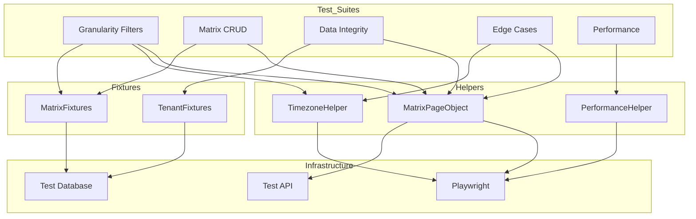
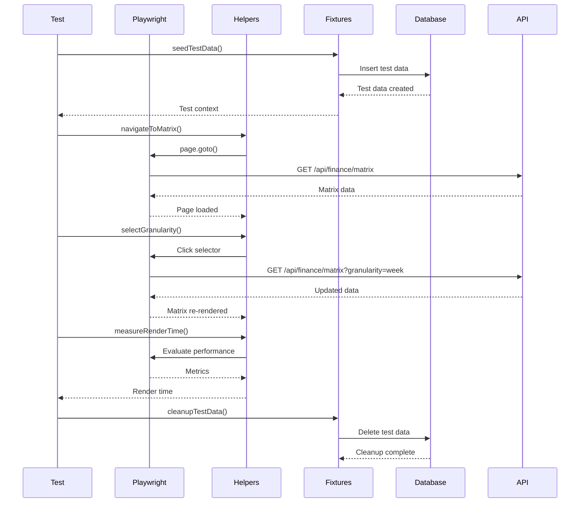

# Financial Planning Matrix - E2E Testing Strategy

## Executive Summary

This document outlines the comprehensive E2E testing strategy for the Financial Planning Matrix feature at route `/t/{tenant}/finance`. The strategy covers all test suites specified in the requirements, including granularity filters, CRUD operations, data integrity, edge cases, and performance testing.

---

## A) E2E Test Architecture Document

### 1. Proposed Playwright Test File Structure

```
tests/e2e/
├── finance/
│   ├── matrix/
│   │   ├── granularity-filters.spec.ts          # Suite 1: Granularity filters & rendering
│   │   ├── matrix-crud.spec.ts                  # Suite 2: CRUD & cash-flow happy path
│   │   ├── data-integrity.spec.ts               # Suite 3: Multi-tenant & data integrity
│   │   ├── edge-cases.spec.ts                  # Suite 4: Edge cases (leap year, timezone)
│   │   ├── performance.spec.ts                  # Suite 5: Performance & UI
│   │   └── README.md                           # Matrix E2E documentation
│   ├── helpers/
│   │   ├── matrix-helpers.ts                    # Matrix-specific page object helpers
│   │   ├── performance-helpers.ts               # Performance measurement utilities
│   │   └── timezone-helpers.ts                 # Timezone manipulation utilities
│   └── fixtures/
│       ├── matrix-fixtures.ts                   # Deterministic test data fixtures
│       └── tenant-fixtures.ts                  # Multi-tenant test fixtures
```

### 2. Data Seeding Strategy

#### 2.1 Deterministic Time/Date Approach

**Fixed Test Dates:**
All E2E tests will use deterministic dates to ensure consistent test execution across environments.

```typescript
// tests/e2e/fixtures/matrix-fixtures.ts

export const FIXED_TEST_DATES = {
  // March 2026 - for weekly/monthly/fortnight tests
  march2026: {
    start: "2026-03-01T00:00:00Z",
    end: "2026-03-31T23:59:59Z",
    weeks: [
      { id: "W2026-09", label: "Sem 09", start: "2026-03-02", end: "2026-03-08" },
      { id: "W2026-10", label: "Sem 10", start: "2026-03-09", end: "2026-03-15" },
      { id: "W2026-11", label: "Sem 11", start: "2026-03-16", end: "2026-03-22" },
      { id: "W2026-12", label: "Sem 12", start: "2026-03-23", end: "2026-03-29" },
      { id: "W2026-13", label: "Sem 13", start: "2026-03-30", end: "2026-04-05" },
    ],
    fortnights: [
      { id: "F2026-03-Q1", label: "Mar Q1", start: "2026-03-01", end: "2026-03-15" },
      { id: "F2026-03-Q2", label: "Mar Q2", start: "2026-03-16", end: "2026-03-31" },
    ],
    month: { id: "M2026-03", label: "Marzo", start: "2026-03-01", end: "2026-03-31" },
  },
  
  // February 2024 (leap year) - for leap year edge case tests
  feb2024: {
    start: "2024-02-01T00:00:00Z",
    end: "2024-02-29T23:59:59Z",
    fortnights: [
      { id: "F2024-02-Q1", label: "Feb Q1", start: "2024-02-01", end: "2024-02-15" },
      { id: "F2024-02-Q2", label: "Feb Q2", start: "2024-02-16", end: "2024-02-29" },
    ],
  },
  
  // February 2025 (non-leap year) - for comparison
  feb2025: {
    start: "2025-02-01T00:00:00Z",
    end: "2025-02-28T23:59:59Z",
    fortnights: [
      { id: "F2025-02-Q1", label: "Feb Q1", start: "2025-02-01", end: "2025-02-15" },
      { id: "F2025-02-Q2", label: "Feb Q2", start: "2025-02-16", end: "2025-02-28" },
    ],
  },
};
```

#### 2.2 Deterministic Tenant Fixtures

```typescript
// tests/e2e/fixtures/tenant-fixtures.ts

import { TenantBuilder } from "../../builders/TenantBuilder";

export const createTestTenants = () => {
  // Tenant A - for isolation tests
  const tenantA = TenantBuilder.aTenant()
    .withSlug(`matrix-test-a-${Date.now()}`)
    .withName("Matrix Test Tenant A")
    .withTimezone("America/Mexico_City")
    .build();

  // Tenant B - for isolation tests
  const tenantB = TenantBuilder.aTenant()
    .withSlug(`matrix-test-b-${Date.now()}`)
    .withName("Matrix Test Tenant B")
    .withTimezone("America/Mexico_City")
    .build();

  // Tenant with UTC timezone - for timezone tests
  const tenantUTC = TenantBuilder.aTenant()
    .withSlug(`matrix-test-utc-${Date.now()}`)
    .withName("Matrix Test Tenant UTC")
    .withTimezone("UTC")
    .build();

  return { tenantA, tenantB, tenantUTC };
};
```

#### 2.3 Seeding Strategy Implementation

```typescript
// tests/e2e/fixtures/matrix-fixtures.ts (continued)

import { createTestTenants } from "./tenant-fixtures";

export interface MatrixTestFixtures {
  tenants: ReturnType<typeof createTestTenants>;
  categories: Category[];
  cells: CellData[];
  movements: MovementData[];
}

export async function seedMatrixTestData(db: any): Promise<MatrixTestFixtures> {
  const tenants = createTestTenants();
  
  // Create categories for each tenant
  const categories = await Promise.all([
    createCategoriesForTenant(tenants.tenantA.id, db),
    createCategoriesForTenant(tenants.tenantB.id, db),
  ]);

  // Create planning cells with deterministic values
  const cells = await createDeterministicCells(tenants, categories, db);
  
  // Create movements for legacy history tests
  const movements = await createTestMovements(tenants.tenantA.id, categories, db);

  return { tenants, categories, cells, movements };
}

async function createDeterministicCells(
  tenants: any,
  categories: any[],
  db: any
): Promise<CellData[]> {
  const cells: CellData[] = [];
  
  // Create cells with known values for TC-01 (monthly total == sum of weeks)
  const marchCells = [
    // Week 1: 1000
    { categoryId: categories[0].id, bucketId: "W2026-09", projectedAmount: "1000.00" },
    // Week 2: 1500
    { categoryId: categories[0].id, bucketId: "W2026-10", projectedAmount: "1500.00" },
    // Week 3: 2000
    { categoryId: categories[0].id, bucketId: "W2026-11", projectedAmount: "2000.00" },
    // Week 4: 500
    { categoryId: categories[0].id, bucketId: "W2026-12", projectedAmount: "500.00" },
    // Month total should be: 1000 + 1500 + 2000 + 500 = 5000
  ];

  for (const cell of marchCells) {
    await db.cells.insert({ ...cell, tenantId: tenants.tenantA.id });
    cells.push(cell);
  }

  return cells;
}
```

### 3. Page Object / Helper Design

#### 3.1 Matrix Page Object

```typescript
// tests/e2e/helpers/matrix-helpers.ts

import { Page, expect } from "@playwright/test";

export class MatrixPageObject {
  constructor(private page: Page) {}

  // Navigation
  async navigateToMatrix(tenantSlug: string) {
    await this.page.goto(`/t/${tenantSlug}/finance/matrix`, {
      waitUntil: "domcontentloaded",
    });
    await this.page.waitForLoadState("networkidle");
  }

  // Granularity Filters
  async selectGranularity(granularity: "week" | "fortnight" | "month" | "year") {
    await this.page.getByTestId("granularity-selector").click();
    await this.page.getByRole("option", { name: this.getGranularityLabel(granularity) }).click();
    await this.waitForMatrixRender();
  }

  private getGranularityLabel(granularity: string): string {
    const labels = {
      week: "Semanal",
      fortnight: "Quincenal",
      month: "Mensual",
      year: "Anual",
    };
    return labels[granularity as keyof typeof labels];
  }

  async waitForMatrixRender() {
    await this.page.waitForSelector('[data-testid="matrix-container"]', { timeout: 10000 });
    await this.page.waitForTimeout(300); // Allow re-render to complete
  }

  // Cell Operations
  async getCell(categoryId: string, bucketId: string) {
    return this.page.locator(
      `[data-testid="matrix-cell"][data-category-id="${categoryId}"][data-bucket-id="${bucketId}"]`
    );
  }

  async clickCell(categoryId: string, bucketId: string) {
    const cell = await this.getCell(categoryId, bucketId);
    await cell.click();
  }

  async getCellValue(categoryId: string, bucketId: string): Promise<string> {
    const cell = await this.getCell(categoryId, bucketId);
    const valueElement = cell.locator('[data-testid="cell-value"]');
    return await valueElement.textContent() || "";
  }

  async getCellStyle(categoryId: string, bucketId: string): Promise<CellStyle> {
    const cell = await this.getCell(categoryId, bucketId);
    const classes = await cell.getAttribute("class") || "";
    
    return {
      isPlanned: classes.includes("cell-planned"),
      isExecuted: classes.includes("cell-executed"),
      isOverBudget: classes.includes("cell-over-budget"),
    };
  }

  // Quick Entry Popover
  async enterPlannedValue(categoryId: string, bucketId: string, amount: string) {
    await this.clickCell(categoryId, bucketId);
    
    const popover = this.page.getByTestId("quick-entry-popover");
    await expect(popover).toBeVisible();
    
    await popover.getByTestId("planned-amount-input").fill(amount);
    await popover.getByTestId("save-cell-btn").click();
    
    await expect(popover).not.toBeVisible();
  }

  async markAsPaid(categoryId: string, bucketId: string, amount: string) {
    await this.clickCell(categoryId, bucketId);
    
    const popover = this.page.getByTestId("quick-entry-popover");
    await expect(popover).toBeVisible();
    
    await popover.getByTestId("mark-paid-btn").click();
    await popover.getByTestId("payment-amount-input").fill(amount);
    await popover.getByTestId("confirm-payment-btn").click();
    
    await expect(popover).not.toBeVisible();
  }

  // Column Headers
  async getColumnHeaders(): Promise<string[]> {
    const headers = this.page.locator('[data-testid="matrix-header-cell"]');
    const count = await headers.count();
    const labels: string[] = [];
    
    for (let i = 0; i < count; i++) {
      labels.push(await headers.nth(i).textContent() || "");
    }
    
    return labels;
  }

  async getBucketStartDate(bucketId: string): Promise<string> {
    const header = this.page.locator(
      `[data-testid="matrix-header-cell"][data-bucket-id="${bucketId}"]`
    );
    return await header.getAttribute("data-start-date") || "";
  }

  async getBucketEndDate(bucketId: string): Promise<string> {
    const header = this.page.locator(
      `[data-testid="matrix-header-cell"][data-bucket-id="${bucketId}"]`
    );
    return await header.getAttribute("data-end-date") || "";
  }

  // Totals
  async getMonthlyTotal(categoryId: string): Promise<number> {
    const totalCell = this.page.locator(
      `[data-testid="matrix-total-row"][data-category-id="${categoryId}"]`
    );
    const text = await totalCell.textContent() || "";
    return this.parseCurrency(text);
  }

  private parseCurrency(text: string): number {
    const match = text.match(/[\d,]+\.?\d*/);
    return match ? parseFloat(match[0].replace(/,/g, "")) : 0;
  }

  // Filter Persistence
  async saveScrollPosition(): Promise<number> {
    const container = this.page.locator('[data-testid="matrix-scroll-container"]');
    return await container.evaluate((el: any) => el.scrollLeft);
  }

  async scrollToPosition(position: number) {
    const container = this.page.locator('[data-testid="matrix-scroll-container"]');
    await container.evaluate((el: any, pos: number) => el.scrollLeft = pos, position);
  }

  // Dashboard Integration
  async getDashboardMonthlyBalance(): Promise<number> {
    await this.page.goto(`/t/${process.env.TEST_TENANT_SLUG}/finance`);
    await this.page.waitForLoadState("networkidle");
    
    const balanceElement = this.page.getByTestId("dashboard-balance");
    const text = await balanceElement.textContent() || "";
    return this.parseCurrency(text);
  }

  async navigateToTransactionHistory() {
    await this.page.getByTestId("view-history-btn").click();
    await this.page.waitForURL(/\/finance\/movements/);
  }

  async getLatestTransactionDate(): Promise<string> {
    const latestRow = this.page.locator('[data-testid="transaction-row"]').first();
    const dateCell = latestRow.locator('[data-testid="transaction-date"]');
    return await dateCell.textContent() || "";
  }
}

interface CellStyle {
  isPlanned: boolean;
  isExecuted: boolean;
  isOverBudget: boolean;
}
```

#### 3.2 Performance Measurement Helpers

```typescript
// tests/e2e/helpers/performance-helpers.ts

import { Page } from "@playwright/test";

export interface PerformanceMetrics {
  renderTime: number;
  scrollFPS: number;
  memoryUsage?: number;
}

export class PerformanceHelper {
  constructor(private page: Page) {}

  /**
   * Measure matrix render time after granularity switch
   * Target: < 300ms
   */
  async measureRenderTime(action: () => Promise<void>): Promise<number> {
    const startTime = Date.now();
    
    // Start performance observer
    const metrics = await this.page.evaluate(() => {
      return new Promise((resolve) => {
        const observer = new PerformanceObserver((list) => {
          const entries = list.getEntries();
          const renderEntries = entries.filter((e: any) => 
            e.name.includes('render') || e.entryType === 'measure'
          );
          resolve(renderEntries);
        });
        observer.observe({ entryTypes: ['measure', 'paint', 'navigation'] });
      });
    });

    await action();
    
    // Wait for render to complete
    await this.page.waitForTimeout(100);
    
    const endTime = Date.now();
    return endTime - startTime;
  }

  /**
   * Measure scroll FPS during horizontal scrolling
   * Target: ~60 FPS
   */
  async measureScrollFPS(scrollDistance: number = 1000): Promise<number> {
    const container = this.page.locator('[data-testid="matrix-scroll-container"]');
    
    const fps = await this.page.evaluate(async (distance) => {
      const scrollContainer = document.querySelector('[data-testid="matrix-scroll-container"]');
      if (!scrollContainer) return 0;

      const frames: number[] = [];
      let lastTime = performance.now();
      let scrolled = 0;

      const measureFrame = () => {
        const now = performance.now();
        const delta = now - lastTime;
        lastTime = now;
        frames.push(1000 / delta);

        if (scrolled < distance) {
          scrollContainer.scrollLeft += 10;
          scrolled += 10;
          requestAnimationFrame(measureFrame);
        }
      };

      requestAnimationFrame(measureFrame);

      // Wait for scroll to complete
      await new Promise(resolve => setTimeout(resolve, 2000));

      // Calculate average FPS
      const validFrames = frames.filter(f => isFinite(f) && f > 0);
      return validFrames.length > 0 
        ? validFrames.reduce((a, b) => a + b) / validFrames.length 
        : 0;
    }, scrollDistance);

    return fps;
  }

  /**
   * Measure memory usage (if available)
   */
  async getMemoryUsage(): Promise<number | null> {
    const memory = await this.page.evaluate(() => {
      // @ts-ignore
      if (performance.memory) {
        // @ts-ignore
        return performance.memory.usedJSHeapSize / 1024 / 1024; // MB
      }
      return null;
    });
    return memory;
  }

  /**
   * Assert performance meets targets
   */
  assertPerformanceTargets(metrics: PerformanceMetrics) {
    expect(metrics.renderTime).toBeLessThan(300);
    expect(metrics.scrollFPS).toBeGreaterThan(50); // Allow some tolerance from 60 FPS
  }
}
```

#### 3.3 Timezone Manipulation Helpers

```typescript
// tests/e2e/helpers/timezone-helpers.ts

import { Page, BrowserContext } from "@playwright/test";

export class TimezoneHelper {
  constructor(private context: BrowserContext) {}

  /**
   * Set browser timezone for testing
   */
  async setTimezone(timezone: string) {
    await this.context.addInitScript(`{
      const Intl = window.Intl;
      const originalDateTimeFormat = Intl.DateTimeFormat;
      
      Intl.DateTimeFormat = function(...args) {
        const options = args[1] || {};
        options.timeZone = '${timezone}';
        return new originalDateTimeFormat(args[0], options);
      };
      
      Intl.DateTimeFormat.prototype = originalDateTimeFormat.prototype;
    }`);
  }

  /**
   * Mock current date for deterministic testing
   */
  async setCurrentDate(date: Date) {
    const timestamp = date.getTime();
    await this.context.addInitScript(`
      const originalDate = Date;
      Date.now = () => ${timestamp};
      Date.prototype = originalDate.prototype;
    `);
  }

  /**
   * Get user's current timezone offset in minutes
   */
  async getTimezoneOffset(): Promise<number> {
    return await this.context.evaluate(() => new Date().getTimezoneOffset());
  }

  /**
   * Verify date is displayed correctly in user timezone
   */
  async verifyDateDisplay(dateString: string, expectedFormat: string) {
    // Implementation depends on how dates are displayed
  }
}
```

### 4. Selector Strategy (data-testid)

All matrix components must include `data-testid` attributes for reliable test selection:

#### 4.1 Container Selectors

| Element | data-testid | Purpose |
|----------|-------------|---------|
| Matrix container | `matrix-container` | Main matrix wrapper |
| Scroll container | `matrix-scroll-container` | Horizontal scroll area |
| Category column | `matrix-category-column` | Sticky category column |
| Header row | `matrix-header-row` | Time bucket headers |

#### 4.2 Cell Selectors

| Element | data-testid | Attributes |
|----------|-------------|------------|
| Cell | `matrix-cell` | `data-category-id`, `data-bucket-id` |
| Cell value | `cell-value` | Text content of amount |
| Cell style indicator | `cell-style` | Classes: `cell-planned`, `cell-executed`, `cell-over-budget` |
| Total row cell | `matrix-total-row` | `data-category-id`, `data-bucket-id` |

#### 4.3 Header Selectors

| Element | data-testid | Attributes |
|----------|-------------|------------|
| Header cell | `matrix-header-cell` | `data-bucket-id`, `data-start-date`, `data-end-date` |
| Granularity selector | `granularity-selector` | Dropdown for granularity |
| Date range picker | `date-range-picker` | Start/end date inputs |

#### 4.4 Quick Entry Popover Selectors

| Element | data-testid | Purpose |
|----------|-------------|---------|
| Popover container | `quick-entry-popover` | Main popover wrapper |
| Planned amount input | `planned-amount-input` | Budget amount field |
| Real amount input | `real-amount-input` | Actual amount field |
| Mark paid button | `mark-paid-btn` | Trigger payment flow |
| Payment amount input | `payment-amount-input` | Payment amount field |
| Save button | `save-cell-btn` | Save cell changes |
| Cancel button | `cancel-cell-btn` | Close popover |

#### 4.5 Dashboard Integration Selectors

| Element | data-testid | Purpose |
|----------|-------------|---------|
| Dashboard balance | `dashboard-balance` | Monthly balance display |
| View history button | `view-history-btn` | Navigate to movements |
| Transaction row | `transaction-row` | Individual transaction |
| Transaction date | `transaction-date` | Transaction date cell |

### 5. Test Environment Controls

#### 5.1 Timezone Configuration

**Test Environment Setup:**

```typescript
// tests/e2e/matrix/granularity-filters.spec.ts

import { TimezoneHelper } from "../helpers/timezone-helpers";

test.describe("Matrix - Timezone Tests", () => {
  test.beforeEach(async ({ context }) => {
    const timezoneHelper = new TimezoneHelper(context);
    // Set to Mexico City timezone for all tests
    await timezoneHelper.setTimezone("America/Mexico_City");
  });

  test("TC-02: Fortnight cuts are exact with timezone awareness", async ({ page }) => {
    // Test implementation
  });
});
```

**Timezone Test Scenarios:**

1. **Mexico City (UTC-6/UTC-5 DST):** Primary test timezone
2. **UTC:** For verifying server UTC storage
3. **Europe/London:** For DST transition edge cases

#### 5.2 Locale Configuration

```typescript
// playwright.config.ts (extension)

export default defineConfig({
  use: {
    locale: "es-MX", // Spanish Mexico
    timezoneId: "America/Mexico_City",
  },
});
```

#### 5.3 Clock Control

For deterministic date testing, we'll use fixed test dates:

```typescript
// tests/e2e/fixtures/matrix-fixtures.ts

export const TEST_CLOCK = {
  // Fixed dates for testing
  march2026: new Date("2026-03-15T12:00:00Z"),
  feb2024Leap: new Date("2024-02-15T12:00:00Z"),
  feb2025NonLeap: new Date("2025-02-15T12:00:00Z"),
  
  // DST transition dates
  dstStart2026: new Date("2026-04-05T02:00:00Z"), // DST starts
  dstEnd2026: new Date("2026-10-31T02:00:00Z"),   // DST ends
};
```

#### 5.4 Anti-Flake Strategy

**1. Retry Configuration:**

```typescript
// playwright.config.ts
export default defineConfig({
  retries: process.env.CI ? 2 : 1, // More retries in CI
  timeout: 60000,
  expect: {
    timeout: 10000,
  },
});
```

**2. Wait Strategies:**

```typescript
// tests/e2e/helpers/matrix-helpers.ts

async waitForMatrixRender() {
  // Wait for container
  await this.page.waitForSelector('[data-testid="matrix-container"]', { timeout: 10000 });
  
  // Wait for all cells to be present
  await this.page.waitForSelector('[data-testid="matrix-cell"]', { timeout: 10000 });
  
  // Wait for network idle (no pending requests)
  await this.page.waitForLoadState("networkidle", { timeout: 10000 });
  
  // Additional wait for re-render to complete
  await this.page.waitForTimeout(300);
}
```

**3. Selector Stability:**

- Always use `data-testid` attributes
- Avoid CSS selectors that depend on layout
- Use `waitForSelector` before interacting with elements
- Add unique IDs to test data for isolation

**4. Data Cleanup:**

```typescript
// tests/e2e/fixtures/matrix-fixtures.ts

export async function cleanupTestData(db: any, testId: string) {
  await db.cells.deleteMany({ testId });
  await db.movements.deleteMany({ testId });
  await db.categories.deleteMany({ testId });
  await db.tenants.deleteMany({ testId });
}
```

**5. Test Isolation:**

```typescript
// Each test gets unique tenant and data
test.beforeEach(async ({ page }) => {
  const testId = `test-${Date.now()}-${Math.random()}`;
  const testData = await seedMatrixTestData(db, testId);
  
  // Store test context
  await page.evaluate((data) => {
    (window as any).__testContext = data;
  }, { testId, testData });
});

test.afterEach(async ({ page }) => {
  const testId = await page.evaluate(() => (window as any).__testContext?.testId);
  await cleanupTestData(db, testId);
});
```

### 6. Performance Measurement Approach

#### 6.1 Render Time Measurement (< 300ms)

```typescript
// tests/e2e/matrix/performance.spec.ts

test("granularity switch renders in < 300ms", async ({ page }) => {
  const matrixPO = new MatrixPageObject(page);
  const perfHelper = new PerformanceHelper(page);
  
  await matrixPO.navigateToMatrix(process.env.TEST_TENANT_SLUG);
  
  // Measure render time for granularity switch
  const renderTime = await perfHelper.measureRenderTime(async () => {
    await matrixPO.selectGranularity("fortnight");
  });
  
  console.log(`Render time: ${renderTime}ms`);
  expect(renderTime).toBeLessThan(300);
});
```

#### 6.2 Scroll Smoothness Measurement (~60 FPS)

```typescript
test("horizontal scroll maintains ~60 FPS", async ({ page }) => {
  const matrixPO = new MatrixPageObject(page);
  const perfHelper = new PerformanceHelper(page);
  
  await matrixPO.navigateToMatrix(process.env.TEST_TENANT_SLUG);
  await matrixPO.selectGranularity("week");
  
  // Measure FPS during scroll
  const fps = await perfHelper.measureScrollFPS(2000); // Scroll 2000px
  
  console.log(`Scroll FPS: ${fps.toFixed(1)}`);
  expect(fps).toBeGreaterThan(50); // Allow some tolerance
});
```

#### 6.3 Large Dataset Performance

```typescript
test("50 categories x 52 weeks renders efficiently", async ({ page }) => {
  const matrixPO = new MatrixPageObject(page);
  const perfHelper = new PerformanceHelper(page);
  
  // Seed large dataset
  await seedLargeDataset(db, 50, 52);
  
  await matrixPO.navigateToMatrix(process.env.TEST_TENANT_SLUG);
  
  const renderTime = await perfHelper.measureRenderTime(async () => {
    await matrixPO.selectGranularity("week");
  });
  
  console.log(`Large dataset render time: ${renderTime}ms`);
  expect(renderTime).toBeLessThan(500); // Slightly higher tolerance for large data
});
```

#### 6.4 Performance Assertions

```typescript
// tests/e2e/helpers/performance-helpers.ts

export const PERFORMANCE_TARGETS = {
  granularitySwitch: 300,    // ms
  cellUpdate: 200,           // ms
  initialLoad: 500,          // ms
  scrollFPS: 60,             // FPS (target)
  scrollFPSMin: 50,          // FPS (minimum acceptable)
};

export function assertPerformanceMetrics(
  operation: keyof typeof PERFORMANCE_TARGETS,
  actual: number
) {
  const target = PERFORMANCE_TARGETS[operation];
  
  if (operation === "scrollFPS") {
    expect(actual).toBeGreaterThan(PERFORMANCE_TARGETS.scrollFPSMin);
  } else {
    expect(actual).toBeLessThan(target);
  }
}
```

### 7. Security Test Approach for Tenant Isolation

#### 7.1 Tenant Isolation Test Strategy

```typescript
// tests/e2e/matrix/data-integrity.spec.ts

test.describe("Multi-Tenant Security", () => {
  test("TC-04: Tenant A cannot access Tenant B data", async ({ page, context }) => {
    const matrixPO = new MatrixPageObject(page);
    
    // Create two tenants with different data
    const { tenantA, tenantB } = await createTestTenants();
    
    // Seed different categories for each tenant
    await seedCategoriesForTenant(tenantA.id, ["Income A", "Expense A"]);
    await seedCategoriesForTenant(tenantB.id, ["Income B", "Expense B"]);
    
    // Login as user from Tenant A
    await loginAsUser(page, tenantA.users[0]);
    
    // Navigate to matrix for Tenant A
    await matrixPO.navigateToMatrix(tenantA.slug);
    
    // Verify only Tenant A categories are visible
    const headers = await matrixPO.getColumnHeaders();
    expect(headers).toContain("Income A");
    expect(headers).toContain("Expense A");
    expect(headers).not.toContain("Income B");
    expect(headers).not.toContain("Expense B");
    
    // Try to access Tenant B's matrix directly via URL
    await page.goto(`/t/${tenantB.slug}/finance/matrix`);
    
    // Should be redirected or get 403
    await expect(page).toHaveURL(/\/login|\/403/);
  });

  test("TC-04: Cell values are isolated between tenants", async ({ page }) => {
    const matrixPO = new MatrixPageObject(page);
    
    const { tenantA, tenantB } = await createTestTenants();
    const categoryId = await createCategory(tenantA.id, "Test Category");
    
    // Set different values for same category in different tenants
    await setCellValue(tenantA.id, categoryId, "W2026-09", "1000.00");
    await setCellValue(tenantB.id, categoryId, "W2026-09", "2000.00");
    
    // Login as Tenant A user
    await loginAsUser(page, tenantA.users[0]);
    await matrixPO.navigateToMatrix(tenantA.slug);
    
    // Verify Tenant A sees their value
    const valueA = await matrixPO.getCellValue(categoryId, "W2026-09");
    expect(valueA).toBe("1000.00");
    
    // Login as Tenant B user
    await loginAsUser(page, tenantB.users[0]);
    await matrixPO.navigateToMatrix(tenantB.slug);
    
    // Verify Tenant B sees their value
    const valueB = await matrixPO.getCellValue(categoryId, "W2026-09");
    expect(valueB).toBe("2000.00");
  });
});
```

#### 7.2 API-Level Security Tests

```typescript
// tests/integration/matrix-security.test.ts

test.describe("Matrix API Security", () => {
  test("API returns 403 for cross-tenant requests", async () => {
    const { tenantA, tenantB } = await createTestTenants();
    const tokenA = await generateAuthToken(tenantA.users[0]);
    
    // Try to access Tenant B's matrix with Tenant A's token
    const response = await fetch(
      `${API_BASE}/api/finance/matrix?tenantId=${tenantB.id}`,
      {
        headers: { Authorization: `Bearer ${tokenA}` }
      }
    );
    
    expect(response.status).toBe(403);
  });

  test("RLS policies prevent cross-tenant queries", async () => {
    const { tenantA, tenantB } = await createTestTenants();
    
    // Direct database query attempt (simulating SQL injection)
    const result = await db.query(`
      SELECT * FROM financial_planning_cells
      WHERE tenant_id = '${tenantB.id}'
    `, { userId: tenantA.users[0].id });
    
    expect(result.rows).toHaveLength(0);
  });
});
```

#### 7.3 Data Leakage Prevention Tests

```typescript
test("TC-04: No tenant data leaks in responses", async ({ page }) => {
  const matrixPO = new MatrixPageObject(page);
  const { tenantA, tenantB } = await createTestTenants();
  
  // Seed Tenant B with sensitive data
  await seedSensitiveData(tenantB.id);
  
  // Login as Tenant A
  await loginAsUser(page, tenantA.users[0]);
  await matrixPO.navigateToMatrix(tenantA.slug);
  
  // Capture network responses
  const responses: any[] = [];
  page.on('response', async (response) => {
    if (response.url().includes('/api/finance/matrix')) {
      const body = await response.json();
      responses.push(body);
    }
  });
  
  // Trigger matrix load
  await matrixPO.selectGranularity("week");
  
  // Verify no Tenant B data in any response
  for (const resp of responses) {
    expect(resp.data).not.toContain(tenantB.id);
    expect(resp.data).not.toContain("sensitive_category_b");
  }
});
```

### 8. Traceability Matrix

| Requirement | Test Case | Test File | Priority |
|-------------|-----------|------------|----------|
| **Suite 1: Granularity Filters** |
| TC-01: Monthly total == sum of March weeks in weekly view | `should_aggregate_weekly_to_monthly_correctly` | granularity-filters.spec.ts | P0 |
| TC-02: Fortnight cuts are exact (Q1: day 1-15, Q2: day 16-end) | `should_have_exact_fortnight_boundaries` | granularity-filters.spec.ts | P0 |
| TC-03: Filter persistence (Year view + scroll after nav) | `should_persist_filters_and_scroll_position` | granularity-filters.spec.ts | P1 |
| Granularity switch performance < 300ms | `should_switch_granularity_under_300ms` | performance.spec.ts | P0 |
| **Suite 2: CRUD & Cash-Flow** |
| Create planned value from empty cell | `should_create_planned_value` | matrix-crud.spec.ts | P0 |
| Refresh page and verify persistence + planned style | `should_persist_planned_value_after_refresh` | matrix-crud.spec.ts | P0 |
| Trigger Liquidar/Pagar and verify cell style becomes executed | `should_mark_as_paid_and_update_style` | matrix-crud.spec.ts | P0 |
| Dashboard monthly balance decreases after payment | `should_update_dashboard_balance_after_payment` | matrix-crud.spec.ts | P0 |
| Transaction history gets new entry with current date | `should_create_transaction_entry` | matrix-crud.spec.ts | P0 |
| **Suite 3: Data Integrity** |
| TC-04: Security isolation across Tenant A/B categories | `should_isolate_tenant_categories` | data-integrity.spec.ts | P0 |
| TC-04: Security isolation across Tenant A/B values | `should_isolate_tenant_values` | data-integrity.spec.ts | P0 |
| TC-05: Editing transaction in legacy history reflects in matrix | `should_update_matrix_from_legacy_transaction` | data-integrity.spec.ts | P1 |
| **Suite 4: Edge Cases** |
| Leap year fortnight behavior (Feb 2024 = 29 days) | `should_handle_leap_year_fortnight` | edge-cases.spec.ts | P1 |
| Timezone correctness (Mexico CST vs UTC) | `should_handle_timezone_correctly` | edge-cases.spec.ts | P0 |
| Day-15 11:00PM entries not shifting to Q2 | `should_not_shift_day15_entries_to_q2` | edge-cases.spec.ts | P1 |
| Invalid inputs (negative/invalid chars) blocked/sanitized | `should_block_invalid_cell_inputs` | edge-cases.spec.ts | P0 |
| **Suite 5: Performance & UI** |
| 50 categories x 52 weekly columns scenario | `should_render_large_dataset_efficiently` | performance.spec.ts | P1 |
| Sticky category column remains fixed | `should_keep_category_column_sticky` | performance.spec.ts | P1 |
| Smooth horizontal scrolling ~60 FPS | `should_maintain_60fps_during_scroll` | performance.spec.ts | P0 |
| Initial load < 500ms | `should_load_initial_matrix_quickly` | performance.spec.ts | P0 |

---

## B) Prioritized Implementation Backlog for QA Automation

### P0 Tests (Critical - Blocker for Release)

| ID | Test Case | File | Dependencies | Estimated Effort |
|----|-----------|------|---------------|------------------|
| **Suite 1** |
| P0-01 | TC-01: Monthly total == sum of March weeks | granularity-filters.spec.ts | Matrix UI implementation | Medium |
| P0-02 | TC-02: Fortnight cuts are exact | granularity-filters.spec.ts | Date bucket service | Medium |
| P0-03 | Granularity switch < 300ms | performance.spec.ts | Matrix UI + caching | Medium |
| **Suite 2** |
| P0-04 | Create planned value from empty cell | matrix-crud.spec.ts | Cell API + UI | Medium |
| P0-05 | Persist planned value after refresh | matrix-crud.spec.ts | Database persistence | Low |
| P0-06 | Mark as paid and update style | matrix-crud.spec.ts | Payment API + UI | Medium |
| P0-07 | Dashboard balance update | matrix-crud.spec.ts | Dashboard integration | Medium |
| P0-08 | Transaction history entry | matrix-crud.spec.ts | Movements API | Low |
| **Suite 3** |
| P0-09 | TC-04: Tenant category isolation | data-integrity.spec.ts | RLS policies | High |
| P0-10 | TC-04: Tenant value isolation | data-integrity.spec.ts | RLS policies | High |
| **Suite 4** |
| P0-11 | Timezone correctness (Mexico CST vs UTC) | edge-cases.spec.ts | Timezone handling | High |
| P0-12 | Invalid inputs blocked/sanitized | edge-cases.spec.ts | Input validation | Low |
| **Suite 5** |
| P0-13 | Initial load < 500ms | performance.spec.ts | Caching + optimization | High |
| P0-14 | Scroll ~60 FPS | performance.spec.ts | Virtual scrolling | High |

**Total P0 Tests:** 14 tests

### P1 Tests (High Priority - Important for UX)

| ID | Test Case | File | Dependencies | Estimated Effort |
|----|-----------|------|---------------|------------------|
| **Suite 1** |
| P1-01 | TC-03: Filter persistence + scroll | granularity-filters.spec.ts | localStorage | Low |
| **Suite 3** |
| P1-02 | TC-05: Legacy transaction sync | data-integrity.spec.ts | Legacy API integration | High |
| **Suite 4** |
| P1-03 | Leap year fortnight behavior | edge-cases.spec.ts | Date bucket service | Medium |
| P1-04 | Day-15 11:00PM entries not shift | edge-cases.spec.ts | Timezone boundaries | Medium |
| **Suite 5** |
| P1-05 | 50 categories x 52 weeks render | performance.spec.ts | Large dataset seeding | Medium |
| P1-06 | Sticky category column | performance.spec.ts | CSS sticky positioning | Low |

**Total P1 Tests:** 6 tests

### P2 Tests (Nice to Have - Edge Cases)

| ID | Test Case | File | Dependencies | Estimated Effort |
|----|-----------|------|---------------|------------------|
| P2-01 | Year boundary weekly view | edge-cases.spec.ts | ISO week handling | Medium |
| P2-02 | DST transition handling | edge-cases.spec.ts | Timezone DST logic | High |
| P2-03 | Multiple tenants concurrent access | data-integrity.spec.ts | Concurrency testing | High |
| P2-04 | Cell update conflict resolution | matrix-crud.spec.ts | Optimistic locking | Medium |
| P2-05 | Clone month operation | matrix-crud.spec.ts | Clone API | Medium |
| P2-06 | Empty matrix state | matrix-crud.spec.ts | Empty state UI | Low |
| P2-07 | Network error handling | matrix-crud.spec.ts | Error boundaries | Medium |
| P2-08 | Mobile responsive matrix | performance.spec.ts | Responsive design | Medium |

**Total P2 Tests:** 8 tests

### Dependencies & Blockers

| Dependency | Description | Blocking Tests | Status |
|------------|-------------|-----------------|---------|
| **Frontend** |
| Matrix UI components | FinancialMatrix, MatrixCell, MatrixHeader | All P0/P1/P2 | Pending |
| Quick entry popover | QuickEntryPopover component | P0-04, P0-06, P0-11, P0-12 | Pending |
| Granularity filters | MatrixFilters component | P0-01, P0-02, P0-03, P1-01 | Pending |
| **Backend** |
| Matrix API endpoints | GET /api/finance/matrix | All tests | Pending |
| Cell update API | PUT /api/finance/matrix/cells | P0-04, P0-05, P0-06 | Pending |
| Movement API | POST /api/finance/matrix/movements | P0-06, P0-07, P0-08 | Pending |
| **Data Layer** |
| Database schema | financial_planning_cells, financial_movements | All tests | Pending |
| RLS policies | Tenant isolation policies | P0-09, P0-10, P1-02 | Pending |
| Date bucket service | DateBucketService implementation | P0-01, P0-02, P1-03, P1-04 | Pending |
| **Infrastructure** |
| Test database | Separate test DB instance | All tests | Pending |
| Test fixtures | Deterministic test data | All tests | Pending |
| Playwright helpers | MatrixPageObject, PerformanceHelper | All tests | Pending |

### CI Execution Strategy

#### 1. Parallelization

```yaml
# .github/workflows/e2e-matrix-tests.yml

name: Matrix E2E Tests

on:
  pull_request:
    paths:
      - 'apps/web/components/finance/**'
      - 'apps/api/app/api/finance/**'
      - 'tests/e2e/finance/matrix/**'

jobs:
  test:
    runs-on: ubuntu-latest
    
    strategy:
      matrix:
        shard: [1, 2, 3, 4]
    
    steps:
      - uses: actions/checkout@v3
      
      - name: Setup Node.js
        uses: actions/setup-node@v3
        with:
          node-version: '18'
      
      - name: Install dependencies
        run: npm ci
      
      - name: Start dev server
        run: npm run dev &
        env:
          DATABASE_URL: ${{ secrets.TEST_DATABASE_URL }}
      
      - name: Wait for server
        run: npx wait-on http://localhost:3001
      
      - name: Run Playwright tests
        run: npx playwright test --shard=${{ matrix.shard }}/4 tests/e2e/finance/matrix/
        env:
          BASE_URL: http://localhost:3001
          TEST_DATABASE_URL: ${{ secrets.TEST_DATABASE_URL }}
      
      - name: Upload test results
        if: always()
        uses: actions/upload-artifact@v3
        with:
          name: playwright-results-shard-${{ matrix.shard }}
          path: test-results/
```

#### 2. Retry Strategy

```typescript
// playwright.config.ts

export default defineConfig({
  retries: process.env.CI ? 2 : 1, // 2 retries in CI
  workers: process.env.CI ? 1 : "50%", // Sequential in CI, parallel locally
});
```

#### 3. Artifacts

```yaml
# Upload artifacts on failure
- name: Upload screenshots on failure
  if: failure()
  uses: actions/upload-artifact@v3
  with:
    name: screenshots
    path: test-results/screenshots/

- name: Upload videos on failure
  if: failure()
  uses: actions/upload-artifact@v3
  with:
    name: videos
    path: test-results/videos/

- name: Upload traces on failure
  if: failure()
  uses: actions/upload-artifact@v3
  with:
    name: traces
    path: test-results/traces/
```

#### 4. Test Execution Commands

```bash
# Run all matrix E2E tests
npm run test:e2e -- tests/e2e/finance/matrix/

# Run specific suite
npm run test:e2e -- tests/e2e/finance/matrix/granularity-filters.spec.ts

# Run with coverage
npm run test:e2e -- tests/e2e/finance/matrix/ --coverage

# Run in UI mode (development)
npm run test:e2e:ui -- tests/e2e/finance/matrix/

# Run with trace
npm run test:e2e -- tests/e2e/finance/matrix/ --trace on

# Run specific test by name
npm run test:e2e -- tests/e2e/finance/matrix/ -g "should_aggregate_weekly_to_monthly_correctly"
```

### Acceptance Criteria

#### P0 Tests Acceptance Criteria

- [ ] All 14 P0 tests pass consistently (3 consecutive runs)
- [ ] Granularity switch renders in < 300ms
- [ ] Initial load completes in < 500ms
- [ ] Scroll maintains > 50 FPS
- [ ] Tenant isolation verified (no cross-tenant data access)
- [ ] Timezone correctness verified (Mexico CST)
- [ ] Invalid inputs properly blocked
- [ ] Data persistence verified after page refresh
- [ ] Dashboard balance updates correctly after payments
- [ ] Transaction history entries created correctly

#### P1 Tests Acceptance Criteria

- [ ] All 6 P1 tests pass consistently
- [ ] Filter and scroll position persist correctly
- [ ] Legacy transaction syncs to matrix
- [ ] Leap year handled correctly
- [ ] Day-15 boundary entries stay in correct fortnight
- [ ] Large dataset (50x52) renders efficiently
- [ ] Category column remains sticky during scroll

#### P2 Tests Acceptance Criteria

- [ ] All 8 P2 tests pass consistently
- [ ] Year boundary weekly view works correctly
- [ ] DST transitions handled properly
- [ ] Concurrent access doesn't cause data corruption
- [ ] Cell update conflicts resolved gracefully
- [ ] Clone month operation works correctly
- [ ] Empty matrix state displays properly
- [ ] Network errors handled gracefully
- [ ] Mobile responsive layout works correctly

### Maintenance Guidelines

#### 1. Test Data Management

- **Cleanup:** Always clean up test data after each test run
- **Isolation:** Use unique test IDs for each test execution
- **Determinism:** Use fixed dates and values for reproducibility
- **Versioning:** Tag test data fixtures with schema versions

#### 2. Selector Maintenance

- **data-testid:** All matrix components must have data-testid attributes
- **Documentation:** Keep selector strategy document updated
- **Deprecation:** Remove unused selectors and update tests
- **Stability:** Avoid brittle selectors (CSS classes, indexes)

#### 3. Performance Baselines

- **Baseline Recording:** Record baseline metrics on first run
- **Threshold Updates:** Update thresholds only with justification
- **Monitoring:** Track performance trends over time
- **Alerting:** Set up alerts for performance regressions

#### 4. Flaky Test Management

- **Retry Analysis:** Investigate all flaky test occurrences
- **Root Cause:** Fix underlying issues, don't just increase timeouts
- **Documentation:** Document known flaky tests and workarounds
- **Quarantine:** Move consistently flaky tests to quarantine suite

#### 5. Test Updates

- **Feature Changes:** Update tests when features change
- **Bug Fixes:** Add regression tests for bug fixes
- **Refactoring:** Keep tests in sync with code refactoring
- **Deprecation:** Remove tests for deprecated features

#### 6. Documentation

- **README Updates:** Keep test suite READMEs current
- **Comments:** Document complex test logic
- **Examples:** Provide examples for common test patterns
- **Onboarding:** Create onboarding guide for new QA engineers

---

## Appendix

### Mermaid Diagram: Test Architecture



### Mermaid Diagram: Test Execution Flow



---

**Document Version:** 1.0  
**Last Updated:** 2026-02-21  
**Author:** Architect Agent  
**Status:** Ready for Implementation
