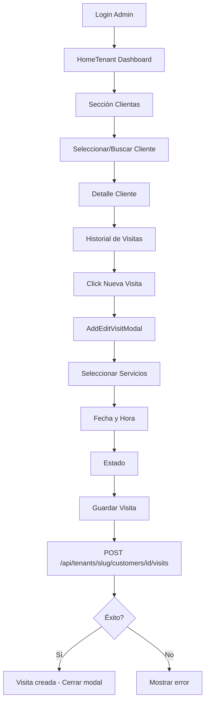

# Plan de Cobertura de Tests: HomeTenant - Flujo "Nueva Visita"

## Resumen Ejecutivo

Se identificaron **gaps críticos** en la cobertura de tests para el flujo de agendar una nueva visita desde la pantalla HomeTenant (`/t/wondernails`). El test E2E existente en [`customer-workflow.spec.ts`](tests/e2e/customers/customer-workflow.spec.ts) tiene selectores incorrectos y no completa el flujo de creación de visitas.

---

## Análisis de Cobertura Actual

### Tests E2E Existentes

| Archivo                                                                         | Cobertura                                    | Estado                                            |
| ------------------------------------------------------------------------------- | -------------------------------------------- | ------------------------------------------------- |
| [`home-tenant-dashboard.spec.ts`](tests/e2e/home/home-tenant-dashboard.spec.ts) | Dashboard visibility, navigation, responsive | ✅ Funcional                                      |
| [`customer-workflow.spec.ts`](tests/e2e/customers/customer-workflow.spec.ts)    | Crear cliente, agregar visitas               | ⚠️ Incompleto - no encuentra botón "Nueva Visita" |

### Tests Unitarios Existentes

| Archivo                                                               | Cobertura                | Estado       |
| --------------------------------------------------------------------- | ------------------------ | ------------ |
| [`appointments-data.spec.ts`](tests/unit/appointments-data.spec.ts)   | Fetching de appointments | ✅ Funcional |
| [`booking-operations.test.ts`](tests/unit/booking-operations.test.ts) | Operaciones de booking   | ✅ Funcional |

### Componentes Sin Coverage

| Componente                                                                             | Ruta                                    | Riesgo   |
| -------------------------------------------------------------------------------------- | --------------------------------------- | -------- |
| [`AddEditVisitModal.tsx`](apps/web/components/customers/AddEditVisitModal.tsx)         | Modal crítico para crear/editar visitas | 🔴 Alto  |
| [`CustomerVisitsHistory.tsx`](apps/web/components/customers/CustomerVisitsHistory.tsx) | Contiene botón "Nueva Visita"           | 🔴 Alto  |
| [`HomeTenant.tsx`](apps/web/components/home/HomeTenant.tsx)                            | Dashboard principal                     | 🟡 Medio |

---

## Flujo de Usuario para "Nueva Visita"



---

## Gaps Identificados

### 1. E2E: Flujo Completo "Nueva Visita"

**Problema:** El test [`customer-workflow.spec.ts`](tests/e2e/customers/customer-workflow.spec.ts:529-548) busca el botón con selectores incorrectos:

```typescript
// Selectores que NO funcionan:
'button:has-text("Nueva Visita")',
'button:has-text("Agregar Visita")',
```

**Ubicación real del botón:** [`CustomerVisitsHistory.tsx:154-160`](apps/web/components/customers/CustomerVisitsHistory.tsx:154-160)

```tsx
<button onClick={handleAddVisit} className="...">
  <Plus className="h-4 w-4 mr-2" />
  Nueva Visita
</button>
```

**Solución:** Actualizar selectores y agregar `data-testid` al botón.

### 2. Unit Tests: AddEditVisitModal

**Problema:** No existen tests unitarios para el modal de crear/editar visitas.

**Funcionalidades críticas sin testear:**

- Fetch de servicios (`/api/v1/public/services`)
- Fetch de productos (`/api/v1/public/products`)
- Cálculo de totales
- Submit del formulario (POST/PATCH)
- Manejo de errores
- Validación de campos

### 3. Unit Tests: CustomerVisitsHistory

**Problema:** No existen tests para el componente que contiene el botón "Nueva Visita".

**Funcionalidades sin testear:**

- Fetch de visitas (`/api/tenants/slug/customers/id/visits`)
- Apertura del modal
- Delete de visita
- Refresh después de crear

---

## Plan de Implementación

### Fase 1: E2E Tests - Flujo Nueva Visita

#### Test 1.1: Crear visita desde HomeTenant

**Archivo:** `tests/e2e/home/nueva-visita-flow.spec.ts`

```typescript
test.describe.serial("Flujo Nueva Visita desde HomeTenant", () => {
  test("should create a new visit from customer detail page", async ({
    page,
  }) => {
    // 1. Login como admin
    // 2. Navegar a /t/wondernails
    // 3. Verificar HomeTenant dashboard visible
    // 4. Click en cliente existente o crear uno nuevo
    // 5. En detalle cliente, click "Nueva Visita"
    // 6. Verificar modal abierto
    // 7. Seleccionar servicio
    // 8. Seleccionar fecha/hora
    // 9. Click "Visita" (submit)
    // 10. Verificar visita creada en lista
  });

  test("should show validation errors for missing fields", async ({ page }) => {
    // Test de validación
  });

  test("should edit an existing visit", async ({ page }) => {
    // Test de edición
  });

  test("should delete a visit", async ({ page }) => {
    // Test de eliminación
  });
});
```

#### Test 1.2: API de Visitas

**Archivo:** `tests/integration/api/visits-api.spec.ts`

```typescript
test.describe("Visits API", () => {
  test("POST /api/tenants/slug/customers/id/visits creates visit", async () => {});
  test("PATCH /api/tenants/slug/customers/id/visits/visitId updates visit", async () => {});
  test("DELETE /api/tenants/slug/customers/id/visits/visitId deletes visit", async () => {});
  test("GET /api/tenants/slug/customers/id/visits returns visits list", async () => {});
});
```

### Fase 2: Unit Tests - AddEditVisitModal

#### Test 2.1: Componente AddEditVisitModal

**Archivo:** `tests/unit/components/AddEditVisitModal.spec.tsx`

```typescript
describe("AddEditVisitModal", () => {
  describe("Rendering", () => {
    it("should render modal with form fields", () => {});
    it("should show loading state while fetching services", () => {});
    it("should pre-populate fields when editing existing visit", () => {});
  });

  describe("Service Management", () => {
    it("should add a service row", () => {});
    it("should remove a service row", () => {});
    it("should update subtotal when quantity changes", () => {});
    it("should update subtotal when price changes", () => {});
  });

  describe("Product Management", () => {
    it("should add a product row", () => {});
    it("should remove a product row", () => {});
    it("should calculate product subtotal correctly", () => {});
  });

  describe("Total Calculation", () => {
    it("should calculate total from services only", () => {});
    it("should calculate total from services and products", () => {});
    it("should update total when items change", () => {});
  });

  describe("Form Submission", () => {
    it("should submit POST for new visit", () => {});
    it("should submit PATCH for existing visit", () => {});
    it("should show error on submission failure", () => {});
    it("should require customer selection when no customerId prop", () => {});
  });

  describe("Quote Generation", () => {
    it("should create quote from visit data", () => {});
    it("should generate WhatsApp link with quote", () => {});
    it("should show error when customer has no phone", () => {});
  });
});
```

### Fase 3: Unit Tests - CustomerVisitsHistory

#### Test 3.1: Componente CustomerVisitsHistory

**Archivo:** `tests/unit/components/CustomerVisitsHistory.spec.tsx`

```typescript
describe("CustomerVisitsHistory", () => {
  describe("Rendering", () => {
    it("should render visits table", () => {});
    it("should show empty state when no visits", () => {});
    it("should show loading state", () => {});
  });

  describe("Actions", () => {
    it("should open AddEditVisitModal on Nueva Visita click", () => {});
    it("should open VisitDetailModal on view click", () => {});
    it("should open edit modal on edit click", () => {});
    it("should delete visit on confirm", () => {});
  });

  describe("Data Fetching", () => {
    it("should fetch visits on mount", () => {});
    it("should refresh visits after creating new one", () => {});
  });
});
```

---

## Mejoras de Accesibilidad para Testing

### Agregar data-testid a componentes clave

**Archivo:** `apps/web/components/customers/CustomerVisitsHistory.tsx`

```tsx
<button
  onClick={handleAddVisit}
  data-testid="btn-nueva-visita" // AGREGAR
  className="..."
>
  <Plus className="h-4 w-4 mr-2" />
  Nueva Visita
</button>
```

**Archivo:** `apps/web/components/customers/AddEditVisitModal.tsx`

```tsx
// Modal container
<div data-testid="modal-nueva-visita" role="dialog" aria-modal="true">

// Form elements
<input data-testid="input-fecha-visita" />
<select data-testid="select-estado-visita" />
<button data-testid="btn-agregar-servicio" />
<button data-testid="btn-guardar-visita" />
```

---

## Comandos de Ejecución

### Ejecutar tests E2E específicos

```bash
# Todos los tests de home
npm run test:e2e -- --grep "home"

# Tests de customer workflow
npm run test:e2e -- --grep "customer"

# Tests específicos de nueva visita (después de crear)
npm run test:e2e -- --grep "nueva visita"
```

### Ejecutar tests unitarios específicos

```bash
# Tests de appointments
npm run test:unit -- --grep "appointments"

# Tests de bookings
npm run test:unit -- --grep "booking"

# Tests de componentes (después de crear)
npm run test:unit -- --grep "AddEditVisitModal"
npm run test:unit -- --grep "CustomerVisitsHistory"
```

---

## Priorización

| Prioridad | Tarea                               | Estimación |
| --------- | ----------------------------------- | ---------- |
| 🔴 P0     | Fix E2E customer-workflow.spec.ts   | 2h         |
| 🔴 P0     | Crear E2E nueva-visita-flow.spec.ts | 3h         |
| 🟡 P1     | Unit tests AddEditVisitModal        | 4h         |
| 🟡 P1     | Unit tests CustomerVisitsHistory    | 2h         |
| 🟢 P2     | Agregar data-testid a componentes   | 1h         |
| 🟢 P2     | Integration tests visits API        | 2h         |

---

## Siguiente Paso

¿Deseas que proceda con la implementación de estos tests? Puedo:

1. **Opción A:** Crear/fix tests E2E primero (recomendado para detectar el bug)
2. **Opción B:** Crear unit tests primero (mejor para TDD)
3. **Opción C:** Ambos en paralelo

Recomiendo **Opción A** para validar el flujo completo y confirmar el bug reportado.
