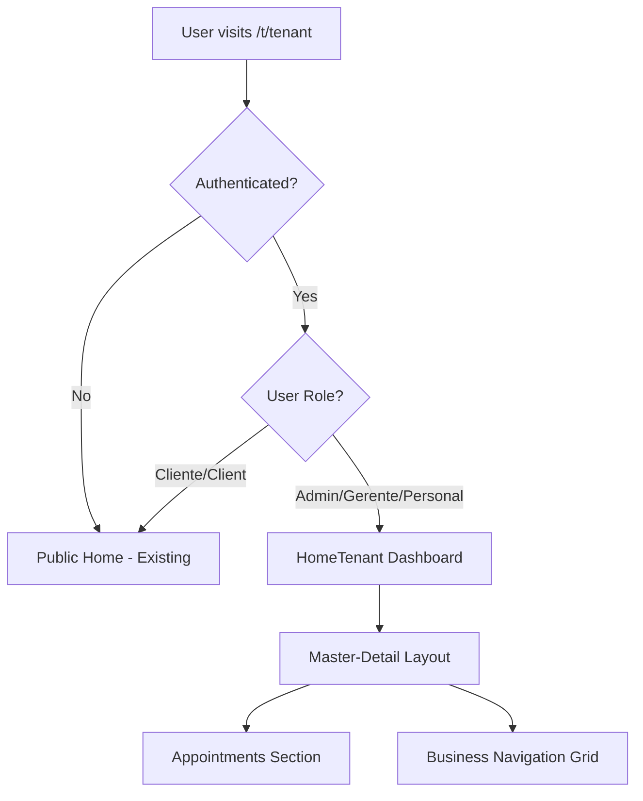
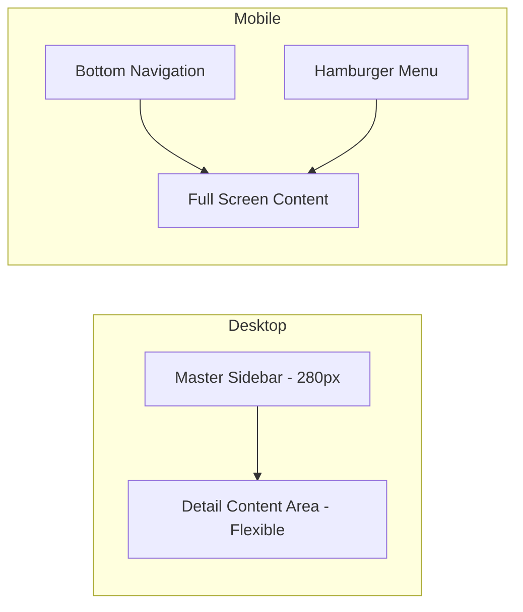

# HomeTenant Implementation Plan

## Executive Summary

This plan details the implementation of a role-based tenant home experience for the sass-store Next.js application. The feature provides differentiated home views based on user roles, with a Master-Detail architecture for staff users and the existing public home for clients and unauthenticated users.

---

## 1. Architecture Overview

### 1.1 Role-Based Home Selection Flow



### 1.2 Master-Detail Architecture



---

## 2. Target Files and Implementation

### 2.1 Role-Based Home Routing

#### Existing Files to Modify:

| File | Changes |
|------|---------|
| [`apps/web/app/t/[tenant]/page.tsx`](apps/web/app/t/[tenant]/page.tsx) | Add role detection and conditional rendering |
| [`apps/web/lib/auth/tenant-validation.ts`](apps/web/lib/auth/tenant-validation.ts) | Export role helper functions |
| [`apps/web/middleware.ts`](apps/web/middleware.ts) | Add x-tenant-user-role header to public routes for home selection |

#### New Files to Create:

| File | Purpose |
|------|---------|
| `apps/web/lib/auth/role-guards.ts` | Centralized role checking utilities |
| `apps/web/components/home/HomeRouter.tsx` | Client component for role-based home selection |
| `apps/web/hooks/useUserRole.ts` | Hook for accessing current user role |

### 2.2 HomeTenant Layout Components

#### New Files:

| File | Purpose |
|------|---------|
| `apps/web/components/home/HomeTenant.tsx` | Main HomeTenant container with Master-Detail layout |
| `apps/web/components/home/HomeTenantSidebar.tsx` | Desktop sidebar navigation - 280px fixed width |
| `apps/web/components/home/HomeTenantBottomNav.tsx` | Mobile bottom navigation - glassmorphism style |
| `apps/web/components/home/HomeTenantHeader.tsx` | Header with user info and tenant branding |
| `apps/web/components/home/HomeTenantMobileMenu.tsx` | Hamburger menu for tablet/mobile |

### 2.3 Dashboard Sections

#### Appointments Section - Citas por Confirmar

| File | Purpose |
|------|---------|
| `apps/web/components/home/sections/AppointmentsSection.tsx` | Container for unconfirmed appointments list |
| `apps/web/components/home/sections/AppointmentCard.tsx` | Individual appointment row with WhatsApp action |
| `apps/web/lib/home/appointments-data.ts` | Server-side data fetching for appointments |
| `apps/web/lib/home/whatsapp-link.ts` | WhatsApp deep-link generation utility |

#### Business Navigation Grid - NEGOCIO

| File | Purpose |
|------|---------|
| `apps/web/components/home/sections/BusinessNavGrid.tsx` | 2-3 column grid with navigation links |
| `apps/web/components/home/sections/NavGridItem.tsx` | Individual nav item with emoji + gold hover |

### 2.4 Design System Implementation

#### Ethereal Lilac Luxury Theme

| File | Changes |
|------|---------|
| [`apps/web/app/globals.css`](apps/web/app/globals.css) | Add new CSS variables for lilac theme |
| `apps/web/styles/themes/ethereal-lilac.css` | New theme file with design tokens |
| `apps/web/tailwind.config.js` | Extend theme with lilac colors |

#### Design Tokens to Add:

```css
:root {
  /* Ethereal Lilac Luxury */
  --lilac-spotlight: #E6E6FA;
  --lilac-spotlight-soft: rgba(230, 230, 250, 0.3);
  --gold-accent: #C5A059;
  --gold-accent-hover: #D4B76A;
  --glass-bg: rgba(255, 255, 255, 0.7);
  --glass-border: rgba(197, 160, 89, 0.3);
  --glass-shadow: 0 8px 32px rgba(0, 0, 0, 0.1);
}
```

#### Yellow Background Sanitization:

Add to `globals.css`:
```css
/* Sanitize yellow backgrounds - replace with white or lilac */
.bg-yellow-50, .bg-yellow-100, .bg-yellow-200 {
  background-color: #FFFFFF !important;
}
.bg-yellow-300, .bg-yellow-400 {
  background-color: var(--lilac-spotlight-soft) !important;
}
```

### 2.5 Responsive Behavior

| Breakpoint | Behavior |
|------------|----------|
| Desktop >= 1024px | Expanded sidebar 280px, detail area flexible |
| Tablet 768px - 1023px | Collapsible sidebar or hamburger menu |
| Mobile < 768px | Bottom navigation only, full-screen sections |

---

## 3. Data Flow and API Strategy

### 3.1 Unconfirmed Appointments API

#### Existing API Enhancement:

File: [`apps/web/app/api/tenants/[tenant]/bookings/route.ts`](apps/web/app/api/tenants/[tenant]/bookings/route.ts)

Add new endpoint or query parameter:
```
GET /api/tenants/[tenant]/bookings?status=pending&confirmed=false
```

#### New Result-Pattern Service:

| File | Purpose |
|------|---------|
| `apps/web/lib/services/appointments-service.ts` | Result-pattern service for appointments |
| `apps/web/types/appointments.ts` | TypeScript types for appointment data |

#### Service Pattern:

```typescript
import { Result, Ok, Err } from "@sass-store/core/src/result";
import { DomainError, ErrorFactories } from "@sass-store/core/src/errors/types";

export async function getUnconfirmedAppointments(
  tenantId: string,
): Promise<Result<UnconfirmedAppointment[], DomainError>> {
  // Implementation with proper error handling
}
```

### 3.2 WhatsApp Deep-Link Generation

File: `apps/web/lib/home/whatsapp-link.ts`

```typescript
interface WhatsAppLinkParams {
  phone: string;
  customerName: string;
  serviceName?: string;
  appointmentDate?: Date;
  tenantName: string;
}

export function generateWhatsAppLink(params: WhatsAppLinkParams): string {
  const baseUrl = 'https://wa.me/';
  const message = encodeURIComponent(
    `Hola ${params.customerName}, te escribimos de ${params.tenantName}...`
  );
  return `${baseUrl}${sanitizePhone(params.phone)}?text=${message}`;
}
```

### 3.3 Business Navigation Links

| Link | Path | Auth Protected | Required Role |
|------|------|----------------|---------------|
| Clientas | /t/[tenant]/clientes | No | Any staff |
| Finanzas | /t/[tenant]/finance | Yes | Admin, Gerente |
| Planificación Redes | /t/[tenant]/social | No | Any staff |
| Atención al cliente | /t/[tenant]/contact | No | Any staff |
| Plantillas Canva | External link | No | Any staff |

---

## 4. Component Specifications

### 4.1 HomeTenant Component Structure

```tsx
// apps/web/components/home/HomeTenant.tsx
export default function HomeTenant({ tenantSlug }: { tenantSlug: string }) {
  return (
    <div className="flex min-h-screen bg-white">
      {/* Desktop Sidebar */}
      <HomeTenantSidebar className="hidden lg:flex" />
      
      {/* Main Content */}
      <main className="flex-1 lg:ml-0">
        <HomeTenantHeader />
        
        <div className="p-4 lg:p-6 space-y-6">
          <AppointmentsSection tenantSlug={tenantSlug} />
          <BusinessNavGrid tenantSlug={tenantSlug} />
        </div>
      </main>
      
      {/* Mobile Bottom Nav */}
      <HomeTenantBottomNav className="lg:hidden" />
    </div>
  );
}
```

### 4.2 Appointment Card with WhatsApp

```tsx
// apps/web/components/home/sections/AppointmentCard.tsx
interface AppointmentCardProps {
  appointment: {
    id: string;
    customerName: string;
    customerPhone: string;
    serviceName: string;
    startTime: Date;
  };
  tenantName: string;
}

export function AppointmentCard({ appointment, tenantName }: AppointmentCardProps) {
  const whatsappLink = generateWhatsAppLink({
    phone: appointment.customerPhone,
    customerName: appointment.customerName,
    serviceName: appointment.serviceName,
    appointmentDate: appointment.startTime,
    tenantName,
  });

  return (
    <div className="glass-card p-4 rounded-lg border border-[#C5A059]/20">
      <div className="flex justify-between items-center">
        <div>
          <h4 className="font-medium">{appointment.customerName}</h4>
          <p className="text-sm text-gray-600">{appointment.serviceName}</p>
          <p className="text-xs text-gray-500">{formatDate(appointment.startTime)}</p>
        </div>
        <a
          href={whatsappLink}
          target="_blank"
          rel="noopener noreferrer"
          className="flex items-center gap-2 px-4 py-2 bg-green-500 text-white rounded-lg hover:bg-green-600 transition-colors"
        >
          <WhatsAppIcon />
          Confirmar
        </a>
      </div>
    </div>
  );
}
```

### 4.3 Business Nav Grid Item

```tsx
// apps/web/components/home/sections/NavGridItem.tsx
interface NavGridItemProps {
  emoji: string;
  label: string;
  href: string;
  authProtected?: boolean;
}

export function NavGridItem({ emoji, label, href, authProtected }: NavGridItemProps) {
  return (
    <a
      href={href}
      className="glass-card p-4 rounded-xl border border-[#C5A059]/20 
                 hover:border-[#C5A059] hover:shadow-lg
                 transition-all duration-300 group"
    >
      <span className="text-3xl mb-2 block">{emoji}</span>
      <span className="font-medium text-gray-800 group-hover:text-[#C5A059] transition-colors">
        {label}
      </span>
      {authProtected && (
        <span className="text-xs text-gray-400 mt-1 block">🔒 Requiere autorización</span>
      )}
    </a>
  );
}
```

---

## 5. Testing Strategy

### 5.1 Unit Tests

| File | Purpose |
|------|---------|
| `tests/unit/home/role-guards.test.ts` | Test role checking utilities |
| `tests/unit/home/whatsapp-link.test.ts` | Test WhatsApp link generation |
| `tests/unit/home/appointments-service.test.ts` | Test appointments data service |
| `tests/unit/components/HomeTenant.test.tsx` | Component rendering tests |

#### Test Cases for Role Guards:

```typescript
describe('Role Guards', () => {
  it('should return true for Admin role', () => {
    expect(isStaffRole('Admin')).toBe(true);
  });
  
  it('should return true for Gerente role', () => {
    expect(isStaffRole('Gerente')).toBe(true);
  });
  
  it('should return true for Personal role', () => {
    expect(isStaffRole('Personal')).toBe(true);
  });
  
  it('should return false for Cliente role', () => {
    expect(isStaffRole('Cliente')).toBe(false);
  });
  
  it('should return false for null/undefined', () => {
    expect(isStaffRole(null)).toBe(false);
    expect(isStaffRole(undefined)).toBe(false);
  });
});
```

#### Test Cases for WhatsApp Link:

```typescript
describe('WhatsApp Link Generation', () => {
  it('should generate valid WhatsApp URL', () => {
    const link = generateWhatsAppLink({
      phone: '521234567890',
      customerName: 'María García',
      tenantName: 'Wondernails',
    });
    expect(link).toContain('https://wa.me/');
    expect(link).toContain('521234567890');
  });
  
  it('should sanitize phone number', () => {
    const link = generateWhatsAppLink({
      phone: '+52 123 456 7890',
      customerName: 'Test',
      tenantName: 'Test',
    });
    expect(link).toMatch(/wa\.me\/\d+/);
  });
  
  it('should include prefilled message', () => {
    const link = generateWhatsAppLink({
      phone: '521234567890',
      customerName: 'María',
      tenantName: 'Wondernails',
    });
    expect(link).toContain('?text=');
  });
});
```

### 5.2 E2E Tests

| File | Purpose |
|------|---------|
| `tests/e2e/home/hometenant-role-routing.spec.ts` | Test role-based routing |
| `tests/e2e/home/hometenant-dashboard.spec.ts` | Test dashboard rendering |
| `tests/e2e/home/hometenant-appointments.spec.ts` | Test appointments section |
| `tests/e2e/home/hometenant-responsive.spec.ts` | Test responsive behavior |
| `tests/e2e/home/hometenant-whatsapp.spec.ts` | Test WhatsApp integration |

#### E2E Test Scenarios:

```typescript
// tests/e2e/home/hometenant-role-routing.spec.ts
test.describe('HomeTenant Role Routing', () => {
  test('unauthenticated user sees public home', async ({ page }) => {
    await page.goto('/t/wondernails');
    await expect(page.locator('[data-testid="public-home"]')).toBeVisible();
    await expect(page.locator('[data-testid="hometenant-dashboard"]')).not.toBeVisible();
  });

  test('client user sees public home', async ({ page }) => {
    await loginAsClient(page);
    await page.goto('/t/wondernails');
    await expect(page.locator('[data-testid="public-home"]')).toBeVisible();
  });

  test('admin user sees HomeTenant dashboard', async ({ page }) => {
    await loginAsAdmin(page);
    await page.goto('/t/wondernails');
    await expect(page.locator('[data-testid="hometenant-dashboard"]')).toBeVisible();
  });

  test('gerente user sees HomeTenant dashboard', async ({ page }) => {
    await loginAsGerente(page);
    await page.goto('/t/wondernails');
    await expect(page.locator('[data-testid="hometenant-dashboard"]')).toBeVisible();
  });

  test('personal user sees HomeTenant dashboard', async ({ page }) => {
    await loginAsPersonal(page);
    await page.goto('/t/wondernails');
    await expect(page.locator('[data-testid="hometenant-dashboard"]')).toBeVisible();
  });
});
```

```typescript
// tests/e2e/home/hometenant-responsive.spec.ts
test.describe('HomeTenant Responsive Behavior', () => {
  test.use({ viewport: { width: 1280, height: 720 } });
  
  test('desktop shows sidebar navigation', async ({ page }) => {
    await loginAsAdmin(page);
    await page.goto('/t/wondernails');
    await expect(page.locator('[data-testid="sidebar-nav"]')).toBeVisible();
    await expect(page.locator('[data-testid="bottom-nav"]')).not.toBeVisible();
  });

  test('mobile shows bottom navigation', async ({ page }) => {
    await page.setViewportSize({ width: 375, height: 667 });
    await loginAsAdmin(page);
    await page.goto('/t/wondernails');
    await expect(page.locator('[data-testid="bottom-nav"]')).toBeVisible();
    await expect(page.locator('[data-testid="sidebar-nav"]')).not.toBeVisible();
  });

  test('tablet shows hamburger menu', async ({ page }) => {
    await page.setViewportSize({ width: 768, height: 1024 });
    await loginAsAdmin(page);
    await page.goto('/t/wondernails');
    await expect(page.locator('[data-testid="mobile-menu-trigger"]')).toBeVisible();
  });
});
```

---

## 6. Technical Risks and Mitigations

### 6.1 Risk Matrix

| Risk | Probability | Impact | Mitigation |
|------|-------------|--------|------------|
| Session role not available on client | Medium | High | Use server components for role detection; pass role via secure headers |
| WhatsApp link fails on non-mobile | Low | Low | Use wa.me format which works on desktop with WhatsApp Web |
| Glassmorphism performance on mobile | Medium | Medium | Use backdrop-filter with fallbacks; test on low-end devices |
| Role escalation vulnerability | Low | Critical | Always verify role server-side; never trust client-side role alone |
| Yellow background regression | Medium | Low | Add CSS regression tests; use design token linting |

### 6.2 Security Considerations

1. **Role Verification**: Always verify user role server-side in API routes
2. **Tenant Isolation**: Ensure appointments query includes tenantId filter
3. **WhatsApp Link**: Sanitize phone numbers to prevent injection
4. **Auth Protected Routes**: Implement middleware checks for Finanzas access

### 6.3 Performance Considerations

1. **Lazy Loading**: Load appointments data after initial render
2. **Caching**: Cache role in session; revalidate on navigation
3. **Bundle Size**: Code-split HomeTenant components
4. **Images**: Use Next.js Image for any icons/emojis if custom

---

## 7. Acceptance Criteria

### 7.1 Role-Based Home Selection

| ID | Criteria | Verification |
|----|----------|--------------|
| AC-1.1 | Unauthenticated users see existing public home | E2E test |
| AC-1.2 | Users with Cliente role see existing public home | E2E test |
| AC-1.3 | Users with Admin role see HomeTenant dashboard | E2E test |
| AC-1.4 | Users with Gerente role see HomeTenant dashboard | E2E test |
| AC-1.5 | Users with Personal role see HomeTenant dashboard | E2E test |

### 7.2 Master-Detail Architecture

| ID | Criteria | Verification |
|----|----------|--------------|
| AC-2.1 | Desktop displays 280px fixed sidebar | Visual regression test |
| AC-2.2 | Mobile displays bottom navigation | E2E test |
| AC-2.3 | Tablet displays hamburger menu | E2E test |
| AC-2.4 | Sections stack vertically on all viewports | Visual test |

### 7.3 Appointments Section - Citas por Confirmar

| ID | Criteria | Verification |
|----|----------|--------------|
| AC-3.1 | Displays only appointments with confirmed=false | Unit test, E2E test |
| AC-3.2 | Each row shows customer name, service, date | Visual test |
| AC-3.3 | WhatsApp button generates valid deep-link | Unit test |
| AC-3.4 | WhatsApp message is prefilled with customer data | Unit test |
| AC-3.5 | Empty state shows when no pending appointments | E2E test |

### 7.4 Business Navigation Grid - NEGOCIO

| ID | Criteria | Verification |
|----|----------|--------------|
| AC-4.1 | Grid displays 2-3 columns based on viewport | Visual test |
| AC-4.2 | Each item has emoji icon | Visual test |
| AC-4.3 | Gold hover effect on items | Visual regression test |
| AC-4.4 | Clientas link navigates to /t/[tenant]/clientes | E2E test |
| AC-4.5 | Finanzas link requires Admin/Gerente role | E2E test |
| AC-4.6 | Planificación Redes link works | E2E test |
| AC-4.7 | Atención al cliente link works | E2E test |
| AC-4.8 | Plantillas Canva link opens external URL | E2E test |

### 7.5 Design System - Ethereal Lilac Luxury

| ID | Criteria | Verification |
|----|----------|--------------|
| AC-5.1 | Primary background is white | Visual test |
| AC-5.2 | Gold accent #C5A059 used for hover states | CSS test |
| AC-5.3 | Lilac spotlight used for highlights | Visual test |
| AC-5.4 | Glassmorphism applied to cards | Visual test |
| AC-5.5 | No yellow backgrounds present | CSS regression test |

### 7.6 Responsive Behavior

| ID | Criteria | Verification |
|----|----------|--------------|
| AC-6.1 | Desktop >= 1024px shows expanded sidebar | E2E test |
| AC-6.2 | Tablet 768-1023px shows hamburger menu | E2E test |
| AC-6.3 | Mobile < 768px shows bottom nav | E2E test |
| AC-6.4 | All sections stack vertically | Visual test |

---

## 8. Implementation Phases

### Phase 1: Foundation
1. Create role guard utilities
2. Implement role-based home routing
3. Add Ethereal Lilac Luxury design tokens

### Phase 2: Core Components
1. Build HomeTenant layout with Master-Detail
2. Implement responsive sidebar/bottom nav
3. Create glassmorphism card components

### Phase 3: Dashboard Sections
1. Build Appointments section with data fetching
2. Implement WhatsApp link generation
3. Create Business Navigation Grid

### Phase 4: Testing & Polish
1. Write unit tests for all utilities
2. Write E2E tests for all user flows
3. Visual regression testing
4. Performance optimization

---

## 9. File Summary

### New Files (20+ files)

**Components:**
- `apps/web/components/home/HomeRouter.tsx`
- `apps/web/components/home/HomeTenant.tsx`
- `apps/web/components/home/HomeTenantSidebar.tsx`
- `apps/web/components/home/HomeTenantBottomNav.tsx`
- `apps/web/components/home/HomeTenantHeader.tsx`
- `apps/web/components/home/HomeTenantMobileMenu.tsx`
- `apps/web/components/home/sections/AppointmentsSection.tsx`
- `apps/web/components/home/sections/AppointmentCard.tsx`
- `apps/web/components/home/sections/BusinessNavGrid.tsx`
- `apps/web/components/home/sections/NavGridItem.tsx`

**Libraries:**
- `apps/web/lib/auth/role-guards.ts`
- `apps/web/lib/home/appointments-data.ts`
- `apps/web/lib/home/whatsapp-link.ts`
- `apps/web/lib/services/appointments-service.ts`

**Styles:**
- `apps/web/styles/themes/ethereal-lilac.css`

**Types:**
- `apps/web/types/appointments.ts`

**Hooks:**
- `apps/web/hooks/useUserRole.ts`

**Tests:**
- `tests/unit/home/role-guards.test.ts`
- `tests/unit/home/whatsapp-link.test.ts`
- `tests/unit/home/appointments-service.test.ts`
- `tests/unit/components/HomeTenant.test.tsx`
- `tests/e2e/home/hometenant-role-routing.spec.ts`
- `tests/e2e/home/hometenant-dashboard.spec.ts`
- `tests/e2e/home/hometenant-appointments.spec.ts`
- `tests/e2e/home/hometenant-responsive.spec.ts`
- `tests/e2e/home/hometenant-whatsapp.spec.ts`

### Modified Files (4 files)

- [`apps/web/app/t/[tenant]/page.tsx`](apps/web/app/t/[tenant]/page.tsx) - Add role-based routing
- [`apps/web/lib/auth/tenant-validation.ts`](apps/web/lib/auth/tenant-validation.ts) - Export role helpers
- [`apps/web/middleware.ts`](apps/web/middleware.ts) - Add role headers to public routes
- [`apps/web/app/globals.css`](apps/web/app/globals.css) - Add theme tokens and yellow sanitization
- [`apps/web/tailwind.config.js`](apps/web/tailwind.config.js) - Extend with lilac theme

---

## 10. Dependencies

### Existing Dependencies (No new packages required)
- Next.js 14+ App Router
- Drizzle ORM
- NextAuth.js
- Tailwind CSS
- Vitest (testing)
- Playwright (E2E)

### Potential Future Enhancements
- Framer Motion for animations
- React Aria for accessibility enhancements
