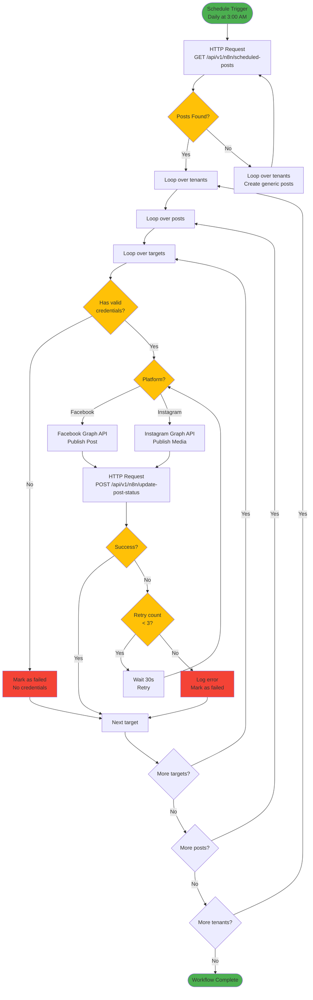

# N8N Social Media Publishing Workflow - Architecture Plan

## Overview
This document describes the architecture for an n8n workflow that automatically publishes scheduled social media posts for multiple tenants on Facebook and Instagram.

## Workflow Requirements
1. **Schedule**: Runs daily at 3:00 AM
2. **Platforms**: Facebook and Instagram (initially)
3. **Features**:
   - Query active tenants with social media credentials
   - Get scheduled posts for current day
   - Publish posts to configured social networks
   - Create generic posts if none exist
   - Retry failed publications (3 attempts)
   - Update post status in database

## Database Schema Reference

### Relevant Tables

#### `tenants`
- `id` - UUID primary key
- `slug` - Unique tenant identifier
- `name` - Tenant name
- `status` - 'active' | 'inactive' | 'suspended'

#### `tenant_channels`
- `id` - UUID primary key
- `tenant_id` - FK to tenants
- `channel` - 'facebook' | 'instagram' | 'linkedin' | 'tiktok' | 'whatsapp_business'
- `enabled` - Boolean
- `limits_per_day` - Integer
- `posting_window` - JSONB { start, end, tz }

#### `channel_accounts`
- `id` - UUID primary key
- `tenant_channel_id` - FK to tenant_channels
- `external_ref` - JSONB { page_id, ig_user_id, linkedin_org_id }
- `label` - Text
- `status` - 'active' | 'revoked'

#### `channel_credentials`
- `id` - UUID primary key
- `account_id` - FK to channel_accounts
- `access_token_enc` - Encrypted access token
- `refresh_token_enc` - Encrypted refresh token
- `expires_at` - Timestamp
- `status` - 'ok' | 'revoked' | 'expired'

#### `social_posts`
- `id` - UUID primary key
- `tenant_id` - FK to tenants
- `title` - VARCHAR(200)
- `base_text` - TEXT (post content)
- `status` - 'draft' | 'scheduled' | 'published' | 'failed' | 'canceled'
- `scheduled_at_utc` - TIMESTAMP
- `timezone` - VARCHAR(100)

#### `social_post_targets`
- `id` - UUID primary key
- `post_id` - FK to social_posts
- `platform` - 'facebook' | 'instagram' | 'linkedin' | 'x' | 'tiktok' | 'gbp' | 'threads'
- `publish_at_utc` - TIMESTAMP
- `status` - 'draft' | 'scheduled' | 'published' | 'failed'
- `variant_text` - TEXT
- `platform_post_id` - VARCHAR(255)
- `asset_ids` - JSONB array of media asset IDs

## API Endpoints Required

### 1. GET `/api/v1/n8n/scheduled-posts`
**Purpose**: Get all scheduled posts for the current day for active tenants with credentials

**Query Parameters**:
- `date` (optional) - Date in YYYY-MM-DD format (defaults to today)

**Response**:
```json
{
  "success": true,
  "data": [
    {
      "tenant": {
        "id": "uuid",
        "slug": "wondernails",
        "name": "Wonder Nails Studio",
        "timezone": "America/Mexico_City"
      },
      "channels": [
        {
          "channel": "facebook",
          "account_id": "uuid",
          "page_id": "123456789",
          "access_token": "decrypted_token",
          "expires_at": "2024-12-31T23:59:59Z"
        },
        {
          "channel": "instagram",
          "account_id": "uuid",
          "ig_user_id": "987654321",
          "access_token": "decrypted_token",
          "expires_at": "2024-12-31T23:59:59Z"
        }
      ],
      "posts": [
        {
          "id": "uuid",
          "title": "Promoción de verano",
          "base_text": "¡Oferta especial de verano!",
          "scheduled_at_utc": "2024-06-15T03:00:00Z",
          "targets": [
            {
              "id": "uuid",
              "platform": "facebook",
              "variant_text": "¡Oferta especial de verano! 🌞",
              "asset_ids": ["uuid1", "uuid2"],
              "media_urls": ["https://...", "https://..."]
            },
            {
              "id": "uuid",
              "platform": "instagram",
              "variant_text": "¡Oferta especial de verano! ✨",
              "asset_ids": ["uuid1"],
              "media_urls": ["https://..."]
            }
          ]
        }
      ]
    }
  ]
}
```

### 2. POST `/api/v1/n8n/update-post-status`
**Purpose**: Update the status of a post target after publication attempt

**Request Body**:
```json
{
  "target_id": "uuid",
  "status": "published" | "failed",
  "platform_post_id": "platform_post_id_or_null",
  "error": "error_message_or_null",
  "published_at": "2024-06-15T03:05:00Z"
}
```

**Response**:
```json
{
  "success": true,
  "data": {
    "id": "uuid",
    "status": "published",
    "platform_post_id": "123456789_987654321",
    "published_at": "2024-06-15T03:05:00Z"
  }
}
```

### 3. POST `/api/v1/n8n/create-generic-post`
**Purpose**: Create a generic post when no scheduled posts exist for a tenant

**Request Body**:
```json
{
  "tenant_id": "uuid",
  "title": "Post automático del día",
  "base_text": "¡Hola! Hoy estamos disponibles para atenderte. 🌟",
  "scheduled_at_utc": "2024-06-15T03:00:00Z",
  "targets": [
    {
      "platform": "facebook",
      "variant_text": "¡Hola! Hoy estamos disponibles para atenderte. 🌟",
      "asset_ids": []
    },
    {
      "platform": "instagram",
      "variant_text": "¡Hola! Hoy estamos disponibles para atenderte. ✨",
      "asset_ids": []
    }
  ]
}
```

**Response**:
```json
{
  "success": true,
  "data": {
    "id": "uuid",
    "tenant_id": "uuid",
    "title": "Post automático del día",
    "base_text": "¡Hola! Hoy estamos disponibles para atenderte. 🌟",
    "status": "scheduled",
    "scheduled_at_utc": "2024-06-15T03:00:00Z",
    "targets": [
      {
        "id": "uuid",
        "platform": "facebook",
        "status": "scheduled",
        "publish_at_utc": "2024-06-15T03:00:00Z"
      },
      {
        "id": "uuid",
        "platform": "instagram",
        "status": "scheduled",
        "publish_at_utc": "2024-06-15T03:00:00Z"
      }
    ]
  }
}
```

## N8N Workflow Architecture

### Workflow Diagram



### Workflow Steps Detail

#### 1. Schedule Trigger
- **Node Type**: Schedule Trigger
- **Configuration**:
  - Cron Expression: `0 3 * * *` (Daily at 3:00 AM)
  - Timezone: `UTC`

#### 2. Get Scheduled Posts
- **Node Type**: HTTP Request
- **Configuration**:
  - Method: `GET`
  - URL: `{{ $env.API_BASE_URL }}/api/v1/n8n/scheduled-posts`
  - Headers:
    - `Content-Type`: `application/json`
    - `Authorization`: `Bearer {{ $env.N8N_API_KEY }}`

#### 3. Check if Posts Exist
- **Node Type**: IF
- **Condition**: Check if `data` array is not empty

#### 4. Create Generic Posts (if no posts)
- **Node Type**: Loop Over Items
- **Configuration**: Loop over tenants from previous response

#### 5. Create Generic Post for Each Tenant
- **Node Type**: HTTP Request
- **Method**: `POST`
- **URL**: `{{ $env.API_BASE_URL }}/api/v1/n8n/create-generic-post`
- **Body**: JSON payload with generic post content

#### 6. Loop Over Tenants
- **Node Type**: Loop Over Items
- **Configuration**: Loop over each tenant's posts

#### 7. Loop Over Posts
- **Node Type**: Loop Over Items
- **Configuration**: Loop over each post's targets

#### 8. Loop Over Targets
- **Node Type**: Loop Over Items
- **Configuration**: Loop over each platform target

#### 9. Check Credentials
- **Node Type**: IF
- **Condition**: Check if credentials exist and are valid

#### 10. Publish to Facebook
- **Node Type**: HTTP Request
- **Method**: `POST`
- **URL**: `https://graph.facebook.com/v18.0/{{ $json.page_id }}/feed`
- **Body**:
  ```json
  {
    "message": "{{ $json.variant_text }}",
    "access_token": "{{ $json.access_token }}",
    "published": true
  }
  ```
- **For media posts**:
  ```json
  {
    "message": "{{ $json.variant_text }}",
    "url": "{{ $json.media_urls[0] }}",
    "access_token": "{{ $json.access_token }}",
    "published": true
  }
  ```

#### 11. Publish to Instagram
- **Node Type**: HTTP Request (Step 1: Create Container)
- **Method**: `POST`
- **URL**: `https://graph.facebook.com/v18.0/{{ $json.ig_user_id }}/media`
- **Body**:
  ```json
  {
    "image_url": "{{ $json.media_urls[0] }}",
    "caption": "{{ $json.variant_text }}",
    "access_token": "{{ $json.access_token }}"
  }
  ```

- **Node Type**: HTTP Request (Step 2: Publish)
- **Method**: `POST`
- **URL**: `https://graph.facebook.com/v18.0/{{ $json.id }}/publish`
- **Body**:
  ```json
  {
    "access_token": "{{ $json.access_token }}"
  }
  ```

#### 12. Update Post Status
- **Node Type**: HTTP Request
- **Method**: `POST`
- **URL**: `{{ $env.API_BASE_URL }}/api/v1/n8n/update-post-status`
- **Body**:
  ```json
  {
    "target_id": "{{ $json.target_id }}",
    "status": "{{ $json.success ? 'published' : 'failed' }}",
    "platform_post_id": "{{ $json.platform_post_id }}",
    "error": "{{ $json.error }}",
    "published_at": "{{ $now().toISO() }}"
  }
  ```

#### 13. Retry Logic
- **Node Type**: IF
- **Condition**: Check if retry count < 3

#### 14. Wait Before Retry
- **Node Type**: Wait
- **Configuration**: 30 seconds

#### 15. Error Handling
- **Node Type**: Error Trigger
- **Configuration**: Catch all errors and log them

## Environment Variables Required

```env
# API Configuration
API_BASE_URL=http://localhost:3001
N8N_API_KEY=your_secure_api_key_here

# Facebook/Instagram App Credentials (optional, for OAuth flows)
FACEBOOK_APP_ID=your_facebook_app_id
FACEBOOK_APP_SECRET=your_facebook_app_secret
```

## Security Considerations

1. **API Key Authentication**: Use a secure API key for n8n to authenticate with your API
2. **Token Encryption**: Store OAuth tokens encrypted in the database
3. **HTTPS**: Use HTTPS for all API calls in production
4. **Rate Limiting**: Implement rate limiting on API endpoints
5. **Audit Logging**: Log all publication attempts in `audit_logs` table

## Testing Plan

1. **Unit Tests**: Test each API endpoint independently
2. **Integration Tests**: Test the complete workflow with mock data
3. **Manual Testing**: Test the workflow in n8n with real Facebook/Instagram accounts
4. **Error Scenarios**: Test retry logic and error handling

## Future Enhancements

1. **Additional Platforms**: Add LinkedIn, TikTok, X/Twitter
2. **AI Content Generation**: Integrate with AI to generate better generic posts
3. **Analytics**: Track engagement metrics from published posts
4. **Scheduling UI**: Allow users to schedule posts through the UI
5. **Media Management**: Improve media upload and management
