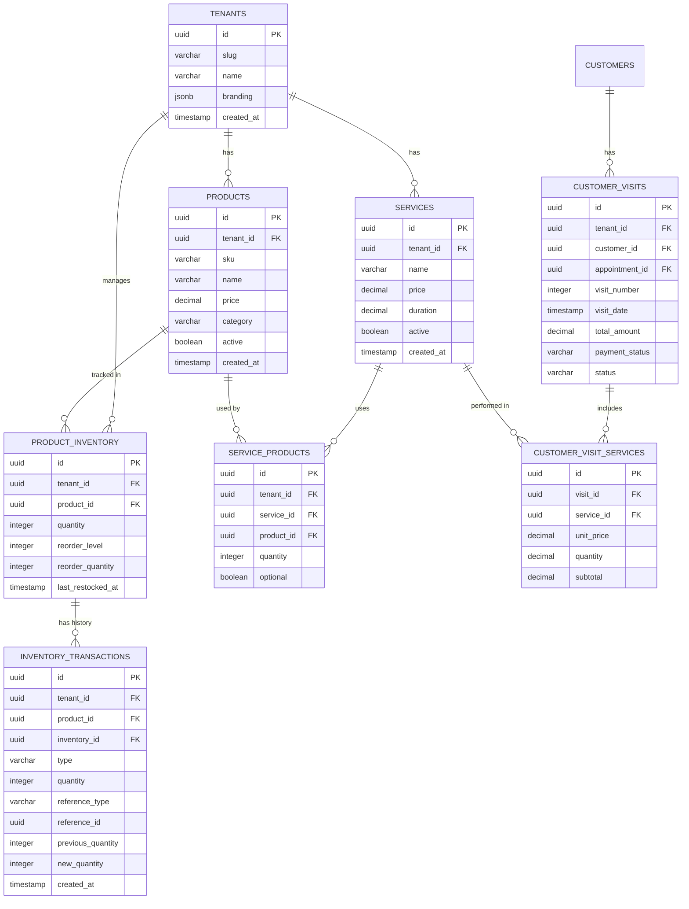
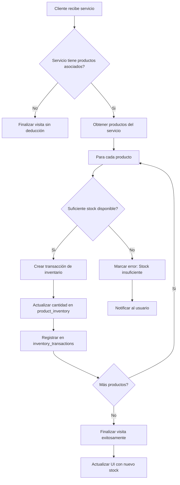

# Plan de Implementación: Conexión Productos-Servicios y Gestión de Inventario

## 📋 Resumen Ejecutivo

Este plan describe la implementación de dos funcionalidades clave para el sistema SASS Store:

1. **Conexión de Productos a Servicios**: Permitir asociar productos opcionales a servicios
2. **Gestión de Inventario**: Sistema completo de control de stock con deducción automática cuando se realizan servicios

## 🎯 Requisitos del Usuario

- Conectar productos a servicios (opcional, no obligatorio)
- Cuando un cliente recibe un servicio con productos asociados, descontar automáticamente la cantidad del inventario
- Implementar sistema de inventario para productos por tenant
- El inventario se forma de los productos asociados a un tenant específico

## 📊 Estado Actual del Sistema

### Tablas Existentes Relevantes

1. **`products`** (líneas 107-145 en [`schema.ts`](../packages/database/schema.ts:107))
   - Campos: id, tenantId, sku, name, description, price, imageUrl, category, featured, active, metadata
   - **FALTA**: No tiene campos de inventario (stock, reorderLevel, etc.)

2. **`services`** (líneas 148-175 en [`schema.ts`](../packages/database/schema.ts:148))
   - Campos: id, tenantId, name, description, price, duration, imageUrl, beforeImage, afterImage, videoUrl, featured, active, metadata
   - **FALTA**: No tiene relación con productos

3. **`customer_visits`** (líneas 1526-1572 en [`schema.ts`](../packages/database/schema.ts:1526))
   - Registra las visitas de clientes
   - Tiene campos para totalAmount, advanceApplied, remainingAmount, paymentStatus

4. **`customer_visit_services`** (líneas 1595-1621 en [`schema.ts`](../packages/database/schema.ts:1595))
   - Registra los servicios realizados en cada visita
   - Campos: visitId, serviceId, description, unitPrice, quantity, subtotal
   - **FALTA**: No registra productos consumidos del inventario

### Funcionalidad Existente

- Sistema de carrito con validación de stock ([`cart-store.ts`](../apps/web/lib/cart/cart-store.ts:1))
- Endpoints de finanzas que manejan cantidades de productos
- No existe gestión de inventario dedicada

## 🏗️ Diseño de la Solución

### 1. Esquema de Base de Datos

#### 1.1 Tabla: `product_inventory`

Gestiona el stock de productos por tenant.

```sql
CREATE TABLE IF NOT EXISTS "product_inventory" (
  "id" uuid PRIMARY KEY DEFAULT gen_random_uuid(),
  "tenant_id" uuid NOT NULL REFERENCES "tenants"("id") ON DELETE CASCADE,
  "product_id" uuid NOT NULL REFERENCES "products"("id") ON DELETE CASCADE,
  "quantity" integer NOT NULL DEFAULT 0,
  "reorder_level" integer DEFAULT 10, -- Nivel de reordenamiento
  "reorder_quantity" integer DEFAULT 50, -- Cantidad a reordenar
  "last_restocked_at" timestamp,
  "metadata" jsonb DEFAULT '{}',
  "created_at" timestamp DEFAULT now(),
  "updated_at" timestamp DEFAULT now(),
  UNIQUE("tenant_id", "product_id")
);
```

**Índices:**

```sql
CREATE INDEX "product_inventory_tenant_idx" ON "product_inventory"("tenant_id");
CREATE INDEX "product_inventory_product_idx" ON "product_inventory"("product_id");
CREATE INDEX "product_inventory_low_stock_idx" ON "product_inventory"("tenant_id", "quantity")
  WHERE "quantity" <= "reorder_level";
```

#### 1.2 Tabla: `service_products`

Relación muchos-a-muchos entre servicios y productos.

```sql
CREATE TABLE IF NOT EXISTS "service_products" (
  "id" uuid PRIMARY KEY DEFAULT gen_random_uuid(),
  "tenant_id" uuid NOT NULL REFERENCES "tenants"("id") ON DELETE CASCADE,
  "service_id" uuid NOT NULL REFERENCES "services"("id") ON DELETE CASCADE,
  "product_id" uuid NOT NULL REFERENCES "products"("id") ON DELETE CASCADE,
  "quantity" integer NOT NULL DEFAULT 1, -- Cantidad del producto requerida por el servicio
  "optional" boolean DEFAULT false, -- Si el producto es opcional en el servicio
  "metadata" jsonb DEFAULT '{}',
  "created_at" timestamp DEFAULT now(),
  "updated_at" timestamp DEFAULT now(),
  UNIQUE("service_id", "product_id")
);
```

**Índices:**

```sql
CREATE INDEX "service_products_tenant_idx" ON "service_products"("tenant_id");
CREATE INDEX "service_products_service_idx" ON "service_products"("service_id");
CREATE INDEX "service_products_product_idx" ON "service_products"("product_id");
```

#### 1.3 Tabla: `inventory_transactions`

Historial de movimientos de inventario para auditoría.

```sql
CREATE TABLE IF NOT EXISTS "inventory_transactions" (
  "id" uuid PRIMARY KEY DEFAULT gen_random_uuid(),
  "tenant_id" uuid NOT NULL REFERENCES "tenants"("id") ON DELETE CASCADE,
  "product_id" uuid NOT NULL REFERENCES "products"("id") ON DELETE CASCADE,
  "inventory_id" uuid NOT NULL REFERENCES "product_inventory"("id") ON DELETE CASCADE,
  "type" varchar(20) NOT NULL, -- 'in', 'out', 'adjustment', 'return'
  "quantity" integer NOT NULL, -- Cantidad (positiva o negativa)
  "reference_type" varchar(50), -- 'service', 'booking', 'manual', 'restock'
  "reference_id" uuid, -- ID de la entidad relacionada
  "previous_quantity" integer NOT NULL,
  "new_quantity" integer NOT NULL,
  "notes" text,
  "performed_by" text, -- ID del usuario que realizó la acción
  "metadata" jsonb DEFAULT '{}',
  "created_at" timestamp DEFAULT now()
);
```

**Índices:**

```sql
CREATE INDEX "inventory_transactions_tenant_idx" ON "inventory_transactions"("tenant_id");
CREATE INDEX "inventory_transactions_product_idx" ON "inventory_transactions"("product_id");
CREATE INDEX "inventory_transactions_type_idx" ON "inventory_transactions"("type");
CREATE INDEX "inventory_transactions_created_idx" ON "inventory_transactions"("created_at");
CREATE INDEX "inventory_transactions_reference_idx" ON "inventory_transactions"("reference_type", "reference_id");
```

### 2. Diagrama de Entidades



### 3. Diagrama de Flujo: Deducción de Inventario



### 4. API Endpoints

#### 4.1 Gestión de Inventario

**GET `/api/inventory`**

- Obtener inventario del tenant actual
- Query params: `lowStockOnly` (boolean), `category` (string)
- Respuesta: Array de productos con stock

**GET `/api/inventory/products/:productId`**

- Obtener detalles de inventario de un producto específico
- Respuesta: Detalles del producto + stock actual + historial de transacciones

**POST `/api/inventory/products/:productId/adjust`**

- Ajustar stock manualmente
- Body: `{ quantity: number, type: 'in' | 'out' | 'adjustment', notes: string }`
- Respuesta: Nuevo stock + transacción creada

**POST `/api/inventory/restock`**

- Reabastecer múltiples productos
- Body: `{ items: [{ productId, quantity, notes }] }`
- Respuesta: Resultados de la operación

**GET `/api/inventory/transactions`**

- Obtener historial de transacciones
- Query params: `productId`, `type`, `startDate`, `endDate`, `page`, `limit`
- Respuesta: Paginado de transacciones

**GET `/api/inventory/low-stock`**

- Obtener productos con stock bajo (quantity <= reorder_level)
- Respuesta: Array de productos que necesitan reabastecimiento

#### 4.2 Conexión Productos-Servicios

**GET `/api/services/:serviceId/products`**

- Obtener productos asociados a un servicio
- Respuesta: Array de productos con cantidades requeridas

**POST `/api/services/:serviceId/products`**

- Agregar producto a un servicio
- Body: `{ productId, quantity, optional }`
- Respuesta: Producto asociado creado

**PUT `/api/services/:serviceId/products/:productId`**

- Actualizar relación producto-servicio
- Body: `{ quantity, optional }`
- Respuesta: Relación actualizada

**DELETE `/api/services/:serviceId/products/:productId`**

- Eliminar producto de un servicio
- Respuesta: Confirmación de eliminación

#### 4.3 Integración con Visitas

**POST `/api/visits/:visitId/complete`**

- Completar visita y deducir inventario automáticamente
- Lógica:
  1. Obtener servicios de la visita
  2. Para cada servicio, obtener productos asociados
  3. Para cada producto, verificar y deducir stock
  4. Crear transacciones de inventario
  5. Actualizar estado de la visita
- Respuesta: Visita completada con resumen de deducciones

**GET `/api/visits/:visitId/inventory-impact`**

- Previsualizar impacto en inventario antes de completar visita
- Respuesta: Lista de productos que serán deducidos y stock resultante

### 5. Componentes de UI

#### 5.1 Página de Inventario

**Ruta**: `/t/[tenant]/inventory`

**Componentes**:

1. **InventoryDashboard**
   - KPIs: Total productos, valor del inventario, productos con stock bajo
   - Gráfico de tendencia de stock
   - Alertas de reabastecimiento

2. **InventoryTable**
   - Tabla con: SKU, Nombre, Categoría, Stock Actual, Nivel de Reorden, Valor Total
   - Filtros: Categoría, Stock Bajo
   - Acciones: Ajustar Stock, Ver Historial, Editar Producto

3. **InventoryAdjustmentModal**
   - Modal para ajustar stock manualmente
   - Campos: Tipo de ajuste, Cantidad, Notas
   - Validación: Stock no puede ser negativo

4. **TransactionHistory**
   - Historial de movimientos de inventario
   - Filtros: Tipo de transacción, Producto, Fecha
   - Exportable a CSV

#### 5.2 Edición de Servicios con Productos

**Ruta**: `/t/[tenant]/admin_services/[serviceId]`

**Componentes**:

1. **ServiceProductSelector**
   - Selector de productos para asociar al servicio
   - Buscador con filtros por categoría
   - Muestra stock actual del producto

2. **ServiceProductList**
   - Lista de productos asociados al servicio
   - Para cada producto: Nombre, Cantidad requerida, Opcional
   - Acciones: Editar cantidad, Eliminar

3. **ProductStockWarning**
   - Alerta cuando stock es insuficiente para el servicio
   - Muestra stock actual vs requerido

#### 5.3 Vista de Visita con Impacto de Inventario

**Ruta**: `/t/[tenant]/visits/[visitId]`

**Componentes**:

1. **VisitInventoryImpact**
   - Previsualización de deducciones de inventario
   - Lista de productos que serán consumidos
   - Indicador de stock insuficiente (si aplica)

2. **StockValidationBanner**
   - Banner de advertencia si hay productos con stock insuficiente
   - Opción de continuar o ajustar stock antes de completar

### 6. Hooks y Servicios

#### 6.1 Hooks Personalizados

**`useInventory`**

```typescript
interface UseInventoryReturn {
  inventory: InventoryItem[];
  lowStockItems: InventoryItem[];
  loading: boolean;
  error: Error | null;
  adjustStock: (
    productId: string,
    quantity: number,
    type: "in" | "out" | "adjustment",
    notes?: string,
  ) => Promise<void>;
  restock: (items: RestockItem[]) => Promise<void>;
  getTransactions: (filters?: TransactionFilters) => Promise<Transaction[]>;
}

export function useInventory(tenantId: string): UseInventoryReturn;
```

**`useServiceProducts`**

```typescript
interface UseServiceProductsReturn {
  products: ServiceProduct[];
  loading: boolean;
  error: Error | null;
  addProduct: (
    productId: string,
    quantity: number,
    optional?: boolean,
  ) => Promise<void>;
  updateProduct: (
    productId: string,
    quantity: number,
    optional?: boolean,
  ) => Promise<void>;
  removeProduct: (productId: string) => Promise<void>;
  loadProducts: (serviceId: string) => Promise<void>;
}

export function useServiceProducts(serviceId: string): UseServiceProductsReturn;
```

#### 6.2 Servicios de Backend

**`InventoryService`**

```typescript
class InventoryService {
  // Obtener inventario del tenant
  static async getTenantInventory(
    tenantId: string,
    filters?: InventoryFilters,
  ): Promise<InventoryItem[]>;

  // Ajustar stock de un producto
  static async adjustStock(
    tenantId: string,
    productId: string,
    adjustment: StockAdjustment,
  ): Promise<InventoryTransaction>;

  // Reabastecer múltiples productos
  static async restock(
    tenantId: string,
    items: RestockItem[],
  ): Promise<RestockResult[]>;

  // Obtener productos con stock bajo
  static async getLowStockProducts(tenantId: string): Promise<InventoryItem[]>;

  // Obtener historial de transacciones
  static async getTransactions(
    tenantId: string,
    filters?: TransactionFilters,
  ): Promise<InventoryTransaction[]>;

  // Verificar stock disponible
  static async checkAvailability(
    tenantId: string,
    productId: string,
    quantity: number,
  ): Promise<boolean>;

  // Deduct stock cuando se completa un servicio
  static async deductForService(
    tenantId: string,
    serviceId: string,
    visitId: string,
  ): Promise<DeductionResult>;
}
```

**`ServiceProductsService`**

```typescript
class ServiceProductsService {
  // Obtener productos de un servicio
  static async getServiceProducts(serviceId: string): Promise<ServiceProduct[]>;

  // Agregar producto a servicio
  static async addProductToService(
    serviceId: string,
    product: ServiceProductInput,
  ): Promise<ServiceProduct>;

  // Actualizar producto en servicio
  static async updateServiceProduct(
    serviceId: string,
    productId: string,
    updates: ServiceProductUpdate,
  ): Promise<ServiceProduct>;

  // Eliminar producto de servicio
  static async removeProductFromService(
    serviceId: string,
    productId: string,
  ): Promise<void>;

  // Obtener impacto en inventario de un servicio
  static async getInventoryImpact(
    serviceId: string,
    quantity: number = 1,
  ): Promise<InventoryImpact[]>;
}
```

### 7. Lógica de Negocio Crítica

#### 7.1 Validación de Stock Antes de Servicio

```typescript
async function validateStockForService(
  tenantId: string,
  serviceId: string,
  serviceQuantity: number = 1,
): Promise<ValidationResult> {
  // 1. Obtener productos asociados al servicio
  const serviceProducts =
    await ServiceProductsService.getServiceProducts(serviceId);

  // 2. Para cada producto, verificar stock disponible
  const validationResults = await Promise.all(
    serviceProducts.map(async (sp) => {
      const inventory = await InventoryService.getProductInventory(
        tenantId,
        sp.productId,
      );
      const requiredQuantity = sp.quantity * serviceQuantity;

      return {
        productId: sp.productId,
        productName: sp.product.name,
        requiredQuantity,
        availableQuantity: inventory.quantity,
        isValid: inventory.quantity >= requiredQuantity,
        shortage: Math.max(0, requiredQuantity - inventory.quantity),
      };
    }),
  );

  // 3. Retornar resultado global
  const allValid = validationResults.every((r) => r.isValid);

  return {
    isValid: allValid,
    validations: validationResults,
    errors: allValid ? [] : validationResults.filter((r) => !r.isValid),
  };
}
```

#### 7.2 Deducción de Inventario con Transaccionalidad

```typescript
async function deductInventoryForVisit(
  tenantId: string,
  visitId: string,
): Promise<DeductionResult> {
  return await db.transaction(async (tx) => {
    try {
      // 1. Obtener la visita y sus servicios
      const visit = await tx.query.customerVisits.findFirst({
        where: eq(customerVisits.id, visitId),
      });

      const visitServices = await tx.query.customerVisitServices.findMany({
        where: eq(customerVisitServices.visitId, visitId),
        with: { service: true },
      });

      // 2. Para cada servicio, obtener productos y deducir
      const deductions = [];
      const errors = [];

      for (const vs of visitServices) {
        const serviceProducts = await tx.query.serviceProducts.findMany({
          where: eq(serviceProducts.serviceId, vs.serviceId),
          with: { product: true },
        });

        for (const sp of serviceProducts) {
          // Obtener inventario actual
          const inventory = await tx.query.productInventory.findFirst({
            where: and(
              eq(productInventory.tenantId, tenantId),
              eq(productInventory.productId, sp.productId),
            ),
          });

          const requiredQuantity = sp.quantity * vs.quantity;

          if (!inventory || inventory.quantity < requiredQuantity) {
            errors.push({
              productId: sp.productId,
              productName: sp.product.name,
              required: requiredQuantity,
              available: inventory?.quantity || 0,
            });
            continue;
          }

          // Crear transacción de inventario
          const transaction = await tx
            .insert(inventoryTransactions)
            .values({
              tenantId,
              productId: sp.productId,
              inventoryId: inventory.id,
              type: "out",
              quantity: -requiredQuantity,
              referenceType: "service",
              referenceId: visitId,
              previousQuantity: inventory.quantity,
              newQuantity: inventory.quantity - requiredQuantity,
              performedBy: "system",
            })
            .returning();

          // Actualizar inventario
          await tx
            .update(productInventory)
            .set({
              quantity: inventory.quantity - requiredQuantity,
              updatedAt: new Date(),
            })
            .where(eq(productInventory.id, inventory.id));

          deductions.push({
            productId: sp.productId,
            productName: sp.product.name,
            quantityDeducted: requiredQuantity,
            previousStock: inventory.quantity,
            newStock: inventory.quantity - requiredQuantity,
          });
        }
      }

      // 3. Si hay errores, hacer rollback
      if (errors.length > 0) {
        throw new InventoryInsufficientError(errors);
      }

      // 4. Actualizar estado de la visita
      await tx
        .update(customerVisits)
        .set({
          status: "completed",
          updatedAt: new Date(),
        })
        .where(eq(customerVisits.id, visitId));

      return {
        success: true,
        deductions,
        errors: [],
      };
    } catch (error) {
      // La transacción se hace rollback automáticamente
      throw error;
    }
  });
}
```

### 8. Migraciones de Base de Datos

#### 8.1 Archivo de Migración

**Ruta**: `packages/database/migrations/YYYYMMDD_service_products_and_inventory.sql`

```sql
-- ============================================================
-- Migración: Productos-Servicios y Gestión de Inventario
-- ============================================================

-- 1. Crear tabla product_inventory
CREATE TABLE IF NOT EXISTS "product_inventory" (
  "id" uuid PRIMARY KEY DEFAULT gen_random_uuid(),
  "tenant_id" uuid NOT NULL REFERENCES "tenants"("id") ON DELETE CASCADE,
  "product_id" uuid NOT NULL REFERENCES "products"("id") ON DELETE CASCADE,
  "quantity" integer NOT NULL DEFAULT 0,
  "reorder_level" integer DEFAULT 10,
  "reorder_quantity" integer DEFAULT 50,
  "last_restocked_at" timestamp,
  "metadata" jsonb DEFAULT '{}',
  "created_at" timestamp DEFAULT now(),
  "updated_at" timestamp DEFAULT now(),
  CONSTRAINT "product_inventory_tenant_product_unique" UNIQUE("tenant_id", "product_id")
);

-- 2. Crear índices para product_inventory
CREATE INDEX IF NOT EXISTS "product_inventory_tenant_idx" ON "product_inventory"("tenant_id");
CREATE INDEX IF NOT EXISTS "product_inventory_product_idx" ON "product_inventory"("product_id");
CREATE INDEX IF NOT EXISTS "product_inventory_low_stock_idx" ON "product_inventory"("tenant_id", "quantity")
  WHERE "quantity" <= "reorder_level";

-- 3. Crear tabla service_products
CREATE TABLE IF NOT EXISTS "service_products" (
  "id" uuid PRIMARY KEY DEFAULT gen_random_uuid(),
  "tenant_id" uuid NOT NULL REFERENCES "tenants"("id") ON DELETE CASCADE,
  "service_id" uuid NOT NULL REFERENCES "services"("id") ON DELETE CASCADE,
  "product_id" uuid NOT NULL REFERENCES "products"("id") ON DELETE CASCADE,
  "quantity" integer NOT NULL DEFAULT 1,
  "optional" boolean DEFAULT false,
  "metadata" jsonb DEFAULT '{}',
  "created_at" timestamp DEFAULT now(),
  "updated_at" timestamp DEFAULT now(),
  CONSTRAINT "service_products_service_product_unique" UNIQUE("service_id", "product_id")
);

-- 4. Crear índices para service_products
CREATE INDEX IF NOT EXISTS "service_products_tenant_idx" ON "service_products"("tenant_id");
CREATE INDEX IF NOT EXISTS "service_products_service_idx" ON "service_products"("service_id");
CREATE INDEX IF NOT EXISTS "service_products_product_idx" ON "service_products"("product_id");

-- 5. Crear tabla inventory_transactions
CREATE TABLE IF NOT EXISTS "inventory_transactions" (
  "id" uuid PRIMARY KEY DEFAULT gen_random_uuid(),
  "tenant_id" uuid NOT NULL REFERENCES "tenants"("id") ON DELETE CASCADE,
  "product_id" uuid NOT NULL REFERENCES "products"("id") ON DELETE CASCADE,
  "inventory_id" uuid NOT NULL REFERENCES "product_inventory"("id") ON DELETE CASCADE,
  "type" varchar(20) NOT NULL CHECK ("type" IN ('in', 'out', 'adjustment', 'return')),
  "quantity" integer NOT NULL,
  "reference_type" varchar(50),
  "reference_id" uuid,
  "previous_quantity" integer NOT NULL,
  "new_quantity" integer NOT NULL,
  "notes" text,
  "performed_by" text,
  "metadata" jsonb DEFAULT '{}',
  "created_at" timestamp DEFAULT now()
);

-- 6. Crear índices para inventory_transactions
CREATE INDEX IF NOT EXISTS "inventory_transactions_tenant_idx" ON "inventory_transactions"("tenant_id");
CREATE INDEX IF NOT EXISTS "inventory_transactions_product_idx" ON "inventory_transactions"("product_id");
CREATE INDEX IF NOT EXISTS "inventory_transactions_type_idx" ON "inventory_transactions"("type");
CREATE INDEX IF NOT EXISTS "inventory_transactions_created_idx" ON "inventory_transactions"("created_at");
CREATE INDEX IF NOT EXISTS "inventory_transactions_reference_idx" ON "inventory_transactions"("reference_type", "reference_id");

-- 7. Crear inventario inicial para productos existentes
INSERT INTO "product_inventory" ("tenant_id", "product_id", "quantity", "reorder_level", "reorder_quantity", "created_at", "updated_at")
SELECT
  "tenant_id",
  "id" as "product_id",
  0 as "quantity",
  10 as "reorder_level",
  50 as "reorder_quantity",
  now() as "created_at",
  now() as "updated_at"
FROM "products"
ON CONFLICT ("tenant_id", "product_id") DO NOTHING;

-- 8. Crear políticas RLS (Row Level Security)
ALTER TABLE "product_inventory" ENABLE ROW LEVEL SECURITY;
ALTER TABLE "service_products" ENABLE ROW LEVEL SECURITY;
ALTER TABLE "inventory_transactions" ENABLE ROW LEVEL SECURITY;

-- Política para product_inventory: Solo ver inventario del propio tenant
CREATE POLICY "product_inventory_tenant_policy" ON "product_inventory"
  FOR ALL
  USING ("tenant_id" = current_setting('app.current_tenant_id', '')::uuid)
  WITH CHECK ("tenant_id" = current_setting('app.current_tenant_id', '')::uuid);

-- Política para service_products: Solo ver productos del propio tenant
CREATE POLICY "service_products_tenant_policy" ON "service_products"
  FOR ALL
  USING ("tenant_id" = current_setting('app.current_tenant_id', '')::uuid)
  WITH CHECK ("tenant_id" = current_setting('app.current_tenant_id', '')::uuid);

-- Política para inventory_transactions: Solo ver transacciones del propio tenant
CREATE POLICY "inventory_transactions_tenant_policy" ON "inventory_transactions"
  FOR ALL
  USING ("tenant_id" = current_setting('app.current_tenant_id', '')::uuid)
  WITH CHECK ("tenant_id" = current_setting('app.current_tenant_id', '')::uuid);
```

### 9. Plan de Implementación por Fases

#### Fase 1: Infraestructura de Base de Datos (1-2 días)

- [ ] Crear archivo de migración con nuevas tablas
- [ ] Actualizar [`schema.ts`](../packages/database/schema.ts:1) con nuevas tablas
- [ ] Agregar relaciones en Drizzle ORM
- [ ] Ejecutar migración en ambiente de desarrollo
- [ ] Verificar integridad de datos

#### Fase 2: API Backend (2-3 días)

- [ ] Crear `InventoryService` con métodos CRUD
- [ ] Crear `ServiceProductsService` con métodos CRUD
- [ ] Implementar endpoints de inventario
  - [ ] GET `/api/inventory`
  - [ ] GET `/api/inventory/products/:productId`
  - [ ] POST `/api/inventory/products/:productId/adjust`
  - [ ] POST `/api/inventory/restock`
  - [ ] GET `/api/inventory/transactions`
  - [ ] GET `/api/inventory/low-stock`
- [ ] Implementar endpoints de productos-servicios
  - [ ] GET `/api/services/:serviceId/products`
  - [ ] POST `/api/services/:serviceId/products`
  - [ ] PUT `/api/services/:serviceId/products/:productId`
  - [ ] DELETE `/api/services/:serviceId/products/:productId`
- [ ] Implementar integración con visitas
  - [ ] POST `/api/visits/:visitId/complete`
  - [ ] GET `/api/visits/:visitId/inventory-impact`
- [ ] Agregar validaciones y manejo de errores
- [ ] Escribir tests unitarios

#### Fase 3: Frontend - Hooks y Servicios (1-2 días)

- [ ] Crear hook `useInventory`
- [ ] Crear hook `useServiceProducts`
- [ ] Crear servicio `InventoryService` en frontend
- [ ] Crear servicio `ServiceProductsService` en frontend
- [ ] Integrar con sistema de autenticación
- [ ] Escribir tests de componentes

#### Fase 4: Frontend - UI Components (3-4 días)

- [ ] Crear página `/t/[tenant]/inventory`
  - [ ] Componente `InventoryDashboard`
  - [ ] Componente `InventoryTable`
  - [ ] Componente `InventoryAdjustmentModal`
  - [ ] Componente `TransactionHistory`
- [ ] Actualizar página de edición de servicios
  - [ ] Componente `ServiceProductSelector`
  - [ ] Componente `ServiceProductList`
  - [ ] Componente `ProductStockWarning`
- [ ] Actualizar vista de visitas
  - [ ] Componente `VisitInventoryImpact`
  - [ ] Componente `StockValidationBanner`
- [ ] Agregar navegación en sidebar
- [ ] Implementar diseño responsive
- [ ] Escribir tests E2E con Playwright

#### Fase 5: Integración y Testing (2-3 días)

- [ ] Probar flujo completo: Crear servicio con productos → Realizar visita → Ver deducción de inventario
- [ ] Probar validación de stock insuficiente
- [ ] Probar ajustes manuales de inventario
- [ ] Probar reabastecimiento de productos
- [ ] Probar historial de transacciones
- [ ] Probar alertas de stock bajo
- [ ] Corregir bugs encontrados
- [ ] Optimizar rendimiento de consultas
- [ ] Documentar API endpoints

#### Fase 6: Deployment y Monitoreo (1 día)

- [ ] Preparar migración para producción
- [ ] Crear backup de base de datos antes de migrar
- [ ] Ejecutar migración en staging
- [ ] Verificar funcionalidad en staging
- [ ] Deploy a producción
- [ ] Monitorear logs y errores
- [ ] Crear documentación para usuarios

### 10. Consideraciones Técnicas

#### 10.1 Transaccionalidad

- Usar transacciones de base de datos para asegurar consistencia
- Implementar rollback automático en caso de error
- Manejar concurrencia con locks a nivel de fila

#### 10.2 Performance

- Crear índices compuestos para consultas frecuentes
- Implementar caching para consultas de inventario
- Usar paginación para listados grandes
- Optimizar consultas con joins

#### 10.3 Seguridad

- Implementar RLS (Row Level Security) para todas las nuevas tablas
- Validar tenant_id en todas las operaciones
- Sanitizar inputs de usuario
- Implementar rate limiting en endpoints críticos

#### 10.4 Auditoría

- Registrar todas las operaciones de inventario
- Incluir usuario que realizó la acción
- Mantener historial completo de transacciones
- Permitir exportar historial

#### 10.5 Experiencia de Usuario

- Mostrar alertas visuales de stock bajo
- Permitir previsualizar impacto antes de completar visita
- Proporcionar mensajes de error claros
- Implementar confirmación para acciones destructivas
- Soportar undo para ajustes recientes

### 11. Casos de Uso

#### Caso 1: Asociar Productos a un Servicio

1. Usuario navega a página de edición de servicio
2. Hace clic en "Agregar Producto"
3. Busca y selecciona producto de lista
4. Especifica cantidad requerida (default: 1)
5. Marca como opcional o requerido
6. Guarda cambios
7. Sistema valida y guarda relación

#### Caso 2: Completar Visita con Deducción de Inventario

1. Usuario completa servicio para cliente
2. Sistema verifica productos asociados al servicio
3. Para cada producto, verifica stock disponible
4. Si stock suficiente, deduce cantidad automáticamente
5. Si stock insuficiente, muestra alerta y bloquea acción
6. Usuario puede ajustar stock o continuar sin productos
7. Sistema crea transacciones de inventario
8. UI muestra resumen de deducciones

#### Caso 3: Ajuste Manual de Inventario

1. Usuario navega a página de inventario
2. Encuentra producto con stock incorrecto
3. Hace clic en "Ajustar Stock"
4. Selecciona tipo: Entrada/Salida/Ajuste
5. Ingresa cantidad y notas
6. Confirma acción
7. Sistema actualiza stock y crea transacción
8. Historial muestra nuevo movimiento

#### Caso 4: Alerta de Stock Bajo

1. Sistema detecta producto con stock <= reorder_level
2. Muestra alerta en dashboard de inventario
3. Usuario puede ver lista de productos a reabastecer
4. Puede crear orden de reabastecimiento
5. Al recibir productos, actualiza stock

### 12. Métricas de Éxito

- [ ] Todos los endpoints de API funcionan correctamente
- [ ] Las deducciones de inventario son precisas
- [ ] No hay condiciones de carrera en operaciones concurrentes
- [ ] El historial de transacciones es completo
- [ ] Las alertas de stock bajo funcionan
- [ ] La UI es intuitiva y responsive
- [ ] Los tests cubren >= 80% del código
- [ ] El rendimiento es aceptable (< 500ms para operaciones comunes)
- [ ] La documentación es completa y clara

### 13. Riesgos y Mitigaciones

#### Riesgo 1: Condiciones de Carrera en Inventario

**Descripción**: Múltiples usuarios intentando deducir el mismo producto simultáneamente
**Mitigación**:

- Usar transacciones con locks a nivel de fila
- Implementar retry logic con exponential backoff
- Validar stock después de transacción

#### Riesgo 2: Stock Negativo

**Descripción**: Deducciones pueden llevar stock a valores negativos
**Mitigación**:

- Validar stock antes de deducir
- Usar constraint CHECK en base de datos
- Implementar lógica de compensación

#### Riesgo 3: Performance con Muchos Productos

**Descripción**: Consultas de inventario pueden ser lentas con miles de productos
**Mitigación**:

- Implementar paginación
- Usar índices apropiados
- Cachear resultados frecuentes
- Considerar particionamiento por tenant

#### Riesgo 4: Datos Inconsistentes

**Descripción**: Errores pueden dejar inventario en estado inconsistente
**Mitigación**:

- Usar transacciones ACID
- Implementar validaciones post-transacción
- Crear jobs de reconciliación nocturnos
- Mantener logs detallados

### 14. Funcionalidades Avanzadas: Reportes y Alertas Automáticas

#### 14.1 Sistema de Reportes de Inventario

**GET `/api/inventory/reports`**

- Endpoint principal para obtener reportes de inventario
- Query params: `type` (string), `startDate`, `endDate`, `category`, `format` (json/csv)

**Tipos de Reportes Disponibles**:

1. **Reporte de Rotación de Productos** (`type=turnover`)
   - Mide qué tan rápido se venden los productos
   - Métricas: Días de inventario, rotación por categoría, productos de lento movimiento
   - Fórmula: Días de Inventario = (Stock Promedio / Ventas Diarias) × 365
   - SQL:
     ```sql
     SELECT
       p.name,
       p.category,
       p.sku,
       pi.quantity as current_stock,
       COALESCE(SUM(oi.quantity), 0) as total_sold,
       COALESCE(SUM(oi.total_price), 0) as total_revenue,
       CASE
         WHEN COALESCE(SUM(oi.quantity), 0) > 0
         THEN (pi.quantity / COALESCE(SUM(oi.quantity), 0)) * 365
         ELSE NULL
       END as inventory_days
     FROM products p
     LEFT JOIN product_inventory pi ON p.id = pi.product_id
     LEFT JOIN order_items oi ON p.id = oi.product_id
     WHERE p.tenant_id = $1
       AND oi.created_at >= $2
       AND oi.created_at <= $3
     GROUP BY p.id, p.name, p.category, p.sku, pi.quantity
     ORDER BY inventory_days ASC NULLS LAST
     ```

2. **Reporte de Productos Más Vendidos** (`type=top-selling`)
   - Ranking de productos por cantidad vendida y revenue
   - Métricas: Cantidad vendida, Revenue total, Margen de ganancia
   - Filtros: Por período, por categoría, top N
   - SQL:
     ```sql
     SELECT
       p.name,
       p.sku,
       p.category,
       COUNT(oi.id) as order_count,
       SUM(oi.quantity) as total_quantity,
       SUM(oi.total_price) as total_revenue,
       AVG(oi.total_price) as avg_order_value
     FROM products p
     LEFT JOIN order_items oi ON p.id = oi.product_id
     WHERE p.tenant_id = $1
       AND oi.created_at >= $2
       AND oi.created_at <= $3
     GROUP BY p.id, p.name, p.sku, p.category
     ORDER BY total_revenue DESC
     LIMIT $4
     ```

3. **Reporte de Valor de Inventario** (`type=inventory-value`)
   - Valor total del inventario actual
   - Desglose por categoría y por producto
   - Métricas: Valor total, costo promedio, valor por categoría
   - SQL:
     ```sql
     SELECT
       p.category,
       COUNT(p.id) as product_count,
       SUM(pi.quantity) as total_units,
       SUM(pi.quantity * p.price) as total_value,
       AVG(p.price) as avg_price
     FROM products p
     JOIN product_inventory pi ON p.id = pi.product_id
     WHERE p.tenant_id = $1
       AND p.active = true
     GROUP BY p.category
     ORDER BY total_value DESC
     ```

4. **Reporte de Pérdidas y Mermas** (`type=shrinkage`)
   - Diferencias entre stock esperado y stock real
   - Métricas: Porcentaje de merma, valor de pérdidas, productos con mayor merma
   - SQL:
     ```sql
     SELECT
       p.name,
       p.sku,
       pi.quantity as current_stock,
       pi.reorder_quantity as expected_stock,
       (pi.reorder_quantity - pi.quantity) as shrinkage,
       CASE
         WHEN pi.reorder_quantity > 0
         THEN ((pi.reorder_quantity - pi.quantity) / pi.reorder_quantity) * 100
         ELSE 0
       END as shrinkage_percentage,
       (pi.reorder_quantity - pi.quantity) * p.price as loss_value
     FROM products p
     JOIN product_inventory pi ON p.id = pi.product_id
     WHERE p.tenant_id = $1
       AND pi.quantity < pi.reorder_quantity
     ORDER BY loss_value DESC
     ```

5. **Reporte de Movimientos por Producto** (`type=product-movements`)
   - Historial detallado de movimientos de un producto específico
   - Incluye todas las transacciones con filtros
   - Exportable a CSV/Excel

6. **Reporte de Stock por Ubicación** (`type=stock-by-location`)
   - Si se implementa soporte multi-ubicación
   - Desglose de stock por cada ubicación/almacén
   - Identifica productos sobreabastecidos o faltantes en ubicaciones específicas

#### 14.2 Sistema de Alertas Automáticas

**Nueva Tabla: `inventory_alerts`**

```sql
CREATE TABLE IF NOT EXISTS "inventory_alerts" (
  "id" uuid PRIMARY KEY DEFAULT gen_random_uuid(),
  "tenant_id" uuid NOT NULL REFERENCES "tenants"("id") ON DELETE CASCADE,
  "product_id" uuid NOT NULL REFERENCES "products"("id") ON DELETE CASCADE,
  "inventory_id" uuid NOT NULL REFERENCES "product_inventory"("id") ON DELETE CASCADE,
  "alert_type" varchar(50) NOT NULL, -- 'low_stock', 'out_of_stock', 'overstock', 'expiration_warning'
  "severity" varchar(20) NOT NULL, -- 'info', 'warning', 'critical', 'error'
  "current_quantity" integer NOT NULL,
  "threshold" integer NOT NULL,
  "message" text NOT NULL,
  "is_read" boolean DEFAULT false,
  "is_resolved" boolean DEFAULT false,
  "resolved_at" timestamp,
  "resolved_by" text,
  "resolution_notes" text,
  "metadata" jsonb DEFAULT '{}',
  "created_at" timestamp DEFAULT now()
);

-- Índices para inventory_alerts
CREATE INDEX IF NOT EXISTS "inventory_alerts_tenant_idx" ON "inventory_alerts"("tenant_id");
CREATE INDEX IF NOT EXISTS "inventory_alerts_product_idx" ON "inventory_alerts"("product_id");
CREATE INDEX IF NOT EXISTS "inventory_alerts_type_idx" ON "inventory_alerts"("alert_type");
CREATE INDEX IF NOT EXISTS "inventory_alerts_severity_idx" ON "inventory_alerts"("severity");
CREATE INDEX IF NOT EXISTS "inventory_alerts_unread_idx" ON "inventory_alerts"("is_read", "is_resolved");
```

**Tipos de Alertas**:

1. **Alerta de Stock Bajo** (`low_stock`)
   - Se activa cuando `quantity <= reorder_level`
   - Severidad: `warning`
   - Mensaje: "El producto {name} está por debajo del nivel de reordenamiento"
   - Se crea automáticamente cuando se deduce stock

2. **Alerta de Stock Agotado** (`out_of_stock`)
   - Se activa cuando `quantity = 0`
   - Severidad: `critical`
   - Mensaje: "El producto {name} está agotado"
   - Bloquea la realización de servicios que requieren este producto

3. **Alerta de Sobreabastecimiento** (`overstock`)
   - Se activa cuando `quantity > reorder_quantity * 2` (más del doble de lo normal)
   - Severidad: `info`
   - Mensaje: "El producto {name} tiene exceso de stock"
   - Ayuda a identificar capital atado en inventario

4. **Alerta de Caducidad Próxima** (`expiration_warning`)
   - Si se implementa gestión de fechas de caducidad
   - Se activa cuando la fecha de caducidad está dentro de X días
   - Severidad: `warning` o `critical` según proximidad
   - Mensaje: "El producto {name} expira en {days} días"

**Endpoint para Alertas**:

**GET `/api/inventory/alerts`**

- Obtener alertas activas del tenant
- Query params: `unreadOnly` (boolean), `severity` (string), `type` (string)
- Respuesta: Array de alertas con detalles

**POST `/api/inventory/alerts/:alertId/resolve`**

- Marcar alerta como resuelta
- Body: `{ resolutionNotes: string }`
- Respuesta: Alerta actualizada

**POST `/api/inventory/alerts/mark-read`**

- Marcar múltiples alertas como leídas
- Body: `{ alertIds: string[] }`
- Respuesta: Confirmación

**Cron Job para Generación de Alertas**:

```typescript
// Ejecutar cada hora
async function checkInventoryAlerts() {
  const tenants = await getAllActiveTenants();

  for (const tenant of tenants) {
    // 1. Buscar productos con stock bajo
    const lowStockProducts = await db.query.productInventory.findMany({
      where: and(
        eq(productInventory.tenantId, tenant.id),
        lte(productInventory.quantity, productInventory.reorderLevel),
      ),
      with: { product: true },
    });

    for (const item of lowStockProducts) {
      // Verificar si ya existe alerta no resuelta
      const existingAlert = await db.query.inventoryAlerts.findFirst({
        where: and(
          eq(inventoryAlerts.productId, item.productId),
          eq(inventoryAlerts.alertType, "low_stock"),
          eq(inventoryAlerts.isResolved, false),
        ),
      });

      if (!existingAlert) {
        await db.insert(inventoryAlerts).values({
          tenantId: tenant.id,
          productId: item.productId,
          inventoryId: item.id,
          alertType: "low_stock",
          severity: item.quantity === 0 ? "critical" : "warning",
          currentQuantity: item.quantity,
          threshold: item.reorderLevel,
          message: `El producto "${item.product.name}" está por debajo del nivel de reordenamiento (${item.quantity} < ${item.reorderLevel})`,
        });
      }
    }

    // 2. Buscar productos agotados
    const outOfStockProducts = await db.query.productInventory.findMany({
      where: and(
        eq(productInventory.tenantId, tenant.id),
        eq(productInventory.quantity, 0),
      ),
      with: { product: true },
    });

    for (const item of outOfStockProducts) {
      const existingAlert = await db.query.inventoryAlerts.findFirst({
        where: and(
          eq(inventoryAlerts.productId, item.productId),
          eq(inventoryAlerts.alertType, "out_of_stock"),
          eq(inventoryAlerts.isResolved, false),
        ),
      });

      if (!existingAlert) {
        await db.insert(inventoryAlerts).values({
          tenantId: tenant.id,
          productId: item.productId,
          inventoryId: item.id,
          alertType: "out_of_stock",
          severity: "critical",
          currentQuantity: 0,
          threshold: 1,
          message: `El producto "${item.product.name}" está agotado`,
        });
      }
    }
  }
}
```

#### 14.3 Componentes de UI para Reportes y Alertas

**Ruta**: `/t/[tenant]/inventory/reports`

**Componentes**:

1. **ReportsDashboard**
   - KPIs de reportes: Total alertas activas, Valor del inventario, Rotación promedio
   - Gráficos:
     - Tendencia de stock en el tiempo
     - Distribución por categoría
     - Top 10 productos más vendidos
   - Filtros: Período, Categoría, Tipo de reporte

2. **ReportGenerator**
   - Selector de tipo de reporte
   - Configuración de parámetros (fechas, categorías, etc.)
   - Vista previa del reporte
   - Botones: Generar PDF, Exportar CSV, Exportar Excel

3. **AlertsPanel**
   - Lista de alertas activas
   - Agrupadas por severidad (critical, warning, info)
   - Indicador de cantidad de alertas no leídas
   - Acciones: Marcar como leída, Resolver, Ver producto

4. **ReportViewer**
   - Visualización de reportes generados
   - Tablas con datos detallados
   - Gráficos y visualizaciones
   - Opciones de impresión y exportación

5. **AlertSettings**
   - Configuración de preferencias de alertas
   - Opciones:
     - Niveles de alerta personalizados por producto
     - Frecuencia de notificaciones por email
     - Horarios de alertas (no alertar fuera de horario laboral)
     - Nota: El sistema usa solo correos electrónicos y bandeja de entrada del sistema

#### 14.4 Integración con Notificaciones (Simplificado)

**Servicio de Notificaciones**:

```typescript
class NotificationService {
  // Enviar alerta por email
  static async sendEmailAlert(
    tenantId: string,
    alert: InventoryAlert,
  ): Promise<void> {
    const tenant = await getTenant(tenantId);
    const recipients = await getTenantAdmins(tenantId);

    await emailService.send({
      to: recipients.map((r) => r.email),
      subject: `Alerta de Inventario: ${alert.message}`,
      template: "inventory_alert",
      data: {
        tenantName: tenant.name,
        alertType: alert.alertType,
        severity: alert.severity,
        productName: alert.product.name,
        currentQuantity: alert.currentQuantity,
        threshold: alert.threshold,
        link: `${process.env.APP_URL}/t/${tenant.slug}/inventory/alerts/${alert.id}`,
      },
    });
  }

  // Marcar alerta como leída en bandeja de entrada del sistema
  static async markAsReadInSystem(
    alertId: string,
    userId: string,
  ): Promise<void> {
    await db
      .update(inventoryAlerts)
      .set({
        isRead: true,
        readAt: new Date(),
        readBy: userId,
      })
      .where(eq(inventoryAlerts.id, alertId));
  }

  // Obtener alertas no leídas para la bandeja de entrada
  static async getUnreadAlerts(
    tenantId: string,
    userId: string,
  ): Promise<InventoryAlert[]> {
    return await db.query.inventoryAlerts.findMany({
      where: and(
        eq(inventoryAlerts.tenantId, tenantId),
        eq(inventoryAlerts.isRead, false),
      ),
      orderBy: [desc(inventoryAlerts.createdAt)],
      limit: 50,
    });
  }
}
```

**Nota**: El sistema de notificaciones está simplificado para usar solo:

- Correos electrónicos para alertas críticas
- Bandeja de entrada en el sistema para todas las alertas
- No incluye notificaciones push ni webhooks (se pueden agregar en el futuro si es necesario)

#### 14.5 Configuración de Alertas por Producto

**Nueva Tabla: `product_alert_config`**

```sql
CREATE TABLE IF NOT EXISTS "product_alert_config" (
  "id" uuid PRIMARY KEY DEFAULT gen_random_uuid(),
  "tenant_id" uuid NOT NULL REFERENCES "tenants"("id") ON DELETE CASCADE,
  "product_id" uuid NOT NULL REFERENCES "products"("id") ON DELETE CASCADE,
  "low_stock_threshold" integer, -- Umbral personalizado para alerta de stock bajo
  "out_of_stock_threshold" integer DEFAULT 0, -- Umbral para considerar agotado
  "overstock_threshold" integer, -- Umbral para alerta de sobreabastecimiento
  "notification_schedule" jsonb DEFAULT '{}', -- Horarios de notificación
  "enabled" boolean DEFAULT true,
  "created_at" timestamp DEFAULT now(),
  "updated_at" timestamp DEFAULT now(),
  UNIQUE("tenant_id", "product_id")
);
```

### 15. Próximos Pasos Después de Implementación

1. **Reportes de Inventario** ✅ IMPLEMENTADO EN ESTA FASE
   - Reporte de rotación de productos
   - Reporte de productos más vendidos
   - Reporte de valor de inventario
   - Reporte de pérdidas/mermas

2. **Alertas Automáticas** ✅ IMPLEMENTADO EN ESTA FASE
   - Notificaciones por email cuando stock <= reorder_level
   - Alertas en dashboard en tiempo real
   - Integración con sistemas de mensajería

3. **Integración con POS**
   - Sincronización con terminales POS
   - Actualización en tiempo real de stock
   - Soporte para múltiples ubicaciones

4. **Gestión de Lotes y Expiraciones**
   - Soporte para productos con fecha de caducidad
   - Gestión de lotes (batch numbers)
   - Alertas de productos próximos a expirar

5. **Proveedores y Órdenes de Compra**
   - Catálogo de proveedores
   - Órdenes de compra
   - Recepción de mercancía
   - Seguimiento de entregas

## 📝 Notas Adicionales

- Esta implementación es **no destructiva**: No modifica tablas existentes
- El inventario es **opcional por producto**: No todos los productos necesitan tener stock
- La conexión productos-servicios es **opcional**: No todos los servicios requieren productos
- El sistema es **multitenante**: Cada tenant tiene su propio inventario
- Se mantiene **compatibilidad con código existente**: No rompe funcionalidad actual
- **Las alertas son configurables**: Cada tenant puede personalizar umbrales y canales de notificación
- **Los reportes son flexibles**: Soportan múltiples formatos y filtros personalizados

## ⚠️ Consideraciones Críticas para Producción

### Impacto en Base de Datos Existente

**IMPORTANTE**: Este plan agrega 3 nuevas tablas pero NO modifica tablas existentes. Sin embargo, hay consideraciones importantes:

#### 1. Tablas Afectadas

**Tablas NO modificadas** (seguras):

- [`tenants`](../packages/database/schema.ts:28) - Solo lectura
- [`products`](../packages/database/schema.ts:107) - Solo lectura
- [`services`](../packages/database/schema.ts:148) - Solo lectura
- [`customers`](../packages/database/schema.ts:1490) - Solo lectura
- [`customer_visits`](../packages/database/schema.ts:1526) - Solo lectura
- [`customer_visit_services`](../packages/database/schema.ts:1595) - Solo lectura

**Tablas que se LEEN** (para deducción de inventario):

- [`customer_visits`](../packages/database/schema.ts:1526) - Se actualiza el estado a "completed"
- [`customer_visit_services`](../packages/database/schema.ts:1595) - Se crea registro de servicio realizado

#### 2. Riesgos Potenciales y Mitigaciones

**Riesgo 1: Deducción de Inventario Falla**

- **Descripción**: Si la deducción de inventario falla después de marcar la visita como completada, el inventario queda inconsistente.
- **Mitigación**:
  - Usar transacciones de base de datos ACID
  - Validar stock ANTES de deducir (no después)
  - Implementar rollback automático en caso de error
  - Crear job de reconciliación nocturno para detectar inconsistencias
  - Registrar todos los intentos de deducción en `inventory_transactions`

**Riesgo 2: Visitas Existentes Sin Productos Asociados**

- **Descripción**: Las visitas creadas antes de la implementación no tendrán productos asociados, por lo que no habrá deducción de inventario.
- **Impacto**: Esto es CORRECTO y esperado. Las visitas futuras que tengan productos asociados sí deducirán inventario.
- **Mitigación**: No requiere acción. El sistema es retrocompatible.

**Riesgo 3: Productos Sin Inventario Inicial**

- **Descripción**: Los productos existentes se crearán con `quantity = 0` en `product_inventory`.
- **Impacto**: Los productos mostrarán stock 0 hasta que se reabastezcan manualmente.
- **Mitigación**:
  - La migración crea inventario inicial con quantity = 0
  - Proporcionar script de inicialización de stock para productos existentes
  - Documentar que el inventario debe inicializarse manualmente

**Riesgo 4: Condiciones de Carrera**

- **Descripción**: Múltiples usuarios intentando completar visitas que usan los mismos productos simultáneamente.
- **Mitigación**:
  - Usar transacciones con locks a nivel de fila (SELECT ... FOR UPDATE)
  - Implementar validación de stock dentro de la transacción
  - Retry logic con exponential backoff
  - Mensajes de error claros para el usuario

**Riesgo 5: Performance con Muchos Productos**

- **Descripción**: Consultas de inventario pueden ser lentas con miles de productos.
- **Mitigación**:
  - Índices compuestos ya incluidos en el plan
  - Paginación en todos los endpoints de listado
  - Caching de consultas frecuentes (Redis)
  - Considerar particionamiento por tenant si hay muchos tenants

#### 3. Estrategia de Deploy en Producción

**Fase 1: Preparación (1 día)**

- [ ] Crear backup completo de base de datos de producción
- [ ] Preparar script de rollback completo
- [ ] Documentar procedimiento de rollback
- [ ] Preparar monitoreo de errores en tiempo real
- [ ] Notificar a usuarios del cambio inminente

**Fase 2: Staging (2-3 días)**

- [ ] Deploy a ambiente de staging
- [ ] Ejecutar migración en staging
- [ ] Verificar integridad de datos
- [ ] Probar funcionalidad completa en staging
  - [ ] Crear servicio con productos
  - [ ] Completar visita con deducción
  - [ ] Verificar stock actualizado
  - [ ] Probar reportes
  - [ ] Probar alertas
- [ ] Cargar datos de prueba realistas
- [ ] Ejecutar tests E2E completos
- [ ] Medir rendimiento de endpoints
- [ ] Verificar no hay memory leaks

**Fase 3: Producción - Maintenance Window (1 día)**

- [ ] Programar ventana de mantenimiento (preferiblemente fuera de horas pico)
- [ ] Notificar a todos los tenants con anticipación (24-48 horas)
- [ ] Crear backup inmediatamente antes de migrar
- [ ] Ejecutar migración en producción
- [ ] Verificar migración exitosa
- [ ] Reiniciar servicios si es necesario
- [ ] Ejecutar script de inicialización de stock (opcional)
- [ ] Monitorear logs por 1-2 horas
- [ ] Verificar funcionalidad crítica
- [ ] Abrir sistema a usuarios

**Fase 4: Post-Deploy (3-5 días)**

- [ ] Monitoreo intensivo de errores y performance
- [ ] Revisar logs de transacciones de inventario
- [ ] Verificar que las deducciones son correctas
- [ ] Revisar alertas generadas
- [ ] Revisar reportes generados
- [ ] Recopilar feedback de usuarios
- [ ] Documentar issues encontrados y soluciones
- [ ] Corregir bugs críticos inmediatamente
- [ ] Preparar hotfix si es necesario

#### 4. Monitoreo y Métricas en Producción

**Métricas a Monitorear**:

- Tasa de éxito de deducciones de inventario (objetivo: > 99%)
- Tiempo de respuesta de endpoints de inventario (objetivo: < 500ms)
- Número de alertas generadas por día
- Número de transacciones fallidas por día
- Cantidad de productos con stock bajo
- Valor total de inventario por tenant
- Tasa de rotación de productos

**Alertas de Monitoreo**:

- Si tasa de éxito de deducciones < 95% → Alerta CRÍTICA
- Si hay más de 10 transacciones fallidas por hora → Alerta CRÍTICA
- Si más del 20% de productos tienen stock bajo → Alerta WARNING
- Si hay productos con stock negativo → Alerta CRÍTICA
- Si tiempo de respuesta > 2s → Alerta WARNING

**Dashboards de Monitoreo**:

- Grafana/Prometheus para métricas de aplicación
- Sentry para captura de errores
- Logs estructurados para análisis posterior
- Alertas configuradas en PagerDuty o similar si es crítico

#### 5. Rollback Plan

**Cuándo Ejecutar Rollback**:

- Si hay pérdida de datos
- Si el sistema queda inutilizable
- Si hay errores críticos que no se pueden resolver rápidamente
- Si el performance degrada significativamente

**Procedimiento de Rollback**:

1. Detener tráfico a la aplicación (maintenance mode)
2. Restaurar backup de base de datos
3. Revertir cambios en código si es necesario
4. Reiniciar servicios
5. Verificar funcionalidad básica
6. Abrir sistema a usuarios
7. Documentar el incidente

**Tiempo Estimado de Rollback**: 30-60 minutos

#### 6. Comunicación con Usuarios

**Antes del Deploy (24-48 horas)**:

- Email: "Próximamente implementaremos gestión de inventario con deducción automática"
- Detalles:
  - Qué funcionalidades nuevas se agregarán
  - Qué cambios esperar en la UI
  - Cuándo habrá ventana de mantenimiento
  - Qué hacer durante el mantenimiento
  - Cómo reportar problemas

**Durante el Deploy**:

- Banner en la aplicación: "Mantenimiento programado en progreso"
- Twitter/Status page actualizado
- Estimación de tiempo restante

**Después del Deploy**:

- Email: "Gestión de inventario implementada exitosamente"
- Guía de uso de nuevas funcionalidades
- Links a documentación
- Formulario de feedback
- FAQ de preguntas frecuentes

#### 7. Validaciones Post-Deploy

**Checklist de Validación**:

- [ ] Migración ejecutada sin errores
- [ ] Todas las tablas creadas correctamente
- [ ] Índices creados y funcionando
- [ ] RLS policies aplicadas
- [ ] Endpoints responden correctamente
- [ ] Deducción de inventario funciona
- [ ] Reportes generan datos correctos
- [ ] Alertas se crean y envían
- [ ] Performance dentro de SLA
- [ ] No hay memory leaks
- [ ] No hay errores en logs críticos
- [ ] Backup post-deploy creado

## ✅ Checklist de Pre-Implementación

Antes de comenzar la implementación, verificar:

- [ ] Backup reciente de base de datos
- [ ] Entorno de desarrollo configurado
- [ ] Dependencias actualizadas
- [ ] Tests existentes pasan
- [ ] Documentación de arquitectura revisada
- [ ] Equipo alineado con el plan
- [ ] Plan de rollback documentado
- [ ] Ventana de mantenimiento programada
- [ ] Usuarios notificados del cambio inminente

---

**Documento creado**: 2025-01-25
**Versión**: 2.2 (Con Consideraciones de Producción)
**Estado**: Pendiente de revisión y aprobación
