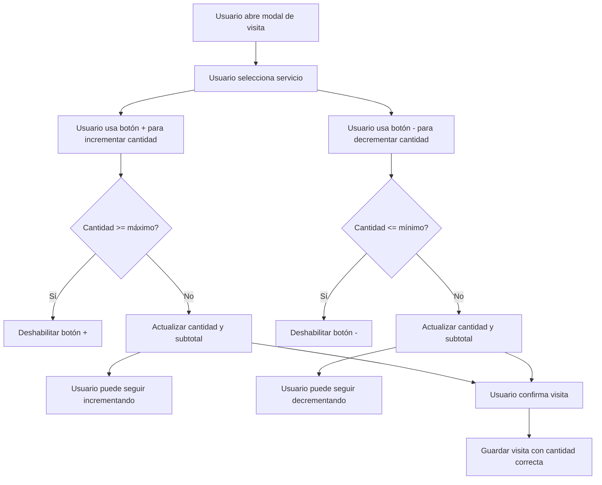

# Plan de Implementación: Botón de Cantidad en Servicios Admin

## Resumen del Requisito

Agregar un control de cantidad con botones +/- en el modal de agregar/editar visitas ([`AddEditVisitModal.tsx`](apps/web/components/customers/AddEditVisitModal.tsx)) para facilitar la selección de múltiples servicios del mismo tipo sin tener que agregarlos repetidamente.

## Contexto Actual

### Archivo Principal: [`AddEditVisitModal.tsx`](apps/web/components/customers/AddEditVisitModal.tsx)

- Ubicación: `apps/web/components/customers/AddEditVisitModal.tsx`
- Función: Modal para crear/editar visitas de clientes
- Implementación actual de cantidad (líneas 386-399):
  - Usa un `<FormInput>` tipo `number` simple
  - El usuario debe escribir manualmente la cantidad
  - Para agregar 4 veces "techgel", el usuario debe agregar el servicio 4 veces o escribir "4" en el input

### Problema Identificado

El flujo actual requiere que el usuario:

1. Seleccione el servicio
2. Escriba manualmente la cantidad (ej: 4)
3. O agregue el mismo servicio 4 veces en filas separadas

Esto es ineficiente y propenso a errores.

## Solución Propuesta

### 1. Crear Componente Reutilizable: `QuantityControl.tsx`

**Ubicación:** `apps/web/components/ui/forms/QuantityControl.tsx`

**Props:**

- `value: number` - Valor actual de la cantidad
- `onChange: (value: number) => void` - Callback cuando cambia el valor
- `min?: number` - Valor mínimo (default: 1)
- `max?: number` - Valor máximo (opcional)
- `disabled?: boolean` - Estado deshabilitado
- `label?: string` - Etiqueta opcional
- `size?: 'sm' | 'md' | 'lg'` - Tamaño del control (default: 'md')

**Características:**

- Botón de decremento (-) con icono
- Botón de incremento (+) con icono
- Input numérico central (editable)
- Validación automática de límites
- Estilos consistentes con el sistema de diseño existente
- Soporte para temas (luxury vs standard)

**Diseño Visual:**

```
┌─────────────────────────────────┐
│ [-]  4  [+]                     │
└─────────────────────────────────┘
```

### 2. Modificar [`AddEditVisitModal.tsx`](apps/web/components/customers/AddEditVisitModal.tsx)

**Cambios en las líneas 386-399:**

**Antes:**

```tsx
<div className="col-span-2">
  <FormInput
    label="Cantidad"
    type="number"
    step="1"
    value={service.quantity}
    onChange={(e) =>
      handleQuantityChange(index, parseInt(e.target.value, 10) || 1)
    }
    required
    min={1}
    inputClassName="text-sm"
  />
</div>
```

**Después:**

```tsx
<div className="col-span-2">
  <QuantityControl
    label="Cantidad"
    value={service.quantity}
    onChange={(value) => handleQuantityChange(index, value)}
    min={1}
    size="sm"
  />
</div>
```

### 3. Validaciones y Reglas de Negocio

- **Cantidad mínima:** 1 (nunca permitir 0 o negativo)
- **Cantidad máxima:** 99 (opcional, configurable)
- **Validación en tiempo real:** El control previene valores fuera de rango
- **Feedback visual:** Los botones se deshabilitan cuando se alcanzan los límites

## Diagrama de Flujo



## Componentes a Crear/Modificar

### Nuevo Componente

1. **`QuantityControl.tsx`** - Componente reutilizable de control de cantidad
   - Ubicación: `apps/web/components/ui/forms/QuantityControl.tsx`
   - Exportar desde: `apps/web/components/ui/forms/index.ts`

### Archivos a Modificar

1. **`AddEditVisitModal.tsx`** - Integrar el nuevo componente
   - Ubicación: `apps/web/components/customers/AddEditVisitModal.tsx`
   - Cambio: Reemplazar FormInput de cantidad por QuantityControl

2. **`forms/index.ts`** - Exportar nuevo componente
   - Ubicación: `apps/web/components/ui/forms/index.ts`
   - Cambio: Agregar export de QuantityControl

## Implementación Detallada

### Paso 1: Crear `QuantityControl.tsx`

```tsx
"use client";

import { Plus, Minus } from "lucide-react";
import { cn } from "@/lib/utils";

interface QuantityControlProps {
  value: number;
  onChange: (value: number) => void;
  min?: number;
  max?: number;
  disabled?: boolean;
  label?: string;
  size?: "sm" | "md" | "lg";
}

export function QuantityControl({
  value,
  onChange,
  min = 1,
  max = 99,
  disabled = false,
  label,
  size = "md",
}: QuantityControlProps) {
  const handleDecrement = () => {
    const newValue = Math.max(min, value - 1);
    onChange(newValue);
  };

  const handleIncrement = () => {
    const newValue = Math.min(max, value + 1);
    onChange(newValue);
  };

  const handleInputChange = (e: React.ChangeEvent<HTMLInputElement>) => {
    const newValue = parseInt(e.target.value, 10);
    if (isNaN(newValue)) return;
    const clampedValue = Math.max(min, Math.min(max, newValue));
    onChange(clampedValue);
  };

  const sizeClasses = {
    sm: "h-8 text-sm px-2",
    md: "h-10 text-base px-3",
    lg: "h-12 text-lg px-4",
  };

  const buttonSizeClasses = {
    sm: "h-8 w-8",
    md: "h-10 w-10",
    lg: "h-12 w-12",
  };

  return (
    <div className="flex flex-col gap-1">
      {label && (
        <label className="text-sm font-medium text-gray-700">{label}</label>
      )}
      <div className="flex items-center gap-2">
        <button
          type="button"
          onClick={handleDecrement}
          disabled={disabled || value <= min}
          className={cn(
            "flex items-center justify-center rounded-lg border bg-white hover:bg-gray-50 transition-colors",
            buttonSizeClasses[size],
            (disabled || value <= min) && "opacity-50 cursor-not-allowed",
          )}
        >
          <Minus className={size === "sm" ? "h-3 w-3" : "h-4 w-4"} />
        </button>

        <input
          type="number"
          value={value}
          onChange={handleInputChange}
          disabled={disabled}
          min={min}
          max={max}
          className={cn(
            "w-16 text-center border rounded-lg focus:ring-2 focus:ring-blue-500 focus:border-transparent",
            sizeClasses[size],
            disabled && "bg-gray-100 cursor-not-allowed",
          )}
        />

        <button
          type="button"
          onClick={handleIncrement}
          disabled={disabled || value >= max}
          className={cn(
            "flex items-center justify-center rounded-lg border bg-white hover:bg-gray-50 transition-colors",
            buttonSizeClasses[size],
            (disabled || value >= max) && "opacity-50 cursor-not-allowed",
          )}
        >
          <Plus className={size === "sm" ? "h-3 w-3" : "h-4 w-4"} />
        </button>
      </div>
    </div>
  );
}
```

### Paso 2: Actualizar `forms/index.ts`

```tsx
export * from "./FormInput";
export * from "./FormSelect";
export * from "./FormTextarea";
export * from "./PasswordInput";
export * from "./QuantityControl"; // Nuevo export
```

### Paso 3: Modificar `AddEditVisitModal.tsx`

**Importar el nuevo componente:**

```tsx
import QuantityControl from "@/components/ui/forms/QuantityControl";
```

**Reemplazar el input de cantidad (líneas 386-399):**

```tsx
<div className="col-span-2">
  <QuantityControl
    label="Cantidad"
    value={service.quantity}
    onChange={(value) => handleQuantityChange(index, value)}
    min={1}
    size="sm"
  />
</div>
```

## Consideraciones Adicionales

### Accesibilidad

- Los botones tienen estados de deshabilitado visuales
- El input numérico es accesible por teclado
- Etiquetas claras para lectores de pantalla

### Responsividad

- El componente funciona bien en diferentes tamaños de pantalla
- Los botones son lo suficientemente grandes para toques en móviles

### Tematización

- El componente usa colores neutrales que funcionan con el tema actual
- Compatible con el tema "luxury" de wondernails

### Validaciones

- El backend ya maneja validaciones de cantidad
- El componente previene valores inválidos en el frontend

## Testing Plan

### Pruebas Manuales

1. Abrir el modal de nueva visita
2. Seleccionar un servicio
3. Usar el botón + para incrementar cantidad
4. Verificar que el subtotal se actualiza correctamente
5. Usar el botón - para decrementar cantidad
6. Verificar que no permite cantidad menor a 1
7. Editar manualmente el input numérico
8. Verificar que respeta los límites (min=1, max=99)

### Casos de Prueba

- [ ] Incrementar cantidad de 1 a 5
- [ ] Decrementar cantidad de 5 a 1
- [ ] Intentar decrementar cuando ya está en 1 (botón deshabilitado)
- [ ] Escribir valor manualmente (ej: 10)
- [ ] Escribir valor fuera de rango (ej: 0 o 100)
- [ ] Verificar que el subtotal se calcula correctamente
- [ ] Probar en modo edición de visita existente
- [ ] Probar en diferentes tamaños de pantalla

## Estimación de Impacto

### Archivos Modificados

- 1 archivo nuevo: `QuantityControl.tsx`
- 1 archivo modificado: `AddEditVisitModal.tsx`
- 1 archivo modificado: `forms/index.ts`

### Riesgos

- Bajo: El cambio es localizado y no afecta otras partes del sistema
- Validaciones existentes en el backend protegen contra datos inválidos

### Beneficios

- Mejor experiencia de usuario (UX)
- Reducción de errores al ingresar cantidades
- Interfaz más moderna e intuitiva
- Componente reutilizable para otras partes del sistema

## Pasos Siguientes

1. Crear el componente `QuantityControl.tsx`
2. Actualizar el archivo `forms/index.ts` para exportar el componente
3. Modificar `AddEditVisitModal.tsx` para usar el nuevo componente
4. Probar la funcionalidad manualmente
5. Verificar que no hay regresiones en otras funcionalidades
6. Documentar cualquier cambio adicional necesario
