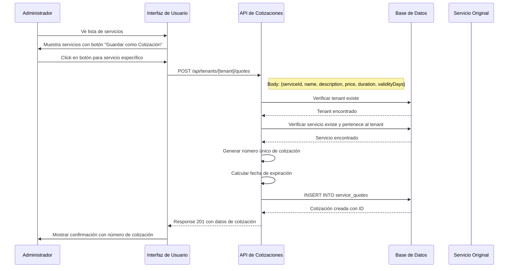
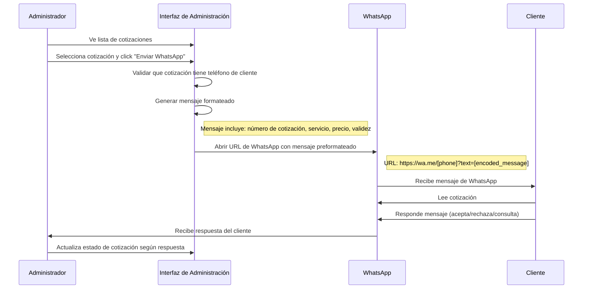
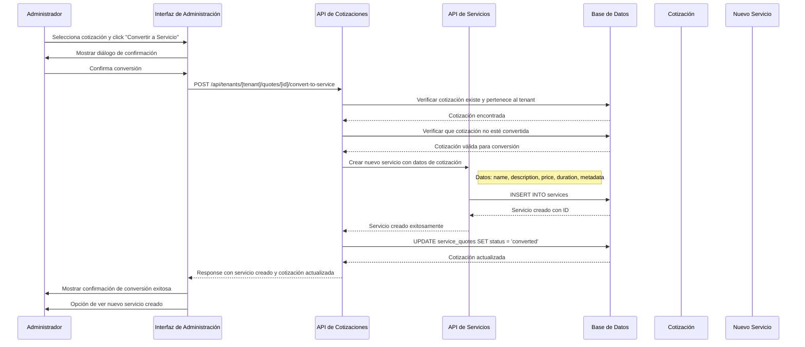
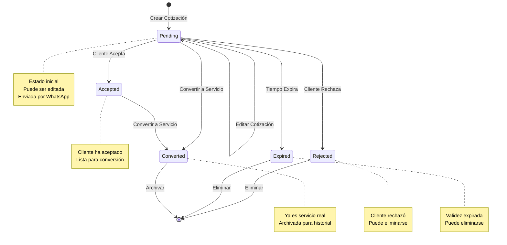
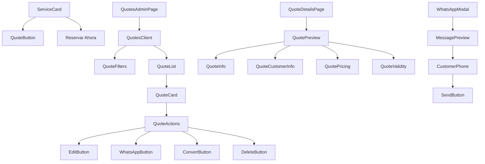
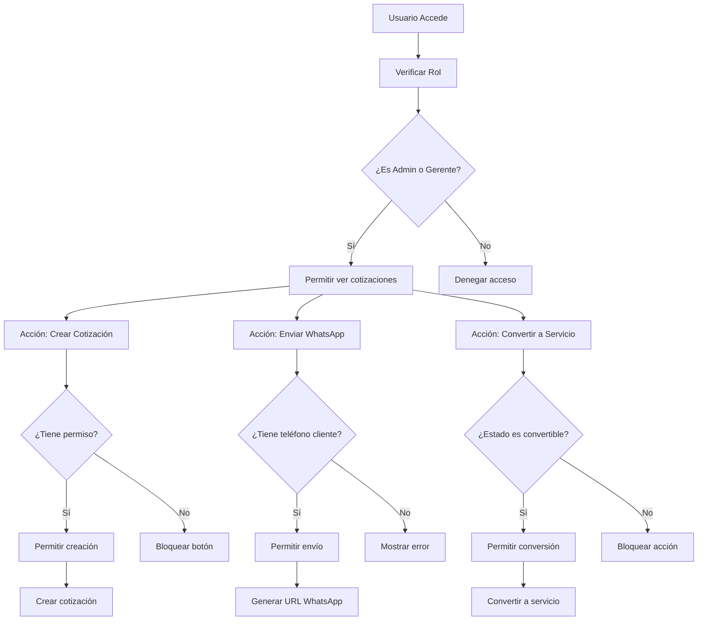

# Diagrama de Flujo Detallado: Funcionalidad de Cotizaciones

## Flujo Principal del Sistema

```mermaid
graph TD
    A[Inicio] --> B[Usuario Administrador]
    B --> C[Ver Servicios Existentes]
    C --> D{¿Desea crear cotización?}
    D -->|No| E[Flujo normal de reservas]
    D -->|Sí| F[Seleccionar Servicio]
    F --> G[Click en "Guardar como Cotización"]
    G --> H[API: Crear Cotización]
    H --> I[Generar número único]
    I --> J[Calcular fecha de expiración]
    J --> K[Guardar en BD]
    K --> L[Mostrar confirmación]
    L --> M[Cotización creada con éxito]

    M --> N{¿Qué acción desea realizar?}
    N --> O[Ver lista de cotizaciones]
    N --> P[Enviar por WhatsApp]
    N --> Q[Convertir en servicio]
    N --> R[Editar cotización]

    O --> S[Interfaz de Administración]
    S --> T[Filtrar y buscar cotizaciones]
    T --> U[Seleccionar cotización]
    U --> V[Ver detalles y acciones]

    P --> W[Generar mensaje WhatsApp]
    W --> X[Abrir WhatsApp con mensaje]
    X --> Y[Cliente recibe cotización]
    Y --> Z{Cliente responde}
    Z -->|Acepta| AA[Actualizar estado a "aceptada"]
    Z -->|Rechaza| AB[Actualizar estado a "rechazada"]

    Q --> AC[Validar datos]
    AC --> AD[Crear nuevo servicio]
    AD --> AE[Actualizar estado cotización]
    AE --> AF[Servicio disponible para reservas]

    R --> AG[Cargar datos de cotización]
    AG --> AH[Modificar campos permitidos]
    AH --> AI[Guardar cambios]
    AI --> AJ[Cotización actualizada]
```

## Flujo Detallado de Creación de Cotización



## Flujo Detallado de Envío por WhatsApp



## Flujo Detallado de Conversión a Servicio



## Estados y Transiciones de Cotización



## Diagrama de Componentes UI



## Flujo de Datos entre Componentes

```mermaid
graph LR
    subgraph Frontend
        A[ServiceCard] --> B[QuoteButton]
        B --> C[useQuoteAPI]
        C --> D[POST /quotes]

        E[QuotesAdminPage] --> F[useQuotesList]
        F --> G[GET /quotes]

        H[QuoteCard] --> I[onConvert]
        I --> J[useConvertQuote]
        J --> K[POST /quotes/[id]/convert-to-service]

        L[QuoteCard] --> M[onSendWhatsApp]
        M --> N[generateWhatsAppMessage]
        N --> O[window.open WhatsApp URL]
    end

    subgraph Backend
        P[API Quotes] --> Q[Database]
        Q --> R[service_quotes table]

        S[API Convert] --> T[Services API]
        T --> U[services table]
    end

    D --> P
    G --> P
    K --> S
```

## Flujo de Permisos y Validación



## Flujo de Manejo de Errores

```mermaid
graph TD
    A[Acción de Usuario] --> B[Intentar operación]
    B --> C{¿Error?}
    C -->|No| D[Operación exitosa]
    C -->|Sí| E[Identificar tipo de error]

    E --> F[Error de red]
    E --> G[Error de validación]
    E --> H[Error de permisos]
    E --> I[Error de base de datos]

    F --> J[Mostrar "Error de conexión"]
    G --> K[Mostrar mensaje específico]
    H --> L[Mostrar "Sin permisos"]
    I --> M[Mostrar "Error interno"]

    J --> N[Reintentar conexión]
    K --> O[Corregir datos]
    L --> P[Solicitar permisos]
    M --> Q[Contactar soporte]

    N --> B
    O --> B
    P --> B
    Q --> R[Loggear error]
```

Este diagrama detallado muestra todos los flujos, interacciones y estados del sistema de cotizaciones, permitiendo una comprensión completa antes de la implementación.
