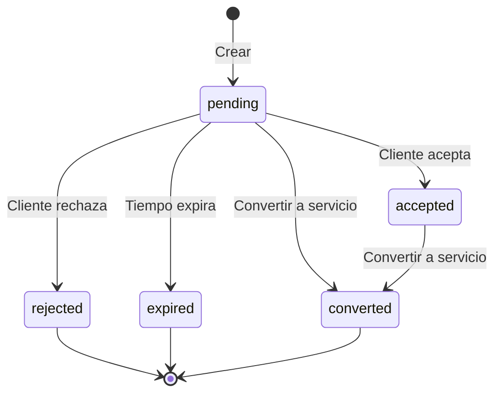

# Plan de Implementación: Funcionalidad de Cotizaciones

## Resumen

Implementar un sistema de cotizaciones que permita a los administradores guardar servicios como cotizaciones sin afectar los números reales, con la capacidad de enviarlas por WhatsApp y convertirlas en servicios reales posteriormente.

## Arquitectura General

```mermaid
graph TD
    A[Servicios Existentes] --> B[Botón "Guardar como Cotización"]
    B --> C[API de Cotizaciones]
    C --> D[Tabla de Cotizaciones]
    D --> E[Interfaz de Administrador]
    E --> F[Vista Previa de Cotización]
    F --> G[Enviar por WhatsApp]
    E --> H[Convertir en Servicio Real]
    H --> I[Nuevo Servicio]
```

## 1. Base de Datos

### Tabla: service_quotes

```sql
CREATE TABLE service_quotes (
    id UUID PRIMARY KEY DEFAULT gen_random_uuid(),
    tenant_id UUID REFERENCES tenants(id) NOT NULL,
    service_id UUID REFERENCES services(id) NOT NULL,
    quote_number VARCHAR(50) UNIQUE NOT NULL,
    name VARCHAR(200) NOT NULL,
    description TEXT,
    price DECIMAL(10,2) NOT NULL,
    duration DECIMAL(4,1) NOT NULL,
    validity_days INTEGER NOT NULL DEFAULT 7, -- Días de validez
    terms_conditions TEXT, -- Términos y condiciones
    status VARCHAR(20) NOT NULL DEFAULT 'pending', -- pending, accepted, rejected, expired
    customer_name VARCHAR(100),
    customer_email VARCHAR(255),
    customer_phone VARCHAR(20),
    notes TEXT,
    metadata JSONB DEFAULT '{}',
    created_at TIMESTAMP DEFAULT NOW(),
    updated_at TIMESTAMP DEFAULT NOW(),
    expires_at TIMESTAMP,

    -- Índices
    CONSTRAINT tenant_quote_unique UNIQUE (tenant_id, quote_number)
);

-- Crear índices
CREATE INDEX idx_service_quotes_tenant ON service_quotes(tenant_id);
CREATE INDEX idx_service_quotes_service ON service_quotes(service_id);
CREATE INDEX idx_service_quotes_status ON service_quotes(status);
CREATE INDEX idx_service_quotes_expires ON service_quotes(expires_at);
```

## 2. API Endpoints

### 2.1 Crear Cotización

```
POST /api/tenants/[tenant]/quotes
```

- Crea una cotización a partir de un servicio existente
- Genera número de cotización único
- Calcula fecha de expiración basada en validity_days

### 2.2 Listar Cotizaciones

```
GET /api/tenants/[tenant]/quotes
```

- Retorna todas las cotizaciones del tenant
- Filtrado por estado, fecha, etc.
- Paginación

### 2.3 Obtener Cotización

```
GET /api/tenants/[tenant]/quotes/[id]
```

- Retorna detalles de una cotización específica

### 2.4 Actualizar Cotización

```
PUT /api/tenants/[tenant]/quotes/[id]
```

- Actualiza datos de la cotización
- Cambio de estado

### 2.5 Eliminar Cotización

```
DELETE /api/tenants/[tenant]/quotes/[id]
```

- Elimina una cotización

### 2.6 Convertir a Servicio

```
POST /api/tenants/[tenant]/quotes/[id]/convert-to-service
```

- Convierte una cotización en un servicio real
- Crea nuevo servicio con datos de la cotización

## 3. Componentes de UI

### 3.1 QuoteButton Component

```tsx
// Componente para agregar botón de cotización
interface QuoteButtonProps {
  service: Service;
  onQuoteCreated: (quote: Quote) => void;
}

const QuoteButton: React.FC<QuoteButtonProps> = ({
  service,
  onQuoteCreated,
}) => {
  const [isLoading, setIsLoading] = useState(false);

  const handleCreateQuote = async () => {
    // Lógica para crear cotización
  };

  return (
    <button
      onClick={handleCreateQuote}
      disabled={isLoading}
      className="bg-blue-500 text-white px-4 py-2 rounded"
    >
      {isLoading ? "Creando..." : "Guardar como Cotización"}
    </button>
  );
};
```

### 3.2 QuoteCard Component

```tsx
// Componente para mostrar cotización en tarjetas
interface QuoteCardProps {
  quote: Quote;
  onEdit: (quote: Quote) => void;
  onDelete: (id: string) => void;
  onConvert: (quote: Quote) => void;
  onSendWhatsApp: (quote: Quote) => void;
}

const QuoteCard: React.FC<QuoteCardProps> = ({
  quote,
  onEdit,
  onDelete,
  onConvert,
  onSendWhatsApp,
}) => {
  // Mostrar detalles de cotización con acciones
};
```

### 3.3 QuotePreview Component

```tsx
// Componente para vista previa de cotización
interface QuotePreviewProps {
  quote: Quote;
  showActions?: boolean;
}

const QuotePreview: React.FC<QuotePreviewProps> = ({
  quote,
  showActions = true,
}) => {
  // Vista previa profesional de la cotización
};
```

### 3.4 WhatsAppMessage Component

```tsx
// Componente para generar y mostrar mensaje de WhatsApp
interface WhatsAppMessageProps {
  quote: Quote;
  onSend: (message: string) => void;
}

const WhatsAppMessage: React.FC<WhatsAppMessageProps> = ({ quote, onSend }) => {
  // Generar mensaje formateado para WhatsApp
};
```

## 4. Páginas de Administración

### 4.1 Página de Lista de Cotizaciones

```
/t/[tenant]/admin/quotes
```

- Lista todas las cotizaciones
- Filtros y búsqueda
- Acciones masivas

### 4.2 Página de Detalles de Cotización

```
/t/[tenant]/admin/quotes/[id]
```

- Muestra detalles completos
- Vista previa
- Opciones de envío y conversión

## 5. Integración con Servicios Existentes

### 5.1 Modificación de ServiceCard

Agregar botón de cotización en el componente ServiceCard existente:

```tsx
// En apps/web/components/services/ServiceCard.tsx
// Agregar después del botón "Reservar Ahora"

{
  isAdmin && (
    <button
      onClick={handleCreateQuote}
      className="w-full py-2 px-4 rounded-lg font-semibold bg-blue-500 text-white hover:bg-blue-600 transition-colors"
    >
      Guardar como Cotización
    </button>
  );
}
```

### 5.2 Modificación de ServicesClient

Actualizar para manejar la creación de cotizaciones:

```tsx
// En apps/web/app/t/[tenant]/services/services-client.tsx
// Agregar función para crear cotización
const handleCreateQuote = async (service: Service) => {
  // Lógica para crear cotización
};
```

## 6. Lógica de WhatsApp

### 6.1 Generación de Mensaje

```typescript
const generateWhatsAppMessage = (quote: Quote, tenant: Tenant): string => {
  const message = `
*${tenant.name} - Cotización*

*Servicio:* ${quote.name}
*Descripción:* ${quote.description}
*Precio:* $${quote.price} MXN
*Duración:* ${quote.duration} horas
*Válida hasta:* ${formatDate(quote.expires_at)}

${quote.terms_conditions ? `*Términos:* ${quote.terms_conditions}` : ""}

Para aceptar esta cotización, responda a este mensaje o contáctenos.

*Cotización:* ${quote.quote_number}
  `;

  return encodeURIComponent(message.trim());
};
```

### 6.2 URL de WhatsApp

```typescript
const getWhatsAppUrl = (phone: string, message: string): string => {
  const cleanPhone = phone.replace(/[^\d]/g, "");
  return `https://wa.me/${cleanPhone}?text=${message}`;
};
```

## 7. Flujo de Conversión a Servicio

### 7.1 Proceso de Conversión

1. Administrador selecciona cotización
2. Confirma datos del servicio
3. Opcionalmente ajusta precio o detalles
4. Crea nuevo servicio
5. Actualiza estado de cotización a "converted"
6. Notifica al administrador

### 7.2 API de Conversión

```typescript
export async function convertQuoteToService(
  quoteId: string,
  adjustments?: ServiceAdjustments,
): Promise<Service> {
  // Lógica para convertir cotización en servicio
}
```

## 8. Estados y Ciclo de Vida

### 8.1 Estados de Cotización

- **pending**: Recién creada, pendiente de acción
- **accepted**: Cotización aceptada por cliente
- **rejected**: Cotización rechazada por cliente
- **expired**: Cotización expirada por tiempo
- **converted**: Convertida en servicio real

### 8.2 Transiciones de Estado



## 9. Permisos y Seguridad

### 9.1 Roles y Permisos

- **Admin**: Crear, editar, eliminar, convertir, enviar WhatsApp
- **Gerente**: Ver, editar, enviar WhatsApp, convertir
- **Personal**: Solo ver
- **Cliente**: No tiene acceso (las cotizaciones son internas)

### 9.2 Validaciones

- Verificar permisos de usuario
- Validar fechas de expiración
- Verificar disponibilidad de servicio original
- Validar formato de teléfono para WhatsApp

## 10. Pruebas

### 10.1 Pruebas Unitarias

- Creación de cotización
- Actualización de estados
- Generación de mensaje WhatsApp
- Conversión a servicio

### 10.2 Pruebas de Integración

- Flujo completo de creación a conversión
- Envío de WhatsApp
- Permisos y seguridad

### 10.3 Pruebas E2E

- Crear cotización desde interfaz
- Enviar por WhatsApp
- Convertir en servicio real

## 11. Implementación por Fases

### Fase 1: Básico

1. Crear tabla y API básica
2. Botón de crear cotización
3. Lista simple de cotizaciones
4. Vista previa básica

### Fase 2: Funcionalidad

1. Estados y ciclos de vida
2. Conversión a servicio
3. WhatsApp básico
4. Permisos y seguridad

### Fase 3: Mejoras

1. Interfaz administrativa completa
2. Búsqueda y filtros
3. Edición de cotizaciones
4. Reportes y estadísticas

## 12. Consideraciones Técnicas

### 12.1 Generales

- Usar TypeScript para seguridad de tipos
- Implementar manejo de errores adecuado
- Considerar rendimiento con múltiples cotizaciones
- Implementar caching donde sea apropiado

### 12.2 Base de Datos

- Usar transacciones para operaciones críticas
- Implementar índices para consultas frecuentes
- Considerar soft delete en lugar de eliminación física

### 12.3 UI/UX

- Diseño responsive
- Indicadores de carga
- Confirmaciones para acciones destructivas
- Accesibilidad y usabilidad

Este plan proporciona una guía completa para implementar la funcionalidad de cotizaciones de manera estructurada y escalable.
