# Plan de Solución: Persistencia de Roles de Usuario

## 🔍 Problema Identificado

### Descripción del Bug

En la URL [`https://sass-store-web.vercel.app/t/wondernails/profile`](https://sass-store-web.vercel.app/t/wondernails/profile), cuando un usuario cambia su rol de "Cliente" a "Administrador":

- ✅ El cambio SE GUARDA en la base de datos (tabla `user_roles`)
- ✅ Se ejecuta `session.update()` en el frontend
- ❌ Después de cerrar el navegador y volver a iniciar sesión, el rol vuelve a "Cliente"

### Causa Raíz

El problema está en el callback `jwt` de NextAuth en [`packages/config/src/auth.ts:254-280`](packages/config/src/auth.ts:254):

```typescript
async jwt({ token, user, trigger, session }: any) {
  if (user) {
    token.id = user.id;
    token.role = user.role;
    token.tenantSlug = user.tenantSlug;
  }

  if (trigger === "update" && session) {
    console.log("[NextAuth] JWT update triggered:", session);
    if (session.role) token.role = session.role;
    if (session.name) token.name = session.name;
  }

  return token;
}
```

**El problema:**

1. Cuando se ejecuta `update({ role: "Admin" })` desde el frontend, el callback JWT recibe el trigger "update"
2. El código actualiza `token.role` con `session.role`
3. **PERO** cuando el usuario cierra el navegador y vuelve a iniciar sesión, el callback JWT se ejecuta con `user` del login, que trae el rol de la tabla `user_roles`
4. El flujo de autenticación (líneas 122-134) **SÍ lee correctamente** el rol de la base de datos
5. **Sin embargo**, el token JWT no persiste entre sesiones del navegador

---

## 📋 Análisis del Flujo Actual

### Flujo de Cambio de Rol

```mermaid
sequenceDiagram
    participant User as Usuario
    participant UI as Profile Page
    participant API as /api/profile/role
    participant DB as Database (user_roles)
    participant NextAuth as NextAuth JWT Callback
    participant Browser as Browser Session

    User->>UI: Cambia rol a "Admin"
    UI->>API: PUT /api/profile/role { roleId: "Admin" }
    API->>DB: UPDATE user_roles SET role = "Admin"
    DB-->>API: ✅ Guardado exitoso
    API-->>UI: { success: true }
    UI->>NextAuth: session.update({ role: "Admin" })
    NextAuth->>NextAuth: jwt callback (trigger: "update")
    NextAuth-->>Browser: ✅ Token actualizado en memoria
    User->>Browser: Cierra navegador
    Browser->>Browser: ❌ Token JWT se pierde
    User->>UI: Vuelve a abrir navegador
    UI->>NextAuth: Inicia sesión
    NextAuth->>DB: Lee user_roles
    DB-->>NextAuth: role = "Admin"
    NextAuth->>Browser: ✅ Token con role = "Admin"
```



### Flujo de Inicio de Sesión


---

## ✅ Solución Propuesta

### Estrategia Principal

**Modificar el callback JWT para consultar la base de datos cuando hay una actualización de rol**, asegurando que siempre se refleje el estado actual de la base de datos.

### Cambios Necesarios

#### 1. Modificar el JWT Callback en [`packages/config/src/auth.ts`](packages/config/src/auth.ts:254)

**Ubicación:** Líneas 254-288

**Código actual:**

```typescript
async jwt({ token, user, trigger, session }: any) {
  console.log("[NextAuth] JWT callback called:", {
    trigger,
    hasToken: !!token,
    hasUser: !!user,
    hasSession: !!session,
    tokenId: token?.id,
    userId: user?.id,
  });

  if (user) {
    token.id = user.id;
    token.role = user.role;
    token.tenantSlug = user.tenantSlug;
    console.log("[NextAuth] JWT token updated with user data:", {
      id: user.id,
      role: user.role,
      tenantSlug: user.tenantSlug,
    });
  }

  if (trigger === "update" && session) {
    console.log("[NextAuth] JWT update triggered:", session);
    if (session.role) token.role = session.role;
    if (session.name) token.name = session.name;
    // Allows updating other fields if necessary
  }

  console.log("[NextAuth] Returning JWT token:", {
    id: token?.id,
    role: token?.role,
    tenantSlug: token?.tenantSlug,
  });
  return token;
}
```

**Código propuesto:**

```typescript
async jwt({ token, user, trigger, session }: any) {
  console.log("[NextAuth] JWT callback called:", {
    trigger,
    hasToken: !!token,
    hasUser: !!user,
    hasSession: !!session,
    tokenId: token?.id,
    userId: user?.id,
  });

  // Initial sign in - set token from user object
  if (user) {
    token.id = user.id;
    token.role = user.role;
    token.tenantSlug = user.tenantSlug;
    console.log("[NextAuth] JWT token updated with user data:", {
      id: user.id,
      role: user.role,
      tenantSlug: user.tenantSlug,
    });
  }

  // Handle session updates (e.g., role change from profile page)
  if (trigger === "update" && session) {
    console.log("[NextAuth] JWT update triggered:", session);

    // If role is being updated, verify it against the database
    if (session.role && token.id && token.tenantSlug) {
      try {
        // Find the tenant ID
        const [tenant] = await db
          .select({ id: tenants.id })
          .from(tenants)
          .where(eq(tenants.slug, token.tenantSlug))
          .limit(1);

        if (tenant) {
          // Fetch the latest role from database
          const [roleAssignment] = await db
            .select({ role: userRoles.role })
            .from(userRoles)
            .where(
              and(
                eq(userRoles.userId, token.id),
                eq(userRoles.tenantId, tenant.id)
              )
            )
            .limit(1);

          if (roleAssignment) {
            // Use the database value as source of truth
            token.role = roleAssignment.role;
            console.log("[NextAuth] Role updated from database:", roleAssignment.role);
          } else {
            // Fallback to session value if no DB record (shouldn't happen)
            token.role = session.role;
            console.log("[NextAuth] Role updated from session (no DB record):", session.role);
          }
        }
      } catch (error) {
        console.error("[NextAuth] Error fetching role from database:", error);
        // Fallback to session value on error
        if (session.role) token.role = session.role;
      }
    }

    // Update other fields
    if (session.name) token.name = session.name;
  }

  console.log("[NextAuth] Returning JWT token:", {
    id: token?.id,
    role: token?.role,
    tenantSlug: token?.tenantSlug,
  });
  return token;
}
```

#### 2. Agregar Imports Necesarios

**Ubicación:** Línea 7 de [`packages/config/src/auth.ts`](packages/config/src/auth.ts:7)

**Asegurar que están importados:**

```typescript
import { db } from "@sass-store/database";
import { users, tenants, staff, userRoles } from "@sass-store/database/schema";
import { eq, and, sql } from "@sass-store/database";
```

✅ **Verificado:** Ya están importados correctamente.

#### 3. Mejorar el Frontend en [`apps/web/app/t/[tenant]/profile/page.tsx`](apps/web/app/t/[tenant]/profile/page.tsx:143)

**Ubicación:** Líneas 111-168

**Código actual:**

```typescript
const confirmRoleChange = async () => {
  if (!pendingRole) return;

  if (!session?.user?.id) {
    showToast("No pudimos identificar al usuario activo", "error");
    return;
  }

  if (!currentTenant?.id) {
    showToast("No pudimos identificar el tenant actual", "error");
    return;
  }

  setIsLoading(true);
  try {
    const response = await fetch("/api/profile/role", {
      method: "PUT",
      headers: {
        "Content-Type": "application/json",
      },
      body: JSON.stringify({
        roleId: pendingRole,
        tenantId: currentTenant.id,
        userId: session.user.id,
      }),
    });

    const result = await response.json();

    if (response.ok) {
      setCurrentRole(pendingRole);
      // Actualizar la sesión con el nuevo rol
      await update({
        ...session.user,
        role: pendingRole,
      });

      const roleName = AVAILABLE_ROLES.find((r) => r.id === pendingRole)?.name;
      showToast(
        roleName
          ? `Tu rol ha sido cambiado a ${roleName}`
          : "Tu rol ha sido actualizado",
        "success",
      );
    } else {
      showToast(result.error || "Error al actualizar el rol", "error");
    }
  } catch (error) {
    console.error("Error updating role:", error);
    showToast("Error al actualizar el rol", "error");
  } finally {
    setIsLoading(false);
    setRoleDialogOpen(false);
    setPendingRole(null);
  }
};
```

**Código mejorado:**

```typescript
const confirmRoleChange = async () => {
  if (!pendingRole) return;

  if (!session?.user?.id) {
    showToast("No pudimos identificar al usuario activo", "error");
    return;
  }

  if (!currentTenant?.id) {
    showToast("No pudimos identificar el tenant actual", "error");
    return;
  }

  setIsLoading(true);
  try {
    const response = await fetch("/api/profile/role", {
      method: "PUT",
      headers: {
        "Content-Type": "application/json",
      },
      body: JSON.stringify({
        roleId: pendingRole,
        tenantId: currentTenant.id,
        userId: session.user.id,
      }),
    });

    const result = await response.json();

    if (response.ok) {
      setCurrentRole(pendingRole);

      // Actualizar la sesión con el nuevo rol
      // Pasamos solo el rol para que el callback JWT lo valide contra la BD
      await update({
        role: pendingRole,
      });

      const roleName = AVAILABLE_ROLES.find((r) => r.id === pendingRole)?.name;

      showToast(
        roleName
          ? `Tu rol ha sido cambiado a ${roleName}`
          : "Tu rol ha sido actualizado",
        "success",
      );

      // Opcional: Recargar la página para reflejar cambios de permisos
      // setTimeout(() => router.refresh(), 1000);
    } else {
      showToast(result.error || "Error al actualizar el rol", "error");
    }
  } catch (error) {
    console.error("Error updating role:", error);
    showToast("Error al actualizar el rol", "error");
  } finally {
    setIsLoading(false);
    setRoleDialogOpen(false);
    setPendingRole(null);
  }
};
```

---

## 🎯 Beneficios de esta Solución

### ✅ Ventajas

1. **Fuente única de verdad**: El rol siempre se lee desde la base de datos
2. **Sincronización garantizada**: El JWT siempre refleja el estado actual de la BD
3. **Seguridad mejorada**: No se puede manipular el rol desde el cliente
4. **Coherencia**: Funciona tanto para login inicial como para actualizaciones
5. **Mantenibilidad**: Código centralizado en el callback JWT

### ⚠️ Consideraciones

1. **Rendimiento**: Se agrega una consulta a la BD en cada actualización de sesión
   - **Mitigación**: Solo ocurre cuando se actualiza el rol (evento poco frecuente)
   - **Impacto**: Mínimo, ya que es una consulta simple con índices

2. **Manejo de errores**: Si la BD falla, se usa el valor de la sesión como fallback
   - **Mitigación**: Logs detallados para debugging

---

## 📝 Pasos de Implementación

### Fase 1: Modificación del Backend

1. **Modificar [`packages/config/src/auth.ts`](packages/config/src/auth.ts:254)**
   - Actualizar el callback `jwt` con la lógica de consulta a BD
   - Agregar manejo de errores robusto
   - Agregar logs para debugging

2. **Verificar imports**
   - Confirmar que `db`, `userRoles`, `tenants`, `eq`, `and` están importados

### Fase 2: Modificación del Frontend

3. **Modificar [`apps/web/app/t/[tenant]/profile/page.tsx`](apps/web/app/t/[tenant]/profile/page.tsx:143)**
   - Simplificar el objeto pasado a `update()`
   - Agregar comentarios explicativos

### Fase 3: Testing

4. **Pruebas funcionales**
   - [ ] Cambiar rol de Cliente a Admin
   - [ ] Verificar que se guarda en BD
   - [ ] Cerrar navegador completamente
   - [ ] Volver a iniciar sesión
   - [ ] Verificar que el rol persiste como Admin

5. **Pruebas de edge cases**
   - [ ] Cambiar rol múltiples veces seguidas
   - [ ] Verificar comportamiento con múltiples tenants
   - [ ] Probar con diferentes roles (Admin, Gerente, Personal, Cliente)

6. **Pruebas de rendimiento**
   - [ ] Medir tiempo de respuesta de actualización de sesión
   - [ ] Verificar que no hay degradación significativa

### Fase 4: Documentación

7. **Actualizar documentación**
   - [ ] Agregar comentarios en el código
   - [ ] Documentar el flujo de actualización de roles
   - [ ] Crear este plan de implementación

---

## 🔧 Alternativas Consideradas

### Opción 1: Forzar re-login después de cambio de rol

- ❌ **Descartada**: Mala experiencia de usuario
- Requeriría que el usuario cierre sesión y vuelva a iniciar sesión

### Opción 2: Usar cookies del lado del servidor

- ❌ **Descartada**: Complejidad innecesaria
- NextAuth ya maneja JWT correctamente

### Opción 3: Almacenar rol en localStorage

- ❌ **Descartada**: Inseguro y fácilmente manipulable
- No se sincroniza con la base de datos

### ✅ Opción 4: Consultar BD en JWT callback (ELEGIDA)

- ✅ **Ventajas**: Seguro, centralizado, fuente única de verdad
- ✅ **Desventajas**: Una consulta extra a BD (impacto mínimo)

---

## 📊 Diagrama de la Solución

```mermaid
sequenceDiagram
    participant User as Usuario
    participant UI as Profile Page
    participant API as /api/profile/role
    participant DB as Database
    participant JWT as JWT Callback (MODIFICADO)
    participant Browser as Browser

    User->>UI: Cambia rol a "Admin"
    UI->>API: PUT { roleId: "Admin" }
    API->>DB: UPDATE user_roles SET role = "Admin"
    DB-->>API: ✅ Guardado
    API-->>UI: { success: true }

    UI->>JWT: session.update({ role: "Admin" })
    JWT->>JWT: trigger === "update" detectado
    JWT->>DB: SELECT role FROM user_roles
    DB-->>JWT: role = "Admin"
    JWT->>JWT: token.role = "Admin"
    JWT-->>Browser: ✅ Token actualizado con BD

    Note over User,Browser: Usuario cierra y vuelve a abrir navegador

    User->>UI: Vuelve a la app
    UI->>JWT: Inicia sesión
    JWT->>DB: SELECT role FROM user_roles
    DB-->>JWT: role = "Admin"
    JWT-->>UI: ✅ session.user.role = "Admin"
```



---

## 🚀 Próximos Pasos

Una vez aprobado este plan:

1. Cambiar a modo **Code** para implementar los cambios
2. Realizar pruebas locales
3. Desplegar a staging
4. Realizar pruebas de aceptación
5. Desplegar a producción

---

## 📚 Referencias

- [NextAuth.js JWT Callback Documentation](https://next-auth.js.org/configuration/callbacks#jwt-callback)
- [NextAuth.js Session Update](https://next-auth.js.org/getting-started/client#updating-the-session)
- Código fuente:
  - [`packages/config/src/auth.ts`](packages/config/src/auth.ts)
  - [`apps/web/app/api/profile/role/route.ts`](apps/web/app/api/profile/role/route.ts)
  - [`apps/web/app/t/[tenant]/profile/page.tsx`](apps/web/app/t/[tenant]/profile/page.tsx)
  - [`packages/database/schema.ts`](packages/database/schema.ts:899) (tabla `user_roles`)
