# Plan de Implementación: Upload de Imágenes y Videos para Caruseles en Redes Sociales

**Fecha:** 2026-02-02  
**Versión:** 1.0  
**Opción:** Implementación Completa

---

## 📋 Resumen Ejecutivo

Este plan detalla la implementación completa de funcionalidad para subir imágenes y videos en el formulario de publicación de redes sociales, permitiendo crear y gestionar caruseles para múltiples plataformas (Instagram, Facebook, LinkedIn, TikTok, etc.).

**Objetivo:** Agregar capacidad de subir, previsualizar y gestionar contenido multimedia (imágenes y videos) en el EditorDrawer, con soporte para caruseles de múltiples items.

**Alcance:**

- Componente de upload con drag & drop
- API route específica para social media
- Integración con tabla `mediaAssets`
- Previsualización de caruseles
- Reordenamiento de items
- Tracking de cuotas del tenant
- Actualización de API route de posts

---

## 🏗️ Arquitectura Propuesta

```mermaid
graph TD
    A[Usuario en EditorDrawer] --> B[MediaUploader Component]
    B --> C[POST /api/v1/social/media/upload]
    C --> D[Cloudinary Upload]
    D --> E[Crear registro en mediaAssets]
    E --> F[Retornar mediaId y URL]
    F --> G[Guardar en estado local]
    G --> H[Mostrar previsualización]
    H --> I{Usuario guarda post?}
    I -->|Sí| J[POST /api/v1/social/queue]
    J --> K[Guardar mediaIds en socialPosts]
    K --> L[Guardar assetIds en socialPostTargets]
    L --> M[Post listo para publicar]
```



---

## 📁 Estructura de Archivos

### Nuevos Archivos a Crear

```
apps/web/
├── components/
│   └── social/
│       ├── MediaUploader.tsx           # Componente principal de upload
│       ├── CarouselPreview.tsx         # Previsualización de carrusel
│       └── MediaItem.tsx             # Item individual de media
├── app/
│   └── api/
│       └── v1/
│           └── social/
│               └── media/
│                   └── upload/
│                       └── route.ts  # API route para upload
└── lib/
    └── social/
        ├── media-utils.ts             # Utilidades para media
        └── upload-helpers.ts         # Helpers de upload
```

### Archivos a Modificar

```
apps/web/
├── components/
│   └── social/
│       └── EditorDrawer.tsx           # Agregar sección de media
└── app/
    └── api/
        └── v1/
            └── social/
                └── queue/
                    └── route.ts          # Manejar mediaIds/assetIds
```

---

## 🎯 Fases de Implementación

### Fase 1: API Route para Upload de Social Media

**Archivo:** `apps/web/app/api/v1/social/media/upload/route.ts`

**Objetivo:** Crear endpoint que sube media a Cloudinary y crea registro en `mediaAssets`.

#### Especificaciones Técnicas

**Endpoint:**

```
POST /api/v1/social/media/upload
```

**Request:**

- Content-Type: `multipart/form-data`
- Body:
  - `file`: File (imagen o video)
  - `tenant`: string (tenant slug)
  - `assetType`: string (opcional, default: 'social')

**Response:**

```typescript
{
  success: true,
  data: {
    mediaId: string,        // UUID del registro en mediaAssets
    url: string,            // URL de Cloudinary
    mimeType: string,        // image/jpeg, video/mp4, etc.
    width?: number,         // Para imágenes
    height?: number,        // Para imágenes
    duration?: number,       // Para videos (en segundos)
    blurhash?: string,      // Para placeholder
    variants: Array<{
      preset: string,
      url: string,
      width?: number,
      height?: number
    }>
  }
}
```

**Validaciones:**

1. Verificar tenant existe
2. Validar tipo de archivo (image/_ o video/_)
3. Validar tamaño (max 5MB imágenes, 50MB videos)
4. Verificar límites de cuota del tenant
5. Generar hash SHA-256 del contenido para deduplicación

**Lógica de Implementación:**

1. Extraer archivo y parámetros del formData
2. Validar tenant y obtener tenantId
3. Verificar cuotas del tenant (`tenantQuotas`)
4. Calcular hash del contenido del archivo
5. Buscar si ya existe media con mismo hash (deduplicación)
6. Si no existe:
   - Subir a Cloudinary con configuración específica para social media
   - Extraer metadatos (dimensiones, duración)
   - Generar blurhash para imágenes
   - Crear variantes (thumbnail, optimizado)
   - Insertar registro en `mediaAssets`
   - Actualizar cuotas del tenant
7. Retornar mediaId y URL

**Código de Referencia:**

```typescript
import { NextRequest, NextResponse } from "next/server";
import { v2 as cloudinary } from "cloudinary";
import { createHash } from "crypto";
import { db } from "@sass-store/database";
import { mediaAssets, tenantQuotas } from "@sass-store/database/schema";
import { eq } from "drizzle-orm";

export const dynamic = "force-dynamic";

cloudinary.config({
  cloud_name: process.env.CLOUDINARY_CLOUD_NAME,
  api_key: process.env.CLOUDINARY_API_KEY,
  api_secret: process.env.CLOUDINARY_API_SECRET,
});

export async function POST(request: NextRequest) {
  try {
    const formData = await request.formData();
    const file = formData.get("file") as File;
    const tenant = formData.get("tenant") as string;
    const assetType = (formData.get("assetType") as string) || "social";

    // Validaciones
    if (!file || !tenant) {
      return NextResponse.json(
        { error: "Missing required fields" },
        { status: 400 },
      );
    }

    if (!file.type.startsWith("image/") && !file.type.startsWith("video/")) {
      return NextResponse.json(
        { error: "File must be an image or video" },
        { status: 400 },
      );
    }

    const isVideo = file.type.startsWith("video/");
    const maxSize = isVideo ? 50 * 1024 * 1024 : 5 * 1024 * 1024;

    if (file.size > maxSize) {
      return NextResponse.json(
        { error: `File size must be less than ${isVideo ? "50MB" : "5MB"}` },
        { status: 400 },
      );
    }

    // Obtener tenant ID y verificar cuotas
    // ... (implementación de verificación de tenant)

    // Calcular hash del contenido
    const bytes = await file.arrayBuffer();
    const buffer = Buffer.from(bytes);
    const contentHash = createHash("sha256").update(buffer).digest("hex");

    // Verificar deduplicación
    const existingMedia = await db.query.mediaAssets.findFirst({
      where: eq(mediaAssets.contentHash, contentHash),
    });

    if (existingMedia) {
      return NextResponse.json({
        success: true,
        data: {
          mediaId: existingMedia.id,
          url: existingMedia.variants[0]?.url || "",
          mimeType: existingMedia.mimeType,
          width: existingMedia.width,
          height: existingMedia.height,
          variants: existingMedia.variants,
        },
      });
    }

    // Subir a Cloudinary
    const uploadResult = await new Promise<any>((resolve, reject) => {
      const uploadStream = cloudinary.uploader.upload_stream(
        {
          folder: `sass-store/social/${tenant}`,
          resource_type: "auto",
          transformation: isVideo
            ? [
                { quality: "auto", fetch_format: "mp4" },
                { width: 1080, height: 1920, crop: "fill" },
              ]
            : [
                { quality: "auto", fetch_format: "auto" },
                { width: 1080, height: 1080, crop: "fill" },
              ],
        },
        (error, result) => {
          if (error) reject(error);
          else resolve(result);
        },
      );
      uploadStream.end(buffer);
    });

    // Crear registro en mediaAssets
    const [newMedia] = await db
      .insert(mediaAssets)
      .values({
        tenantId: tenantId,
        assetType,
        entityId: null,
        filename: file.name,
        contentHash,
        originalSize: file.size,
        totalSize: file.size,
        mimeType: file.type,
        width: uploadResult.width,
        height: uploadResult.height,
        dominantColor: uploadResult.colors?.[0]?.[0] || null,
        blurhash: null, // TODO: Generar blurhash
        variants: [
          {
            preset: "original",
            url: uploadResult.secure_url,
            width: uploadResult.width,
            height: uploadResult.height,
          },
        ],
        metadata: {
          uploadDate: new Date().toISOString(),
          source: "social_media_upload",
        },
      })
      .returning();

    // Actualizar cuotas
    await db
      .update(tenantQuotas)
      .set({
        storageUsedBytes: sql`storage_used_bytes + ${file.size}`,
        mediaCount: sql`media_count + 1`,
      })
      .where(eq(tenantQuotas.tenantId, tenantId));

    return NextResponse.json({
      success: true,
      data: {
        mediaId: newMedia.id,
        url: uploadResult.secure_url,
        mimeType: file.type,
        width: uploadResult.width,
        height: uploadResult.height,
        duration: uploadResult.duration,
        variants: newMedia.variants,
      },
    });
  } catch (error) {
    console.error("Upload error:", error);
    return NextResponse.json(
      {
        success: false,
        error: "Failed to upload media",
        details: error instanceof Error ? error.message : "Unknown error",
      },
      { status: 500 },
    );
  }
}
```

---

### Fase 2: Componente MediaUploader

**Archivo:** `apps/web/components/social/MediaUploader.tsx`

**Objetivo:** Componente reutilizable para subir y gestionar media con drag & drop.

#### Especificaciones Técnicas

**Props:**

```typescript
interface MediaUploaderProps {
  tenant: string;
  mediaUrls: string[];
  mediaIds: string[];
  onMediaChange: (urls: string[], ids: string[]) => void;
  maxFiles?: number; // Default: 10
  acceptTypes?: string[]; // Default: ['image/*', 'video/*']
  variant?: "default" | "tech";
  disabled?: boolean;
}
```

**Características:**

1. **Drag & Drop Zone**
   - Área visual para arrastrar archivos
   - Indicadores visuales cuando se arrastra sobre
   - Validación de tipos de archivos al soltar

2. **File Input**
   - Botón para seleccionar archivos manualmente
   - Soporte para selección múltiple
   - Filtro por tipos aceptados

3. **Previsualización de Media**
   - Grid de items subidos
   - Thumbnail para imágenes
   - Miniatura con icono de video para videos
   - Indicador de tipo (imagen/video)
   - Badge con número de orden

4. **Gestión de Items**
   - Eliminar item individual
   - Reordenar items (drag & drop dentro del grid)
   - Límite máximo de items
   - Contador de items (ej: "3/10")

5. **Estado de Carga**
   - Spinner de carga durante upload
   - Barra de progreso
   - Deshabilitar acciones durante carga

6. **Validaciones**
   - Máximo 10 archivos (configurable)
   - Tipos aceptados: image/_, video/_
   - Tamaño máximo: 5MB imágenes, 50MB videos
   - Mensajes de error claros

**Estructura del Componente:**

```typescript
"use client";

import { useState, useRef } from "react";
import { Upload, X, GripVertical, Image as ImageIcon, Video } from "lucide-react";

interface MediaItem {
  id: string;
  url: string;
  type: "image" | "video";
  file?: File;
}

interface MediaUploaderProps {
  tenant: string;
  mediaUrls: string[];
  mediaIds: string[];
  onMediaChange: (urls: string[], ids: string[]) => void;
  maxFiles?: number;
  acceptTypes?: string[];
  variant?: "default" | "tech";
  disabled?: boolean;
}

export default function MediaUploader({
  tenant,
  mediaUrls,
  mediaIds,
  onMediaChange,
  maxFiles = 10,
  acceptTypes = ["image/*", "video/*"],
  variant = "default",
  disabled = false,
}: MediaUploaderProps) {
  const [isDragging, setIsDragging] = useState(false);
  const [isUploading, setIsUploading] = useState(false);
  const [uploadProgress, setUploadProgress] = useState(0);
  const [mediaItems, setMediaItems] = useState<MediaItem[]>([]);
  const [error, setError] = useState<string | null>(null);
  const fileInputRef = useRef<HTMLInputElement>(null);

  // Estilos según variante
  const styles = {
    bg: variant === "tech" ? "bg-[#111111]" : "bg-white",
    text: variant === "tech" ? "text-gray-200" : "text-gray-900",
    textSecondary: variant === "tech" ? "text-gray-400" : "text-gray-500",
    border: variant === "tech" ? "border-gray-800" : "border-gray-200",
    dragActive: variant === "tech" ? "border-[#FF8000]" : "border-blue-500",
    cardBg: variant === "tech" ? "bg-[#1a1a1a]" : "bg-gray-50",
  };

  // Handlers para drag & drop
  const handleDragOver = (e: React.DragEvent) => {
    e.preventDefault();
    setIsDragging(true);
  };

  const handleDragLeave = () => {
    setIsDragging(false);
  };

  const handleDrop = async (e: React.DragEvent) => {
    e.preventDefault();
    setIsDragging(false);

    if (disabled) return;

    const files = Array.from(e.dataTransfer.files);
    await handleFiles(files);
  };

  const handleFileSelect = async (e: React.ChangeEvent<HTMLInputElement>) => {
    const files = Array.from(e.target.files || []);
    await handleFiles(files);
  };

  const handleFiles = async (files: File[]) => {
    setError(null);

    // Validar límite de archivos
    const remainingSlots = maxFiles - mediaItems.length;
    if (files.length > remainingSlots) {
      setError(`Solo puedes agregar ${remainingSlots} archivos más (máximo ${maxFiles})`);
      return;
    }

    // Validar tipos
    const invalidFiles = files.filter(
      (file) => !file.type.startsWith("image/") && !file.type.startsWith("video/")
    );
    if (invalidFiles.length > 0) {
      setError("Solo se permiten imágenes y videos");
      return;
    }

    // Validar tamaños
    const oversizedFiles = files.filter((file) => {
      const isVideo = file.type.startsWith("video/");
      const maxSize = isVideo ? 50 * 1024 * 1024 : 5 * 1024 * 1024;
      return file.size > maxSize;
    });
    if (oversizedFiles.length > 0) {
      setError("Algunos archivos exceden el tamaño máximo (5MB imágenes, 50MB videos)");
      return;
    }

    setIsUploading(true);
    setUploadProgress(0);

    try {
      const uploadPromises = files.map(async (file, index) => {
        const formData = new FormData();
        formData.append("file", file);
        formData.append("tenant", tenant);
        formData.append("assetType", "social");

        const response = await fetch("/api/v1/social/media/upload", {
          method: "POST",
          body: formData,
        });

        if (!response.ok) {
          throw new Error(`Failed to upload ${file.name}`);
        }

        const result = await response.json();
        setUploadProgress(((index + 1) / files.length) * 100);

        return {
          id: result.data.mediaId,
          url: result.data.url,
          type: file.type.startsWith("video/") ? ("video" as const) : ("image" as const),
          file,
        };
      });

      const uploadedItems = await Promise.all(uploadPromises);

      const newItems = [...mediaItems, ...uploadedItems];
      setMediaItems(newItems);

      const newUrls = newItems.map((item) => item.url);
      const newIds = newItems.map((item) => item.id);
      onMediaChange(newUrls, newIds);
    } catch (error) {
      setError(error instanceof Error ? error.message : "Error al subir archivos");
    } finally {
      setIsUploading(false);
      setUploadProgress(0);
    }
  };

  const handleRemoveMedia = (index: number) => {
    const newItems = mediaItems.filter((_, i) => i !== index);
    setMediaItems(newItems);

    const newUrls = newItems.map((item) => item.url);
    const newIds = newItems.map((item) => item.id);
    onMediaChange(newUrls, newIds);
  };

  const handleReorder = (fromIndex: number, toIndex: number) => {
    const newItems = [...mediaItems];
    const [removed] = newItems.splice(fromIndex, 1);
    newItems.splice(toIndex, 0, removed);
    setMediaItems(newItems);

    const newUrls = newItems.map((item) => item.url);
    const newIds = newItems.map((item) => item.id);
    onMediaChange(newUrls, newIds);
  };

  return (
    <div className={`space-y-4 ${styles.text}`}>
      {/* Drag & Drop Zone */}
      <div
        className={`
          border-2 border-dashed rounded-lg p-8 text-center transition-all
          ${isDragging ? styles.dragActive : styles.border}
          ${disabled ? "opacity-50 cursor-not-allowed" : "cursor-pointer"}
        `}
        onDragOver={handleDragOver}
        onDragLeave={handleDragLeave}
        onDrop={handleDrop}
        onClick={() => !disabled && fileInputRef.current?.click()}
      >
        <input
          ref={fileInputRef}
          type="file"
          multiple
          accept={acceptTypes.join(",")}
          onChange={handleFileSelect}
          className="hidden"
          disabled={disabled}
        />

        <Upload className={`mx-auto h-12 w-12 mb-4 ${styles.textSecondary}`} />
        <p className={`text-lg font-medium ${styles.text}`}>
          Arrastra imágenes o videos aquí
        </p>
        <p className={`text-sm ${styles.textSecondary}`}>
          o haz clic para seleccionar archivos
        </p>
        <p className={`text-xs mt-2 ${styles.textSecondary}`}>
          Máximo {maxFiles} archivos • 5MB imágenes, 50MB videos
        </p>
      </div>

      {/* Error Message */}
      {error && (
        <div className="bg-red-50 border border-red-200 rounded-lg p-4 text-red-700">
          {error}
        </div>
      )}

      {/* Upload Progress */}
      {isUploading && (
        <div className="bg-blue-50 border border-blue-200 rounded-lg p-4">
          <div className="flex items-center justify-between mb-2">
            <span className="text-sm font-medium text-blue-700">
              Subiendo archivos...
            </span>
            <span className="text-sm text-blue-600">
              {Math.round(uploadProgress)}%
            </span>
          </div>
          <div className="w-full bg-blue-200 rounded-full h-2">
            <div
              className="bg-blue-600 h-2 rounded-full transition-all"
              style={{ width: `${uploadProgress}%` }}
            />
          </div>
        </div>
      )}

      {/* Media Items Grid */}
      {mediaItems.length > 0 && (
        <div>
          <div className="flex items-center justify-between mb-3">
            <h3 className={`text-lg font-medium ${styles.text}`}>
              Contenido Multimedia
            </h3>
            <span className={`text-sm ${styles.textSecondary}`}>
              {mediaItems.length}/{maxFiles} items
            </span>
          </div>

          <div className="grid grid-cols-2 md:grid-cols-3 lg:grid-cols-4 gap-4">
            {mediaItems.map((item, index) => (
              <div
                key={item.id}
                className={`
                  relative rounded-lg overflow-hidden border-2
                  ${styles.cardBg} ${styles.border}
                  group
                `}
              >
                {/* Media Preview */}
                {item.type === "image" ? (
                  
                ) : (
                  <div className="w-full aspect-square bg-gray-200 flex items-center justify-center">
                    <Video className="h-12 w-12 text-gray-400" />
                  </div>
                )}

                {/* Type Badge */}
                <div className="absolute top-2 left-2 bg-black/70 text-white text-xs px-2 py-1 rounded">
                  {item.type === "image" ? (
                    <div className="flex items-center gap-1">
                      <ImageIcon className="h-3 w-3" />
                      IMG
                    </div>
                  ) : (
                    <div className="flex items-center gap-1">
                      <Video className="h-3 w-3" />
                      VID
                    </div>
                  )}
                </div>

                {/* Order Badge */}
                <div className="absolute top-2 right-2 bg-blue-600 text-white text-xs px-2 py-1 rounded">
                  {index + 1}
                </div>

                {/* Remove Button */}
                <button
                  onClick={() => handleRemoveMedia(index)}
                  className="absolute top-2 right-2 mt-6 bg-red-600 text-white p-1 rounded opacity-0 group-hover:opacity-100 transition-opacity"
                >
                  <X className="h-4 w-4" />
                </button>

                {/* Drag Handle */}
                <div className="absolute bottom-2 right-2 bg-black/70 text-white p-1 rounded cursor-move">
                  <GripVertical className="h-4 w-4" />
                </div>
              </div>
            ))}
          </div>
        </div>
      )}
    </div>
  );
}
```

---

### Fase 3: Integración en EditorDrawer

**Archivo:** `apps/web/components/social/EditorDrawer.tsx`

**Objetivo:** Agregar sección de media upload al formulario de publicación.

#### Cambios Requeridos

**1. Agregar Estado para Media:**

```typescript
// Después de las declaraciones de estado existentes
const [mediaUrls, setMediaUrls] = useState<string[]>([]);
const [mediaIds, setMediaIds] = useState<string[]>([]);
```

**2. Agregar Handler para Media:**

```typescript
const handleMediaChange = (urls: string[], ids: string[]) => {
  setMediaUrls(urls);
  setMediaIds(ids);
};
```

**3. Actualizar useEffect para Cargar Post Existente:**

```typescript
// En el useEffect que carga detalles del post
if (post.metadata?.mediaUrls) {
  setMediaUrls(post.metadata.mediaUrls);
}
if (post.metadata?.mediaIds) {
  setMediaIds(post.metadata.mediaIds);
}
```

**4. Actualizar handleSubmit para Incluir Media:**

```typescript
// En la función handleSubmit
const postData = {
  id: postId || undefined,
  tenant,
  title,
  baseText: baseContent,
  status,
  scheduledAtUtc,
  mediaIds, // Agregar mediaIds
  metadata: {
    ...metadata,
    mediaUrls, // Guardar URLs en metadata
  },
  platforms: selectedPlatforms.map((platform) => ({
    platform,
    variantText: variants[platform] || baseContent,
    status,
    assetIds: mediaIds, // Agregar assetIds por plataforma
  })),
};
```

**5. Agregar Sección de Media en el UI:**

Ubicación: Después del textarea de "Contenido base" (línea ~397)

```typescript
{/* Media Upload Section */}
<div>
  <label className={`block text-sm font-medium ${styles.textSecondary} mb-3`}>
    Contenido Multimedia
  </label>
  <MediaUploader
    tenant={tenant}
    mediaUrls={mediaUrls}
    mediaIds={mediaIds}
    onMediaChange={handleMediaChange}
    maxFiles={10}
    variant={variant}
    disabled={isLoading}
  />
  <p className={`text-xs ${styles.textSecondary} mt-2`}>
    Agrega imágenes o videos para crear caruseles en las redes sociales
  </p>
</div>
```

---

### Fase 4: Actualizar API Route de Posts

**Archivo:** `apps/web/app/api/v1/social/queue/route.ts`

**Objetivo:** Manejar mediaIds y assetIds al crear/actualizar posts.

#### Cambios Requeridos

**1. Extraer mediaIds del Request Body:**

```typescript
// En la función POST, después de extraer otros campos
const {
  // ... campos existentes
  mediaIds = [],
  assetIds = {},
} = body;
```

**2. Actualizar Inserción de socialPosts:**

```typescript
// Al crear nuevo post (línea ~264)
const [newPost] = await db
  .insert(socialPosts)
  .values({
    tenantId: tenant.id,
    title,
    baseText,
    status,
    scheduledAtUtc: scheduledAtUtc ? new Date(scheduledAtUtc) : null,
    timezone,
    createdBy,
    updatedBy: createdBy,
    metadata: {
      ...metadata,
      mediaUrls, // Guardar URLs en metadata
    },
    mediaIds, // Agregar array de mediaIds
  })
  .returning();
```

**3. Actualizar Inserción de socialPostTargets:**

```typescript
// Al crear targets (línea ~280)
await db.insert(socialPostTargets).values(
  platforms.map((p: any) => ({
    postId: newPost.id,
    platform: p.platform,
    variantText: p.variantText || baseText,
    publishAtUtc: p.publishAtUtc
      ? new Date(p.publishAtUtc)
      : scheduledAtUtc
        ? new Date(scheduledAtUtc)
        : null,
    status: p.status || status,
    timezone,
    assetIds: mediaIds, // Agregar array de mediaIds
    metadata: {
      ...p.metadata,
      mediaUrls, // Guardar URLs en metadata
    },
  })),
);
```

**4. Actualizar Actualización de Post Existente:**

```typescript
// Al actualizar post (línea ~209)
const [updatedPost] = await db
  .update(socialPosts)
  .set({
    title,
    baseText,
    status,
    scheduledAtUtc: scheduledAtUtc ? new Date(scheduledAtUtc) : null,
    timezone,
    metadata: {
      ...metadata,
      mediaUrls, // Actualizar URLs en metadata
    },
    mediaIds, // Actualizar mediaIds
    updatedBy: createdBy,
    updatedAt: new Date(),
  })
  .where(and(eq(socialPosts.id, id), eq(socialPosts.tenantId, tenant.id)))
  .returning();
```

---

### Fase 5: Componente de Previsualización de Carrusel

**Archivo:** `apps/web/components/social/CarouselPreview.tsx`

**Objetivo:** Mostrar previsualización de cómo se verá el carrusel en cada plataforma.

#### Especificaciones Técnicas

**Props:**

```typescript
interface CarouselPreviewProps {
  mediaUrls: string[];
  platform: string;
  variant?: "default" | "tech";
  currentIndex?: number;
  onIndexChange?: (index: number) => void;
}
```

**Características:**

1. **Simulación por Plataforma**
   - Instagram: 1:1 o 4:5 para feed, 9:16 para stories/reels
   - Facebook: 1:1 o 4:5
   - LinkedIn: 1.91:1
   - TikTok: 9:16

2. **Navegación de Carrusel**
   - Flechas izquierda/derecha
   - Indicadores de posición (dots)
   - Swipe en móvil

3. **Animaciones**
   - Transiciones suaves entre slides
   - Zoom en hover
   - Parallax effect

**Estructura del Componente:**

```typescript
"use client";

import { useState, useEffect } from "react";
import { ChevronLeft, ChevronRight } from "lucide-react";

interface CarouselPreviewProps {
  mediaUrls: string[];
  platform: string;
  variant?: "default" | "tech";
  currentIndex?: number;
  onIndexChange?: (index: number) => void;
}

const PLATFORM_ASPECT_RATIOS: Record<string, { width: number; height: number }> = {
  instagram: { width: 1, height: 1 }, // 1:1 square
  facebook: { width: 1, height: 1 },
  linkedin: { width: 1.91, height: 1 },
  tiktok: { width: 9, height: 16 },
  x: { width: 16, height: 9 },
  gbp: { width: 1, height: 1 },
  threads: { width: 1, height: 1 },
};

export default function CarouselPreview({
  mediaUrls,
  platform,
  variant = "default",
  currentIndex: controlledIndex,
  onIndexChange,
}: CarouselPreviewProps) {
  const [internalIndex, setInternalIndex] = useState(0);
  const currentIndex = controlledIndex !== undefined ? controlledIndex : internalIndex;
  const setCurrentIndex = onIndexChange || setInternalIndex;

  const aspectRatio = PLATFORM_ASPECT_RATIOS[platform] || { width: 1, height: 1 };

  const handlePrevious = () => {
    setCurrentIndex((prev) => (prev === 0 ? mediaUrls.length - 1 : prev - 1));
  };

  const handleNext = () => {
    setCurrentIndex((prev) => (prev === mediaUrls.length - 1 ? 0 : prev + 1));
  };

  useEffect(() => {
    // Auto-play si hay más de 1 item
    if (mediaUrls.length > 1) {
      const interval = setInterval(handleNext, 3000);
      return () => clearInterval(interval);
    }
  }, [currentIndex, mediaUrls.length]);

  if (mediaUrls.length === 0) {
    return (
      <div className="flex items-center justify-center bg-gray-100 rounded-lg aspect-square">
        <p className="text-gray-400">Sin contenido multimedia</p>
      </div>
    );
  }

  const styles = {
    bg: variant === "tech" ? "bg-[#111111]" : "bg-white",
    text: variant === "tech" ? "text-gray-200" : "text-gray-900",
    border: variant === "tech" ? "border-gray-800" : "border-gray-200",
  };

  return (
    <div className={`relative ${styles.bg} ${styles.border} border-2 rounded-lg overflow-hidden`}>
      {/* Current Media */}
      <div
        className="relative"
        style={{
          aspectRatio: `${aspectRatio.width}/${aspectRatio.height}`,
        }}
      >
        {mediaUrls[currentIndex]?.startsWith("data:video") ? (
          <video
            src={mediaUrls[currentIndex]}
            className="w-full h-full object-cover"
            controls
            muted
            loop
          />
        ) : (
          
        )}

        {/* Navigation Arrows */}
        {mediaUrls.length > 1 && (
          <>
            <button
              onClick={handlePrevious}
              className="absolute left-2 top-1/2 -translate-y-1/2 bg-black/50 hover:bg-black/70 text-white p-2 rounded-full transition-colors"
            >
              <ChevronLeft className="h-5 w-5" />
            </button>
            <button
              onClick={handleNext}
              className="absolute right-2 top-1/2 -translate-y-1/2 bg-black/50 hover:bg-black/70 text-white p-2 rounded-full transition-colors"
            >
              <ChevronRight className="h-5 w-5" />
            </button>
          </>
        )}

        {/* Position Indicator */}
        <div className="absolute bottom-2 left-1/2 -translate-x-1/2 bg-black/70 text-white text-xs px-3 py-1 rounded-full">
          {currentIndex + 1} / {mediaUrls.length}
        </div>
      </div>

      {/* Dots Indicator */}
      {mediaUrls.length > 1 && (
        <div className="flex justify-center gap-2 py-3">
          {mediaUrls.map((_, index) => (
            <button
              key={index}
              onClick={() => setCurrentIndex(index)}
              className={`
                w-2 h-2 rounded-full transition-colors
                ${index === currentIndex ? "bg-blue-600" : "bg-gray-300"}
              `}
            />
          ))}
        </div>
      )}
    </div>
  );
}
```

---

### Fase 6: Utilidades y Helpers

**Archivo:** `apps/web/lib/social/media-utils.ts`

**Objetivo:** Funciones auxiliares para manejo de media.

#### Funciones a Implementar

```typescript
/**
 * Valida si un archivo es aceptado para upload
 */
export function isValidMediaFile(file: File): boolean {
  const validTypes = ["image/*", "video/*"];
  return validTypes.some((type) => file.type.startsWith(type));
}

/**
 * Valida el tamaño de un archivo
 */
export function isValidFileSize(file: File): boolean {
  const isVideo = file.type.startsWith("video/");
  const maxSize = isVideo ? 50 * 1024 * 1024 : 5 * 1024 * 1024;
  return file.size <= maxSize;
}

/**
 * Genera un nombre único para archivo
 */
export function generateUniqueFilename(originalName: string): string {
  const timestamp = Date.now();
  const randomString = Math.random().toString(36).substring(2, 8);
  const extension = originalName.split(".").pop();
  return `${timestamp}-${randomString}.${extension}`;
}

/**
 * Obtiene el tipo de media desde URL o MIME type
 */
export function getMediaType(mimeType: string): "image" | "video" {
  return mimeType.startsWith("video/") ? "video" : "image";
}

/**
 * Valida límites de plataforma
 */
export function validatePlatformLimits(
  platform: string,
  mediaCount: number,
): { valid: boolean; error?: string } {
  const limits: Record<string, { max: number; name: string }> = {
    instagram: { max: 10, name: "Instagram" },
    facebook: { max: 10, name: "Facebook" },
    linkedin: { max: 9, name: "LinkedIn" },
    tiktok: { max: 35, name: "TikTok" },
    x: { max: 4, name: "X (Twitter)" },
    gbp: { max: 10, name: "Google Business" },
    threads: { max: 10, name: "Threads" },
  };

  const limit = limits[platform];
  if (limit && mediaCount > limit.max) {
    return {
      valid: false,
      error: `${limit.name} permite máximo ${limit.max} items por publicación`,
    };
  }

  return { valid: true };
}

/**
 * Genera blurhash para imagen
 */
export async function generateBlurhash(
  imageUrl: string,
): Promise<string | null> {
  try {
    // TODO: Implementar generación de blurhash
    // Usar librería como 'blurhash'
    return null;
  } catch (error) {
    console.error("Error generating blurhash:", error);
    return null;
  }
}

/**
 * Extrae metadatos de media
 */
export async function extractMediaMetadata(
  file: File,
): Promise<{ width?: number; height?: number; duration?: number }> {
  return new Promise((resolve) => {
    if (file.type.startsWith("image/")) {
      const img = new Image();
      img.onload = () => {
        resolve({ width: img.width, height: img.height });
      };
      img.onerror = () => resolve({});
      img.src = URL.createObjectURL(file);
    } else if (file.type.startsWith("video/")) {
      const video = document.createElement("video");
      video.onloadedmetadata = () => {
        resolve({
          width: video.videoWidth,
          height: video.videoHeight,
          duration: video.duration,
        });
      };
      video.onerror = () => resolve({});
      video.src = URL.createObjectURL(file);
    } else {
      resolve({});
    }
  });
}
```

---

## 🧪 Pruebas

### Pruebas Unitarias

**MediaUploader Component:**

- [ ] Drag & drop funciona correctamente
- [ ] Selección de archivos funciona
- [ ] Validación de tipos de archivos
- [ ] Validación de tamaños de archivos
- [ ] Límite máximo de archivos
- [ ] Eliminar items funciona
- [ ] Reordenamiento de items funciona
- [ ] Estado de carga se muestra correctamente
- [ ] Manejo de errores funciona

**CarouselPreview Component:**

- [ ] Navegación entre slides funciona
- [ ] Indicadores de posición correctos
- [ ] Auto-play funciona
- [ ] Aspect ratio correcto por plataforma
- [ ] Videos se reproducen correctamente

### Pruebas de Integración

**EditorDrawer:**

- [ ] MediaUploader se muestra correctamente
- [ ] Estado de media se sincroniza con el formulario
- [ ] Al guardar post, mediaIds se envían correctamente
- [ ] Al editar post existente, media se carga correctamente
- [ ] Validación de plataforma se muestra cuando hay demasiados items

**API Routes:**

- [ ] POST /api/v1/social/media/upload funciona
- [ ] Deduplicación de media funciona
- [ ] Cuotas del tenant se actualizan
- [ ] POST /api/v1/social/queue guarda mediaIds
- [ ] PUT /api/v1/social/queue actualiza mediaIds

### Pruebas E2E

**Flujo Completo:**

1. [ ] Usuario abre EditorDrawer
2. [ ] Usuario arrastra 3 imágenes
3. [ ] Imágenes se suben correctamente
4. [ ] Previsualización se muestra
5. [ ] Usuario reordena items
6. [ ] Usuario elimina 1 item
7. [ ] Usuario completa el formulario
8. [ ] Usuario guarda el post
9. [ ] Post se guarda con mediaIds correctos
10. [ ] Usuario edita el post
11. [ ] Media se carga correctamente

---

## 📊 Métricas de Éxito

- [ ] API de upload responde en < 5 segundos para archivos de 5MB
- [ ] Deduplicación de media funciona correctamente
- [ ] Cuotas del tenant se actualizan correctamente
- [ ] UI de upload es intuitiva y fácil de usar
- [ ] Previsualización de carrusel es precisa
- [ ] Reordenamiento de items funciona sin bugs
- [ ] Validaciones de plataforma se muestran correctamente
- [ ] Posts se guardan con mediaIds correctos
- [ ] Posts se editan y media se carga correctamente

---

## 🚀 Checklist de Implementación

### Fase 1: API Route

- [ ] Crear archivo `apps/web/app/api/v1/social/media/upload/route.ts`
- [ ] Implementar validaciones de archivo
- [ ] Implementar upload a Cloudinary
- [ ] Implementar deduplicación de media
- [ ] Implementar creación de registro en mediaAssets
- [ ] Implementar actualización de cuotas
- [ ] Probar endpoint con Postman/curl

### Fase 2: MediaUploader Component

- [ ] Crear archivo `apps/web/components/social/MediaUploader.tsx`
- [ ] Implementar drag & drop zone
- [ ] Implementar file input
- [ ] Implementar previsualización de media
- [ ] Implementar gestión de items (eliminar, reordenar)
- [ ] Implementar estado de carga
- [ ] Implementar validaciones
- [ ] Probar componente en isolation

### Fase 3: Integración EditorDrawer

- [ ] Agregar estado para media
- [ ] Agregar handler para media
- [ ] Actualizar useEffect para cargar media existente
- [ ] Actualizar handleSubmit para incluir media
- [ ] Agregar sección de media en UI
- [ ] Probar integración

### Fase 4: Actualizar API de Posts

- [ ] Extraer mediaIds del request body
- [ ] Actualizar inserción de socialPosts
- [ ] Actualizar inserción de socialPostTargets
- [ ] Actualizar actualización de posts existentes
- [ ] Probar API con Postman/curl

### Fase 5: CarouselPreview Component

- [ ] Crear archivo `apps/web/components/social/CarouselPreview.tsx`
- [ ] Implementar simulación por plataforma
- [ ] Implementar navegación de carrusel
- [ ] Implementar animaciones
- [ ] Probar componente en isolation

### Fase 6: Utilidades

- [ ] Crear archivo `apps/web/lib/social/media-utils.ts`
- [ ] Implementar funciones de validación
- [ ] Implementar funciones de utilidad
- [ ] Probar funciones

### Pruebas

- [ ] Escribir pruebas unitarias
- [ ] Escribir pruebas de integración
- [ ] Escribir pruebas E2E
- [ ] Ejecutar todas las pruebas
- [ ] Corregir bugs encontrados

---

## 📝 Notas Adicionales

### Consideraciones de Performance

1. **Lazy Loading de Imágenes**
   - Usar `loading="lazy"` en tags img
   - Implementar placeholder con blurhash
   - Cargar imágenes solo cuando sean visibles

2. **Optimización de Upload**
   - Comprimir imágenes antes de subir (si es posible)
   - Usar streaming para uploads grandes
   - Implementar resumen de uploads

3. **Caching de Media**
   - Cargar media en estado local
   - Evitar re-uploads del mismo archivo
   - Usar localStorage para caché temporal

### Consideraciones de UX

1. **Feedback Visual**
   - Mostrar progreso de upload
   - Indicar errores claramente
   - Mostrar confirmación de éxito

2. **Accesibilidad**
   - Soporte para navegación por teclado
   - Alt text para imágenes
   - Descripciones para videos
   - ARIA labels apropiados

3. **Responsive Design**
   - Grid adaptable a diferentes tamaños de pantalla
   - Touch-friendly en móvil
   - Optimizado para tablet y desktop

### Consideraciones de Seguridad

1. **Validación de Archivos**
   - Validar tipos MIME en backend
   - Validar tamaños en backend
   - Escanear archivos maliciosos (si es posible)

2. **Rate Limiting**
   - Limitar uploads por usuario
   - Implementar cooldown entre uploads
   - Prevenir abuso de API

3. **Sanitización de URLs**
   - Validar URLs de Cloudinary
   - Prevenir XSS en previsualización
   - Sanitizar metadatos

---

## 🔄 Roadmap Futuro

### V2.0 - Funcionalidades Adicionales

- [ ] Edición de imágenes (crop, filters)
- [ ] Generación de thumbnails automáticos
- [ ] Soporte para GIFs animados
- [ ] Detección de contenido inapropiado
- [ ] Análisis de colores dominantes
- [ ] Generación de captions con IA
- [ ] Sugerencias de hashtags basadas en media

### V3.0 - Integraciones Avanzadas

- [ ] Integración con Canva para edición
- [ ] Integración con Unsplash para stock photos
- [ ] Soporte para live streaming
- [ ] Publicación programada con media
- [ ] Analytics de engagement por media

---

## 📚 Referencias

- [Cloudinary Documentation](https://cloudinary.com/documentation)
- [Instagram Carousel Guidelines](https://developers.facebook.com/docs/instagram-api/reference/ig-media-publishing)
- [Facebook Media Upload](https://developers.facebook.com/docs/graph-api/reference/page)
- [LinkedIn Media Upload](https://learn.microsoft.com/en-us/linkedin/marketing/community-management/programs/messages-api)
- [Next.js File Uploads](https://nextjs.org/docs/app/building-your-application/routing/route-handlers)

---

**Fin del Plan de Implementación**
